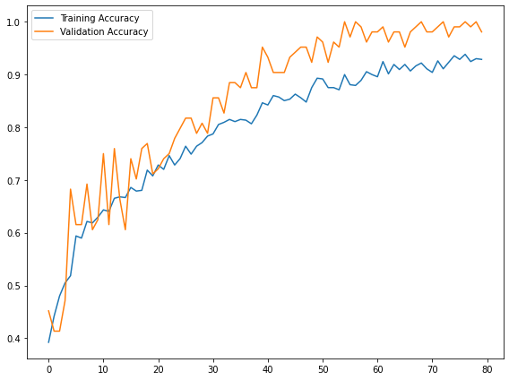
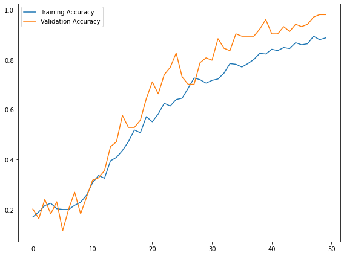
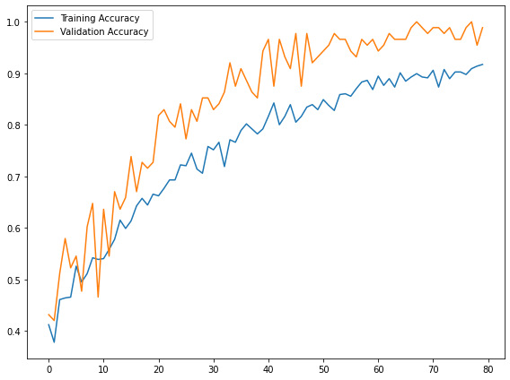
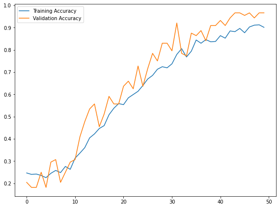

# Supreme Court opinion NLP project

## Scraping


```python
# This is the spider for preliminary prints
#import scrapy
#from pic16bproject.items import Pic16BprojectItem

#class courtscraper(scrapy.Spider):
#    name = 'court_spider'
    
#    start_urls = ['https://www.supremecourt.gov/opinions/USReports.aspx']

#    def parse(self, response):

#         pdfs = [a.attrib["href"] for a in response.css("div#accordion2 a")]
#         prefix = "https://www.supremecourt.gov/opinions/"
#         pdfs_urls = [prefix + suffix for suffix in pdfs]


#         for url in pdfs_urls:
#            item = Pic16BprojectItem() #define it items.py
#            item['file_urls'] = [url]
#            yield item

```


```python
# code for the items.py file 

#import scrapy

#class Pic16BprojectItem(scrapy.Item):
    #file_urls = scrapy.Field()
    #files = scrapy.Field()
```


```python
#Code for the settings.py file needed in order to run the spider

#BOT_NAME = 'pic16bproject'

#SPIDER_MODULES = ['pic16bproject.spiders']
#NEWSPIDER_MODULE = 'pic16bproject.spiders'

#ITEM_PIPELINES = {
#    'scrapy.pipelines.files.FilesPipeline' : 1,
#}

#FILES_STORE = "pdf"
#FILES_RESULT_FIELD = 'files'

#ROBOTSTXT_OBEY = True
```

## OCR and Text Cleaning

Acknowledgement: https://www.geeksforgeeks.org/python-reading-contents-of-pdf-using-ocr-optical-character-recognition/


```python
# For every opinion PDF (donwloaded from spider)
for op in [i for i in os.listdir("./opinion_PDFs") if i[-3:] == 'pdf']:
    
    # *** Part 1 ***
    pages = convert_from_path("./opinion_PDFs/" + op, dpi = 300)
    image_counter = 1
    # Iterate through all the pages in this opinion and store as jpg
    for page in pages:
        # Declaring filename for each page of PDF as JPG
        # For each page, filename will be:
        # PDF page 1 -> page_1.jpg
        # ....
        # PDF page n -> page_n.jpg
        filename = "page_"+str(image_counter)+".jpg"
        # Save the image of the page in system
        page.save(filename, 'JPEG')
        # Increment the counter to update filename
        image_counter = image_counter + 1
    image_counter = image_counter - 1
    
    # *** Part 2 ***
    # Creating a text file to write the output
    outfile = "./opinion_txt/" + op.split(".")[0] + "_OCR.txt"
    # Open the file in append mode
    f = open(outfile, "w")
    
    # Iterate from 1 to total number of pages
    skipped_pages = []
    print("Starting OCR for " + re.findall('([0-9a-z-]+)_', op)[0])
    print("Reading page:")
    for i in range(1, image_counter + 1):
        print(str(i) + "...") if i==1 or i%10==0 or i==image_counter else None
        # Set filename to recognize text from
        filename = "page_" + str(i) + ".jpg"
        # Recognize the text as string in image using pytesserct
        text = pytesseract.image_to_string(Image.open(filename))
        # If the page is a syllabus page or not an opinion page
        # marked by "Opinion of the Court" or "Last_Name, J. dissenting/concurring"
        # skip and remove this file; no need to append text
        is_syllabus = re.search('Syllabus\n', text) is not None
        is_maj_op = re.search('Opinion of [A-Za-z., ]+\n', text) is not None
        is_dissent_concur_op = re.search('[A-Z]+, (C. )?J., (concurring|dissenting)?( in judgment)?', text) is not None
        if is_syllabus or ((not is_maj_op) and (not is_dissent_concur_op)):
            # note down the page was skipped, remove image, and move on to next page
            skipped_pages.append(i)
            os.remove(filename)
            continue
        # Restore sentences
        text = text.replace('-\n', '')
        # Roman numerals header
        text = re.sub('[\n]+[A-Za-z]{1,4}\n', '', text)
        # Remove headers
        text = re.sub("[\n]+SUPREME COURT OF THE UNITED STATES[\nA-Za-z0-9!'#%&()*+,-.\/\[\]:;<=>?@^_{|}~—’ ]+\[[A-Z][a-z]+ [0-9]+, [0-9]+\][\n]+",
                  ' ', text)
        text = re.sub('[^\n]((CHIEF )?JUSTICE ([A-Z]+)[-A-Za-z0-9 ,—\n]+)\.[* ]?[\n]{2}',
                  '!OP START!\\3!!!\\1!!!', text)
        text = re.sub('[\n]+', ' ', text) # Get rid of new lines and paragraphs
        text = re.sub('NOTICE: This opinion is subject to formal revision before publication in the preliminary print of the United States Reports. Readers are requested to noti[f]?y the Reporter of Decisions, Supreme Court of the United States, Washington, D.[ ]?C. [0-9]{5}, of any typographical or other formal errors, in order that corrections may be made before the preliminary print goes to press[\.]?',
                      '', text)
        text = re.sub('Cite as: [0-9]+[ ]?U.S.[_]* \([0-9]+\) ([0-9a-z ]+)?(Opinion of the Court )?([A-Z]+,( C.)? J., [a-z]+[ ]?)?',
                      '', text)
        text = re.sub(' JUSTICE [A-Z]+ took no part in the consideration or decision of this case[\.]?', '', text)
        text = re.sub('[0-9]+ [A-Z!&\'(),-.:; ]+ v. [A-Z!&\'(),-.:; ]+ (Opinion of the Court )?(dissenting[ ]?|concurring[ ]?)?',
                  '', text)
        # Remove * boundaries
        text = re.sub('([*][ ]?)+', '', text)
        # Eliminate "It is so ordered" after every majority opinion
        text = re.sub(' It is so ordered\. ', '', text)
        # Eliminate opinion header
        text = re.sub('Opinion of [A-Z]+, [C. ]?J[\.]?', '', text)
        # Separate opinions
        text = re.sub('!OP START!', '\n', text)
    
        # Write to text
        f.write(text)
    
        # After everything is done for the page, remove the page image
        os.remove(filename)
    # Close connection to .txt file after finishing writing
    f.close()
    
    # Now read in the newly created txt file as a pandas data frame if possible
    
    try:
        op_df = pd.read_csv("./opinion_txt/" + op.split(".")[0] + "_OCR.txt",
                            sep = re.escape("!!!"), engine = "python",
                            names = ["Author", "Header", "Text"])
        op_df.insert(1, "Docket_Number", re.findall("([-a-z0-9 ]+)_", op)[0])
        op_df["Type"] = op_df.Header.apply(opinion_classifier)
        
        # Lastly add all the opinion info to the main data frame
        opinion_df = opinion_df.append(op_df, ignore_index = True)
        os.remove("./opinion_PDFs/" + op)
        print("Task completed\nPages skipped: " + str(skipped_pages) + "\n")
    except:
        print("Error in CSV conversion. Pages NOT added!\n")
        
print("-----------------------\nAll assigned OCR Completed")
```

## Exploratory Data Analysis


```python
# Giving Colab access to drive (where csv files are stored)
from google.colab import drive
drive.mount('/content/gdrive')
```

    Mounted at /content/gdrive


```python
import pandas as pd # For data frame manipulation
!pip install afinn
from afinn import Afinn # for sentiment score
```

    Looking in indexes: https://pypi.org/simple, https://us-python.pkg.dev/colab-wheels/public/simple/
    Collecting afinn
      Downloading afinn-0.1.tar.gz (52 kB)
         |████████████████████████████████| 52 kB 1.1 MB/s 
    [?25hBuilding wheels for collected packages: afinn
      Building wheel for afinn (setup.py) ... [?25l[?25hdone
      Created wheel for afinn: filename=afinn-0.1-py3-none-any.whl size=53447 sha256=744d047e46cf248f31a705b6f4b171699bc649c54c3a7f077df381fd292d3f42
      Stored in directory: /root/.cache/pip/wheels/9d/16/3a/9f0953027434eab5dadf3f33ab3298fa95afa8292fcf7aba75
    Successfully built afinn
    Installing collected packages: afinn
    Successfully installed afinn-0.1


```python
# Load in the dataframe for train/test/validation
train = pd.read_csv('gdrive/My Drive/PIC16B-Final-Project/train_validate.csv',
                   usecols = ["Author", "Text", "Type"])
train.head(10)
```


  <div id="df-2884948c-c120-4f0a-b532-3df596371ce8">
    <div class="colab-df-container">
      <div>
<style scoped>
    .dataframe tbody tr th:only-of-type {
        vertical-align: middle;
    }

    .dataframe tbody tr th {
        vertical-align: top;
    }

    .dataframe thead th {
        text-align: right;
    }
</style>
<table border="1" class="dataframe">
  <thead>
    <tr style="text-align: right;">
      <th></th>
      <th>Author</th>
      <th>Text</th>
      <th>Type</th>
    </tr>
  </thead>
  <tbody>
    <tr>
      <th>0</th>
      <td>GINSBURG</td>
      <td>In the Federal Employees Health Benefits Act o...</td>
      <td>Opinion</td>
    </tr>
    <tr>
      <th>1</th>
      <td>THOMAS</td>
      <td>I join the opinion of the Court with one reser...</td>
      <td>Concurrence</td>
    </tr>
    <tr>
      <th>2</th>
      <td>ROBERTS</td>
      <td>In our judicial system, “the public has a righ...</td>
      <td>Opinion</td>
    </tr>
    <tr>
      <th>3</th>
      <td>KAVANAUGH</td>
      <td>The Court today unanimously concludes that a P...</td>
      <td>Concurrence in Judgment</td>
    </tr>
    <tr>
      <th>4</th>
      <td>THOMAS</td>
      <td>Respondent Cyrus Vance, Jr., the district atto...</td>
      <td>Dissent</td>
    </tr>
    <tr>
      <th>5</th>
      <td>ALITO</td>
      <td>This case is almost certain to be portrayed as...</td>
      <td>Dissent</td>
    </tr>
    <tr>
      <th>6</th>
      <td>KENNEDY</td>
      <td>The classic example of a property taking by th...</td>
      <td>Opinion</td>
    </tr>
    <tr>
      <th>7</th>
      <td>ROBERTS</td>
      <td>The Murr family owns two adjacent lots along t...</td>
      <td>Dissent</td>
    </tr>
    <tr>
      <th>8</th>
      <td>THOMAS</td>
      <td>I join THE CHIEF JUSTICE’s dissent because it ...</td>
      <td>Dissent</td>
    </tr>
    <tr>
      <th>9</th>
      <td>BREYER</td>
      <td>The Centers for Disease Control and Prevention...</td>
      <td>Dissent</td>
    </tr>
  </tbody>
</table>
</div>
      <button class="colab-df-convert" onclick="convertToInteractive('df-2884948c-c120-4f0a-b532-3df596371ce8')"
              title="Convert this dataframe to an interactive table."
              style="display:none;">

  <svg xmlns="http://www.w3.org/2000/svg" height="24px"viewBox="0 0 24 24"
       width="24px">
    <path d="M0 0h24v24H0V0z" fill="none"/>
    <path d="M18.56 5.44l.94 2.06.94-2.06 2.06-.94-2.06-.94-.94-2.06-.94 2.06-2.06.94zm-11 1L8.5 8.5l.94-2.06 2.06-.94-2.06-.94L8.5 2.5l-.94 2.06-2.06.94zm10 10l.94 2.06.94-2.06 2.06-.94-2.06-.94-.94-2.06-.94 2.06-2.06.94z"/><path d="M17.41 7.96l-1.37-1.37c-.4-.4-.92-.59-1.43-.59-.52 0-1.04.2-1.43.59L10.3 9.45l-7.72 7.72c-.78.78-.78 2.05 0 2.83L4 21.41c.39.39.9.59 1.41.59.51 0 1.02-.2 1.41-.59l7.78-7.78 2.81-2.81c.8-.78.8-2.07 0-2.86zM5.41 20L4 18.59l7.72-7.72 1.47 1.35L5.41 20z"/>
  </svg>
      </button>

  <style>
    .colab-df-container {
      display:flex;
      flex-wrap:wrap;
      gap: 12px;
    }

    .colab-df-convert {
      background-color: #E8F0FE;
      border: none;
      border-radius: 50%;
      cursor: pointer;
      display: none;
      fill: #1967D2;
      height: 32px;
      padding: 0 0 0 0;
      width: 32px;
    }

    .colab-df-convert:hover {
      background-color: #E2EBFA;
      box-shadow: 0px 1px 2px rgba(60, 64, 67, 0.3), 0px 1px 3px 1px rgba(60, 64, 67, 0.15);
      fill: #174EA6;
    }

    [theme=dark] .colab-df-convert {
      background-color: #3B4455;
      fill: #D2E3FC;
    }

    [theme=dark] .colab-df-convert:hover {
      background-color: #434B5C;
      box-shadow: 0px 1px 3px 1px rgba(0, 0, 0, 0.15);
      filter: drop-shadow(0px 1px 2px rgba(0, 0, 0, 0.3));
      fill: #FFFFFF;
    }
  </style>

      <script>
        const buttonEl =
          document.querySelector('#df-2884948c-c120-4f0a-b532-3df596371ce8 button.colab-df-convert');
        buttonEl.style.display =
          google.colab.kernel.accessAllowed ? 'block' : 'none';

        async function convertToInteractive(key) {
          const element = document.querySelector('#df-2884948c-c120-4f0a-b532-3df596371ce8');
          const dataTable =
            await google.colab.kernel.invokeFunction('convertToInteractive',
                                                     [key], {});
          if (!dataTable) return;

          const docLinkHtml = 'Like what you see? Visit the ' +
            '<a target="_blank" href=https://colab.research.google.com/notebooks/data_table.ipynb>data table notebook</a>'
            + ' to learn more about interactive tables.';
          element.innerHTML = '';
          dataTable['output_type'] = 'display_data';
          await google.colab.output.renderOutput(dataTable, element);
          const docLink = document.createElement('div');
          docLink.innerHTML = docLinkHtml;
          element.appendChild(docLink);
        }
      </script>
    </div>
  </div>


```python
train.groupby(by = ["Author", "Type"]).size().reset_index().pivot(index = "Author", columns = "Type", values = 0)
```


  <div id="df-68244c06-3d7e-4a51-bc4a-d82596d6fff4">
    <div class="colab-df-container">
      <div>
<style scoped>
    .dataframe tbody tr th:only-of-type {
        vertical-align: middle;
    }

    .dataframe tbody tr th {
        vertical-align: top;
    }

    .dataframe thead th {
        text-align: right;
    }
</style>
<table border="1" class="dataframe">
  <thead>
    <tr style="text-align: right;">
      <th>Type</th>
      <th>Concurrence</th>
      <th>Concurrence in Judgment</th>
      <th>Dissent</th>
      <th>Opinion</th>
    </tr>
    <tr>
      <th>Author</th>
      <th></th>
      <th></th>
      <th></th>
      <th></th>
    </tr>
  </thead>
  <tbody>
    <tr>
      <th>ALITO</th>
      <td>15</td>
      <td>24</td>
      <td>49</td>
      <td>49</td>
    </tr>
    <tr>
      <th>BARRETT</th>
      <td>1</td>
      <td>1</td>
      <td>3</td>
      <td>5</td>
    </tr>
    <tr>
      <th>BREYER</th>
      <td>10</td>
      <td>9</td>
      <td>45</td>
      <td>51</td>
    </tr>
    <tr>
      <th>GINSBURG</th>
      <td>7</td>
      <td>7</td>
      <td>27</td>
      <td>41</td>
    </tr>
    <tr>
      <th>GORSUCH</th>
      <td>13</td>
      <td>9</td>
      <td>27</td>
      <td>29</td>
    </tr>
    <tr>
      <th>KAGAN</th>
      <td>7</td>
      <td>4</td>
      <td>14</td>
      <td>50</td>
    </tr>
    <tr>
      <th>KAVANAUGH</th>
      <td>17</td>
      <td>3</td>
      <td>5</td>
      <td>17</td>
    </tr>
    <tr>
      <th>KENNEDY</th>
      <td>10</td>
      <td>3</td>
      <td>6</td>
      <td>29</td>
    </tr>
    <tr>
      <th>ROBERTS</th>
      <td>4</td>
      <td>3</td>
      <td>23</td>
      <td>47</td>
    </tr>
    <tr>
      <th>SCALIA</th>
      <td>1</td>
      <td>3</td>
      <td>17</td>
      <td>11</td>
    </tr>
    <tr>
      <th>SOTOMAYOR</th>
      <td>23</td>
      <td>10</td>
      <td>51</td>
      <td>47</td>
    </tr>
    <tr>
      <th>THOMAS</th>
      <td>46</td>
      <td>41</td>
      <td>80</td>
      <td>48</td>
    </tr>
  </tbody>
</table>
</div>
      <button class="colab-df-convert" onclick="convertToInteractive('df-68244c06-3d7e-4a51-bc4a-d82596d6fff4')"
              title="Convert this dataframe to an interactive table."
              style="display:none;">

  <svg xmlns="http://www.w3.org/2000/svg" height="24px"viewBox="0 0 24 24"
       width="24px">
    <path d="M0 0h24v24H0V0z" fill="none"/>
    <path d="M18.56 5.44l.94 2.06.94-2.06 2.06-.94-2.06-.94-.94-2.06-.94 2.06-2.06.94zm-11 1L8.5 8.5l.94-2.06 2.06-.94-2.06-.94L8.5 2.5l-.94 2.06-2.06.94zm10 10l.94 2.06.94-2.06 2.06-.94-2.06-.94-.94-2.06-.94 2.06-2.06.94z"/><path d="M17.41 7.96l-1.37-1.37c-.4-.4-.92-.59-1.43-.59-.52 0-1.04.2-1.43.59L10.3 9.45l-7.72 7.72c-.78.78-.78 2.05 0 2.83L4 21.41c.39.39.9.59 1.41.59.51 0 1.02-.2 1.41-.59l7.78-7.78 2.81-2.81c.8-.78.8-2.07 0-2.86zM5.41 20L4 18.59l7.72-7.72 1.47 1.35L5.41 20z"/>
  </svg>
      </button>

  <style>
    .colab-df-container {
      display:flex;
      flex-wrap:wrap;
      gap: 12px;
    }

    .colab-df-convert {
      background-color: #E8F0FE;
      border: none;
      border-radius: 50%;
      cursor: pointer;
      display: none;
      fill: #1967D2;
      height: 32px;
      padding: 0 0 0 0;
      width: 32px;
    }

    .colab-df-convert:hover {
      background-color: #E2EBFA;
      box-shadow: 0px 1px 2px rgba(60, 64, 67, 0.3), 0px 1px 3px 1px rgba(60, 64, 67, 0.15);
      fill: #174EA6;
    }

    [theme=dark] .colab-df-convert {
      background-color: #3B4455;
      fill: #D2E3FC;
    }

    [theme=dark] .colab-df-convert:hover {
      background-color: #434B5C;
      box-shadow: 0px 1px 3px 1px rgba(0, 0, 0, 0.15);
      filter: drop-shadow(0px 1px 2px rgba(0, 0, 0, 0.3));
      fill: #FFFFFF;
    }
  </style>

      <script>
        const buttonEl =
          document.querySelector('#df-68244c06-3d7e-4a51-bc4a-d82596d6fff4 button.colab-df-convert');
        buttonEl.style.display =
          google.colab.kernel.accessAllowed ? 'block' : 'none';

        async function convertToInteractive(key) {
          const element = document.querySelector('#df-68244c06-3d7e-4a51-bc4a-d82596d6fff4');
          const dataTable =
            await google.colab.kernel.invokeFunction('convertToInteractive',
                                                     [key], {});
          if (!dataTable) return;

          const docLinkHtml = 'Like what you see? Visit the ' +
            '<a target="_blank" href=https://colab.research.google.com/notebooks/data_table.ipynb>data table notebook</a>'
            + ' to learn more about interactive tables.';
          element.innerHTML = '';
          dataTable['output_type'] = 'display_data';
          await google.colab.output.renderOutput(dataTable, element);
          const docLink = document.createElement('div');
          docLink.innerHTML = docLinkHtml;
          element.appendChild(docLink);
        }
      </script>
    </div>
  </div>


## Type Classification based on Text using Tensorflow


```python
import numpy as np
import tensorflow as tf
import re
import string
import matplotlib.pyplot as plt

from tensorflow.keras import layers
from tensorflow.keras import losses

from tensorflow.keras.layers.experimental.preprocessing import TextVectorization
from tensorflow.keras.layers.experimental.preprocessing import StringLookup

from sklearn.model_selection import train_test_split
from sklearn.preprocessing import LabelEncoder

from sklearn.decomposition import PCA
import plotly.express as px 
```


```python
le = LabelEncoder()
train["Type"] = le.fit_transform(train["Type"]) # Recode Type to numeric labels
```


```python
# Encoding dictionary
type_dict = dict(zip(le.transform(le.classes_), le.classes_))
type_dict
```


    {0: 'Concurrence', 1: 'Concurrence in Judgment', 2: 'Dissent', 3: 'Opinion'}


```python
type_df = train.drop(["Author"], axis = 1)
type_df
```


  <div id="df-3a1f8d5d-0aed-4a94-890d-7f8db29c7294">
    <div class="colab-df-container">
      <div>
<style scoped>
    .dataframe tbody tr th:only-of-type {
        vertical-align: middle;
    }

    .dataframe tbody tr th {
        vertical-align: top;
    }

    .dataframe thead th {
        text-align: right;
    }
</style>
<table border="1" class="dataframe">
  <thead>
    <tr style="text-align: right;">
      <th></th>
      <th>Text</th>
      <th>Type</th>
    </tr>
  </thead>
  <tbody>
    <tr>
      <th>0</th>
      <td>In the Federal Employees Health Benefits Act o...</td>
      <td>3</td>
    </tr>
    <tr>
      <th>1</th>
      <td>I join the opinion of the Court with one reser...</td>
      <td>0</td>
    </tr>
    <tr>
      <th>2</th>
      <td>In our judicial system, “the public has a righ...</td>
      <td>3</td>
    </tr>
    <tr>
      <th>3</th>
      <td>The Court today unanimously concludes that a P...</td>
      <td>1</td>
    </tr>
    <tr>
      <th>4</th>
      <td>Respondent Cyrus Vance, Jr., the district atto...</td>
      <td>2</td>
    </tr>
    <tr>
      <th>...</th>
      <td>...</td>
      <td>...</td>
    </tr>
    <tr>
      <th>1037</th>
      <td>The Court holds that neither the Sixth Amendme...</td>
      <td>0</td>
    </tr>
    <tr>
      <th>1038</th>
      <td>The Bankruptcy Code places various restriction...</td>
      <td>3</td>
    </tr>
    <tr>
      <th>1039</th>
      <td>I join the opinion for the Court and the concu...</td>
      <td>0</td>
    </tr>
    <tr>
      <th>1040</th>
      <td>The Court granted certiorari to decide “[w]het...</td>
      <td>0</td>
    </tr>
    <tr>
      <th>1041</th>
      <td>Section 505 of the Copyright Act provides that...</td>
      <td>3</td>
    </tr>
  </tbody>
</table>
<p>1042 rows × 2 columns</p>
</div>
      <button class="colab-df-convert" onclick="convertToInteractive('df-3a1f8d5d-0aed-4a94-890d-7f8db29c7294')"
              title="Convert this dataframe to an interactive table."
              style="display:none;">

  <svg xmlns="http://www.w3.org/2000/svg" height="24px"viewBox="0 0 24 24"
       width="24px">
    <path d="M0 0h24v24H0V0z" fill="none"/>
    <path d="M18.56 5.44l.94 2.06.94-2.06 2.06-.94-2.06-.94-.94-2.06-.94 2.06-2.06.94zm-11 1L8.5 8.5l.94-2.06 2.06-.94-2.06-.94L8.5 2.5l-.94 2.06-2.06.94zm10 10l.94 2.06.94-2.06 2.06-.94-2.06-.94-.94-2.06-.94 2.06-2.06.94z"/><path d="M17.41 7.96l-1.37-1.37c-.4-.4-.92-.59-1.43-.59-.52 0-1.04.2-1.43.59L10.3 9.45l-7.72 7.72c-.78.78-.78 2.05 0 2.83L4 21.41c.39.39.9.59 1.41.59.51 0 1.02-.2 1.41-.59l7.78-7.78 2.81-2.81c.8-.78.8-2.07 0-2.86zM5.41 20L4 18.59l7.72-7.72 1.47 1.35L5.41 20z"/>
  </svg>
      </button>

  <style>
    .colab-df-container {
      display:flex;
      flex-wrap:wrap;
      gap: 12px;
    }

    .colab-df-convert {
      background-color: #E8F0FE;
      border: none;
      border-radius: 50%;
      cursor: pointer;
      display: none;
      fill: #1967D2;
      height: 32px;
      padding: 0 0 0 0;
      width: 32px;
    }

    .colab-df-convert:hover {
      background-color: #E2EBFA;
      box-shadow: 0px 1px 2px rgba(60, 64, 67, 0.3), 0px 1px 3px 1px rgba(60, 64, 67, 0.15);
      fill: #174EA6;
    }

    [theme=dark] .colab-df-convert {
      background-color: #3B4455;
      fill: #D2E3FC;
    }

    [theme=dark] .colab-df-convert:hover {
      background-color: #434B5C;
      box-shadow: 0px 1px 3px 1px rgba(0, 0, 0, 0.15);
      filter: drop-shadow(0px 1px 2px rgba(0, 0, 0, 0.3));
      fill: #FFFFFF;
    }
  </style>

      <script>
        const buttonEl =
          document.querySelector('#df-3a1f8d5d-0aed-4a94-890d-7f8db29c7294 button.colab-df-convert');
        buttonEl.style.display =
          google.colab.kernel.accessAllowed ? 'block' : 'none';

        async function convertToInteractive(key) {
          const element = document.querySelector('#df-3a1f8d5d-0aed-4a94-890d-7f8db29c7294');
          const dataTable =
            await google.colab.kernel.invokeFunction('convertToInteractive',
                                                     [key], {});
          if (!dataTable) return;

          const docLinkHtml = 'Like what you see? Visit the ' +
            '<a target="_blank" href=https://colab.research.google.com/notebooks/data_table.ipynb>data table notebook</a>'
            + ' to learn more about interactive tables.';
          element.innerHTML = '';
          dataTable['output_type'] = 'display_data';
          await google.colab.output.renderOutput(dataTable, element);
          const docLink = document.createElement('div');
          docLink.innerHTML = docLinkHtml;
          element.appendChild(docLink);
        }
      </script>
    </div>
  </div>


```python
type_df.groupby("Type").size()
```


    Type
    0    154
    1    117
    2    347
    3    424
    dtype: int64


```python
type_train_df = tf.data.Dataset.from_tensor_slices((train["Text"], train["Type"]))
```


```python
type_train_df = type_train_df.shuffle(buffer_size = len(type_train_df))

# Split data into 70% train, 10% validation, 20% test
train_size = int(0.7*len(type_train_df)) 
val_size = int(0.1*len(type_train_df))

type_train = type_train_df.take(train_size) 
type_val = type_train_df.skip(train_size).take(val_size)
type_test = type_train_df.skip(train_size + val_size)
```


```python
# Length of the train, validation, and test data sets
len(type_train), len(type_val), len(type_test)
```


    (729, 104, 209)


```python
# standardize the text:
# remove punctuation, convert all to lowercase, remove numers
def standardization(input_data):
    lowercase = tf.strings.lower(input_data)
    no_punctuation = tf.strings.regex_replace(lowercase, '[%s]' % re.escape(string.punctuation),'')
    standardized = tf.strings.regex_replace(no_punctuation, '[0-9]+', '*')
    return standardized
```


```python
max_tokens = 2000
sequence_length = 25 

vectorize_layer = TextVectorization(
    standardize =  standardization, 
    output_mode = 'int', 
    max_tokens = max_tokens, 
    output_sequence_length =  sequence_length
)

opinion_type = type_train.map(lambda x, y: x)
vectorize_layer.adapt(opinion_type)
```


```python
def vectorize_pred(text, label):
    text = tf.expand_dims(text, -1)
    return vectorize_layer(text), [label]

train_vec = type_train.map(vectorize_pred)
val_vec = type_val.map(vectorize_pred)
test_vec = type_test.map(vectorize_pred)
```


```python
type_model = tf.keras.Sequential([
    layers.Embedding(max_tokens, output_dim = 4, name = "embedding"),
    layers.Dropout(0.2),
    layers.GlobalAveragePooling1D(), 
    layers.Dropout(0.2), 
    layers.Dense(4)
])
```


```python
type_model.compile(loss = losses.SparseCategoricalCrossentropy(from_logits = True),
                   optimizer = "adam", 
                   metrics = ["accuracy"])
```


```python
type_model.summary()
```

    Model: "sequential"
    _________________________________________________________________
     Layer (type)                Output Shape              Param #   
    =================================================================
     embedding (Embedding)       (None, None, 4)           8000      
                                                                     
     dropout (Dropout)           (None, None, 4)           0         
                                                                     
     global_average_pooling1d (G  (None, 4)                0         
     lobalAveragePooling1D)                                          
                                                                     
     dropout_1 (Dropout)         (None, 4)                 0         
                                                                     
     dense (Dense)               (None, 4)                 20        
                                                                     
    =================================================================
    Total params: 8,020
    Trainable params: 8,020
    Non-trainable params: 0
    _________________________________________________________________


```python
history = type_model.fit(train_vec, epochs = 80, validation_data = val_vec)
```

    Epoch 1/80
    729/729 [==============================] - 7s 5ms/step - loss: 1.3297 - accuracy: 0.3923 - val_loss: 1.2654 - val_accuracy: 0.4519
    Epoch 2/80
    729/729 [==============================] - 3s 4ms/step - loss: 1.2406 - accuracy: 0.4417 - val_loss: 1.2156 - val_accuracy: 0.4135
    Epoch 3/80
    729/729 [==============================] - 3s 4ms/step - loss: 1.1731 - accuracy: 0.4801 - val_loss: 1.1352 - val_accuracy: 0.4135
    Epoch 4/80
    729/729 [==============================] - 3s 4ms/step - loss: 1.1302 - accuracy: 0.5048 - val_loss: 1.1156 - val_accuracy: 0.4712
    Epoch 5/80
    729/729 [==============================] - 3s 4ms/step - loss: 1.0816 - accuracy: 0.5185 - val_loss: 0.9455 - val_accuracy: 0.6827
    Epoch 6/80
    729/729 [==============================] - 3s 5ms/step - loss: 1.0207 - accuracy: 0.5940 - val_loss: 1.0095 - val_accuracy: 0.6154
    Epoch 7/80
    729/729 [==============================] - 3s 5ms/step - loss: 1.0037 - accuracy: 0.5898 - val_loss: 0.9773 - val_accuracy: 0.6154
    Epoch 8/80
    729/729 [==============================] - 3s 5ms/step - loss: 0.9605 - accuracy: 0.6214 - val_loss: 0.8990 - val_accuracy: 0.6923
    Epoch 9/80
    729/729 [==============================] - 3s 5ms/step - loss: 0.9555 - accuracy: 0.6187 - val_loss: 0.9714 - val_accuracy: 0.6058
    Epoch 10/80
    729/729 [==============================] - 3s 5ms/step - loss: 0.9070 - accuracy: 0.6296 - val_loss: 0.9320 - val_accuracy: 0.6250
    Epoch 11/80
    729/729 [==============================] - 3s 5ms/step - loss: 0.9023 - accuracy: 0.6433 - val_loss: 0.7457 - val_accuracy: 0.7500
    Epoch 12/80
    729/729 [==============================] - 3s 4ms/step - loss: 0.8844 - accuracy: 0.6406 - val_loss: 0.9434 - val_accuracy: 0.6154
    Epoch 13/80
    729/729 [==============================] - 3s 5ms/step - loss: 0.8441 - accuracy: 0.6653 - val_loss: 0.7471 - val_accuracy: 0.7596
    Epoch 14/80
    729/729 [==============================] - 3s 4ms/step - loss: 0.8345 - accuracy: 0.6680 - val_loss: 0.7896 - val_accuracy: 0.6635
    Epoch 15/80
    729/729 [==============================] - 3s 4ms/step - loss: 0.8295 - accuracy: 0.6667 - val_loss: 0.8897 - val_accuracy: 0.6058
    Epoch 16/80
    729/729 [==============================] - 3s 4ms/step - loss: 0.7849 - accuracy: 0.6859 - val_loss: 0.7496 - val_accuracy: 0.7404
    Epoch 17/80
    729/729 [==============================] - 3s 4ms/step - loss: 0.7897 - accuracy: 0.6790 - val_loss: 0.7637 - val_accuracy: 0.7019
    Epoch 18/80
    729/729 [==============================] - 3s 4ms/step - loss: 0.7889 - accuracy: 0.6804 - val_loss: 0.6736 - val_accuracy: 0.7596
    Epoch 19/80
    729/729 [==============================] - 3s 5ms/step - loss: 0.7392 - accuracy: 0.7188 - val_loss: 0.6065 - val_accuracy: 0.7692
    Epoch 20/80
    729/729 [==============================] - 3s 4ms/step - loss: 0.7222 - accuracy: 0.7078 - val_loss: 0.7345 - val_accuracy: 0.7115
    Epoch 21/80
    729/729 [==============================] - 3s 4ms/step - loss: 0.7041 - accuracy: 0.7284 - val_loss: 0.6501 - val_accuracy: 0.7212
    Epoch 22/80
    729/729 [==============================] - 3s 4ms/step - loss: 0.6946 - accuracy: 0.7202 - val_loss: 0.6659 - val_accuracy: 0.7404
    Epoch 23/80
    729/729 [==============================] - 3s 4ms/step - loss: 0.6813 - accuracy: 0.7462 - val_loss: 0.6137 - val_accuracy: 0.7500
    Epoch 24/80
    729/729 [==============================] - 3s 4ms/step - loss: 0.6890 - accuracy: 0.7284 - val_loss: 0.6034 - val_accuracy: 0.7788
    Epoch 25/80
    729/729 [==============================] - 3s 4ms/step - loss: 0.6605 - accuracy: 0.7407 - val_loss: 0.5873 - val_accuracy: 0.7981
    Epoch 26/80
    729/729 [==============================] - 3s 4ms/step - loss: 0.6373 - accuracy: 0.7641 - val_loss: 0.5388 - val_accuracy: 0.8173
    Epoch 27/80
    729/729 [==============================] - 3s 4ms/step - loss: 0.6299 - accuracy: 0.7490 - val_loss: 0.5340 - val_accuracy: 0.8173
    Epoch 28/80
    729/729 [==============================] - 4s 6ms/step - loss: 0.6019 - accuracy: 0.7641 - val_loss: 0.5684 - val_accuracy: 0.7885
    Epoch 29/80
    729/729 [==============================] - 4s 5ms/step - loss: 0.5949 - accuracy: 0.7709 - val_loss: 0.5375 - val_accuracy: 0.8077
    Epoch 30/80
    729/729 [==============================] - 3s 5ms/step - loss: 0.5846 - accuracy: 0.7833 - val_loss: 0.5225 - val_accuracy: 0.7885
    Epoch 31/80
    729/729 [==============================] - 3s 5ms/step - loss: 0.5665 - accuracy: 0.7874 - val_loss: 0.4704 - val_accuracy: 0.8558
    Epoch 32/80
    729/729 [==============================] - 3s 4ms/step - loss: 0.5520 - accuracy: 0.8052 - val_loss: 0.4872 - val_accuracy: 0.8558
    Epoch 33/80
    729/729 [==============================] - 3s 4ms/step - loss: 0.5351 - accuracy: 0.8093 - val_loss: 0.5562 - val_accuracy: 0.8269
    Epoch 34/80
    729/729 [==============================] - 3s 4ms/step - loss: 0.5105 - accuracy: 0.8148 - val_loss: 0.4301 - val_accuracy: 0.8846
    Epoch 35/80
    729/729 [==============================] - 3s 5ms/step - loss: 0.5436 - accuracy: 0.8107 - val_loss: 0.4080 - val_accuracy: 0.8846
    Epoch 36/80
    729/729 [==============================] - 3s 5ms/step - loss: 0.5124 - accuracy: 0.8148 - val_loss: 0.4689 - val_accuracy: 0.8750
    Epoch 37/80
    729/729 [==============================] - 3s 4ms/step - loss: 0.5108 - accuracy: 0.8134 - val_loss: 0.3999 - val_accuracy: 0.9038
    Epoch 38/80
    729/729 [==============================] - 3s 4ms/step - loss: 0.5055 - accuracy: 0.8066 - val_loss: 0.4412 - val_accuracy: 0.8750
    Epoch 39/80
    729/729 [==============================] - 3s 4ms/step - loss: 0.4973 - accuracy: 0.8230 - val_loss: 0.3766 - val_accuracy: 0.8750
    Epoch 40/80
    729/729 [==============================] - 3s 4ms/step - loss: 0.4614 - accuracy: 0.8464 - val_loss: 0.2886 - val_accuracy: 0.9519
    Epoch 41/80
    729/729 [==============================] - 3s 4ms/step - loss: 0.4550 - accuracy: 0.8422 - val_loss: 0.3700 - val_accuracy: 0.9327
    Epoch 42/80
    729/729 [==============================] - 3s 4ms/step - loss: 0.4257 - accuracy: 0.8601 - val_loss: 0.3633 - val_accuracy: 0.9038
    Epoch 43/80
    729/729 [==============================] - 3s 4ms/step - loss: 0.4194 - accuracy: 0.8573 - val_loss: 0.3124 - val_accuracy: 0.9038
    Epoch 44/80
    729/729 [==============================] - 3s 4ms/step - loss: 0.4276 - accuracy: 0.8505 - val_loss: 0.3427 - val_accuracy: 0.9038
    Epoch 45/80
    729/729 [==============================] - 3s 4ms/step - loss: 0.4242 - accuracy: 0.8532 - val_loss: 0.3016 - val_accuracy: 0.9327
    Epoch 46/80
    729/729 [==============================] - 3s 4ms/step - loss: 0.4108 - accuracy: 0.8628 - val_loss: 0.3409 - val_accuracy: 0.9423
    Epoch 47/80
    729/729 [==============================] - 3s 4ms/step - loss: 0.4174 - accuracy: 0.8560 - val_loss: 0.2876 - val_accuracy: 0.9519
    Epoch 48/80
    729/729 [==============================] - 3s 4ms/step - loss: 0.4143 - accuracy: 0.8477 - val_loss: 0.2596 - val_accuracy: 0.9519
    Epoch 49/80
    729/729 [==============================] - 3s 4ms/step - loss: 0.3699 - accuracy: 0.8752 - val_loss: 0.2969 - val_accuracy: 0.9231
    Epoch 50/80
    729/729 [==============================] - 3s 5ms/step - loss: 0.3510 - accuracy: 0.8930 - val_loss: 0.2554 - val_accuracy: 0.9712
    Epoch 51/80
    729/729 [==============================] - 3s 5ms/step - loss: 0.3540 - accuracy: 0.8916 - val_loss: 0.2289 - val_accuracy: 0.9615
    Epoch 52/80
    729/729 [==============================] - 3s 5ms/step - loss: 0.3608 - accuracy: 0.8752 - val_loss: 0.3058 - val_accuracy: 0.9231
    Epoch 53/80
    729/729 [==============================] - 3s 4ms/step - loss: 0.3457 - accuracy: 0.8752 - val_loss: 0.2648 - val_accuracy: 0.9615
    Epoch 54/80
    729/729 [==============================] - 3s 4ms/step - loss: 0.3647 - accuracy: 0.8711 - val_loss: 0.2655 - val_accuracy: 0.9519
    Epoch 55/80
    729/729 [==============================] - 3s 5ms/step - loss: 0.3266 - accuracy: 0.8999 - val_loss: 0.1755 - val_accuracy: 1.0000
    Epoch 56/80
    729/729 [==============================] - 3s 5ms/step - loss: 0.3428 - accuracy: 0.8807 - val_loss: 0.1900 - val_accuracy: 0.9712
    Epoch 57/80
    729/729 [==============================] - 3s 4ms/step - loss: 0.3397 - accuracy: 0.8793 - val_loss: 0.1952 - val_accuracy: 1.0000
    Epoch 58/80
    729/729 [==============================] - 3s 4ms/step - loss: 0.3261 - accuracy: 0.8889 - val_loss: 0.1927 - val_accuracy: 0.9904
    Epoch 59/80
    729/729 [==============================] - 3s 4ms/step - loss: 0.3219 - accuracy: 0.9053 - val_loss: 0.1670 - val_accuracy: 0.9615
    Epoch 60/80
    729/729 [==============================] - 3s 5ms/step - loss: 0.3004 - accuracy: 0.8999 - val_loss: 0.2025 - val_accuracy: 0.9808
    Epoch 61/80
    729/729 [==============================] - 3s 4ms/step - loss: 0.3097 - accuracy: 0.8957 - val_loss: 0.1856 - val_accuracy: 0.9808
    Epoch 62/80
    729/729 [==============================] - 3s 4ms/step - loss: 0.2568 - accuracy: 0.9246 - val_loss: 0.1451 - val_accuracy: 0.9904
    Epoch 63/80
    729/729 [==============================] - 3s 5ms/step - loss: 0.3065 - accuracy: 0.9012 - val_loss: 0.1980 - val_accuracy: 0.9615
    Epoch 64/80
    729/729 [==============================] - 3s 5ms/step - loss: 0.2574 - accuracy: 0.9191 - val_loss: 0.1583 - val_accuracy: 0.9808
    Epoch 65/80
    729/729 [==============================] - 3s 5ms/step - loss: 0.2916 - accuracy: 0.9095 - val_loss: 0.1817 - val_accuracy: 0.9808
    Epoch 66/80
    729/729 [==============================] - 3s 5ms/step - loss: 0.2602 - accuracy: 0.9191 - val_loss: 0.1738 - val_accuracy: 0.9519
    Epoch 67/80
    729/729 [==============================] - 3s 5ms/step - loss: 0.2783 - accuracy: 0.9067 - val_loss: 0.1542 - val_accuracy: 0.9808
    Epoch 68/80
    729/729 [==============================] - 3s 5ms/step - loss: 0.2512 - accuracy: 0.9163 - val_loss: 0.1170 - val_accuracy: 0.9904
    Epoch 69/80
    729/729 [==============================] - 3s 5ms/step - loss: 0.2487 - accuracy: 0.9218 - val_loss: 0.1285 - val_accuracy: 1.0000
    Epoch 70/80
    729/729 [==============================] - 3s 5ms/step - loss: 0.2722 - accuracy: 0.9108 - val_loss: 0.1448 - val_accuracy: 0.9808
    Epoch 71/80
    729/729 [==============================] - 3s 4ms/step - loss: 0.2569 - accuracy: 0.9040 - val_loss: 0.1537 - val_accuracy: 0.9808
    Epoch 72/80
    729/729 [==============================] - 3s 5ms/step - loss: 0.2355 - accuracy: 0.9259 - val_loss: 0.1329 - val_accuracy: 0.9904
    Epoch 73/80
    729/729 [==============================] - 3s 5ms/step - loss: 0.2714 - accuracy: 0.9108 - val_loss: 0.1061 - val_accuracy: 1.0000
    Epoch 74/80
    729/729 [==============================] - 3s 5ms/step - loss: 0.2269 - accuracy: 0.9232 - val_loss: 0.1472 - val_accuracy: 0.9712
    Epoch 75/80
    729/729 [==============================] - 3s 4ms/step - loss: 0.2310 - accuracy: 0.9355 - val_loss: 0.1075 - val_accuracy: 0.9904
    Epoch 76/80
    729/729 [==============================] - 3s 4ms/step - loss: 0.2270 - accuracy: 0.9287 - val_loss: 0.0973 - val_accuracy: 0.9904
    Epoch 77/80
    729/729 [==============================] - 3s 4ms/step - loss: 0.2070 - accuracy: 0.9383 - val_loss: 0.0901 - val_accuracy: 1.0000
    Epoch 78/80
    729/729 [==============================] - 3s 5ms/step - loss: 0.2393 - accuracy: 0.9246 - val_loss: 0.1008 - val_accuracy: 0.9904
    Epoch 79/80
    729/729 [==============================] - 3s 5ms/step - loss: 0.2136 - accuracy: 0.9300 - val_loss: 0.0598 - val_accuracy: 1.0000
    Epoch 80/80
    729/729 [==============================] - 3s 4ms/step - loss: 0.2210 - accuracy: 0.9287 - val_loss: 0.0988 - val_accuracy: 0.9808


```python
def plot_model(history):
    model_history = pd.DataFrame(history.history)
    model_history['epoch'] = history.epoch
    fig, ax = plt.subplots(1, figsize=(8,6))
    num_epochs = model_history.shape[0]
    ax.plot(np.arange(0, num_epochs), model_history["accuracy"], 
        label="Training Accuracy")
    ax.plot(np.arange(0, num_epochs), model_history["val_accuracy"], 
        label="Validation Accuracy")
    ax.legend()
    plt.tight_layout()
    plt.show()
```


```python
plot_model(history)
```


    

    


```python
type_model.evaluate(test_vec) # Checking accuracy on the test data set
```

    209/209 [==============================] - 1s 3ms/step - loss: 0.0984 - accuracy: 0.9952


    [0.09842098504304886, 0.9952152967453003]


```python
weights = type_model.get_layer('embedding').get_weights()[0] 
vocab = vectorize_layer.get_vocabulary()                

pca = PCA(n_components = 2)
weights = pca.fit_transform(weights)
```


```python
print(pca.explained_variance_ratio_) # Percentage of variance explained by each PC
np.sum(pca.explained_variance_ratio_) # total percentage explained by our PCs
```

    [0.550473  0.3038923]


    0.8543653


```python
embedding_df = pd.DataFrame({
    'word' : vocab, 
    'x0'   : weights[:,0],
    'x1'   : weights[:,1]
})

fig = px.scatter(embedding_df, 
                 x = "x0", 
                 y = "x1", 
                 size = [2]*len(embedding_df),
                 hover_name = "word")

fig.show()
```


<html>
<head><meta charset="utf-8" /></head>
<body>
    <div>            <script src="https://cdnjs.cloudflare.com/ajax/libs/mathjax/2.7.5/MathJax.js?config=TeX-AMS-MML_SVG"></script><script type="text/javascript">if (window.MathJax) {MathJax.Hub.Config({SVG: {font: "STIX-Web"}});}</script>                <script type="text/javascript">window.PlotlyConfig = {MathJaxConfig: 'local'};</script>
        <script src="https://cdn.plot.ly/plotly-2.8.3.min.js"></script>                <div id="0ca8ee90-dad9-41df-8383-118d7c1cbc28" class="plotly-graph-div" style="height:525px; width:100%;"></div>            <script type="text/javascript">                                    window.PLOTLYENV=window.PLOTLYENV || {};                                    if (document.getElementById("0ca8ee90-dad9-41df-8383-118d7c1cbc28")) {                    Plotly.newPlot(                        "0ca8ee90-dad9-41df-8383-118d7c1cbc28",                        [{"hovertemplate":"<b>%{hovertext}</b><br><br>x0=%{x}<br>x1=%{y}<br>size=%{marker.size}<extra></extra>","hovertext":["","[UNK]","the","*","of","to","a","that","in","and","at","is","for","not","us","as","court","it","or","on","see","this","v","an","by","be","with","was","but","from","have","we","would","state","its","are","has","no","states","law","any","which","if","under","id","case","federal","united","may","because","his","does","their","\u00a7*","other","when","they","also","only","had","congress","one","act","whether","he","all","those","such","so","district","*d","rule","government","than","courts","must","more","i","\u201cthe","first","these","could","statute","did","ante","even","our","were","cases","who","can","do","court\u2019s","f","here","j","will","decision","what","opinion","same","question","there","judgment","about","against","time","should","claim","clause","majority","review","been","brief","after","new","two","before","amendment","n","supra","c","evidence","op","power","some","claims","slip","right","ibid","into","use","issue","part","eg","held","action","without","provision","then","over","public","constitutional","statutory","criminal","appeals","order","between","defendant","judicial","rights","cannot","second","thus","where","authority","both","them","out","within","trial","inc","like","circuit","argument","property","might","make","laws","general","however","justice","section","different","fact","legal","process","how","constitution","s","just","made","jurisdiction","app","conduct","person","apply","particular","interpretation","ca*","rules","\u201ca","own","information","based","co","view","most","jury","instead","agency","omitted","while","dissent","p","years","requirement","way","example","many","relevant","required","reason","parties","stat","language","petitioner","certain","private","marks","rather","post","emphasis","explained","another","removal","her","matter","added","through","provisions","relief","standard","term","each","requires","dissenting","found","decisions","u","clear","quoting","quotation","effect","reasonable","him","class","reasons","including","point","foreign","further","need","appeal","text","suit","now","ed","\u00a7*a","provide","service","subject","interest","used","patent","three","meaning","means","concurring","application","therefore","result","respondents","provides","holding","consider","*a","cause","party","proceedings","code","fourth","well","president","approach","upon","sentence","religious","nor","much","exercise","basis","individual","test","least","during","policy","long","given","judge","tax","statutes","too","american","support","usc","jd","itself","context","take","national","l","circumstances","history","require","article","why","plaintiffs","nothing","system","civil","internal","every","later","simply","legislative","said","violation","less","petitioners","crime","plan","today","officer","set","conclusion","reading","damages","up","members","similar","record","common","regulation","place","officers","analysis","shall","purpose","counsel","she","say","offense","course","applies","respect","necessary","\u00a7*b","protection","habeas","conviction","generally","prior","period","terms","purposes","plaintiff","exception","practice","risk","provided","doctrine","although","notice","due","makes","agree","executive","actions","state\u2019s","political","decide","words","questions","final","otherwise","third","people","granted","free","applied","concluded","services","government\u2019s","\u00a7*a*","never","plurality","administrative","speech","considered","health","still","likely","defendants","show","burden","bankruptcy","hold","defense","indeed","often","limitations","benefits","department","attorney","alien","secretary","immunity","precedent","says","per","statement","recognized","though","again","standing","judges","among","enforcement","either","facts","thomas","commission","work","precedents","filed","b","respondent","powers","consistent","specific","art","\u201cto","litigation","force","challenge","legislature","house","sought","rev","*th","definition","requirements","determine","contrary","interests","single","phrase","present","available","supp","word","principles","supreme","intent","address","report","corp","enacted","discrimination","employees","important","original","texas","limited","board","liability","include","*\u2014","release","error","proceeding","ordinary","scope","once","yet","very","true","neither","defendant\u2019s","city","several","noted","curiae","police","find","alleged","\u201cin","read","light","injury","already","warrant","stated","far","immigration","complaint","below","give","inquiry","agreement","since","arbitration","offenses","*the","regulations","florida","number","title","taken","race","according","suggests","lower","applying","principle","land","rejected","cf","substantial","country","fed","majority\u2019s","racial","nature","established","iii","death","adopted","obtain","oral","discretion","seek","execution","until","sentencing","physical","beyond","voting","harm","pay","form","appropriate","understanding","arrest","office","status","districts","d","appellate","others","concerns","access","taking","international","failed","commerce","being","additional","good","citing","special","employee","officials","bar","denied","brought","year","full","contract","water","control","persons","little","petition","school","motion","finding","understood","sufficient","position","end","procedure","park","allow","equal","separate","direct","*\u2014*","tr","significant","law\u201d","making","ground","presented","intended","benefit","mean","crimes","involving","certiorari","argues","california","statements","dispute","records","johnson","entitled","alone","unless","serious","resolve","answer","individuals","convicted","congressional","days","using","sovereign","establish","business","prove","substantive","personal","plans","county","detention","decided","chapter","amount","permit","jurisdictional","change","mr","presumption","failure","enough","doubt","asked","violated","hearing","described","program","kind","impose","account","testimony","problem","search","merits","arguments","\u201can","unconstitutional","determination","\u00a7*c","potential","grant","voters","entry","dictionary","requiring","puerto","market","proper","official","merely","bank","issues","security","conclude","turn","similarly","remedy","fair","theory","always","expressly","challenged","think","related","put","price","fees","english","epa","sense","home","today\u2019s","remand","actually","fifth","finally","procedural","showing","rico","orders","group","necessarily","matters","amicus","vote","believe","prosecution","dr","role","prison","contends","my","pet","suits","costs","local","factual","trust","factors","seeking","created","above","create","r","limits","involved","money","sixth","know","committed","aliens","actual","unlawful","rep","opportunity","procedures","express","et","argued","request","ninth","issued","reach","directly","\u00a7*b*","having","financial","authorized","duty","states\u201d","outside","cert","scheme","broad","subsection","alternative","acts","traditional","future","citizens","independent","guidelines","following","agreed","scalia","regulatory","left","four","challenges","allowed","reasoning","grounds","e","you","\u201cany","thought","extent","\u2014","standards","arg","noting","come","care","last","allowing","york","line","back","doing","documents","defined","credit","assets","whole","accordingly","possible","moreover","lack","suggest","penalty","funds","contrast","instance","avoid","applicable","protect","correct","ability","jurors","things","ann","elements","discharge","manner","agencies","employer","copyright","w","stop","favor","day","providing","lands","wrong","perhaps","natural","equitable","regarding","down","few","election","structure","short","virginia","sometimes","explaining","smith","difficult","liberty","regulate","congress\u2019","bring","affirmed","serve","consideration","child","imposed","whose","determining","proposed","probable","points","infringement","receive","prevent","ensure","data","amended","limit","event","religion","addition","previously","element","clearly","violate","medical","jbid","life","employment","argue","fails","conditions","took","categorical","black","drug","construction","five","anything","amici","\u201cno","statute\u2019s","next","identified","initial","consequences","consent","seeks","list","earlier","basic","early","\u00a7\u00a7*","choice","times","satisfy","petitioner\u2019s","distinction","curiam","specifically","called","union","properly","prohibits","historical","go","done","none","guilty","concern","better","director","denial","able","written","safety","included","enforce","difference","deference","\u201cit","restrictions","face","eighth","\u00a7*d","treatment","north","appear","act\u2019s","women","meant","past","known","*b","ask","follow","determined","compensation","received","range","million","children","protected","population","area","governmental","convictions","appears","allows","ways","interstate","mandatory","commonlaw","addressed","abortion","underlying","students","effects","company","committee","scrutiny","citizenship","best","\u201cis","residual","possession","longer","explain","agency\u2019s","registration","compelling","tribe","remains","raise","look","something","value","senate","respondents\u2019","income","includes","reference","disclosure","pp","exemption","arizona","gives","entirely","comes","forth","fall","\u201cnot","writ","themselves","connection","minimum","h","unlike","recognition","punishment","principal","central","schools","refer","fraud","proof","file","chief","charged","social","become","adopt","relied","prisoner","lead","discriminatory","small","covered","almost","hand","capacity","*see","qualify","const","assistance","treaty","pursuant","false","permits","pending","gnternal","charge","activities","response","regardless","needed","deciding","various","nation","miller","cfr","redistricting","award","passed","ex","age","judgments","asserted","help","activity","washington","violates","cal","narrow","months","indian","ii","gave","open","obligation","violations","justify","date","white","whatever","real","knowledge","designed","attempt","step","plea","interpreted","circuit\u2019s","acting","ultimately","seems","method","degree","absence","together","thing","source","mandate","critical","century","abuse","reasonably","plain","entered","disputes","expert","entity","contracts","tolling","nearly","fundamental","dismissal","category","offer","administration","raised","kansas","elections","sue","strict","remove","lawful","greater","design","river","offered","ijd","felony","petitioners\u2019","injunction","follows","convention","observed","join","reliance","louisiana","al","minority","enter","duties","remain","privileges","governing","describing","waters","uses","owner","former","filing","current","council","car","large","involve","ch","takes","proceed","dismiss","investigation","exceptions","complete","begin","ruling","removed","findings","dismissed","conflict","maryland","f*d","examples","economic","product","note","mere","legislation","imposes","despite","call","aside","affect","absent","treated","securities","reg","president\u2019s","license","inconsistent","great","assume","prohibited","member","june","reversed","return","relationship","recognize","prohibition","practices","concluding","\u201cshall","understand","specified","rely","lawsuit","impact","especially","census","agreements","identify","admitted","transfer","supervised","primary","demand","particularly","effort","declined","summary","marriage","prejudice","permitted","family","essential","defining","williams","likewise","level","cost","*\u201d","*year","lines","concerning","branch","refers","material","inter","function","existing","comply","carolina","\u00a7*g","repeatedly","possibility","antitrust","warrantless","told","problems","privacy","preclusion","payment","involves","hard","efforts","continue","collateral","burglary","acca","\u201cthat","multiple","exclusive","respectfully","leave","creates","began","off","holds","engaged","congress\u2019s","verdict","vehicle","legitimate","high","governor","center","west","sale","llc","juror","interpret","exchange","erisa","entire","discussed","considerations","condition","t","sure","subpoena","occurred","faith","count","run","name","capital","wrote","mental","interpreting","higher","factor","entities","considering","assn","sexual","knew","valid","stare","results","offers","contains","subsequent","maintain","goes","constitutionally","along","university","relies","moved","montana","meet","compliance","bivens","away","*s","whom","ie","explains","document","body","war","suggested","responsibility","corps","stating","letter","effective","close","canon","\u00a7*e","refused","reasoned","notes","neutral","lacked","followed","districting","discovery","corpus","church","alito","acknowledged","\u201cwhen","stay","primarily","double","debt","robbery","practical","ordinarily","re","get","georgia","domestic","distinct","continued","\u201cwe","n*","giving","cong","breyer","object","custody","coverage","community","action\u201d","*\u2019s","outcome","explanation","except","world","type","imprisonment","de","arguing","satisfied","jones","caused","authorize","ut","strong","served","resources","opinions","categories","\u00a7*c*","recent","extend","discussing","concludes","citizen","carry","views","sued","state\u201d","solely","reporting","granting","freedom","cover","certainly","typically","someone","remaining","perform","payments","engage","diversity","six","remanded","permitting","forum","exclude","ever","bill","accord","accept","paid","insurance","human","falls","denying","decisis","charges","applicant","oklahoma","existence","consumer","assessment","gas","dept","democratic","deleted","controlled","content","colorado","changes","blood","authorizes","affairs","y","turns","sort","reply","programs","establishment","demands","certification","resolution","precisely","labor","governments","framework","computer","ban","association","reviewing","remedies","prohibit","corporation","areas","vague","sentences","reservation","plaintiffs\u2019","parts","ohio","infra","tribal","proclamation","obligations","judiciary","immediately","commercial","assuming","partisan","fourteenth","england","eeoc","differently","comment","panel","forms","demonstrate","cl","wanted","useful","suffered","sales","interpretive","attempted","vii","validity","settled","preemption","partes","eligible","choose","became","alabama","version","reckless","pretrial","murder","imposing","contained","\u201call","situation","regulated","objective","man","constitutionality","concerned","case\u201d","came","regard","reached","offenders","obtained","madison","ins","broader","asserts","jeopardy","idea","disagree","barred","affected","*a\u2014*a","\u201cthere","sources","shows","searches","restatement","relating","recognizing","pursue","boundaries","around","products","deny","blackstone","\u201cif","vagueness","separately","rest","render","qualified","privilege","leaves","formal","collection","cited","anyone","am","adequate","across","violence","takings","relying","ordered","nevertheless","exactly","development","companies","assert","applications","\u00a7*\u2019s","trustee","sell","secure","percent","constitute","asks","\u201cfor","trail","sex","separation","places","guidance","focus","decades","contend","admission","requested","referred","pain","claimed","amendment\u2019s","achieve","\u201c*","write","representative","produce","met","liable","latter","ina","usually","reverse","military","fully","founding","else","accepted","weight","total","territory","start","speak","prohibiting","obvious","measure","illinois","fee","behalf","ago","simple","shown","settlement","representation","quite","old","obtaining","mind","illegal","groups","defines","compare","changed","victim","sum","normally","lost","importance","field","education","asking","seem","rejecting","eng","effectively","davis","cites","thereby","substance","dissent\u2019s","unreasonable","tort","testified","study","significantly","permissible","master","m","limitation","court\u201d","bureau","bear","alaska","\u201cas","occur","failing","debtor","unable","taxes","preclude","noncitizen","led","exist","bd","states\u2019","side","sets","representatives","parents","of\u201d","hardly","\u201cmay","responsible","namely","moral","grants","features","errors","attorney\u2019s","your","went","toward","task","restriction","paragraph","exercised","criteria","arrested","serves","seizure","recovery","really","plaintiff\u2019s","nonetheless","navigable","modern","keep","gerrymandering","define","approved","appointments","addressing","reflects","portion","fund","easily","draw","deemed","balance","traffic","thirdparty","residence","reports","objection","ineffective","counts","authorizing","minor","increase","driving","acknowledges","throughout","territorial","supports","adopting","treat","se","refusal","presence","operation","listed","experience","enumerated","clauses","authorities","amendments","penalties","patents","martinez","map","sentenced","protections","instruction","finds","detained","construed","conducted","america","stock","opposite","mark","funding","discussion","cross","wl","presidential","potentially","placed","owned","justified","instructions","explicitly","drugs","associated","arising","announced","vacated","to\u201d","power\u201d","himself","establishing","default","constitution\u2019s","belief","want","supported","suggesting","reject","proposition","meaningful","jurisprudence","james","goods","expressed","equity","en","college","auer","act\u201d","suspect","suppose","st","setting","protects","permanent","implied","creditors","covers","correctly","corporate","concrete","commit","another\u201d","air","abroad","whenever","midazolam","job","burdens","broadly","violent","types","revenue","john","iv","holder","affirm","viewed","threshold","society","organizations","kennedy","exists","core","candidates","authorization","aggravated","votes","teague","suspension","sufficiently","subpoenas","story","rise","process\u201d","person\u2019s","offender","dist","declaring","consumers","banc","subparagraph","justification","it\u2019s","generic","federalist","faa","enactment","bars","works","tried","student","sports","share","rests","resolved","rates","injuries","framers","controversy","apa","upheld","ultimate","taylor","prosecutions","plainly","fhfa","employed","channels","binding","parties\u2019","nation\u2019s","increased","card","alcohol","\u201cwould","\u201cat","ten","preserve","forest","erroneous","aid","tell","structural","reflect","presents","papers","marshall","justices","invoke","waiver","va","trademark","sole","resulting","pennsylvania","ones","needs","legally","key","gorsuch","facial","evans","drawn","directed","believes","assault","*a*","unlawfully","timely","longstanding","doe","distinguish","allegedly","threat","tex","suggestion","retirement","estate","background","\u201cwhether","van","trade","raises","materials","jackson","interpretations","government\u201d","energy","creating","availability","assess","arise","americans","admitting","relations","quality","protocol","originally","mitchell","major","location","equally","enact","ambiguous","agrees","requests","methods","king","integrity","describe","corporations","chosen","chose","campaign","cadc","assertion","alter","adjudication","\u201d","operate","numerous","kinds","highly","hearings","evidence\u201d","collecting","calls","batson","adverse","tribes","top","operations","message","insufficient","differences","bears","wisconsin","stage","remedial","pass","grand","facility","bias","begins","alleging","tradition","tenth","substantially","south","safe","manual","it\u201d"],"legendgroup":"","marker":{"color":"#636efa","size":[2,2,2,2,2,2,2,2,2,2,2,2,2,2,2,2,2,2,2,2,2,2,2,2,2,2,2,2,2,2,2,2,2,2,2,2,2,2,2,2,2,2,2,2,2,2,2,2,2,2,2,2,2,2,2,2,2,2,2,2,2,2,2,2,2,2,2,2,2,2,2,2,2,2,2,2,2,2,2,2,2,2,2,2,2,2,2,2,2,2,2,2,2,2,2,2,2,2,2,2,2,2,2,2,2,2,2,2,2,2,2,2,2,2,2,2,2,2,2,2,2,2,2,2,2,2,2,2,2,2,2,2,2,2,2,2,2,2,2,2,2,2,2,2,2,2,2,2,2,2,2,2,2,2,2,2,2,2,2,2,2,2,2,2,2,2,2,2,2,2,2,2,2,2,2,2,2,2,2,2,2,2,2,2,2,2,2,2,2,2,2,2,2,2,2,2,2,2,2,2,2,2,2,2,2,2,2,2,2,2,2,2,2,2,2,2,2,2,2,2,2,2,2,2,2,2,2,2,2,2,2,2,2,2,2,2,2,2,2,2,2,2,2,2,2,2,2,2,2,2,2,2,2,2,2,2,2,2,2,2,2,2,2,2,2,2,2,2,2,2,2,2,2,2,2,2,2,2,2,2,2,2,2,2,2,2,2,2,2,2,2,2,2,2,2,2,2,2,2,2,2,2,2,2,2,2,2,2,2,2,2,2,2,2,2,2,2,2,2,2,2,2,2,2,2,2,2,2,2,2,2,2,2,2,2,2,2,2,2,2,2,2,2,2,2,2,2,2,2,2,2,2,2,2,2,2,2,2,2,2,2,2,2,2,2,2,2,2,2,2,2,2,2,2,2,2,2,2,2,2,2,2,2,2,2,2,2,2,2,2,2,2,2,2,2,2,2,2,2,2,2,2,2,2,2,2,2,2,2,2,2,2,2,2,2,2,2,2,2,2,2,2,2,2,2,2,2,2,2,2,2,2,2,2,2,2,2,2,2,2,2,2,2,2,2,2,2,2,2,2,2,2,2,2,2,2,2,2,2,2,2,2,2,2,2,2,2,2,2,2,2,2,2,2,2,2,2,2,2,2,2,2,2,2,2,2,2,2,2,2,2,2,2,2,2,2,2,2,2,2,2,2,2,2,2,2,2,2,2,2,2,2,2,2,2,2,2,2,2,2,2,2,2,2,2,2,2,2,2,2,2,2,2,2,2,2,2,2,2,2,2,2,2,2,2,2,2,2,2,2,2,2,2,2,2,2,2,2,2,2,2,2,2,2,2,2,2,2,2,2,2,2,2,2,2,2,2,2,2,2,2,2,2,2,2,2,2,2,2,2,2,2,2,2,2,2,2,2,2,2,2,2,2,2,2,2,2,2,2,2,2,2,2,2,2,2,2,2,2,2,2,2,2,2,2,2,2,2,2,2,2,2,2,2,2,2,2,2,2,2,2,2,2,2,2,2,2,2,2,2,2,2,2,2,2,2,2,2,2,2,2,2,2,2,2,2,2,2,2,2,2,2,2,2,2,2,2,2,2,2,2,2,2,2,2,2,2,2,2,2,2,2,2,2,2,2,2,2,2,2,2,2,2,2,2,2,2,2,2,2,2,2,2,2,2,2,2,2,2,2,2,2,2,2,2,2,2,2,2,2,2,2,2,2,2,2,2,2,2,2,2,2,2,2,2,2,2,2,2,2,2,2,2,2,2,2,2,2,2,2,2,2,2,2,2,2,2,2,2,2,2,2,2,2,2,2,2,2,2,2,2,2,2,2,2,2,2,2,2,2,2,2,2,2,2,2,2,2,2,2,2,2,2,2,2,2,2,2,2,2,2,2,2,2,2,2,2,2,2,2,2,2,2,2,2,2,2,2,2,2,2,2,2,2,2,2,2,2,2,2,2,2,2,2,2,2,2,2,2,2,2,2,2,2,2,2,2,2,2,2,2,2,2,2,2,2,2,2,2,2,2,2,2,2,2,2,2,2,2,2,2,2,2,2,2,2,2,2,2,2,2,2,2,2,2,2,2,2,2,2,2,2,2,2,2,2,2,2,2,2,2,2,2,2,2,2,2,2,2,2,2,2,2,2,2,2,2,2,2,2,2,2,2,2,2,2,2,2,2,2,2,2,2,2,2,2,2,2,2,2,2,2,2,2,2,2,2,2,2,2,2,2,2,2,2,2,2,2,2,2,2,2,2,2,2,2,2,2,2,2,2,2,2,2,2,2,2,2,2,2,2,2,2,2,2,2,2,2,2,2,2,2,2,2,2,2,2,2,2,2,2,2,2,2,2,2,2,2,2,2,2,2,2,2,2,2,2,2,2,2,2,2,2,2,2,2,2,2,2,2,2,2,2,2,2,2,2,2,2,2,2,2,2,2,2,2,2,2,2,2,2,2,2,2,2,2,2,2,2,2,2,2,2,2,2,2,2,2,2,2,2,2,2,2,2,2,2,2,2,2,2,2,2,2,2,2,2,2,2,2,2,2,2,2,2,2,2,2,2,2,2,2,2,2,2,2,2,2,2,2,2,2,2,2,2,2,2,2,2,2,2,2,2,2,2,2,2,2,2,2,2,2,2,2,2,2,2,2,2,2,2,2,2,2,2,2,2,2,2,2,2,2,2,2,2,2,2,2,2,2,2,2,2,2,2,2,2,2,2,2,2,2,2,2,2,2,2,2,2,2,2,2,2,2,2,2,2,2,2,2,2,2,2,2,2,2,2,2,2,2,2,2,2,2,2,2,2,2,2,2,2,2,2,2,2,2,2,2,2,2,2,2,2,2,2,2,2,2,2,2,2,2,2,2,2,2,2,2,2,2,2,2,2,2,2,2,2,2,2,2,2,2,2,2,2,2,2,2,2,2,2,2,2,2,2,2,2,2,2,2,2,2,2,2,2,2,2,2,2,2,2,2,2,2,2,2,2,2,2,2,2,2,2,2,2,2,2,2,2,2,2,2,2,2,2,2,2,2,2,2,2,2,2,2,2,2,2,2,2,2,2,2,2,2,2,2,2,2,2,2,2,2,2,2,2,2,2,2,2,2,2,2,2,2,2,2,2,2,2,2,2,2,2,2,2,2,2,2,2,2,2,2,2,2,2,2,2,2,2,2,2,2,2,2,2,2,2,2,2,2,2,2,2,2,2,2,2,2,2,2,2,2,2,2,2,2,2,2,2,2,2,2,2,2,2,2,2,2,2,2,2,2,2,2,2,2,2,2,2,2,2,2,2,2,2,2,2,2,2,2,2,2,2,2,2,2,2,2,2,2,2,2,2,2,2,2,2,2,2,2,2,2,2,2,2,2,2,2,2,2,2,2,2,2,2,2,2,2,2,2,2,2,2,2,2,2,2,2,2,2,2,2,2,2,2,2,2,2,2,2,2,2,2,2,2,2,2,2,2,2,2,2,2,2,2,2,2,2,2,2,2,2,2,2,2,2,2,2,2,2,2,2,2,2,2,2,2,2,2,2,2,2,2,2,2,2,2,2,2,2,2,2,2,2,2,2,2,2,2,2,2,2,2,2,2,2,2,2,2,2,2,2,2,2,2,2,2,2,2,2,2,2,2,2,2,2,2,2,2,2,2,2,2,2,2,2,2,2,2,2,2,2,2,2,2,2,2,2,2,2,2,2,2,2,2,2,2,2,2,2,2,2,2,2,2,2,2,2,2,2,2,2,2,2,2,2,2,2,2,2,2,2,2,2,2,2,2,2,2,2,2,2,2,2,2,2,2,2,2,2,2,2,2,2,2,2,2,2,2,2,2,2,2,2,2,2,2,2,2,2,2,2,2,2,2,2,2,2,2,2,2,2,2,2,2,2,2,2,2,2,2,2,2,2,2,2,2,2,2,2,2,2,2,2,2,2,2,2,2,2,2,2,2,2,2,2,2,2,2,2,2,2,2,2,2,2,2,2,2,2,2,2,2,2,2,2,2,2,2,2,2,2,2,2,2,2,2,2,2,2,2,2,2,2,2,2,2,2,2,2,2,2,2,2,2,2,2,2,2,2,2,2,2,2,2,2,2,2,2,2,2,2,2,2,2,2,2,2,2,2,2,2,2,2,2,2,2,2,2,2,2,2,2,2,2,2,2,2,2,2,2,2,2,2,2,2,2,2,2,2,2,2,2,2,2,2,2,2,2,2,2,2,2,2,2,2,2,2,2,2,2,2,2,2,2,2,2,2,2,2,2,2,2,2,2,2,2,2,2,2,2,2,2,2,2,2,2,2,2,2,2,2,2,2,2,2,2,2,2,2,2,2,2,2,2,2,2,2,2,2,2,2,2,2,2,2,2,2,2,2,2,2,2,2,2,2,2,2,2,2,2,2,2,2,2,2,2,2,2,2,2,2,2,2,2,2,2,2,2,2,2,2,2,2,2,2,2,2,2,2,2,2,2,2,2,2,2,2,2,2,2,2,2,2,2,2,2,2,2,2,2,2,2,2,2,2,2,2,2,2,2,2,2,2,2,2,2,2,2,2,2,2,2,2,2,2,2,2,2,2],"sizemode":"area","sizeref":0.005,"symbol":"circle"},"mode":"markers","name":"","showlegend":false,"x":[-0.19483689963817596,-0.057108182460069656,-0.10626346617937088,-0.22211898863315582,-0.436697393655777,-0.00967002846300602,0.3619333505630493,-0.8463900089263916,0.14330250024795532,-0.28924378752708435,-1.1079206466674805,-0.766604483127594,-0.140990749001503,-0.755767822265625,-0.8429622054100037,0.01676056534051895,-0.8566030263900757,-0.7369190454483032,-0.08092372864484787,0.3107806146144867,-0.23884081840515137,0.10465452820062637,-0.6930944919586182,0.5614795684814453,-0.020939087495207787,0.10206962376832962,-0.828276515007019,-0.9698224067687988,0.11923632025718689,0.2504819333553314,-1.6734987497329712,-0.20762138068675995,-1.2228018045425415,0.9990583062171936,-0.4515259265899658,0.6410366296768188,-0.6679151058197021,0.1035117655992508,0.4813619554042816,0.19821058213710785,1.6199928522109985,-0.018209170550107956,-0.45987144112586975,-0.13356563448905945,-0.0871225968003273,-0.46391522884368896,0.8716181516647339,0.44872215390205383,-0.7229335904121399,-1.4252315759658813,-0.5293826460838318,-1.9140750169754028,0.10154253244400024,0.8828937411308289,0.22307872772216797,0.09903153032064438,-0.5749803781509399,0.03890514373779297,0.18210938572883606,0.428293913602829,-0.3178725838661194,0.20772312581539154,-0.07674314826726913,0.11911561340093613,1.8422837257385254,1.1470704078674316,0.5363624691963196,0.09936986118555069,-2.2317445278167725,0.9918836951255798,-0.516183614730835,-0.6422153115272522,0.9121385216712952,-0.11491376161575317,1.690751075744629,1.3415664434432983,-0.2612902522087097,-1.6564220190048218,0.28172367811203003,-0.3865472376346588,-0.10201048105955124,-0.2994285225868225,-0.31508275866508484,-0.42802631855010986,-1.4834915399551392,1.7872358560562134,-1.1102685928344727,0.47009995579719543,-0.12804147601127625,1.5392775535583496,0.3320519030094147,2.03456449508667,-1.2449320554733276,-1.3362935781478882,-0.5609896183013916,-2.1215262413024902,0.6726595759391785,-0.5622222423553467,-1.9289404153823853,-1.663806676864624,-0.19169293344020844,-0.5644848346710205,0.1380733698606491,0.8345575928688049,1.1825487613677979,0.06626702845096588,-0.14168581366539001,-0.8751612305641174,-0.33343055844306946,0.17987357079982758,-0.9339547157287598,-0.9256350994110107,-0.9593789577484131,-0.6192336678504944,-0.3136661648750305,-0.13557672500610352,-0.2222405970096588,0.7112464904785156,-0.2741767466068268,-0.1796468049287796,-0.1537979543209076,-0.2828756868839264,1.333396315574646,-0.19811774790287018,0.47623080015182495,0.3166257441043854,-0.3087928891181946,-0.3207055330276489,0.6926848292350769,-0.14704285562038422,-1.1083672046661377,1.3081865310668945,-1.2110676765441895,1.0640703439712524,-0.4368036687374115,-0.15614978969097137,1.87016761302948,0.4171019494533539,-0.9298807978630066,0.6873027086257935,0.30087482929229736,1.1019223928451538,-1.4370414018630981,0.2407081574201584,-0.16703829169273376,-0.8825821280479431,0.2726157009601593,0.11798881739377975,1.2050801515579224,-0.5834375619888306,-0.44550907611846924,-0.3864481449127197,-0.8452268242835999,-0.42162811756134033,-1.08936607837677,1.0930253267288208,0.09912919253110886,-0.8450348973274231,-1.0827245712280273,1.119027853012085,0.6665318012237549,0.563178300857544,-0.7546915411949158,-1.2148514986038208,-1.3667489290237427,-0.21802952885627747,-1.2622406482696533,-0.5523192286491394,-1.026688575744629,0.46640390157699585,0.009857638739049435,0.28615644574165344,0.2557080388069153,-0.7217662930488586,1.3780969381332397,-0.31852737069129944,0.001454752404242754,1.4765790700912476,0.7209325432777405,0.4311903715133667,-1.1089421510696411,-0.17061100900173187,-0.7491012811660767,1.3957979679107666,3.7007803916931152,1.4297422170639038,1.203179121017456,-0.91042160987854,-1.1644185781478882,-0.16674619913101196,-1.0392543077468872,-1.5745131969451904,-0.19164496660232544,-0.37239694595336914,-1.2576727867126465,1.6245815753936768,-1.5223990678787231,1.546882152557373,3.888643503189087,-0.02226436883211136,-0.682090163230896,-0.1341942846775055,1.862995982170105,0.34977203607559204,-0.7934722304344177,-0.5660710334777832,-1.0107951164245605,-0.913143515586853,1.6592371463775635,0.7008005976676941,-0.288871169090271,0.7720081210136414,-0.2938292324542999,1.1442649364471436,6.195868968963623,2.1225786209106445,-0.7120814919471741,0.8283444046974182,0.0963042825460434,-1.3963838815689087,0.26373183727264404,-1.1589744091033936,-0.16641779243946075,0.9637523293495178,0.8379596471786499,0.717568576335907,-0.6422567367553711,-1.2327157258987427,1.1727567911148071,-0.9770352840423584,-0.6238032579421997,0.46294400095939636,-1.4683079719543457,-0.4380277991294861,-0.9037622213363647,0.3051941692829132,-0.5847427845001221,2.104538679122925,0.018274623900651932,-0.030442526564002037,-2.6853432655334473,-0.9778938293457031,-0.169551283121109,1.9519329071044922,-0.05000394582748413,1.2980717420578003,-0.6362265348434448,-2.2679643630981445,-0.6223828792572021,-0.32926902174949646,0.4793711304664612,-1.681442141532898,-2.480794668197632,2.0027594566345215,-1.5963172912597656,0.28499042987823486,0.8919450044631958,-0.8419435620307922,0.001648181350901723,0.06929116696119308,0.40991637110710144,0.7136837840080261,1.231265664100647,0.2731277048587799,1.3899551630020142,1.8287886381149292,-1.3248116970062256,0.20124441385269165,-0.9433771371841431,-0.8348228931427002,-1.190483808517456,-0.35517120361328125,-1.1594245433807373,2.567368268966675,-1.402889609336853,0.6197054386138916,2.195491313934326,-1.2221729755401611,2.0689804553985596,0.15819039940834045,0.3807007670402527,1.0452466011047363,-1.6303101778030396,-0.8752973675727844,-0.8370717763900757,0.017076890915632248,-1.2007977962493896,-1.3398244380950928,-1.5121607780456543,-0.04252828285098076,-1.956864833831787,2.099468946456909,-0.3025078773498535,-1.1554534435272217,-0.7884987592697144,1.2486950159072876,0.05885416269302368,-1.3900316953659058,-1.2844815254211426,1.7766538858413696,-0.909790575504303,2.1040103435516357,-0.1992834508419037,-0.4261793792247772,-0.6413059830665588,0.5716884732246399,-0.16152161359786987,-1.0657787322998047,-0.7475675344467163,1.7440886497497559,-0.97960364818573,-0.858851432800293,0.28770968317985535,-1.562416672706604,-0.33237195014953613,0.5491864085197449,-0.8599951863288879,1.256359338760376,-0.14621084928512573,1.8923602104187012,0.60761559009552,0.09971731901168823,-0.2023613005876541,0.653972327709198,-1.820966124534607,0.4456537365913391,-2.2627482414245605,0.9496293067932129,-0.9378417730331421,-1.7974896430969238,0.31701773405075073,0.4821394383907318,-3.100532293319702,-0.5349210500717163,-0.11033761501312256,-0.14458061754703522,-0.530565619468689,-0.18576090037822723,1.776092767715454,0.3626829981803894,1.0698943138122559,-2.551604747772217,-2.2412662506103516,-0.2289346605539322,-0.6170940399169922,1.323753833770752,-0.8752016425132751,1.1242012977600098,1.5174460411071777,-0.3387075960636139,-0.6739193201065063,-0.7880581617355347,2.8160760402679443,0.6540570855140686,-0.9471840262413025,-0.1761425882577896,-0.27898260951042175,0.14035619795322418,0.23935969173908234,-0.7500205636024475,1.6480913162231445,-0.06964922696352005,0.596564531326294,-0.16642233729362488,1.68923020362854,-0.8809876441955566,0.11202055215835571,0.3889586329460144,-1.0776770114898682,-0.793870210647583,-1.011903166770935,-0.5395997166633606,-0.5821155309677124,1.8301935195922852,-0.0539947934448719,1.113425612449646,-1.5556831359863281,-1.403320550918579,0.3640986382961273,0.32898539304733276,0.955906867980957,-0.5871990919113159,-1.216025471687317,0.5945027470588684,0.9695186018943787,1.8447463512420654,0.9884796738624573,-0.37555792927742004,-0.7242279648780823,-0.8944630026817322,0.4984171688556671,-0.49263617396354675,-0.64198237657547,-1.1297566890716553,-0.8178249001502991,-0.7573395371437073,-0.04733878746628761,0.2087778002023697,-0.47221606969833374,0.6609899997711182,0.7546492218971252,-0.03708668798208237,-0.5261238217353821,-1.9840530157089233,-0.6845810413360596,-0.11008170992136002,-0.1565922349691391,0.6588537693023682,0.46982312202453613,-0.7836878299713135,2.970900058746338,-0.8121992349624634,-0.5104128122329712,0.17353962361812592,-0.553875207901001,0.44718867540359497,1.448923945426941,-0.08853954821825027,-2.5415735244750977,0.3270927667617798,-1.5570863485336304,-1.2532718181610107,-0.09776709973812103,-0.26944437623023987,1.324033498764038,-0.5708441138267517,1.331687569618225,-0.5495690107345581,-0.11808430403470993,1.9229929447174072,-2.030489206314087,0.010915407910943031,0.7270236611366272,-0.053978752344846725,-1.525465726852417,0.8424698710441589,-2.3646655082702637,-0.23355552554130554,-1.6365418434143066,-1.2124472856521606,-1.4848605394363403,-0.043060801923274994,0.4960816204547882,0.8580996990203857,0.9266229867935181,0.39808645844459534,-0.43287160992622375,-0.6983426809310913,-1.863939642906189,1.4067983627319336,-0.48468679189682007,2.2477123737335205,1.1265406608581543,1.4110432863235474,1.0587809085845947,-0.6682044267654419,-0.4637681245803833,0.41270163655281067,-1.0893718004226685,-0.411429762840271,-0.20232541859149933,-1.0271104574203491,0.4024198353290558,0.43842533230781555,1.362989068031311,-0.48885929584503174,-1.4260910749435425,-1.8724262714385986,-1.0213316679000854,1.2529211044311523,0.22474877536296844,-1.240477442741394,0.9212290644645691,-0.2908143699169159,-0.17902320623397827,0.22646814584732056,-1.0947843790054321,-0.16969488561153412,-0.1862536519765854,0.22951924800872803,0.04946032166481018,0.31225788593292236,-1.1051898002624512,-0.78193598985672,0.35915225744247437,-0.9071436524391174,-0.9157311320304871,-0.1208987832069397,-0.33980706334114075,1.0954983234405518,1.1455110311508179,0.5710434913635254,-0.17432156205177307,-0.15223224461078644,0.07732872664928436,-0.5451619625091553,0.22030462324619293,-0.7781687378883362,-0.1288832277059555,-0.8468145728111267,-0.7579940557479858,-0.9844265580177307,1.8560479879379272,-0.29663512110710144,-0.4192166328430176,-0.2382534146308899,0.4790012836456299,-0.4723758399486542,-0.16400720179080963,0.3375920057296753,-0.35748738050460815,-0.5832081437110901,0.7455072999000549,0.707411527633667,-0.18963122367858887,3.125180959701538,0.39528515934944153,-1.2432937622070312,-0.7890353798866272,-0.032691825181245804,1.6131571531295776,-1.2009447813034058,6.455531547544524e-06,-0.7506712079048157,-0.6958729028701782,-1.643188714981079,1.8904906511306763,-0.9386802911758423,-0.17441584169864655,-0.2773803472518921,1.7380989789962769,-1.1641393899917603,0.4670044481754303,-1.5887423753738403,-0.857654333114624,0.5293024182319641,0.9690285921096802,0.03719458729028702,-1.5353835821151733,1.6279209852218628,-0.16335050761699677,-1.6469956636428833,-0.09755419194698334,0.9920728206634521,-0.6359860301017761,0.1899934709072113,1.6346036195755005,-1.1182501316070557,-1.0583869218826294,1.214661717414856,0.11382240056991577,-1.5877776145935059,-0.2633116543292999,-2.300481081008911,-0.6424273252487183,0.1207556426525116,-0.44031476974487305,0.9790076017379761,-0.7969913482666016,0.5693355202674866,0.8547860980033875,3.2912757396698,1.2737103700637817,-0.5691019892692566,-0.4544457793235779,-0.402256578207016,1.2563976049423218,0.8731564283370972,-1.8652185201644897,-0.02741539478302002,-0.1825553923845291,0.007223110180348158,-0.02167179249227047,-0.45399755239486694,1.7478995323181152,0.5349054932594299,2.104581356048584,2.2232613563537598,-1.1921886205673218,1.9672702550888062,0.1381319910287857,-2.492100238800049,2.1145167350769043,-0.8358457684516907,-1.3855063915252686,-0.3036356568336487,2.584493637084961,-0.42854341864585876,0.10425800830125809,1.0484333038330078,-2.0035853385925293,1.1254570484161377,1.2405240535736084,-0.2011224329471588,-0.8603731393814087,-0.24579624831676483,-0.6416387557983398,-0.3452407419681549,-0.19898469746112823,-0.12444037944078445,0.8321126699447632,0.235592320561409,-0.7156161665916443,0.7272680401802063,-0.20329725742340088,-0.9629574418067932,-0.8332077264785767,-0.16716182231903076,2.137098550796509,0.2555614411830902,-0.49779200553894043,-0.22454671561717987,0.4459601938724518,-1.2559977769851685,1.421275019645691,0.9302003979682922,0.9157547354698181,0.8395814299583435,-1.0586439371109009,0.5950235724449158,-1.8913193941116333,-0.32176411151885986,-1.435405969619751,0.2572000026702881,0.6915145516395569,1.3514655828475952,2.8777568340301514,-1.548426866531372,0.5548437833786011,1.067042350769043,0.032091476023197174,-1.0666773319244385,1.297309398651123,-1.584048867225647,-0.15069103240966797,1.1892383098602295,1.202540397644043,0.6434797644615173,-0.9954785108566284,2.2118654251098633,-1.6849817037582397,1.3882017135620117,-0.8782710433006287,-0.16319364309310913,-0.5588849186897278,-1.090066909790039,1.322821021080017,-1.3652923107147217,1.8311967849731445,-2.4362070560455322,-1.3245424032211304,-1.0217722654342651,-1.4027310609817505,-0.7808437347412109,0.27797311544418335,-1.718976378440857,0.9297439455986023,-0.6134947538375854,0.8962337970733643,-0.6272306442260742,-2.1934759616851807,-0.31270501017570496,0.5599303841590881,1.32079017162323,-0.5409941673278809,-1.8925453424453735,-1.124559760093689,2.9598495960235596,-0.695314347743988,-0.19308339059352875,-0.6886130571365356,-1.5118494033813477,-0.007371119223535061,1.6028070449829102,-0.2484997659921646,-0.1301075965166092,1.1679857969284058,0.25230762362480164,0.5734557509422302,-0.6982553601264954,-0.6239535212516785,-0.17875559628009796,0.07799409329891205,0.24615409970283508,-0.6175013780593872,0.3836492896080017,-1.0192056894302368,2.0213305950164795,-1.137703537940979,0.417551189661026,-0.15178772807121277,1.9824923276901245,1.0811325311660767,-1.2401635646820068,-1.260938048362732,-0.9615144729614258,-0.9201326966285706,-1.0064433813095093,-0.47492414712905884,0.24714972078800201,0.2370045781135559,-0.14465050399303436,-1.9897500276565552,-1.316428542137146,-2.0459492206573486,0.7760210633277893,1.687739372253418,-0.20626232028007507,1.2077282667160034,-0.1502278596162796,-1.3881614208221436,-2.275315523147583,1.1821434497833252,-0.20352056622505188,-1.26002836227417,1.1055980920791626,1.2819476127624512,-2.4227969646453857,0.12553612887859344,-0.9453674554824829,-0.14329925179481506,1.1042379140853882,-0.46040278673171997,0.2629145383834839,-0.16553930938243866,2.1884734630584717,0.5240523219108582,-0.21042358875274658,1.492559552192688,-0.1590748429298401,-1.175214171409607,0.6314650177955627,-0.17201422154903412,-1.7406764030456543,-0.5313318967819214,-0.03745994344353676,2.9324188232421875,-0.2025773972272873,0.08280900120735168,-0.1323951929807663,0.7257182002067566,0.40965622663497925,0.7155632972717285,1.0086389780044556,0.027959570288658142,-1.2491750717163086,0.44931334257125854,-1.1452263593673706,-0.21474090218544006,0.7556250691413879,-0.430453360080719,-0.7237356305122375,-1.0838656425476074,1.216066598892212,0.2094210833311081,2.39306902885437,2.4368796348571777,0.174763485789299,1.5528417825698853,-1.553387999534607,-1.086119532585144,-0.13636381924152374,-0.43935489654541016,-1.5863547325134277,0.029777612537145615,-0.17419876158237457,1.93368661403656,0.4703989624977112,-1.4435147047042847,-0.8700947761535645,0.2822301685810089,-0.426788866519928,-0.17826052010059357,0.8013513088226318,-0.4529094994068146,0.062488265335559845,-1.1495616436004639,-1.3155924081802368,-0.1404661387205124,-0.8748325705528259,-0.6045116782188416,-0.8101930618286133,-1.132120966911316,-0.42514342069625854,-1.4136499166488647,-0.1540064662694931,-0.13756099343299866,-0.13243699073791504,0.4573739767074585,1.1706558465957642,0.3544085919857025,-2.5037879943847656,1.0502132177352905,-0.19649638235569,-0.5428261756896973,0.48513129353523254,-0.8398889303207397,0.6580981016159058,-1.1141093969345093,0.6675819158554077,0.08355458080768585,-0.1660768985748291,-0.2144583761692047,-1.3227734565734863,-0.14766404032707214,-0.6943098902702332,1.6250081062316895,-0.18486279249191284,-0.23479092121124268,1.397876501083374,-0.5098462700843811,-1.1200573444366455,-0.8831694722175598,-0.18943077325820923,0.2772296965122223,-0.24993500113487244,-1.084905982017517,0.007336292415857315,-2.297119140625,2.383742094039917,0.31922125816345215,1.1735211610794067,2.5493388175964355,1.7109662294387817,-0.29545849561691284,-0.16186711192131042,-0.8336995840072632,1.236473798751831,0.2784704566001892,-0.49809253215789795,-1.0678232908248901,-0.8730314373970032,-0.08775094151496887,-0.40052512288093567,-0.934117317199707,0.9806686639785767,-0.03416384011507034,-0.9975854754447937,-0.9197945594787598,1.149985432624817,1.3320724964141846,-0.7364196181297302,-0.6627768874168396,1.4109669923782349,0.8315284848213196,1.5526093244552612,-0.1579395979642868,-1.7682178020477295,-0.8445464968681335,-0.8436021208763123,1.8868812322616577,2.999788999557495,0.22850298881530762,1.7504663467407227,-0.7306899428367615,-0.18454456329345703,0.014964675530791283,-1.4622820615768433,-0.014890583232045174,-0.5623432993888855,-1.1117199659347534,1.3274897336959839,-0.4329921305179596,2.3672568798065186,-0.2239793986082077,-0.21126748621463776,-0.11170173436403275,-0.18119974434375763,-1.5141738653182983,-0.39473673701286316,-0.3383898437023163,-0.02240481600165367,-1.3450725078582764,-0.14916963875293732,-1.70039701461792,-0.15061303973197937,-0.16283424198627472,-1.0370802879333496,1.3893133401870728,-1.7690725326538086,-0.6840035915374756,-0.19823907315731049,2.385826826095581,0.07970494776964188,2.0310020446777344,1.3572577238082886,-1.0191878080368042,0.44444915652275085,-1.219075083732605,1.3951040506362915,-0.8495236039161682,-0.9869259595870972,-0.8918121457099915,1.2566336393356323,-0.2629085183143616,-0.14830252528190613,-0.14758895337581635,-0.012190515175461769,1.947035551071167,2.1752994060516357,-1.4140851497650146,-1.5054574012756348,-0.21100015938282013,-0.4083905816078186,-0.10066170990467072,-1.1070722341537476,0.8328523635864258,1.7032030820846558,-0.6065404415130615,-1.0327715873718262,-0.7143283486366272,-0.07645504921674728,1.2484408617019653,-0.06556269526481628,-0.18561634421348572,0.47556689381599426,-0.6425669193267822,-0.9410547614097595,-1.5626095533370972,-0.8152289986610413,0.0028467304073274136,-0.15532588958740234,-0.3945327699184418,0.3980602025985718,-0.7020028829574585,-0.1718655228614807,0.513157069683075,-0.13277965784072876,0.9763296842575073,0.4706091582775116,-0.5594950318336487,1.6308095455169678,1.1000083684921265,0.6820471286773682,-0.17917989194393158,1.3419383764266968,1.8167133331298828,-0.16811691224575043,-1.2258607149124146,2.19403338432312,2.806028127670288,2.157504081726074,1.5330621004104614,1.2520674467086792,-0.6473162174224854,-1.1804094314575195,0.8805561065673828,1.5227510929107666,3.2078113555908203,1.6865869760513306,0.34153762459754944,2.9117443561553955,1.7837045192718506,-0.42483919858932495,-0.16737492382526398,1.3056989908218384,-1.2626973390579224,1.0876922607421875,1.0185365676879883,1.2485707998275757,2.3441123962402344,-0.7354478240013123,1.29819917678833,-1.5215390920639038,-0.36152219772338867,1.4659652709960938,-0.14976951479911804,0.2582198977470398,-0.9990896582603455,1.414383053779602,0.9926462769508362,-0.1204615980386734,2.7349061965942383,-0.12698882818222046,-1.223793387413025,-0.19378076493740082,-0.8813667893409729,1.2517380714416504,-0.3343225419521332,-0.7026947140693665,-0.44855523109436035,-0.19824036955833435,1.1191813945770264,-0.7052436470985413,1.5606975555419922,-0.9580758213996887,-0.5831009745597839,-0.47654831409454346,1.2816781997680664,1.659827470779419,-0.11522772163152695,-1.7287931442260742,0.28838399052619934,0.44229671359062195,-0.8646462559700012,0.020889952778816223,-1.6617553234100342,0.16889682412147522,0.8065716028213501,-1.0561423301696777,-0.13765354454517365,-1.780151605606079,1.287899136543274,-1.0622855424880981,-1.4415820837020874,0.016718249768018723,1.1989524364471436,0.172754168510437,0.06890557706356049,1.803606390953064,-0.19112549722194672,2.3558995723724365,0.6966844201087952,0.5063222050666809,0.14471575617790222,-0.382148414850235,3.324833631515503,-0.33991360664367676,-0.28047919273376465,1.518273949623108,2.9487714767456055,1.3916404247283936,-1.2439630031585693,-0.04467228055000305,2.156418561935425,-1.4033515453338623,-0.9066551923751831,-0.8142619132995605,-0.15518003702163696,-0.7356711030006409,-1.1757662296295166,0.35044243931770325,-0.8010233044624329,-0.19605298340320587,0.9720847010612488,1.7666996717453003,0.38848164677619934,-0.17049628496170044,1.5493595600128174,0.8827468752861023,2.6490113735198975,-0.17052094638347626,-0.060328684747219086,-0.9287656545639038,-0.20479357242584229,1.3931560516357422,1.056729793548584,-0.33923572301864624,0.6608626842498779,-1.4709473848342896,0.6275772452354431,1.5663981437683105,-0.31439560651779175,-1.9261139631271362,-0.23658819496631622,1.4874241352081299,1.3268738985061646,-0.6802085041999817,-1.1917767524719238,1.9143190383911133,-1.0516886711120605,-0.5650848746299744,2.8646726608276367,-0.4133623242378235,-1.2131743431091309,2.0264530181884766,-0.8302964568138123,-0.2890329658985138,-0.2291124314069748,0.7670685648918152,-1.5949475765228271,1.2318419218063354,-0.7663576602935791,-0.5228914618492126,-1.0179815292358398,0.0652744248509407,-1.0578317642211914,-1.071919560432434,-1.5919479131698608,-0.6899152994155884,-1.5162160396575928,-0.20530997216701508,-1.2915537357330322,-1.2190399169921875,-0.906033456325531,1.348649024963379,-1.1703243255615234,-0.8497071266174316,-0.16229969263076782,-0.9414229393005371,-0.6115269660949707,-0.5903617143630981,-0.1842426061630249,-0.6307017207145691,-0.7602173686027527,-0.23923341929912567,0.7034938931465149,-0.3651980459690094,-0.16379237174987793,-0.8676612377166748,1.6638422012329102,-1.0650476217269897,-1.036872386932373,-0.13219748437404633,0.9458822011947632,0.3274996876716614,0.7419977188110352,-0.9410752058029175,2.241162061691284,-0.1842741221189499,-0.5473769903182983,-0.6312551498413086,-1.1014341115951538,3.3798422813415527,-1.033012866973877,0.9314737319946289,2.448133707046509,-0.23873592913150787,-0.14032328128814697,0.4380350410938263,-1.7852537631988525,-0.8075599670410156,-0.6719016432762146,1.1279038190841675,-0.8006975054740906,-0.7014033794403076,-1.238494634628296,0.4961242377758026,1.5178765058517456,-0.17488335072994232,-1.6015033721923828,1.4887826442718506,-1.8940105438232422,-1.0581748485565186,0.2465585470199585,-0.1814272254705429,2.563420295715332,1.6850430965423584,0.37880611419677734,1.7516554594039917,-0.13772252202033997,-0.8259122371673584,-0.8838129639625549,-0.5029932260513306,-1.5368942022323608,1.2224618196487427,0.9856269359588623,-1.5334898233413696,1.8942584991455078,-1.6147478818893433,-1.7139307260513306,1.996972680091858,-0.26223525404930115,-0.05920594558119774,1.2367193698883057,0.3105583190917969,-0.20529749989509583,-0.979574978351593,-2.0527496337890625,0.7447670102119446,-0.23534025251865387,-0.16917462646961212,0.06625983864068985,-0.34151482582092285,-0.8078681826591492,-1.194630742073059,-0.16089682281017303,1.2309304475784302,-0.22441455721855164,0.8163455724716187,0.7980630993843079,1.499801754951477,1.3932292461395264,-1.4277243614196777,0.08751069009304047,-0.36757373809814453,-1.4381353855133057,1.606255054473877,-0.12826429307460785,0.5396062135696411,-0.4374402165412903,-0.27370309829711914,1.510405421257019,0.16872286796569824,-0.11527847498655319,2.4646401405334473,-0.368190735578537,-0.16796709597110748,1.4588656425476074,1.5053458213806152,-0.2056722790002823,1.8967899084091187,0.056221719831228256,0.9801241159439087,-1.0353169441223145,1.344133734703064,-0.1477765142917633,-0.1643916666507721,0.02357254922389984,-0.05735150724649429,-0.3065570294857025,-0.15569283068180084,-0.16985933482646942,-0.0721932202577591,-2.352604627609253,-0.15434585511684418,-0.14761361479759216,-0.1826743185520172,-0.1313576102256775,-1.129720687866211,1.2737922668457031,-0.14789751172065735,1.4564167261123657,-2.0915379524230957,0.39017748832702637,2.015005111694336,-1.6313049793243408,-0.16024020314216614,-0.20839300751686096,1.3558003902435303,-0.17525646090507507,1.4953826665878296,1.7586145401000977,-1.1696538925170898,-0.9144980311393738,-0.631261944770813,-1.7001742124557495,0.4315701127052307,-0.19555051624774933,-0.17919813096523285,-0.10919664055109024,0.9377794861793518,1.5573102235794067,-1.5176563262939453,-0.916754424571991,-0.9284532070159912,0.30890336632728577,1.4985930919647217,-1.7143559455871582,-0.08514869213104248,-0.630843460559845,0.7833845615386963,2.4008967876434326,-0.2589305341243744,2.0697262287139893,-2.4166784286499023,-1.1342315673828125,-0.20378684997558594,-0.07482397556304932,-0.9601653218269348,1.3993415832519531,-1.031508445739746,0.584282398223877,1.9272444248199463,1.2549219131469727,1.0947351455688477,1.27187979221344,-2.7263221740722656,0.3496737778186798,1.4738709926605225,-0.014113222248852253,-0.6849818825721741,-0.22059783339500427,1.6153150796890259,-0.08028358221054077,0.5902488827705383,2.1486027240753174,1.8911830186843872,-0.7824053764343262,0.881844699382782,-1.8241907358169556,1.416498064994812,-0.8319844603538513,-0.1911386251449585,0.0027034899685531855,-0.26191607117652893,-0.14841152727603912,0.2451152354478836,-1.4015467166900635,-0.8914468288421631,0.1993161290884018,-0.16272617876529694,2.1828420162200928,-0.13090302050113678,0.6976219415664673,0.869310200214386,-0.16031688451766968,0.4216216504573822,0.009021908976137638,-0.02011370286345482,-0.17178010940551758,-0.5613630414009094,-0.14131778478622437,-0.27206334471702576,-0.19328002631664276,-0.13767604529857635,0.9866127967834473,-0.7084017992019653,-0.23425821959972382,1.2125085592269897,-0.7755401730537415,-0.21156743168830872,1.80479896068573,-0.2293437123298645,0.7761784195899963,0.13742473721504211,1.293328881263733,-0.11104568094015121,1.1774630546569824,-0.6429925560951233,-0.3226639926433563,-1.35976243019104,-0.7554954290390015,1.2738529443740845,-1.9242992401123047,0.02367895469069481,-0.1592307984828949,-1.6823605298995972,0.8260673880577087,-0.5446249842643738,-0.39122098684310913,-1.3979936838150024,-1.311179518699646,-0.7322624325752258,-0.13992327451705933,-0.5076911449432373,0.20927558839321136,-0.17648530006408691,-1.4789376258850098,0.8554254770278931,1.1536134481430054,-0.028225122019648552,-0.022850390523672104,-2.1930174827575684,-0.9490147829055786,1.4686834812164307,-0.43515557050704956,-1.40927255153656,-0.38002264499664307,-1.0239784717559814,-1.3203438520431519,-1.4970728158950806,1.0199815034866333,0.5167860388755798,0.7138850092887878,2.2786829471588135,-0.5617634654045105,-0.6325817704200745,-0.12489132583141327,0.18335020542144775,-0.816994309425354,1.4336416721343994,0.7431226968765259,-0.026298288255929947,1.1535190343856812,-0.18835316598415375,-0.19591733813285828,-0.21672402322292328,1.0004605054855347,-0.19726607203483582,-1.053287386894226,1.125452995300293,-0.18864601850509644,2.529658317565918,1.1305022239685059,1.3834519386291504,-0.23207470774650574,-1.0489463806152344,-0.3945048153400421,-1.2752947807312012,1.0241258144378662,-0.18786627054214478,0.8884048461914062,-0.7451207041740417,-1.2040634155273438,-0.20133116841316223,-0.9016733765602112,-0.6110284924507141,-0.1585739701986313,-0.20064547657966614,-0.27931150794029236,-1.1165401935577393,-1.4780259132385254,-0.8874786496162415,-0.30853861570358276,1.6340795755386353,0.7246850728988647,1.2147729396820068,-0.1945897340774536,-3.0591161251068115,-0.5876889228820801,-0.17866358160972595,-1.083916187286377,4.359864234924316,-0.8857380747795105,-0.7784184217453003,-0.9898266792297363,1.0831949710845947,1.5389657020568848,-0.18553778529167175,-0.09471304714679718,-0.06978978961706161,-0.018901769071817398,1.4483925104141235,-0.19274547696113586,1.5220218896865845,1.3507091999053955,-0.16090646386146545,-0.861298680305481,-0.4398980736732483,-0.1961122453212738,1.682902455329895,1.4641032218933105,0.5526115894317627,-0.2213967889547348,-0.2191927134990692,-0.13280048966407776,-0.24566403031349182,1.3367966413497925,-0.7187528610229492,1.1031519174575806,-0.19245415925979614,-0.605618417263031,0.6932770013809204,1.7170546054840088,-1.2219047546386719,-0.0733397901058197,-1.6139984130859375,1.1810600757598877,-0.6244885921478271,-2.6751396656036377,1.1882894039154053,-0.15886330604553223,2.060640811920166,-0.6271063089370728,0.15274262428283691,-0.5671998262405396,-0.7220861315727234,0.6639494895935059,0.058783601969480515,-1.1240547895431519,1.4671509265899658,-1.0347992181777954,-0.1679006665945053,-0.221658393740654,-1.3018176555633545,-0.17552854120731354,-0.26927775144577026,-0.8882877230644226,-0.9747287631034851,-1.0901474952697754,-0.20522882044315338,-0.5040014982223511,1.525715708732605,-0.18465182185173035,-0.5797765254974365,0.5170918107032776,1.9847354888916016,0.9114987254142761,2.2334342002868652,-0.14103367924690247,1.189454436302185,1.4045766592025757,-0.8371286988258362,-0.2137945145368576,1.0828368663787842,-0.15815769135951996,-0.16692721843719482,-1.1682535409927368,-0.6447598338127136,-0.200489804148674,-0.18691234290599823,1.4770464897155762,-0.16088265180587769,-0.15302133560180664,0.46720701456069946,-0.9408515691757202,-1.5235251188278198,1.96852445602417,-0.5790054798126221,-0.12051160633563995,1.3823598623275757,1.2501353025436401,-0.011008535511791706,-0.15244410932064056,-0.1619141697883606,-0.18743696808815002,1.4848744869232178,0.088389553129673,-0.16138961911201477,-0.16472049057483673,-1.345290184020996,0.036489177495241165,-1.1196706295013428,-1.5566893815994263,1.8593721389770508,2.573430061340332,-1.0144367218017578,-1.3521853685379028,2.1331400871276855,-0.20311294496059418,-0.1845678836107254,0.8857225775718689,2.170402765274048,2.7941887378692627,-1.354530930519104,-0.15821419656276703,-1.2765849828720093,-0.17843011021614075,-0.14698238670825958,-1.992583990097046,-0.23809680342674255,-0.6953477263450623,-0.8489056825637817,-0.1675049513578415,-0.16874177753925323,1.2900310754776,1.6698932647705078,0.7895195484161377,-0.3162769377231598,-0.2367165982723236,-0.18422923982143402,-0.9429059028625488,2.2213587760925293,0.8791160583496094,1.9208062887191772,-1.2083731889724731,-0.6513965725898743,-0.14111703634262085,-0.146922305226326,1.2887375354766846,-0.16589221358299255,2.0485057830810547,0.09593759477138519,1.7487205266952515,1.6044962406158447,1.2972544431686401,1.400513768196106,-0.19591334462165833,-1.8635588884353638,0.35636717081069946,-0.1672966182231903,1.572453498840332,-0.17892427742481232,-1.050031065940857,-0.21621598303318024,0.7747358679771423,-0.7369303703308105,-1.244715929031372,-0.9113900661468506,-0.17685846984386444,1.769303560256958,-0.14325709640979767,-1.4293378591537476,-0.9371288418769836,1.2880815267562866,-2.8889338970184326,-0.74144446849823,0.36660638451576233,-0.17821037769317627,-1.2751044034957886,-0.17170582711696625,-1.111021876335144,-0.25076690316200256,1.903107762336731,1.1275311708450317,-0.4918251633644104,-0.2103801816701889,0.9730419516563416,1.1281965970993042,1.6045743227005005,-0.15184031426906586,-0.17944319546222687,-1.8634533882141113,-1.1585897207260132,1.1056381464004517,3.1645236015319824,-0.16484345495700836,-0.8459141254425049,-1.078525185585022,-0.20171135663986206,0.5013968348503113,-0.8460232019424438,-1.1881365776062012,-0.17594029009342194,-0.15750746428966522,-0.172555074095726,-0.8519212603569031,-0.4513462781906128,-1.112334132194519,-0.12429315596818924,-0.10879379510879517,-0.19599084556102753,1.2675575017929077,-0.2257036566734314,1.4742869138717651,-0.17639759182929993,-0.11038719117641449,0.2590353786945343,0.05681978166103363,2.4221837520599365,-1.0101810693740845,-0.14054188132286072,-0.16720812022686005,-0.5731027126312256,-0.152660071849823,-1.3593500852584839,1.33284592628479,-0.024412507191300392,-0.22684217989444733,-0.18580591678619385,-0.1771598756313324,-0.18500088155269623,0.47103574872016907,1.2586157321929932,1.6374706029891968,0.38853228092193604,-2.524637222290039,0.07683172076940536,-1.4182093143463135,0.7943419218063354,-0.5776816010475159,-0.8031463027000427,-1.5695143938064575,-0.02677902765572071,-0.16320917010307312,0.03085348941385746,1.181885838508606,-0.1929846853017807,-0.17424070835113525,1.4180009365081787,-0.21710285544395447,-1.312934398651123,1.3525949716567993,-0.17042940855026245,-0.39139214158058167,1.7079212665557861,-1.6549705266952515,-0.4770636260509491,1.1745069026947021,-0.1696597784757614,1.158523678779602,-0.18256080150604248,-0.1858767420053482,-0.1737401932477951,1.4602597951889038,-0.16829873621463776,0.3026130497455597,0.16861064732074738,-0.16945534944534302,-0.1745232492685318,1.090684175491333,1.9935709238052368,-0.17622537910938263,-0.17667032778263092,-0.14100472629070282,1.3517769575119019,-0.16160699725151062,-0.957990825176239,0.7070648074150085,-0.19059620797634125,1.5598292350769043,-0.1898742914199829,3.8323974609375,-0.17818398773670197,2.464355945587158,-0.18296612799167633,-1.3836982250213623,-0.13530395925045013,-0.20968768000602722,-0.8376893401145935,-0.6526373028755188,-0.18646109104156494,-1.2997177839279175,0.5875188708305359,0.10910332947969437,1.3974719047546387,-0.13990065455436707,-0.03930124267935753,-0.22579272091388702,-1.1587815284729004,-0.20718327164649963,1.2082183361053467,-0.1133548691868782,1.0466115474700928,0.07553064078092575,-0.5683937668800354,0.9477514028549194,1.2748318910598755,0.8771219253540039,-0.5264338254928589,-0.13769641518592834,-0.41265109181404114,-0.11975590884685516,2.060701608657837,-0.15465497970581055,-0.7006760239601135,-0.10949810594320297,-0.18163742125034332,0.22088845074176788,-0.16519726812839508,-0.18513581156730652,0.857265293598175,1.4978792667388916,-0.7777912020683289,1.0463811159133911,0.5199835896492004,0.8764244318008423,-0.15821407735347748,-0.1739058494567871,-0.8286788463592529,-0.7608611583709717,-0.18135812878608704,0.7822144031524658,-0.18973258137702942,-0.031068917363882065,0.5404107570648193,-0.188472181558609,-2.0959343910217285,-0.3436683416366577,-0.09908035397529602,-0.6945852637290955,-1.7484439611434937,1.0447496175765991,-0.8387241363525391,0.9918232560157776,1.219627857208252,-0.42185142636299133,-0.19839602708816528,-0.2022635042667389,0.13232767581939697,-0.2364443689584732,1.1931818723678589,-0.2952941060066223,-0.36411458253860474,0.5024663209915161,-0.1503048688173294,1.8907756805419922,-0.14903570711612701,-1.2334896326065063,-0.1677553504705429,1.7915027141571045,-0.16815216839313507,2.309901714324951,-0.16015812754631042,-0.17372629046440125,-0.12641900777816772,1.180727481842041,1.220784068107605,1.2102173566818237,1.3654417991638184,0.9548850059509277,-1.0973752737045288,0.6294807195663452,-0.6286685466766357,-0.19741930067539215,-0.12245690822601318,-1.011346697807312,-0.14799442887306213,-0.34648987650871277,-0.2854797840118408,-0.1869610995054245,-0.3326777219772339,-1.3390889167785645,-1.449407935142517,1.1007996797561646,-0.1917763203382492,-0.25718799233436584,-1.3174352645874023,0.29405081272125244,-0.1453329473733902,1.461281180381775,-0.7918236255645752,2.4720845222473145,-1.0190891027450562,-0.21110780537128448,-0.14412379264831543,-0.1299726366996765,-0.18870693445205688,2.4570884704589844,0.24782788753509521,0.3057258725166321,-1.2220488786697388,-0.16857178509235382,-1.1494330167770386,-0.3768517076969147,-0.17881757020950317,-1.7736506462097168,0.45392537117004395,1.139048457145691,-1.6387989521026611,-0.5083822011947632,-0.9136447310447693,-0.29011809825897217,-0.5115920305252075,0.06661088764667511,0.02953266352415085,-1.5187846422195435,-1.5944125652313232,-0.8887848258018494,-0.09186914563179016,1.1194908618927002,-0.8294218182563782,2.3399717807769775,-0.20404955744743347,-2.4805285930633545,-0.3481166362762451,1.2419055700302124,-0.5341211557388306,1.341855764389038,0.1604776531457901,2.366788387298584,-1.5219906568527222,-0.20291106402873993,-0.848071277141571,1.2104052305221558,-0.20531439781188965,0.9277545809745789,-0.171065092086792,-1.05931556224823,0.7330259680747986,-0.29389557242393494,2.8590779304504395,-0.08634889870882034,-0.15347319841384888,-0.3770315945148468,-0.7611901164054871,0.800744891166687,0.13588948547840118,1.2041680812835693,-0.441779762506485,-0.1678152233362198,-1.9818449020385742,0.7349218130111694,1.2624722719192505,-0.14765913784503937,-0.7985963821411133,-0.17928296327590942,-0.00048327355762012303,-0.7273751497268677,0.9358377456665039,-0.16500180959701538,1.1198177337646484,-0.0758814811706543,-0.18336957693099976,-0.14973752200603485,-0.2921559512615204,-0.931418240070343,-0.20149274170398712,1.3888418674468994,-0.3260621130466461,-0.18671196699142456,-0.03062320128083229,-1.2646127939224243,-0.1978107988834381,0.0878102034330368,2.099102258682251,-0.1470513939857483,-0.030671849846839905,1.6385259628295898,-0.023046370595693588,-1.0260649919509888,-0.40211087465286255,-0.5401296019554138,-0.1929893046617508,-0.17383040487766266,1.436375379562378,-0.16465216875076294,-0.05183662474155426,-0.1573493480682373,-0.1388549953699112,-0.601233959197998,0.6654834151268005,-1.0622957944869995,-0.21330438554286957,-0.2232801616191864,-0.7610082626342773,-0.7654879689216614,-0.5142637491226196,1.8064730167388916,1.5158555507659912,-1.0412461757659912,-0.19106264412403107,-0.13735701143741608,0.5893915295600891,1.317741870880127,1.490343689918518,-0.1701553761959076,-1.3647360801696777,-0.754457414150238,-0.04752747341990471,1.1828818321228027,1.0515824556350708,-0.20914074778556824,-0.19426153600215912,-0.35351210832595825,-0.14435775578022003,-0.3950938582420349,-0.15660661458969116,-0.5569116473197937,-1.5409023761749268,-0.1831052601337433,1.5860623121261597,-0.1790800541639328,-0.24271440505981445,0.8581438064575195,-0.3794434368610382,0.5311055779457092,-0.2568695843219757,-1.1057026386260986,-0.31426817178726196,-1.133575439453125,-1.5195664167404175,-0.12710005044937134,-0.5189425945281982,1.067265272140503,1.808233380317688,1.2305291891098022,-0.21263599395751953,-0.16773751378059387,0.9083361029624939,1.220696210861206,-0.2708354890346527,-0.6633551120758057,-1.0722792148590088,-1.3675382137298584,1.586974024772644,-1.6834557056427002,-0.25904956459999084,-0.5117734670639038,-1.8346471786499023,-1.6774646043777466,-0.23229140043258667,-0.18040567636489868,-0.1727321743965149,-0.4674006700515747,-2.0649447441101074,-0.3324568569660187,-1.0203484296798706,-0.6608579754829407,1.9843608140945435,-1.7397667169570923,-1.1478157043457031,-0.20653823018074036,-1.3630784749984741,-0.6328858733177185,1.1793345212936401,2.120028018951416,-0.21982231736183167,-0.1971556842327118,-0.21345742046833038,1.1193782091140747,-0.7150110006332397,-2.157442092895508,1.6857516765594482,-1.4522266387939453,-0.8246179223060608,-0.16205309331417084,-1.2124332189559937,-1.1300804615020752,-0.20117715001106262,-0.17167168855667114,-0.1918964982032776,-1.2131367921829224,-0.20207522809505463,-0.19712792336940765,-0.20578046143054962,1.0854525566101074,1.2671452760696411,1.2841970920562744,-0.7571960687637329,-0.22268585860729218,0.5577185153961182,1.164080262184143,-0.10063567757606506,1.3362579345703125,2.297147274017334,2.024043560028076,-0.16189219057559967,-0.13796135783195496,-0.5577830672264099,-0.7074872255325317,-0.22104023396968842,0.7467098832130432,-0.026856442913413048,-0.18334075808525085,-0.16667424142360687,-0.19192072749137878,-1.560542106628418,1.3435808420181274,-0.18124182522296906,-1.0376991033554077,-0.5252047181129456,-0.16702702641487122,-0.22762426733970642,0.20261622965335846,-0.8636544346809387,-0.16390565037727356,-0.22900474071502686,-0.23160266876220703],"xaxis":"x","y":[-0.12238400429487228,-0.06770145148038864,-0.1178075447678566,-0.46651557087898254,-0.24520720541477203,-0.309143990278244,-0.1666812002658844,-0.2707391083240509,-0.20518803596496582,-0.1982417106628418,0.2141210436820984,-0.43032562732696533,-0.24281537532806396,-0.5407934784889221,-0.36271634697914124,-0.5741215348243713,-0.22909724712371826,0.08347591757774353,0.2633630335330963,-0.3781557083129883,-0.4046989679336548,-0.17260301113128662,-0.4991759955883026,-0.23446282744407654,0.5227949023246765,0.1826266199350357,0.45010215044021606,0.28062939643859863,1.4050973653793335,-0.017964228987693787,-0.18187792599201202,-0.05777263641357422,0.22993505001068115,1.0222160816192627,-0.4212171137332916,-0.057820722460746765,0.03754844889044762,0.9059273600578308,-0.07530829310417175,0.05600007250905037,0.7768106460571289,-0.05107223615050316,0.5073108673095703,0.3843388855457306,1.3425700664520264,-0.2801649868488312,0.37537625432014465,-0.11129355430603027,-0.5375164151191711,-1.029393196105957,0.34164491295814514,-0.6236477494239807,0.37141990661621094,0.48552456498146057,-1.2950550317764282,-0.28066495060920715,-0.7914494276046753,-0.9640665054321289,-0.11505410075187683,0.7129930257797241,-0.4795580804347992,-0.023505089804530144,-0.060048628598451614,-0.8551105856895447,1.2935479879379272,0.020668290555477142,1.4225538969039917,0.07824713736772537,-0.6117059588432312,0.7582698464393616,-0.4150038957595825,-0.3034448027610779,-0.6228600740432739,0.48153090476989746,0.29945647716522217,-0.6354331970214844,-0.3603307604789734,-0.6271719932556152,-0.3035546541213989,0.2623929977416992,-0.41998013854026794,0.9942820072174072,0.0634336918592453,-0.19370262324810028,0.11725863069295883,-0.03195592761039734,-0.5195810794830322,-0.606227457523346,-0.7370035648345947,-0.6218578815460205,-0.6726104617118835,1.5849379301071167,0.28733381628990173,-0.48941484093666077,-0.8772593140602112,-1.6200965642929077,-0.17042919993400574,1.9351003170013428,-0.757969856262207,-2.372472047805786,1.0291391611099243,-0.4824455976486206,0.6821811199188232,-0.1778285801410675,0.49449047446250916,0.23608413338661194,1.248945951461792,-0.07534222304821014,0.42027533054351807,-0.5564727783203125,0.7344948649406433,0.8261793851852417,0.08797840029001236,-1.1966928243637085,0.4980145990848541,0.1670316755771637,-0.12004944682121277,0.32874277234077454,0.10171302407979965,-0.1719936579465866,-0.12628543376922607,0.41828328371047974,0.35948625206947327,1.7732021808624268,-0.017873506993055344,0.6581873297691345,-0.8218616843223572,1.8139322996139526,1.3031728267669678,-0.06858756393194199,-2.257355213165283,0.35579219460487366,-1.1849762201309204,2.052995204925537,1.0433850288391113,-0.6113635301589966,0.7112902402877808,0.6788098812103271,-0.6120597124099731,1.001120924949646,-0.21708306670188904,0.1966981291770935,-0.895503044128418,-0.06308396905660629,0.2574935555458069,-0.31326448917388916,-0.3417612314224243,-0.02566796913743019,-0.07352166622877121,0.802081286907196,0.14268460869789124,-0.2416316717863083,-0.23516862094402313,1.4926085472106934,0.26107752323150635,-0.38743242621421814,1.3802368640899658,0.22973641753196716,0.7676849961280823,-0.991135835647583,-1.4562702178955078,-0.3954235017299652,-0.02906571514904499,-1.3756721019744873,-0.4301582872867584,0.07043902575969696,-0.0862632468342781,-1.383895993232727,-0.25302040576934814,0.7513697147369385,1.0454412698745728,1.6124095916748047,-0.44598472118377686,-1.010287880897522,-0.3339177072048187,1.0465341806411743,0.4106120467185974,1.725886583328247,0.8000080585479736,-0.07630527019500732,1.1287966966629028,-0.3525449335575104,-0.2785770297050476,-0.4641138017177582,-0.6505526900291443,0.21542872488498688,0.34784623980522156,-1.3262430429458618,-0.3635101020336151,-0.15398171544075012,1.3373692035675049,-1.0248357057571411,0.40327683091163635,0.2952939569950104,-1.2348220348358154,0.09539103507995605,0.07531861960887909,0.08257141709327698,-0.14015285670757294,1.1594032049179077,-0.16914531588554382,-0.15686732530593872,0.12098430842161179,3.914402723312378,-0.6647548079490662,0.23493440449237823,-0.4414544999599457,0.3328191041946411,0.13904422521591187,0.07468236982822418,-0.7048190832138062,0.1998012512922287,0.3480541706085205,-0.15510961413383484,-0.262926310300827,-0.5625512003898621,-0.22564953565597534,-0.9189726710319519,0.027376815676689148,0.6927863359451294,0.24025674164295197,-2.309269905090332,-0.1718120276927948,-0.13439950346946716,-0.32346418499946594,0.3664580285549164,0.2833864092826843,-0.9460658431053162,-0.39112624526023865,-0.06645570695400238,1.15165114402771,0.04022447019815445,-0.23063550889492035,0.7219870090484619,0.2811998128890991,0.9223083257675171,0.4875994622707367,0.6477013826370239,1.034605860710144,0.02190684899687767,-0.5119109749794006,0.2462390512228012,-0.13278593122959137,-0.6751402616500854,0.6946802139282227,0.2461034655570984,0.37905627489089966,-0.3668079674243927,1.5995217561721802,2.2959020137786865,0.23590919375419617,-1.4200738668441772,0.42117634415626526,-0.934097945690155,0.053974587470293045,-0.536344587802887,-0.06516566872596741,0.6257007718086243,-0.6105561256408691,0.34611034393310547,0.5544185042381287,-0.8809784650802612,-0.986189603805542,0.35997137427330017,0.6877517104148865,1.2658969163894653,-1.9996922016143799,0.5523077845573425,-0.905683159828186,1.5485734939575195,1.2269779443740845,0.9316481351852417,0.136974036693573,-0.4821697771549225,-0.2540799677371979,-0.38401365280151367,-0.4329572319984436,-1.0753660202026367,0.9162558317184448,0.9633795022964478,-0.26167261600494385,1.359831690788269,-0.44933179020881653,0.1168808713555336,-0.8790953159332275,0.5197102427482605,-1.2270138263702393,-0.28230050206184387,-0.3844759464263916,0.9916740655899048,-0.37091273069381714,0.807318389415741,-0.18336185812950134,-1.5609567165374756,1.091991662979126,-0.10721341520547867,0.5338385701179504,-1.6909289360046387,1.7313119173049927,0.2696881890296936,0.22117576003074646,1.3663088083267212,-1.3392369747161865,0.30801862478256226,-0.2343786358833313,-0.7107501029968262,-0.11191059648990631,0.8781553506851196,-1.0871809720993042,0.4374373257160187,0.5401852130889893,0.19506607949733734,0.23738929629325867,-0.7358309626579285,-0.0997103899717331,-0.6178812980651855,-0.7692016363143921,0.43512511253356934,2.210322856903076,0.36071863770484924,-0.4770326316356659,0.34379228949546814,-0.01725940965116024,-1.0990188121795654,-0.8864859342575073,0.12892037630081177,-1.0630037784576416,0.5263335108757019,-1.1033086776733398,0.24878105521202087,0.18290606141090393,0.08551737666130066,0.8890749216079712,-0.9916062951087952,-0.19235534965991974,0.5156674385070801,0.7918332815170288,1.0398051738739014,0.3330308496952057,-0.4956117570400238,-0.4517168700695038,-0.8662881851196289,-0.49763044714927673,0.25855326652526855,-0.5344030857086182,0.2894077003002167,-0.8009876012802124,0.27023845911026,-0.9080047607421875,-0.22209569811820984,0.003850043285638094,0.2596628665924072,-0.4588105380535126,0.5605257749557495,-1.4690228700637817,-0.10512103885412216,0.25587576627731323,2.0213396549224854,-1.4028414487838745,0.7038401365280151,-0.482841432094574,-0.7574769854545593,0.19458764791488647,0.5724613666534424,-0.3508322536945343,2.186375856399536,-0.5245921611785889,-0.37474679946899414,1.250327467918396,0.7736780643463135,-0.06038173288106918,0.7322335243225098,1.196823239326477,-0.3964390456676483,0.8965850472450256,0.7369340658187866,-1.4987484216690063,0.25314801931381226,-0.9568737149238586,0.5851162075996399,-0.21572665870189667,-0.7919909954071045,0.8150845170021057,-0.4335627853870392,-0.7317839860916138,0.7644734382629395,1.5550563335418701,-0.7948540449142456,0.8220006227493286,-1.0669366121292114,-0.8034107685089111,-0.36080658435821533,-0.4311264753341675,0.8371802568435669,-1.623261570930481,2.287343978881836,-0.7729514837265015,-0.07403586059808731,-0.05943119153380394,0.3201395869255066,0.8207342624664307,1.4395276308059692,-0.20006391406059265,-0.21696613729000092,-0.19812090694904327,2.2446587085723877,-0.4271901845932007,1.237108588218689,-1.0062609910964966,0.12353485077619553,0.29195716977119446,-0.2582562565803528,-1.6016998291015625,-0.3514271676540375,0.875720202922821,-0.7975173592567444,0.2448052316904068,-0.01490121427923441,-0.33876949548721313,0.593937337398529,-1.0256681442260742,-0.5421352386474609,-0.109861820936203,-1.8124619722366333,0.8287093043327332,-0.36901500821113586,-0.7600783705711365,-0.1526273787021637,-0.5438522696495056,-0.9191966652870178,0.7689960598945618,-0.1192128136754036,0.2141035944223404,-0.34670335054397583,-0.39061644673347473,1.9495315551757812,0.9720872044563293,-0.568911612033844,0.46561840176582336,-1.464048981666565,-1.5229727029800415,-0.9094107151031494,-1.547558307647705,-0.2561403214931488,0.1226264014840126,-0.6448359489440918,0.455810010433197,0.9620184302330017,-0.25565996766090393,-0.43411746621131897,1.2275505065917969,-0.5304425358772278,0.24653416872024536,-0.8683815002441406,1.4659639596939087,0.7011587619781494,0.5939151644706726,-0.2539762258529663,-0.7482233047485352,-0.0546393021941185,-0.093385711312294,1.2063874006271362,0.030418124049901962,0.27972176671028137,-0.4433492124080658,-0.4551168382167816,-0.6442260146141052,-0.9153130650520325,-1.371862530708313,0.2425592839717865,0.24633373320102692,1.0715616941452026,0.23333740234375,-0.6126918792724609,-0.15119238197803497,-0.5498514175415039,1.2994991540908813,-0.14767204225063324,-0.17048603296279907,0.3258538246154785,-1.0346945524215698,-1.3993862867355347,-0.8692960143089294,-0.7019683718681335,0.8193486332893372,1.403881549835205,1.5433701276779175,-0.3572084903717041,-0.18272103369235992,-0.8000118136405945,0.5447123050689697,0.7570863366127014,-0.2072209268808365,-0.10065197944641113,-0.28684407472610474,0.7579874992370605,-1.2223777770996094,0.12539412081241608,-0.13341863453388214,0.21696333587169647,-0.6258670687675476,0.6647788882255554,0.3660178482532501,-0.21236182749271393,-0.47019755840301514,0.5252086520195007,0.6581718325614929,-0.6369727253913879,1.3095943927764893,1.1539627313613892,0.8526768684387207,1.1953104734420776,-0.3695458769798279,0.27547013759613037,-0.21747833490371704,0.09619271010160446,0.7065313458442688,-0.2675044536590576,-0.29760873317718506,1.1332663297653198,-0.005341376643627882,0.2161587029695511,1.4162318706512451,1.052384853363037,-0.6100186109542847,0.7120920419692993,-0.34789422154426575,0.7890245914459229,-0.15912193059921265,0.3534371852874756,0.20689789950847626,0.012125661596655846,2.0140297412872314,1.9562771320343018,-0.699481189250946,0.25779595971107483,1.5922901630401611,0.8360947966575623,-0.40264639258384705,-0.035719215869903564,-0.13069340586662292,-0.396806538105011,-0.43146663904190063,-0.3138406574726105,1.242557406425476,-0.412834495306015,-0.3334575891494751,0.46817871928215027,-0.43185192346572876,0.3425268232822418,0.514800488948822,2.2846481800079346,-2.0534110069274902,-2.7856831550598145,2.8222484588623047,0.9581842422485352,0.9284877181053162,-0.5433089137077332,0.557465672492981,0.646170437335968,0.6212944984436035,-0.3544304668903351,-0.4929715394973755,-0.5286178588867188,-0.015745317563414574,-1.558008074760437,1.6934635639190674,0.2253643274307251,0.17785106599330902,1.0493593215942383,-0.16012950241565704,1.0847086906433105,-1.1294658184051514,-0.9823766946792603,0.6258465647697449,-0.4373159408569336,0.30961698293685913,-0.4883865416049957,-0.8990955352783203,0.8314571380615234,-0.11938916891813278,0.881554126739502,-1.115450143814087,0.7894951105117798,-0.054520003497600555,-1.3599398136138916,-0.4672758877277374,-0.29780521988868713,1.7108347415924072,-1.0868419408798218,0.43237417936325073,-0.19520686566829681,0.03617653623223305,-0.11498787999153137,0.8774927258491516,-0.4803033769130707,-2.081878662109375,1.8439418077468872,-0.10689771175384521,-0.10036137700080872,-0.2386862337589264,1.1405051946640015,-0.691230833530426,-0.23129254579544067,0.9559183716773987,-1.2146815061569214,-0.46178755164146423,-0.1284232884645462,0.5364394187927246,-1.5523592233657837,0.8641357421875,-1.2217626571655273,1.1258604526519775,-0.20421873033046722,0.678884744644165,-0.04443106800317764,1.1289448738098145,-1.300485372543335,0.2363133430480957,0.14663028717041016,0.1853449046611786,0.11511539667844772,2.151606559753418,-0.31984663009643555,-0.22847984731197357,0.301069974899292,-0.5472117066383362,-0.13425463438034058,0.0001277265982935205,-0.6953386664390564,-0.04967916011810303,-0.8946012854576111,-0.33831384778022766,0.48090893030166626,-0.3477350175380707,0.30062809586524963,-0.7828047275543213,-1.119850993156433,0.15455780923366547,-0.5344265699386597,0.2968742549419403,1.7183750867843628,2.087390899658203,-0.0972602590918541,1.6671233177185059,-0.6384603977203369,-0.4246092736721039,0.5450233221054077,-0.7348713278770447,-1.1087088584899902,0.494617760181427,-0.1402355134487152,-0.22394102811813354,-1.194480061531067,-0.9229792356491089,-0.9024226069450378,-0.29731154441833496,-0.3495996594429016,-0.14962805807590485,0.24284304678440094,-0.7235661745071411,1.1272772550582886,1.2961390018463135,-0.3227330446243286,0.792887270450592,1.1400501728057861,-0.3557412922382355,-0.5133722424507141,-1.3561984300613403,-0.11830714344978333,-0.4113615155220032,-0.4025748670101166,-1.6979094743728638,0.0069786859676241875,-1.236107587814331,-0.12107273191213608,0.4147046208381653,0.8101904392242432,-1.2286717891693115,-1.2281248569488525,0.9861609935760498,-0.1296904981136322,-0.26449355483055115,1.5386406183242798,-1.3864070177078247,-0.43594369292259216,0.5601626634597778,0.45054930448532104,1.2733362913131714,-0.8476165533065796,-0.07494669407606125,-0.5038755536079407,-1.3175143003463745,-0.8422507047653198,-1.086807370185852,-0.5078651905059814,-0.02728237584233284,3.3043313026428223,-0.7552205324172974,-0.6457344889640808,-2.242539882659912,-0.1314021795988083,0.4631110727787018,-0.7535001635551453,-0.9019296765327454,-0.9366170167922974,0.4361817538738251,-0.17500512301921844,-0.4383971095085144,-0.16284888982772827,-0.4132361114025116,0.24154359102249146,0.1251448690891266,-0.1395876407623291,-1.6889657974243164,1.006009578704834,-0.3489716351032257,-2.209183692932129,1.3991626501083374,0.010743476450443268,0.5333194136619568,0.16352936625480652,1.6353034973144531,-0.07273834943771362,-0.09095437079668045,0.6203614473342896,-0.04391690716147423,-0.1440875083208084,-0.4569748640060425,-0.12520046532154083,1.121936559677124,0.8397095799446106,0.47377610206604004,-1.5309948921203613,2.59043550491333,0.004758239723742008,-0.7811448574066162,0.6667190790176392,-0.7960023880004883,-0.15735073387622833,1.2672730684280396,0.42881301045417786,-0.5394488573074341,1.255500078201294,1.2788981199264526,0.011615850031375885,-0.6847001910209656,1.3902345895767212,0.04502030462026596,-1.4951367378234863,0.6131028532981873,1.4907236099243164,-0.7351669669151306,0.597152054309845,1.2559171915054321,0.15904828906059265,-0.49435850977897644,1.4824316501617432,0.39248672127723694,0.2594120502471924,1.5414952039718628,-0.13938987255096436,0.6386792063713074,-1.1623092889785767,1.1618119478225708,1.842361569404602,-0.5063921809196472,-0.3420526683330536,-0.9529591798782349,-0.1382073312997818,2.6982905864715576,0.6700380444526672,-0.1308237612247467,-0.524291455745697,-1.38847017288208,-0.9372521042823792,-0.09709004312753677,-0.8104039430618286,-0.1393488198518753,-0.30788370966911316,-0.07000929117202759,1.7406339645385742,-0.03277149423956871,0.9372236728668213,0.12694114446640015,-0.17043066024780273,-0.12244827300310135,-0.9902482628822327,-0.6226091980934143,1.1739201545715332,-1.0629719495773315,-0.7045182585716248,0.1725562959909439,-0.11765141040086746,2.6611287593841553,0.5536965131759644,-1.0720072984695435,-0.6456282138824463,0.0510592982172966,-0.4722102880477905,1.588700294494629,-0.17727702856063843,-0.1748899668455124,-0.06800340116024017,-0.1417517215013504,-0.5315440893173218,0.22268886864185333,-0.15801353752613068,-0.16321776807308197,-0.4144020080566406,-1.0639663934707642,0.834597647190094,-0.265230655670166,-0.10718303918838501,0.4496247470378876,-0.3988981246948242,0.818347156047821,1.114208698272705,-0.0343465581536293,-0.5152533650398254,0.2565006911754608,-0.9080443978309631,0.7105574607849121,-0.41688260436058044,-0.07792927324771881,-0.07802233099937439,1.39140784740448,0.27113547921180725,0.7696239948272705,1.6234519481658936,-0.7436619400978088,0.21012884378433228,1.16989266872406,1.4917855262756348,0.717353343963623,-0.8930506706237793,0.781308114528656,-0.9031428694725037,1.1646276712417603,-0.3850288987159729,-1.911034345626831,-1.0189300775527954,-1.0015596151351929,-0.3251626193523407,1.2768402099609375,0.4928424060344696,-0.11161638051271439,-1.3317443132400513,-0.7251936793327332,0.3764273524284363,-0.44275254011154175,-0.4936586618423462,0.8216967582702637,0.9000107645988464,-1.300028920173645,-0.07531917840242386,0.3289247453212738,-1.6816163063049316,-0.2130560278892517,-0.8430365920066833,-0.29714611172676086,1.0879822969436646,1.4235073328018188,0.2454485446214676,-0.11046876758337021,-0.10766864567995071,-0.27001023292541504,-0.14148999750614166,0.2766498029232025,-0.49785706400871277,1.1991878747940063,-0.322180837392807,0.823976457118988,-0.19667325913906097,0.870962917804718,-0.49547216296195984,-0.08289691060781479,-1.8427233695983887,-0.486585795879364,-0.3315054774284363,0.4652116596698761,0.35317739844322205,0.3290511965751648,0.10966651886701584,-0.44208595156669617,-0.33935827016830444,-1.1152474880218506,1.2703485488891602,0.08095897734165192,-0.4436575472354889,-1.1979098320007324,-0.8898288607597351,0.8810725808143616,0.4987104535102844,-0.4374648332595825,-0.13298028707504272,-0.13974419236183167,0.7216156125068665,-0.34941041469573975,-0.4250440299510956,-1.6180222034454346,-0.2765737473964691,-1.8955310583114624,-0.5270053148269653,2.4311158657073975,-2.114295244216919,-0.2887069284915924,-1.1703745126724243,0.5390592217445374,0.23079019784927368,-0.9292365908622742,-1.4779835939407349,-0.3906465470790863,1.4770461320877075,-0.1420825570821762,0.08267520368099213,-0.202774316072464,0.9188864827156067,0.6375298500061035,2.1074185371398926,1.32935631275177,-0.16824649274349213,1.3704947233200073,1.0465984344482422,0.27456533908843994,-0.09431400150060654,0.18138843774795532,0.4196467697620392,0.3416004478931427,-0.705527126789093,-0.9440069794654846,-0.24231615662574768,0.09632468223571777,-0.42576783895492554,-0.12302237749099731,0.31921452283859253,-0.4232558310031891,1.4824974536895752,0.46682989597320557,-0.029073502868413925,-0.6264321804046631,0.2487817257642746,-0.2939443588256836,-0.35869356989860535,-0.7305310964584351,0.41518086194992065,0.5563520789146423,0.23262029886245728,-0.7268823385238647,-0.5034083724021912,1.038701057434082,-0.6324065923690796,0.8479122519493103,-1.5217573642730713,-0.13257431983947754,0.049585599452257156,0.5397855639457703,-0.2678678333759308,-1.0021051168441772,-0.4036153554916382,-0.5849421620368958,-0.0052229189313948154,-0.364560067653656,0.7792523503303528,1.432428002357483,-0.8011208772659302,-0.15859806537628174,-0.9316977858543396,-0.2432558685541153,0.4563311040401459,0.7702209949493408,0.5173726081848145,-0.573494017124176,-0.1401822417974472,-1.3551820516586304,-0.1355910450220108,-0.38141384720802307,0.7491936683654785,0.6623006463050842,-0.9250936508178711,-0.7019638419151306,-0.14267350733280182,1.6263427734375,0.49684447050094604,-1.0713247060775757,-0.09932485967874527,-1.0563684701919556,-1.7392868995666504,-0.34630224108695984,-0.2571077048778534,-0.15624091029167175,0.3388192653656006,0.5214659571647644,0.381363183259964,-0.40233469009399414,-1.1365625858306885,-0.9331176280975342,-1.1805970668792725,-1.120717167854309,-0.22547052800655365,-0.15201544761657715,0.13452857732772827,-1.252297043800354,-0.20457586646080017,-1.5456037521362305,-0.848167896270752,-0.3106338381767273,1.342175841331482,-1.9212299585342407,0.8543906807899475,-0.13684824109077454,-0.5922116637229919,0.832612931728363,0.7033641934394836,3.0933609008789062,-0.38982370495796204,0.10318412631750107,1.0601489543914795,1.8155925273895264,-0.45803964138031006,-0.19510875642299652,0.1856984794139862,0.6297786831855774,0.2915917634963989,-0.5292848348617554,0.6442951560020447,-1.0431033372879028,-0.5655914545059204,-0.13918891549110413,-1.2367515563964844,-0.8784099817276001,-1.0327138900756836,0.3200719952583313,-0.1705458164215088,-0.35804250836372375,0.8728886246681213,1.410034418106079,-0.11393747478723526,-0.43757766485214233,-0.9061216115951538,-0.5187916159629822,-0.15196140110492706,0.26615118980407715,2.3126888275146484,1.4045631885528564,1.2628473043441772,0.8454149961471558,1.318550705909729,-1.1272764205932617,-0.7336788177490234,1.1721528768539429,-0.5046425461769104,-0.8183934688568115,0.49441155791282654,-0.1590573787689209,1.4998042583465576,-0.4153122305870056,-0.520913302898407,-0.6471970677375793,-0.4940311014652252,0.938573956489563,2.0633649826049805,-0.6877517700195312,0.4120148718357086,-0.3020225167274475,-0.35987696051597595,-1.0569313764572144,-1.123410701751709,0.9432613253593445,0.9279542565345764,-0.7705544829368591,-0.3170797526836395,0.7653482556343079,0.8546117544174194,-0.08316683024168015,0.26332157850265503,-0.7816691994667053,-0.8526949882507324,-0.3874833881855011,-0.07972124963998795,0.6888993978500366,-0.15096479654312134,-1.3139197826385498,-1.0765995979309082,-1.0402323007583618,-0.3556978106498718,0.49796992540359497,0.23819667100906372,-0.15501944720745087,0.11720415949821472,-1.0986993312835693,0.9632511734962463,-0.22162072360515594,0.5401820540428162,-0.03822553530335426,0.8490007519721985,-0.6042629480361938,1.3733428716659546,-0.20592303574085236,-0.1396120935678482,0.15592603385448456,-0.7480704188346863,-0.8748121857643127,-0.10233663022518158,-0.3636888861656189,-0.823493480682373,0.44550737738609314,-0.7109441161155701,0.3269166052341461,-0.1386999934911728,0.5238730907440186,-0.01072696316987276,0.7537340521812439,0.2797328531742096,0.6953586935997009,0.577782392501831,0.1688653528690338,-0.1204463541507721,-0.11494001001119614,0.05822040140628815,-2.898270606994629,0.13326731324195862,0.8494745492935181,-0.22604991495609283,-1.2414904832839966,-1.4896979331970215,0.4053904414176941,1.5198500156402588,-0.4417496621608734,-0.17295710742473602,-1.010745882987976,-0.3411007225513458,-0.7883269190788269,-0.8818929195404053,-1.4493091106414795,-0.10641767084598541,-0.5603964924812317,-0.5986677408218384,-1.1592423915863037,-0.2565150260925293,-0.15297414362430573,0.8994885683059692,-0.747222363948822,-1.6395083665847778,0.11523845046758652,-0.2869720160961151,-0.40665456652641296,0.5754480957984924,-0.42874205112457275,1.1163990497589111,0.5326449275016785,-0.4003358781337738,0.07371263951063156,1.3754576444625854,-0.3145349323749542,0.631896436214447,-0.14788943529129028,-0.8676124811172485,1.5572896003723145,-0.4775063395500183,-0.1378706395626068,-0.1447754204273224,1.133848786354065,1.2088319063186646,-0.17121170461177826,-0.8676535487174988,-0.13897529244422913,-1.8569602966308594,-0.1739976853132248,1.2467806339263916,0.2560219168663025,0.4147723317146301,-0.4675534665584564,0.2979845702648163,-0.2680043876171112,1.3110584020614624,1.3656271696090698,0.11571916192770004,-0.1410735547542572,0.10675987601280212,0.9488478899002075,0.7399702668190002,-0.3578949570655823,-0.8495264649391174,0.5531867146492004,-0.6446983814239502,-1.0985337495803833,-0.09404132515192032,-0.09305555373430252,0.4874931871891022,0.6822364330291748,-0.6201270818710327,1.6746025085449219,0.4490005075931549,0.39770111441612244,0.6320688724517822,-0.15677842497825623,-0.19347958266735077,0.6146950125694275,-0.30114731192588806,1.0992871522903442,-0.16278225183486938,-0.14662601053714752,0.15476839244365692,0.020618773996829987,-0.13492611050605774,-0.107454314827919,1.2185794115066528,-0.1238517239689827,0.5278245210647583,-0.2950679361820221,-0.10853145271539688,-0.4731472432613373,-0.11210598796606064,1.755231261253357,-0.3978923261165619,0.24608385562896729,-0.12144320458173752,-0.16193626821041107,0.01914351060986519,-0.11256951093673706,0.06015375256538391,-0.5535184144973755,-1.4030534029006958,0.16161996126174927,0.9536433815956116,-0.8113520741462708,0.07214430719614029,-0.10318029671907425,-0.15130889415740967,-0.11134633421897888,-1.0637367963790894,0.5707597732543945,0.3046901524066925,-1.3522179126739502,1.050998330116272,-0.8052118420600891,0.17276981472969055,0.9354368448257446,1.0098387002944946,-1.3308777809143066,0.6335009336471558,0.4961998462677002,1.2048678398132324,-0.3077657222747803,-0.6410338282585144,0.7654219269752502,-0.11843975633382797,1.4318057298660278,-1.116095781326294,-0.3703167736530304,-0.2940452992916107,1.4805021286010742,-0.4708127975463867,-0.23304373025894165,-0.4541238844394684,0.4898213744163513,0.7303215265274048,-0.28452470898628235,-0.41545790433883667,1.5335248708724976,-1.7220913171768188,1.3393553495407104,0.38961052894592285,1.6953328847885132,0.28760308027267456,-0.324310302734375,-0.4028405249118805,-0.0959242582321167,-0.4307360351085663,0.6030831336975098,0.6481501460075378,-1.3173011541366577,-0.16210409998893738,1.292649269104004,1.1544033288955688,-0.10520631074905396,-0.9562820196151733,-0.7006679773330688,-0.3284626305103302,0.7739514112472534,-0.14642804861068726,-0.47237804532051086,-0.11851135641336441,0.6792449355125427,1.0526046752929688,-0.133231058716774,0.21941612660884857,0.9854176044464111,1.0895880460739136,-0.14054623246192932,0.025062527507543564,-0.1696181744337082,1.1593286991119385,-0.08518452197313309,-0.1426478922367096,-0.31131261587142944,1.5309138298034668,1.310089111328125,0.3972162902355194,0.4776058793067932,-0.1392354965209961,0.7819069027900696,1.287915587425232,0.6060283184051514,0.3616725206375122,0.4324460029602051,-0.1823273003101349,-0.3395695388317108,-0.8268059492111206,1.0754328966140747,0.39448559284210205,0.49296504259109497,0.5432862043380737,0.08149906992912292,1.261191725730896,-0.10794087499380112,-0.9630377888679504,0.2081129550933838,1.056873083114624,-0.9609829783439636,0.6200220584869385,0.7207760810852051,-0.5631803870201111,-0.11033954471349716,1.222964882850647,0.36541056632995605,-1.0777755975723267,0.392564594745636,0.2707444131374359,-0.27939221262931824,1.1687207221984863,1.4905216693878174,-0.4994316101074219,-0.3802225887775421,-0.3869841992855072,0.39974379539489746,-0.32798081636428833,-0.3925420343875885,-1.2885178327560425,-0.8588206768035889,0.2747722268104553,-0.2395775318145752,1.4609066247940063,0.8517765402793884,-0.4963339567184448,0.5725465416908264,0.7106526494026184,-0.14507481455802917,0.08109605312347412,-1.0540528297424316,-0.3150895833969116,-0.32480135560035706,0.6584328413009644,-0.2922190725803375,-0.17074570059776306,-0.14527061581611633,-0.10933125019073486,-0.8226472735404968,-0.15424326062202454,-0.8968009352684021,-1.1540348529815674,-0.19121153652668,-0.5911564230918884,-0.34618306159973145,-0.4306190609931946,-0.11178983747959137,-0.4165881276130676,0.3001672625541687,0.2473994344472885,-1.1067371368408203,-0.19936150312423706,0.19690032303333282,-1.3360003232955933,0.5792196989059448,-0.09887074679136276,0.49883371591567993,0.3391159176826477,-0.14230908453464508,-0.11932443082332611,1.1649495363235474,0.6241050958633423,-1.5912901163101196,0.6524220705032349,-0.38561099767684937,-0.36497071385383606,-0.9342418313026428,0.0992371216416359,-0.12624086439609528,-1.4191359281539917,-0.17024169862270355,-0.0708441212773323,-1.0332165956497192,-0.6912404894828796,1.9397424459457397,-0.9914964437484741,0.45572787523269653,-0.29919421672821045,0.7737380266189575,-0.15932096540927887,-0.13781602680683136,-0.8012282848358154,-2.0382626056671143,-0.3065032958984375,-0.11065816134214401,-0.35429614782333374,0.33989593386650085,-0.15592049062252045,0.7324281930923462,0.39798539876937866,-0.09451612830162048,-0.4018022119998932,-0.2938132882118225,0.4584221839904785,-0.097837895154953,-0.16239015758037567,-0.1666450947523117,1.373185634613037,1.4724665880203247,-0.9009283781051636,-0.374161958694458,-0.12148310244083405,1.459784746170044,0.0783562958240509,-0.31871137022972107,0.730311393737793,1.3681052923202515,-0.2754606604576111,-0.36175161600112915,1.002105474472046,-0.41273459792137146,-0.34005072712898254,-0.12846088409423828,-0.43717846274375916,1.0219706296920776,-0.8227439522743225,1.0916237831115723,1.2577053308486938,-0.3645182251930237,0.864578127861023,-0.8950844407081604,-0.3303256928920746,-0.8761851787567139,-0.11363054811954498,-0.1553252786397934,-0.2138984501361847,-0.16235636174678802,-1.6211284399032593,-0.5060858130455017,-1.113423466682434,0.8336178064346313,-0.176500603556633,0.14853385090827942,-0.48438113927841187,-0.16108137369155884,-0.9499167799949646,0.19709815084934235,-0.3741225004196167,0.7661786079406738,-0.5263922214508057,-0.17038920521736145,-0.3462526500225067,-0.3112266957759857,-0.6401904225349426,-0.1718762367963791,1.5680519342422485,-0.8734616041183472,-0.12430744618177414,-0.11874985694885254,1.1041746139526367,-0.13285060226917267,-0.13746953010559082,-0.34522318840026855,-0.054143309593200684,-0.13668857514858246,-0.4929957687854767,-0.9177426695823669,0.44477173686027527,-0.4914984107017517,0.975111722946167,-0.14214417338371277,-0.46772128343582153,-0.48394498229026794,-0.24553057551383972,-0.16425549983978271,-0.14199700951576233,-0.12708376348018646,-1.0498487949371338,-1.176584005355835,-0.13759830594062805,-0.18503637611865997,-0.2553749978542328,0.3200986087322235,2.18086576461792,-1.3902205228805542,-0.4263068437576294,-0.38138169050216675,-0.8279065489768982,0.43390002846717834,0.3317728340625763,-0.09133327752351761,-0.07869929820299149,-0.11892710626125336,0.407535582780838,-0.5774035453796387,1.950548529624939,-0.16350902616977692,0.6178660988807678,-0.13323329389095306,-0.1038677915930748,-0.2036849409341812,1.2692623138427734,-1.5555639266967773,0.9817574620246887,-0.11770142614841461,-0.06454706192016602,-0.3766618072986603,-0.3644654452800751,-0.07663966715335846,1.4121744632720947,-0.13186825811862946,-0.15463151037693024,-0.7541435360908508,-0.34493204951286316,-0.3158203959465027,0.8181543946266174,-0.8284910917282104,1.1863411664962769,-0.13386884331703186,-0.11355815082788467,-0.49263468384742737,-0.09094567596912384,0.6389972567558289,1.844485878944397,-0.357077032327652,0.31277453899383545,0.42145365476608276,-0.36612096428871155,-0.13768628239631653,1.3177475929260254,0.11549314111471176,-0.12006428837776184,-0.3104502856731415,-0.12089260667562485,-1.1128965616226196,-0.16676826775074005,0.559634804725647,-0.4228495657444,-0.976909875869751,-1.2174779176712036,-0.1804783046245575,0.37514224648475647,-0.15662825107574463,0.9613891839981079,-0.7029514908790588,-0.3462103605270386,0.34748998284339905,-0.6892880797386169,-0.0015622252831235528,-0.12688350677490234,0.6142345666885376,-0.09644175320863724,-0.8048154711723328,-0.15281140804290771,-0.4355056583881378,-0.22730061411857605,-0.9543668031692505,-0.10813742876052856,-0.2901619076728821,-0.36771273612976074,-0.31346312165260315,-0.1845523715019226,-0.18492425978183746,1.4939591884613037,-1.6904397010803223,-0.24361500144004822,-0.6751119494438171,-0.17348703742027283,0.2014921009540558,0.7293985486030579,1.0545135736465454,0.7440661191940308,1.5558874607086182,-0.12771441042423248,-0.13852442800998688,-0.1371060460805893,-0.10814129561185837,0.643800675868988,-1.47379469871521,-0.7473087906837463,-0.10497419536113739,-1.3611938953399658,-0.12088891863822937,-0.4232926666736603,-0.11321672797203064,-0.32871922850608826,-0.12893395125865936,0.8363546133041382,-1.4921584129333496,1.4405280351638794,-0.689182460308075,-1.2124779224395752,-0.07933514565229416,-0.08657169342041016,0.9155922532081604,-0.16738389432430267,0.1376360058784485,-0.4395836889743805,1.6656594276428223,-0.11724485456943512,-0.12026095390319824,-0.1485612988471985,-0.12223431468009949,0.04969857633113861,0.9731754660606384,0.059352222830057144,0.9129305481910706,-0.378042995929718,0.04195133596658707,0.46563154458999634,0.040383897721767426,-0.5815963745117188,-1.2955355644226074,0.586353600025177,1.5689516067504883,-0.08404148370027542,0.3501068353652954,0.01315862312912941,-0.13170453906059265,-0.19992968440055847,-0.4191359281539917,-0.13826540112495422,2.4896280765533447,0.6277257800102234,-0.06478158384561539,0.7209663987159729,-0.5433261394500732,0.46865323185920715,0.5196574330329895,-0.4101082980632782,-0.1191529780626297,-0.26461148262023926,-0.11480563133955002,-0.10966064780950546,-0.06598684191703796,0.9601025581359863,-0.16226249933242798,0.5962361097335815,-0.8998026847839355,-0.12855860590934753,-0.14097163081169128,0.15898311138153076,-0.3360893428325653,-0.170275017619133,-0.14164794981479645,-0.14372628927230835,-0.3933047354221344,-0.17157705128192902,-0.8047121167182922,0.26393088698387146,-0.17595548927783966,-0.3560291528701782,-0.14241012930870056,-0.7633160948753357,-0.11130765825510025,0.3640672564506531,-0.12947596609592438,0.38847753405570984,-0.14878493547439575,-0.14361512660980225,0.8049136400222778,-0.4664975106716156,-0.16528023779392242,0.5834501385688782,0.47916311025619507,-0.5269812345504761,-0.32112398743629456,-0.15526188910007477,0.170908123254776,-0.13128146529197693,-0.1951264888048172,-0.1509893238544464,-1.2936218976974487,1.342205286026001,0.08530590683221817,0.014123030938208103,0.5446600914001465,0.24841412901878357,-0.34973177313804626,1.875292420387268,1.2153053283691406,-0.1858689934015274,0.7258752584457397,-0.16220034658908844,-0.4785367250442505,-0.1691918671131134,0.556872546672821,-0.11252623796463013,-0.17480500042438507,1.4510672092437744,-0.14511290192604065,-0.1492765098810196,0.6663021445274353,-0.40208733081817627,-1.2976162433624268,0.5643410682678223,-1.1561203002929688,0.4467000961303711,-0.10339555889368057,-0.15956290066242218,0.8449345827102661,0.8022027611732483,-0.1396513432264328,0.022068077698349953,-0.12884832918643951,0.5528249144554138,0.9149900674819946,-0.10595633834600449,0.05051927641034126,1.2128077745437622,-0.1317729949951172,-0.6800440549850464,0.2928735613822937,0.41854366660118103,0.28550097346305847,-0.4092563986778259,-0.3557845652103424,-0.3374895453453064,-0.1444716453552246,-0.09377190470695496,1.4265817403793335,-0.12861678004264832,-0.235592320561409,0.02506186254322529,0.6279930472373962,-1.2138352394104004,-0.17855116724967957,-0.4668682813644409,-0.11973169445991516,-0.8698278069496155,-0.17836421728134155,-0.5304282903671265,-0.13127698004245758,-0.4576517343521118,-0.1321037858724594,-0.1594925969839096,-0.14228715002536774,0.05485175549983978,-0.47015076875686646,-0.4182654321193695,0.46436911821365356,-0.29237404465675354,-0.9263705611228943,-0.6963405609130859,-0.8997490406036377,-0.16672520339488983,-0.14816802740097046,-0.9205337166786194,-0.9895551204681396,1.0600672960281372,-0.5092147588729858,-0.19075912237167358,-1.0302314758300781,0.5104697346687317,0.37491539120674133,-0.3247576653957367,-0.1582946926355362,-0.12532103061676025,0.6929836869239807,-0.033290643244981766,-0.17078028619289398,-0.7991911172866821,-0.6312748193740845,-0.4217221736907959,-0.8934487700462341,-0.13859698176383972,-0.1510341912508011,-0.15813539922237396,-0.14045535027980804,-0.5629088878631592,-1.2686797380447388,0.28316178917884827,0.4862401485443115,-0.12359264492988586,-0.9016141295433044,1.2553584575653076,-0.16796153783798218,0.6838186979293823,1.006103515625,-0.3146643340587616,-1.5218106508255005,-0.6764136552810669,-1.1889629364013672,0.47216182947158813,-1.5143343210220337,1.7600351572036743,1.0706335306167603,-0.6142454147338867,0.45178455114364624,0.7497643232345581,-1.1760497093200684,-0.4425133466720581,-1.834029197692871,-0.4962102472782135,-0.0972072035074234,-2.67714524269104,-0.9235365390777588,-0.33088216185569763,1.2228903770446777,-0.368927001953125,-0.8051367402076721,-0.5368630290031433,0.41332703828811646,-0.16200153529644012,0.07380110770463943,0.435099720954895,-0.14214827120304108,0.7996329665184021,-0.13049355149269104,0.20585741102695465,-0.25815245509147644,0.22476692497730255,-0.6030917167663574,1.8956626653671265,-0.1436237394809723,1.269972324371338,-0.9547492265701294,0.8909660577774048,1.1212626695632935,-0.4003831148147583,1.1661869287490845,-0.19043400883674622,-0.04583758860826492,-0.3164299726486206,-0.36897024512290955,-0.16728512942790985,-0.7858002185821533,-0.18352018296718597,1.421579360961914,2.3701441287994385,0.54328453540802,-0.17744490504264832,-0.30260738730430603,0.23371389508247375,-0.08548466116189957,-0.1566174030303955,1.2537637948989868,-1.1800786256790161,-0.15778447687625885,-0.45323091745376587,2.0572025775909424,-0.13577452301979065,1.2925465106964111,0.5378193855285645,-0.1498459428548813,-0.12615807354450226,-0.44349464774131775,-0.13614317774772644,-0.6523971557617188,-0.3311775028705597,1.0028562545776367,1.7513445615768433,-0.44383832812309265,1.1531989574432373,-0.13469631969928741,-0.07754673808813095,-0.2688712775707245,-0.13366201519966125,1.5650956630706787,0.4962904751300812,-0.17250092327594757,-0.787541925907135,1.0314615964889526,-0.9378068447113037,-0.1407395601272583,-0.1700417846441269,0.8471977114677429,-1.14152991771698,-0.6780786514282227,-0.29981449246406555,-0.43361905217170715,1.9450889825820923,-0.1654403954744339,-0.18248367309570312,0.6720544099807739,-0.4654599130153656,-0.3935835361480713,-0.14667858183383942,-0.7359585762023926,0.9199841618537903,1.5452896356582642,-0.4101492166519165,-2.16011381149292,-0.10064218193292618,-0.14208686351776123,1.6156679391860962,-1.04387366771698,1.432403326034546,-0.16364900767803192,-1.249315619468689,0.13486461341381073,-0.14363506436347961,0.22629812359809875,-0.10378571599721909,1.4649412631988525,-0.1788322776556015,1.2106693983078003,-0.7849388718605042,-0.13410410284996033,-1.0093611478805542,-0.3533717691898346,0.7768687605857849,0.548464298248291,-0.08969799429178238,-0.1985907405614853,0.6160644292831421,-0.5551300644874573,-0.31259962916374207,-0.16302858293056488,-0.10223624855279922,0.008951843716204166,1.0391370058059692,1.370519995689392,-0.9757580757141113,-0.5219734311103821,0.6423087120056152,-0.5368861556053162,-0.6862574815750122,-1.357460856437683,0.5407825112342834,0.243461012840271,0.3692149519920349,-0.1647827923297882,-0.20876236259937286,-0.11074933409690857,-0.6044533252716064,-1.092501163482666,1.2551990747451782,-0.9297654032707214,-1.2167822122573853,0.21390382945537567,-1.2949310541152954,-0.8535977005958557,-0.15748529136180878,1.3640204668045044,-0.8610224723815918,-0.3688729703426361,-0.450118750333786,-0.1544119119644165,-0.11533495783805847,-0.11074932664632797,-0.31325799226760864,0.6308701038360596,-0.2500782907009125,-0.24579788744449615,0.4617180824279785,1.059090495109558,-0.12101804465055466,0.6659528017044067,-0.9446263909339905,-0.1406088024377823,-0.1035366803407669,-0.15537090599536896,-0.897467315196991,-0.11934574693441391,-0.15674732625484467,-0.10049086809158325,-0.38308727741241455,-0.4269990026950836,-0.25110214948654175,-1.0921868085861206,-0.12256241589784622,-0.9964578151702881,-0.39326366782188416,-1.1800463199615479,-0.2754785120487213,-0.3987846076488495,-0.43368959426879883,-0.10468370467424393,-0.15051083266735077,1.2359713315963745,-0.9405866861343384,-0.1023792177438736,-1.138124942779541,-0.14541538059711456,-0.14081048965454102,-0.13136030733585358,1.4261654615402222,1.0619558095932007,-0.35814180970191956,-0.10305684804916382,0.8402398824691772,0.9785739183425903,-0.08718456327915192,-0.14544954895973206,1.0484445095062256,0.8473923206329346,-0.12331558018922806,-0.1339275985956192,-0.15526296198368073],"yaxis":"y","type":"scattergl"}],                        {"template":{"data":{"bar":[{"error_x":{"color":"#2a3f5f"},"error_y":{"color":"#2a3f5f"},"marker":{"line":{"color":"#E5ECF6","width":0.5},"pattern":{"fillmode":"overlay","size":10,"solidity":0.2}},"type":"bar"}],"barpolar":[{"marker":{"line":{"color":"#E5ECF6","width":0.5},"pattern":{"fillmode":"overlay","size":10,"solidity":0.2}},"type":"barpolar"}],"carpet":[{"aaxis":{"endlinecolor":"#2a3f5f","gridcolor":"white","linecolor":"white","minorgridcolor":"white","startlinecolor":"#2a3f5f"},"baxis":{"endlinecolor":"#2a3f5f","gridcolor":"white","linecolor":"white","minorgridcolor":"white","startlinecolor":"#2a3f5f"},"type":"carpet"}],"choropleth":[{"colorbar":{"outlinewidth":0,"ticks":""},"type":"choropleth"}],"contour":[{"colorbar":{"outlinewidth":0,"ticks":""},"colorscale":[[0.0,"#0d0887"],[0.1111111111111111,"#46039f"],[0.2222222222222222,"#7201a8"],[0.3333333333333333,"#9c179e"],[0.4444444444444444,"#bd3786"],[0.5555555555555556,"#d8576b"],[0.6666666666666666,"#ed7953"],[0.7777777777777778,"#fb9f3a"],[0.8888888888888888,"#fdca26"],[1.0,"#f0f921"]],"type":"contour"}],"contourcarpet":[{"colorbar":{"outlinewidth":0,"ticks":""},"type":"contourcarpet"}],"heatmap":[{"colorbar":{"outlinewidth":0,"ticks":""},"colorscale":[[0.0,"#0d0887"],[0.1111111111111111,"#46039f"],[0.2222222222222222,"#7201a8"],[0.3333333333333333,"#9c179e"],[0.4444444444444444,"#bd3786"],[0.5555555555555556,"#d8576b"],[0.6666666666666666,"#ed7953"],[0.7777777777777778,"#fb9f3a"],[0.8888888888888888,"#fdca26"],[1.0,"#f0f921"]],"type":"heatmap"}],"heatmapgl":[{"colorbar":{"outlinewidth":0,"ticks":""},"colorscale":[[0.0,"#0d0887"],[0.1111111111111111,"#46039f"],[0.2222222222222222,"#7201a8"],[0.3333333333333333,"#9c179e"],[0.4444444444444444,"#bd3786"],[0.5555555555555556,"#d8576b"],[0.6666666666666666,"#ed7953"],[0.7777777777777778,"#fb9f3a"],[0.8888888888888888,"#fdca26"],[1.0,"#f0f921"]],"type":"heatmapgl"}],"histogram":[{"marker":{"pattern":{"fillmode":"overlay","size":10,"solidity":0.2}},"type":"histogram"}],"histogram2d":[{"colorbar":{"outlinewidth":0,"ticks":""},"colorscale":[[0.0,"#0d0887"],[0.1111111111111111,"#46039f"],[0.2222222222222222,"#7201a8"],[0.3333333333333333,"#9c179e"],[0.4444444444444444,"#bd3786"],[0.5555555555555556,"#d8576b"],[0.6666666666666666,"#ed7953"],[0.7777777777777778,"#fb9f3a"],[0.8888888888888888,"#fdca26"],[1.0,"#f0f921"]],"type":"histogram2d"}],"histogram2dcontour":[{"colorbar":{"outlinewidth":0,"ticks":""},"colorscale":[[0.0,"#0d0887"],[0.1111111111111111,"#46039f"],[0.2222222222222222,"#7201a8"],[0.3333333333333333,"#9c179e"],[0.4444444444444444,"#bd3786"],[0.5555555555555556,"#d8576b"],[0.6666666666666666,"#ed7953"],[0.7777777777777778,"#fb9f3a"],[0.8888888888888888,"#fdca26"],[1.0,"#f0f921"]],"type":"histogram2dcontour"}],"mesh3d":[{"colorbar":{"outlinewidth":0,"ticks":""},"type":"mesh3d"}],"parcoords":[{"line":{"colorbar":{"outlinewidth":0,"ticks":""}},"type":"parcoords"}],"pie":[{"automargin":true,"type":"pie"}],"scatter":[{"marker":{"colorbar":{"outlinewidth":0,"ticks":""}},"type":"scatter"}],"scatter3d":[{"line":{"colorbar":{"outlinewidth":0,"ticks":""}},"marker":{"colorbar":{"outlinewidth":0,"ticks":""}},"type":"scatter3d"}],"scattercarpet":[{"marker":{"colorbar":{"outlinewidth":0,"ticks":""}},"type":"scattercarpet"}],"scattergeo":[{"marker":{"colorbar":{"outlinewidth":0,"ticks":""}},"type":"scattergeo"}],"scattergl":[{"marker":{"colorbar":{"outlinewidth":0,"ticks":""}},"type":"scattergl"}],"scattermapbox":[{"marker":{"colorbar":{"outlinewidth":0,"ticks":""}},"type":"scattermapbox"}],"scatterpolar":[{"marker":{"colorbar":{"outlinewidth":0,"ticks":""}},"type":"scatterpolar"}],"scatterpolargl":[{"marker":{"colorbar":{"outlinewidth":0,"ticks":""}},"type":"scatterpolargl"}],"scatterternary":[{"marker":{"colorbar":{"outlinewidth":0,"ticks":""}},"type":"scatterternary"}],"surface":[{"colorbar":{"outlinewidth":0,"ticks":""},"colorscale":[[0.0,"#0d0887"],[0.1111111111111111,"#46039f"],[0.2222222222222222,"#7201a8"],[0.3333333333333333,"#9c179e"],[0.4444444444444444,"#bd3786"],[0.5555555555555556,"#d8576b"],[0.6666666666666666,"#ed7953"],[0.7777777777777778,"#fb9f3a"],[0.8888888888888888,"#fdca26"],[1.0,"#f0f921"]],"type":"surface"}],"table":[{"cells":{"fill":{"color":"#EBF0F8"},"line":{"color":"white"}},"header":{"fill":{"color":"#C8D4E3"},"line":{"color":"white"}},"type":"table"}]},"layout":{"annotationdefaults":{"arrowcolor":"#2a3f5f","arrowhead":0,"arrowwidth":1},"autotypenumbers":"strict","coloraxis":{"colorbar":{"outlinewidth":0,"ticks":""}},"colorscale":{"diverging":[[0,"#8e0152"],[0.1,"#c51b7d"],[0.2,"#de77ae"],[0.3,"#f1b6da"],[0.4,"#fde0ef"],[0.5,"#f7f7f7"],[0.6,"#e6f5d0"],[0.7,"#b8e186"],[0.8,"#7fbc41"],[0.9,"#4d9221"],[1,"#276419"]],"sequential":[[0.0,"#0d0887"],[0.1111111111111111,"#46039f"],[0.2222222222222222,"#7201a8"],[0.3333333333333333,"#9c179e"],[0.4444444444444444,"#bd3786"],[0.5555555555555556,"#d8576b"],[0.6666666666666666,"#ed7953"],[0.7777777777777778,"#fb9f3a"],[0.8888888888888888,"#fdca26"],[1.0,"#f0f921"]],"sequentialminus":[[0.0,"#0d0887"],[0.1111111111111111,"#46039f"],[0.2222222222222222,"#7201a8"],[0.3333333333333333,"#9c179e"],[0.4444444444444444,"#bd3786"],[0.5555555555555556,"#d8576b"],[0.6666666666666666,"#ed7953"],[0.7777777777777778,"#fb9f3a"],[0.8888888888888888,"#fdca26"],[1.0,"#f0f921"]]},"colorway":["#636efa","#EF553B","#00cc96","#ab63fa","#FFA15A","#19d3f3","#FF6692","#B6E880","#FF97FF","#FECB52"],"font":{"color":"#2a3f5f"},"geo":{"bgcolor":"white","lakecolor":"white","landcolor":"#E5ECF6","showlakes":true,"showland":true,"subunitcolor":"white"},"hoverlabel":{"align":"left"},"hovermode":"closest","mapbox":{"style":"light"},"paper_bgcolor":"white","plot_bgcolor":"#E5ECF6","polar":{"angularaxis":{"gridcolor":"white","linecolor":"white","ticks":""},"bgcolor":"#E5ECF6","radialaxis":{"gridcolor":"white","linecolor":"white","ticks":""}},"scene":{"xaxis":{"backgroundcolor":"#E5ECF6","gridcolor":"white","gridwidth":2,"linecolor":"white","showbackground":true,"ticks":"","zerolinecolor":"white"},"yaxis":{"backgroundcolor":"#E5ECF6","gridcolor":"white","gridwidth":2,"linecolor":"white","showbackground":true,"ticks":"","zerolinecolor":"white"},"zaxis":{"backgroundcolor":"#E5ECF6","gridcolor":"white","gridwidth":2,"linecolor":"white","showbackground":true,"ticks":"","zerolinecolor":"white"}},"shapedefaults":{"line":{"color":"#2a3f5f"}},"ternary":{"aaxis":{"gridcolor":"white","linecolor":"white","ticks":""},"baxis":{"gridcolor":"white","linecolor":"white","ticks":""},"bgcolor":"#E5ECF6","caxis":{"gridcolor":"white","linecolor":"white","ticks":""}},"title":{"x":0.05},"xaxis":{"automargin":true,"gridcolor":"white","linecolor":"white","ticks":"","title":{"standoff":15},"zerolinecolor":"white","zerolinewidth":2},"yaxis":{"automargin":true,"gridcolor":"white","linecolor":"white","ticks":"","title":{"standoff":15},"zerolinecolor":"white","zerolinewidth":2}}},"xaxis":{"anchor":"y","domain":[0.0,1.0],"title":{"text":"x0"}},"yaxis":{"anchor":"x","domain":[0.0,1.0],"title":{"text":"x1"}},"legend":{"tracegroupgap":0,"itemsizing":"constant"},"margin":{"t":60}},                        {"responsive": true}                    ).then(function(){

var gd = document.getElementById('0ca8ee90-dad9-41df-8383-118d7c1cbc28');
var x = new MutationObserver(function (mutations, observer) {{
        var display = window.getComputedStyle(gd).display;
        if (!display || display === 'none') {{
            console.log([gd, 'removed!']);
            Plotly.purge(gd);
            observer.disconnect();
        }}
}});

// Listen for the removal of the full notebook cells
var notebookContainer = gd.closest('#notebook-container');
if (notebookContainer) {{
    x.observe(notebookContainer, {childList: true});
}}

// Listen for the clearing of the current output cell
var outputEl = gd.closest('.output');
if (outputEl) {{
    x.observe(outputEl, {childList: true});
}}

                        })                };                            </script>        </div>
</body>
</html>


## Author Classification based on Text using Tensorflow


```python
train["Author"] = le.fit_transform(train["Author"])
author_dict = dict(zip(le.transform(le.classes_), le.classes_))
author_dict
```


    {0: 'ALITO',
     1: 'BARRETT',
     2: 'BREYER',
     3: 'GINSBURG',
     4: 'GORSUCH',
     5: 'KAGAN',
     6: 'KAVANAUGH',
     7: 'KENNEDY',
     8: 'ROBERTS',
     9: 'SCALIA',
     10: 'SOTOMAYOR',
     11: 'THOMAS'}


```python
author_df = train.drop(["Type"], axis = 1)
author_df
```


  <div id="df-a65b437f-7c38-44f7-bc6e-a076c2ae1996">
    <div class="colab-df-container">
      <div>
<style scoped>
    .dataframe tbody tr th:only-of-type {
        vertical-align: middle;
    }

    .dataframe tbody tr th {
        vertical-align: top;
    }

    .dataframe thead th {
        text-align: right;
    }
</style>
<table border="1" class="dataframe">
  <thead>
    <tr style="text-align: right;">
      <th></th>
      <th>Author</th>
      <th>Text</th>
    </tr>
  </thead>
  <tbody>
    <tr>
      <th>0</th>
      <td>3</td>
      <td>In the Federal Employees Health Benefits Act o...</td>
    </tr>
    <tr>
      <th>1</th>
      <td>11</td>
      <td>I join the opinion of the Court with one reser...</td>
    </tr>
    <tr>
      <th>2</th>
      <td>8</td>
      <td>In our judicial system, “the public has a righ...</td>
    </tr>
    <tr>
      <th>3</th>
      <td>6</td>
      <td>The Court today unanimously concludes that a P...</td>
    </tr>
    <tr>
      <th>4</th>
      <td>11</td>
      <td>Respondent Cyrus Vance, Jr., the district atto...</td>
    </tr>
    <tr>
      <th>...</th>
      <td>...</td>
      <td>...</td>
    </tr>
    <tr>
      <th>1037</th>
      <td>11</td>
      <td>The Court holds that neither the Sixth Amendme...</td>
    </tr>
    <tr>
      <th>1038</th>
      <td>5</td>
      <td>The Bankruptcy Code places various restriction...</td>
    </tr>
    <tr>
      <th>1039</th>
      <td>7</td>
      <td>I join the opinion for the Court and the concu...</td>
    </tr>
    <tr>
      <th>1040</th>
      <td>10</td>
      <td>The Court granted certiorari to decide “[w]het...</td>
    </tr>
    <tr>
      <th>1041</th>
      <td>5</td>
      <td>Section 505 of the Copyright Act provides that...</td>
    </tr>
  </tbody>
</table>
<p>1042 rows × 2 columns</p>
</div>
      <button class="colab-df-convert" onclick="convertToInteractive('df-a65b437f-7c38-44f7-bc6e-a076c2ae1996')"
              title="Convert this dataframe to an interactive table."
              style="display:none;">

  <svg xmlns="http://www.w3.org/2000/svg" height="24px"viewBox="0 0 24 24"
       width="24px">
    <path d="M0 0h24v24H0V0z" fill="none"/>
    <path d="M18.56 5.44l.94 2.06.94-2.06 2.06-.94-2.06-.94-.94-2.06-.94 2.06-2.06.94zm-11 1L8.5 8.5l.94-2.06 2.06-.94-2.06-.94L8.5 2.5l-.94 2.06-2.06.94zm10 10l.94 2.06.94-2.06 2.06-.94-2.06-.94-.94-2.06-.94 2.06-2.06.94z"/><path d="M17.41 7.96l-1.37-1.37c-.4-.4-.92-.59-1.43-.59-.52 0-1.04.2-1.43.59L10.3 9.45l-7.72 7.72c-.78.78-.78 2.05 0 2.83L4 21.41c.39.39.9.59 1.41.59.51 0 1.02-.2 1.41-.59l7.78-7.78 2.81-2.81c.8-.78.8-2.07 0-2.86zM5.41 20L4 18.59l7.72-7.72 1.47 1.35L5.41 20z"/>
  </svg>
      </button>

  <style>
    .colab-df-container {
      display:flex;
      flex-wrap:wrap;
      gap: 12px;
    }

    .colab-df-convert {
      background-color: #E8F0FE;
      border: none;
      border-radius: 50%;
      cursor: pointer;
      display: none;
      fill: #1967D2;
      height: 32px;
      padding: 0 0 0 0;
      width: 32px;
    }

    .colab-df-convert:hover {
      background-color: #E2EBFA;
      box-shadow: 0px 1px 2px rgba(60, 64, 67, 0.3), 0px 1px 3px 1px rgba(60, 64, 67, 0.15);
      fill: #174EA6;
    }

    [theme=dark] .colab-df-convert {
      background-color: #3B4455;
      fill: #D2E3FC;
    }

    [theme=dark] .colab-df-convert:hover {
      background-color: #434B5C;
      box-shadow: 0px 1px 3px 1px rgba(0, 0, 0, 0.15);
      filter: drop-shadow(0px 1px 2px rgba(0, 0, 0, 0.3));
      fill: #FFFFFF;
    }
  </style>

      <script>
        const buttonEl =
          document.querySelector('#df-a65b437f-7c38-44f7-bc6e-a076c2ae1996 button.colab-df-convert');
        buttonEl.style.display =
          google.colab.kernel.accessAllowed ? 'block' : 'none';

        async function convertToInteractive(key) {
          const element = document.querySelector('#df-a65b437f-7c38-44f7-bc6e-a076c2ae1996');
          const dataTable =
            await google.colab.kernel.invokeFunction('convertToInteractive',
                                                     [key], {});
          if (!dataTable) return;

          const docLinkHtml = 'Like what you see? Visit the ' +
            '<a target="_blank" href=https://colab.research.google.com/notebooks/data_table.ipynb>data table notebook</a>'
            + ' to learn more about interactive tables.';
          element.innerHTML = '';
          dataTable['output_type'] = 'display_data';
          await google.colab.output.renderOutput(dataTable, element);
          const docLink = document.createElement('div');
          docLink.innerHTML = docLinkHtml;
          element.appendChild(docLink);
        }
      </script>
    </div>
  </div>


```python
author_train_df = tf.data.Dataset.from_tensor_slices((author_df["Text"], author_df["Author"]))
author_train_df = author_train_df.shuffle(buffer_size = len(author_train_df))

# Split data into 70% train, 10% validation, 20% test
train_size = int(0.7*len(author_train_df)) 
val_size = int(0.1*len(author_train_df))

author_train = author_train_df.take(train_size) 
author_val = author_train_df.skip(train_size).take(val_size)
author_test = author_train_df.skip(train_size + val_size)

opinion_author = author_train.map(lambda x, y: x)
vectorize_layer.adapt(opinion_author)

author_train_vec = author_train.map(vectorize_pred)
author_val_vec = author_val.map(vectorize_pred)
author_test_vec = author_test.map(vectorize_pred)

author_model = tf.keras.Sequential([
    layers.Embedding(max_tokens, output_dim = 12, name = "embedding"),
    layers.Dropout(0.2),
    layers.GlobalAveragePooling1D(), 
    layers.Dropout(0.2), 
    layers.Dense(12)
])

author_model.compile(loss = losses.SparseCategoricalCrossentropy(from_logits = True),
                   optimizer = "adam",
                   metrics = ["accuracy"])

author_model.summary()
```

    Model: "sequential_1"
    _________________________________________________________________
     Layer (type)                Output Shape              Param #   
    =================================================================
     embedding (Embedding)       (None, None, 12)          24000     
                                                                     
     dropout_2 (Dropout)         (None, None, 12)          0         
                                                                     
     global_average_pooling1d_1   (None, 12)               0         
     (GlobalAveragePooling1D)                                        
                                                                     
     dropout_3 (Dropout)         (None, 12)                0         
                                                                     
     dense_1 (Dense)             (None, 12)                156       
                                                                     
    =================================================================
    Total params: 24,156
    Trainable params: 24,156
    Non-trainable params: 0
    _________________________________________________________________


```python
history1 = author_model.fit(author_train_vec, epochs = 50, validation_data = author_val_vec)
```

    Epoch 1/50
    729/729 [==============================] - 4s 4ms/step - loss: 2.4215 - accuracy: 0.1701 - val_loss: 2.3343 - val_accuracy: 0.2019
    Epoch 2/50
    729/729 [==============================] - 3s 4ms/step - loss: 2.3314 - accuracy: 0.1907 - val_loss: 2.2558 - val_accuracy: 0.1635
    Epoch 3/50
    729/729 [==============================] - 3s 4ms/step - loss: 2.2912 - accuracy: 0.2154 - val_loss: 2.2267 - val_accuracy: 0.2404
    Epoch 4/50
    729/729 [==============================] - 3s 4ms/step - loss: 2.2420 - accuracy: 0.2250 - val_loss: 2.3216 - val_accuracy: 0.1827
    Epoch 5/50
    729/729 [==============================] - 3s 4ms/step - loss: 2.2323 - accuracy: 0.2030 - val_loss: 2.2341 - val_accuracy: 0.2308
    Epoch 6/50
    729/729 [==============================] - 3s 4ms/step - loss: 2.2062 - accuracy: 0.2003 - val_loss: 2.2409 - val_accuracy: 0.1154
    Epoch 7/50
    729/729 [==============================] - 3s 4ms/step - loss: 2.1866 - accuracy: 0.2003 - val_loss: 2.2673 - val_accuracy: 0.2019
    Epoch 8/50
    729/729 [==============================] - 3s 4ms/step - loss: 2.1431 - accuracy: 0.2167 - val_loss: 2.0622 - val_accuracy: 0.2692
    Epoch 9/50
    729/729 [==============================] - 3s 4ms/step - loss: 2.0979 - accuracy: 0.2291 - val_loss: 2.0911 - val_accuracy: 0.1827
    Epoch 10/50
    729/729 [==============================] - 3s 4ms/step - loss: 2.0705 - accuracy: 0.2579 - val_loss: 2.0095 - val_accuracy: 0.2500
    Epoch 11/50
    729/729 [==============================] - 3s 4ms/step - loss: 2.0136 - accuracy: 0.3073 - val_loss: 2.0325 - val_accuracy: 0.3173
    Epoch 12/50
    722/729 [============================>.] - ETA: 0s - loss: 1.9649 - accuracy: 0.3366Epoch 13/50
    729/729 [==============================] - 3s 4ms/step - loss: 1.9186 - accuracy: 0.3251 - val_loss: 1.8503 - val_accuracy: 0.3558
    Epoch 14/50
    729/729 [==============================] - 3s 4ms/step - loss: 1.8801 - accuracy: 0.3951 - val_loss: 1.7711 - val_accuracy: 0.4519
    Epoch 15/50
    729/729 [==============================] - 3s 4ms/step - loss: 1.8460 - accuracy: 0.4088 - val_loss: 1.8004 - val_accuracy: 0.4712
    Epoch 16/50
    729/729 [==============================] - 3s 4ms/step - loss: 1.7652 - accuracy: 0.4362 - val_loss: 1.6692 - val_accuracy: 0.5769
    Epoch 17/50
    729/729 [==============================] - 3s 4ms/step - loss: 1.7312 - accuracy: 0.4719 - val_loss: 1.7018 - val_accuracy: 0.5288
    Epoch 18/50
    729/729 [==============================] - 3s 4ms/step - loss: 1.6557 - accuracy: 0.5185 - val_loss: 1.6476 - val_accuracy: 0.5288
    Epoch 19/50
    729/729 [==============================] - 3s 4ms/step - loss: 1.5997 - accuracy: 0.5075 - val_loss: 1.5675 - val_accuracy: 0.5577
    Epoch 20/50
    729/729 [==============================] - 3s 4ms/step - loss: 1.5338 - accuracy: 0.5720 - val_loss: 1.4772 - val_accuracy: 0.6442
    Epoch 21/50
    729/729 [==============================] - 3s 4ms/step - loss: 1.5504 - accuracy: 0.5514 - val_loss: 1.4044 - val_accuracy: 0.7115
    Epoch 22/50
    729/729 [==============================] - 3s 4ms/step - loss: 1.4889 - accuracy: 0.5830 - val_loss: 1.3683 - val_accuracy: 0.6635
    Epoch 23/50
    729/729 [==============================] - 3s 4ms/step - loss: 1.4026 - accuracy: 0.6255 - val_loss: 1.3409 - val_accuracy: 0.7404
    Epoch 24/50
    729/729 [==============================] - 3s 4ms/step - loss: 1.3679 - accuracy: 0.6145 - val_loss: 1.2496 - val_accuracy: 0.7692
    Epoch 25/50
    729/729 [==============================] - 3s 4ms/step - loss: 1.3321 - accuracy: 0.6406 - val_loss: 1.0685 - val_accuracy: 0.8269
    Epoch 26/50
    729/729 [==============================] - 3s 4ms/step - loss: 1.2671 - accuracy: 0.6461 - val_loss: 1.1334 - val_accuracy: 0.7308
    Epoch 27/50
    729/729 [==============================] - 3s 4ms/step - loss: 1.1893 - accuracy: 0.6859 - val_loss: 1.2469 - val_accuracy: 0.7019
    Epoch 28/50
    729/729 [==============================] - 3s 4ms/step - loss: 1.1588 - accuracy: 0.7270 - val_loss: 1.0746 - val_accuracy: 0.7019
    Epoch 29/50
    729/729 [==============================] - 3s 4ms/step - loss: 1.1024 - accuracy: 0.7202 - val_loss: 1.0382 - val_accuracy: 0.7885
    Epoch 30/50
    729/729 [==============================] - 3s 4ms/step - loss: 1.0987 - accuracy: 0.7064 - val_loss: 0.9437 - val_accuracy: 0.8077
    Epoch 31/50
    729/729 [==============================] - 3s 4ms/step - loss: 1.0711 - accuracy: 0.7174 - val_loss: 0.8953 - val_accuracy: 0.7981
    Epoch 32/50
    729/729 [==============================] - 3s 4ms/step - loss: 1.0419 - accuracy: 0.7229 - val_loss: 0.8192 - val_accuracy: 0.8846
    Epoch 33/50
    729/729 [==============================] - 3s 4ms/step - loss: 0.9906 - accuracy: 0.7462 - val_loss: 0.8584 - val_accuracy: 0.8462
    Epoch 34/50
    729/729 [==============================] - 3s 4ms/step - loss: 0.9538 - accuracy: 0.7846 - val_loss: 0.7915 - val_accuracy: 0.8365
    Epoch 35/50
    729/729 [==============================] - 3s 4ms/step - loss: 0.9036 - accuracy: 0.7819 - val_loss: 0.7087 - val_accuracy: 0.9038
    Epoch 36/50
    729/729 [==============================] - 3s 4ms/step - loss: 0.8921 - accuracy: 0.7709 - val_loss: 0.7630 - val_accuracy: 0.8942
    Epoch 37/50
    729/729 [==============================] - 3s 4ms/step - loss: 0.8614 - accuracy: 0.7846 - val_loss: 0.6976 - val_accuracy: 0.8942
    Epoch 38/50
    729/729 [==============================] - 3s 4ms/step - loss: 0.8219 - accuracy: 0.8011 - val_loss: 0.5930 - val_accuracy: 0.8942
    Epoch 39/50
    729/729 [==============================] - 3s 4ms/step - loss: 0.7782 - accuracy: 0.8258 - val_loss: 0.5557 - val_accuracy: 0.9231
    Epoch 40/50
    729/729 [==============================] - 3s 4ms/step - loss: 0.7512 - accuracy: 0.8230 - val_loss: 0.5475 - val_accuracy: 0.9615
    Epoch 41/50
    729/729 [==============================] - 3s 4ms/step - loss: 0.7022 - accuracy: 0.8422 - val_loss: 0.5226 - val_accuracy: 0.9038
    Epoch 42/50
    729/729 [==============================] - 3s 4ms/step - loss: 0.7060 - accuracy: 0.8368 - val_loss: 0.5354 - val_accuracy: 0.9038
    Epoch 43/50
    729/729 [==============================] - 3s 4ms/step - loss: 0.6921 - accuracy: 0.8491 - val_loss: 0.5094 - val_accuracy: 0.9327
    Epoch 44/50
    729/729 [==============================] - 3s 4ms/step - loss: 0.6430 - accuracy: 0.8450 - val_loss: 0.4701 - val_accuracy: 0.9135
    Epoch 45/50
    729/729 [==============================] - 3s 4ms/step - loss: 0.6289 - accuracy: 0.8683 - val_loss: 0.4041 - val_accuracy: 0.9423
    Epoch 46/50
    729/729 [==============================] - 3s 4ms/step - loss: 0.5953 - accuracy: 0.8601 - val_loss: 0.4136 - val_accuracy: 0.9327
    Epoch 47/50
    729/729 [==============================] - 3s 4ms/step - loss: 0.5552 - accuracy: 0.8642 - val_loss: 0.3956 - val_accuracy: 0.9423
    Epoch 48/50
    729/729 [==============================] - 3s 4ms/step - loss: 0.5484 - accuracy: 0.8944 - val_loss: 0.3572 - val_accuracy: 0.9712
    Epoch 49/50
    729/729 [==============================] - 3s 4ms/step - loss: 0.5312 - accuracy: 0.8807 - val_loss: 0.3657 - val_accuracy: 0.9808
    Epoch 50/50
    729/729 [==============================] - 3s 4ms/step - loss: 0.5179 - accuracy: 0.8875 - val_loss: 0.3543 - val_accuracy: 0.9808


```python
plot_model(history1)
```


    

    


```python
author_model.evaluate(author_test_vec) # Checking accuracy on test data set
```

    209/209 [==============================] - 1s 3ms/step - loss: 0.3657 - accuracy: 0.9569


    [0.3656679093837738, 0.9569377899169922]


```python
weights = author_model.get_layer('embedding').get_weights()[0] 
vocab = vectorize_layer.get_vocabulary()                

pca = PCA(n_components = 8)
weights = pca.fit_transform(weights)
```


```python
# Percentage of variances explained
print(pca.explained_variance_ratio_)
np.sum(pca.explained_variance_ratio_)
```

    [0.26117828 0.17431074 0.1260937  0.11706422 0.1015166  0.07762694
     0.049953   0.04238212]


    0.9501256


```python
embedding_df = pd.DataFrame({
    'word' : vocab, 
    'x0'   : weights[:,0],
    'x1'   : weights[:,1]
})

fig = px.scatter(embedding_df, 
                 x = "x0", 
                 y = "x1", 
                 size = [2]*len(embedding_df),
                 hover_name = "word")

fig.show()
```


<html>
<head><meta charset="utf-8" /></head>
<body>
    <div>            <script src="https://cdnjs.cloudflare.com/ajax/libs/mathjax/2.7.5/MathJax.js?config=TeX-AMS-MML_SVG"></script><script type="text/javascript">if (window.MathJax) {MathJax.Hub.Config({SVG: {font: "STIX-Web"}});}</script>                <script type="text/javascript">window.PlotlyConfig = {MathJaxConfig: 'local'};</script>
        <script src="https://cdn.plot.ly/plotly-2.8.3.min.js"></script>                <div id="b63cffc3-2148-4a0e-b8d0-608ec80204b0" class="plotly-graph-div" style="height:525px; width:100%;"></div>            <script type="text/javascript">                                    window.PLOTLYENV=window.PLOTLYENV || {};                                    if (document.getElementById("b63cffc3-2148-4a0e-b8d0-608ec80204b0")) {                    Plotly.newPlot(                        "b63cffc3-2148-4a0e-b8d0-608ec80204b0",                        [{"hovertemplate":"<b>%{hovertext}</b><br><br>x0=%{x}<br>x1=%{y}<br>size=%{marker.size}<extra></extra>","hovertext":["","[UNK]","the","*","of","to","a","that","in","and","at","is","for","not","us","as","court","it","or","on","see","this","v","by","an","be","with","was","but","have","from","we","state","would","its","are","states","has","no","law","any","under","if","which","id","federal","united","case","his","because","may","their","does","other","they","\u00a7*","also","only","he","when","had","congress","one","whether","all","those","act","so","such","*d","government","courts","rule","than","must","more","district","i","\u201cthe","who","even","statute","our","did","first","could","were","these","ante","cases","court\u2019s","f","can","do","decision","j","question","here","clause","will","opinion","what","about","judgment","claim","same","brief","there","should","against","been","new","op","right","slip","time","n","before","c","after","amendment","claims","two","review","supra","evidence","power","ibid","some","use","majority","issue","eg","held","into","without","part","action","then","over","constitutional","statutory","criminal","defendant","appeals","property","between","rights","public","thus","cannot","s","both","out","second","provision","jurisdiction","where","like","them","judicial","trial","circuit","authority","argument","order","inc","within","justice","just","general","make","app","however","ca*","laws","constitution","might","made","person","different","legal","process","section","fact","how","\u201ca","conduct","apply","own","dissent","instead","omitted","most","years","way","co","requirement","marks","language","stat","p","many","view","based","information","required","while","relevant","example","jury","relief","parties","reason","particular","rules","interpretation","post","u","rather","removal","her","petitioner","another","decisions","explained","meaning","proceedings","matter","certain","quotation","term","requires","foreign","added","found","emphasis","quoting","religious","reasons","clear","\u00a7*a","text","patent","president","exercise","provisions","each","dissenting","application","suit","now","standard","agency","used","holding","through","concurring","private","article","including","three","point","further","ed","need","provide","subject","provides","means","nor","upon","respondents","sentence","*a","him","service","consider","judge","approach","long","code","class","l","appeal","least","effect","party","therefore","support","result","much","reasonable","well","interest","given","said","too","record","jd","during","nothing","fourth","take","context","history","petitioners","violation","require","usc","tax","internal","basis","itself","words","cause","she","american","damages","place","circumstances","today","statutes","crime","reading","test","terms","shall","individual","why","simply","later","\u00a7*b","similar","up","\u00a7*a*","conclusion","practice","officers","civil","course","risk","policy","counsel","health","notice","necessary","plaintiffs","national","due","common","purpose","every","less","habeas","free","offense","plaintiff","generally","force","third","system","prior","state\u2019s","respect","provided","set","say","executive","people","makes","actions","purposes","otherwise","agree","decide","analysis","applies","although","government\u2019s","officer","plurality","conviction","granted","members","phrase","applied","respondent","commission","alien","final","still","benefits","never","regulation","concluded","protection","legislative","indeed","questions","period","art","services","plan","secretary","hold","likely","b","defense","though","administrative","work","supreme","rev","per","either","sentencing","among","precedent","judges","thomas","defendants","doctrine","limitations","\u201cto","recognized","considered","specific","iii","standing","litigation","department","contrary","requirements","board","sought","often","definition","word","show","says","again","*th","curiae","report","powers","filed","consistent","precedents","single","available","intent","attorney","facts","exception","liability","true","established","burden","statement","city","speech","include","original","address","read","principles","immunity","challenge","*\u2014","texas","florida","substantial","present","enforcement","several","political","bankruptcy","corp","death","immigration","already","physical","number","enacted","water","important","determine","very","neither","stated","yet","pay","\u201cin","taking","employees","lower","injury","defendant\u2019s","ordinary","error","far","noted","give","special","rejected","international","interests","since","until","understanding","agreement","discretion","light","obtain","find","discrimination","suggests","scope","seek","limited","law\u201d","country","alleged","form","offenses","inquiry","supp","denied","according","once","nature","cf","amount","harm","california","taken","complaint","position","proceeding","land","hearing","below","oral","*\u2014*","office","finding","fed","petition","mean","*the","appropriate","adopted","procedure","additional","title","mr","security","brought","applying","status","detention","understood","others","presented","good","certiorari","school","persons","beyond","release","dispute","convicted","abortion","argues","house","tr","officials","principle","being","motion","crimes","change","appellate","amicus","failed","direct","concerns","ground","entitled","testimony","bar","regulations","legislature","full","benefit","bank","proper","significant","determination","citing","end","intended","resolve","establish","grant","seeking","police","impose","failure","unless","requiring","\u00a7*c","contract","pet","d","procedural","individuals","alone","using","statements","answer","allow","remedy","today\u2019s","suits","enough","sufficient","sixth","plans","making","arguments","account","described","expressly","aliens","violated","dictionary","substantive","serious","little","involving","committed","commerce","sovereign","prove","presumption","\u201can","prosecution","states\u201d","merits","fees","equitable","actually","york","think","ninth","jurisdictional","separate","days","request","merely","majority\u2019s","control","turn","execution","employee","congressional","decided","always","created","create","cert","actual","sense","kind","fifth","similarly","puerto","potential","unconstitutional","fair","asked","doubt","guidelines","year","know","finally","subsection","smith","problem","outside","whole","put","johnson","care","county","express","argued","procedures","issues","e","related","matters","life","religion","above","you","elements","business","my","local","r","independent","factual","credit","doing","construction","race","\u2014","miller","medical","directly","infringement","acts","et","role","market","jurors","english","data","consent","lack","home","rico","personal","park","entry","factors","applicable","remand","money","\u201cany","whose","thought","involved","four","contends","dr","conclude","ann","extent","reasoning","necessarily","authorized","agreed","alternative","imposed","drug","having","grounds","ability","things","reach","issued","future","following","citizenship","arbitration","penalty","possible","limits","treaty","rep","duty","believe","access","come","broad","arg","trust","short","financial","black","natural","appear","w","previously","back","showing","serve","documents","accordingly","violate","theory","safety","citizens","line","clearly","moreover","last","curiam","\u00a7*b*","regarding","left","avoid","allowed","\u00a7\u00a7*","unlawful","defined","program","director","copyright","contrast","challenged","treatment","permit","census","traditional","suggest","manner","allowing","range","perhaps","marriage","correct","sometimes","scheme","scalia","arrest","official","disclosure","conditions","liberty","amici","addition","indian","ensure","regulate","called","noting","employer","employment","award","seeks","day","congress\u2019","compensation","equal","group","earlier","prison","few","children","washington","providing","denial","five","prevent","jbid","assets","determining","convictions","proposed","historical","vote","instance","challenges","regulatory","opportunity","list","kansas","price","ii","face","done","difference","registration","points","\u201cit","louisiana","ex","company","affirmed","receive","included","go","appears","tribe","took","eighth","protect","petitioner\u2019s","bring","voting","statute\u2019s","written","union","exchange","element","wrong","limit","favor","\u201cno","properly","owner","better","offer","fails","standards","mental","enforce","act\u2019s","warrant","violations","search","north","million","meant","costs","times","next","explaining","records","fraud","findings","consideration","structure","false","church","amended","concern","anything","difficult","basic","argue","down","distinction","past","longer","refer","known","includes","allows","voters","received","expert","specifically","something","funds","*b","privileges","event","able","women","social","satisfy","recognition","prohibits","central","best","river","mandatory","consequences","choice","racial","punishment","gives","lands","gnternal","chief","follow","debt","ask","response","reference","districts","nation","early","restrictions","pursuant","discharge","addressed","principal","entirely","child","\u00a7*d","const","guilty","determined","*see","stop","possession","agencies","underlying","themselves","fall","domestic","ways","look","covered","charge","raise","explain","convention","charged","\u201cis","securities","assistance","cross","age","forth","none","deciding","license","file","initial","date","senate","pp","commonlaw","comes","acca","regardless","georgia","relied","prisoner","president\u2019s","plain","identified","contracts","remains","military","passed","obligation","months","judgments","protected","erisa","branch","attempt","asserted","almost","permits","help","whatever","unlike","together","proof","needed","seems","qualify","value","imposes","disputes","ultimately","committee","ch","capital","acting","\u201cnot","method","connection","respondents\u2019","nearly","lead","knowledge","governmental","become","tolling","orders","doe","current","sentences","payment","thing","remove","remain","virginia","recognize","ijd","cfr","ruling","residual","fundamental","uses","takings","name","minimum","effects","activity","various","follows","duties","reckless","reasonably","greater","describing","cal","relationship","former","circuit\u2019s","category","pending","dismissal","designed","categorical","begin","sue","raised","al","adopt","interstate","faith","real","activities","mere","absence","violates","transfer","subpoena","join","effort","cong","world","scrutiny","area","white","understand","removed","reliance","h","deference","robbery","fee","entity","carolina","hand","dismiss","interpreted","despite","complete","writ","reversed","proceed","petitioners\u2019","material","master","injunction","generic","gave","demand","step","investigation","examples","entered","community","treated","possibility","narrow","century","abuse","offers","justify","establishment","car","whom","takes","letter","involves","summary","someone","particularly","lawful","great","governing","administration","\u201cthat","chapter","election","war","large","insurance","respectfully","primary","june","\u201cshall","practices","jones","holds","exclusive","concluding","arizona","valid","enter","document","condition","told","settlement","served","legislation","identify","efforts","discovery","plea","note","filing","exceptions","especially","discussed","collateral","involve","family","t","offered","ie","count","\u00a7*g","refers","discriminatory","open","lawsuit","inconsistent","conflict","wrote","member","leave","interpreting","declined","y","return","rely","felony","exemption","continue","colorado","sure","reporting","mandate","began","permitted","occurred","observed","hard","dismissed","west","notes","lacked","forum","degree","constitutionally","alito","stare","reply","freedom","essential","agency\u2019s","legitimate","entire","subsequent","remedies","refused","f*d","except","contains","call","absent","*\u201d","prohibited","design","considerations","aside","affairs","acknowledged","*s","entities","creates","concerning","appointments","small","reservation","probable","impact","explains","engaged","bail","arguing","noncitizen","human","goods","travel","prohibition","judiciary","center","along","re","off","moved","explanation","dept","close","state\u201d","source","primarily","multiple","responsibility","presence","preclusion","congress\u2019s","commercial","caused","strict","sales","gas","suggested","elections","ats","assume","alaska","*\u2019s","type","n*","interpret","falls","council","comply","\u201cwe","sued","deny","high","goes","epa","defining","changes","\u201cwhen","\u00a7*c*","trademark","problems","eligible","denying","continued","violence","repeatedly","liable","juror","existence","de","considering","affect","samesex","sale","meet","llc","fourteenth","specified","parts","bill","\u201cif","views","privilege","ordinarily","maintain","likewise","dissent\u2019s","ago","reg","effective","cost","compelling","*year","paragraph","ordered","murder","imposing","get","function","focus","agreements","satisfied","run","render","recognizing","population","neutral","demonstrate","vehicle","states\u2019","sort","recent","reasoned","preemption","oklahoma","existing","ever","custody","accept","territory","breyer","bivens","association","resources","decisis","consumer","cl","case\u201d","\u201call","remanded","qualified","prejudice","compliance","responsible","perform","stating","solely","ohio","of\u201d","lines","knew","differently","bureau","became","turns","threat","relies","permanent","obligations","companies","compact","carry","tribal","suffered","statelaw","settled","precisely","level","compare","barred","away","regard","objective","extend","distinct","content","authorizes","authorize","assert","applicant","payments","court\u201d","computer","canon","tort","six","resolution","permitting","concludes","burglary","accord","strong","representation","practical","outcome","lost","cover","certainly","categories","broader","admitted","young","shows","protections","higher","giving","else","thirdparty","residence","mind","foster","failing","exclude","eeoc","economic","stay","rest","organizations","object","followed","citizen","burdens","affected","tribes","privacy","presidential","obtained","immediately","disability","deleted","controlled","certification","batson","appointment","treat","reverse","paid","framework","exactly","adequate","referred","product","portion","labor","imprisonment","demands","attorney\u2019s","anyone","typically","restriction","ins","importance","hospital","granting","corps","victim","toward","relying","quite","prohibit","mark","corporation","changed","body","asserts","applications","alabama","\u201cas","programs","montana","m","housing","bear","safe","man","comment","\u00a7*a*a","situation","produce","panel","infra","idea","decades","concerned","causes","assuming","assn","asks","action\u201d","*a*","reached","obtaining","disagree","charges","assessment","supports","start","reviewing","parte","old","offenders","fully","admission","testified","opinions","choose","card","assault","validity","unreasonable","unable","pretrial","nevertheless","modern","detained","clauses","capacity","another\u201d","amendment\u2019s","williams","weight","version","subpoenas","sentenced","obvious","field","engage","amendments","\u00a7*\u2019s","to\u201d","reflects","madison","illegal","formal","factor","woman\u2019s","violent","verdict","limitation","contained","\u201cfor","your","simple","sets","relating","john","forms","claimed","associated","am","across","substance","serves","separately","products","places","discussing","defines","deemed","accepted","*a\u2014*a","woman","sec","results","plaintiffs\u2019","parties\u2019","offender","founding","effectively","cited","admitting","task","plaintiff\u2019s","normally","injuries","himself","domain","define","around","suppose","solicitor","shown","met","exercised","requested","contend","constitutionality","collection","asking","\u201cthere","side","remaining","estoppel","america","waters","ina","hardly","wl","throughout","sexual","reports","moral","leaves","exercising","critical","construed","conspiracy","came","bd","attempted","acknowledges","write","taxes","schools","led","eng","cites","\u201c*","wanted","thereby","sum","retirement","nonetheless","minority","maintained","latter","justices","easily","davis","consumers","arising","approved","\u00a7*e","south","rejecting","pursue","prohibiting","parole","nations","fraudulent","estate","coverage","penalties","marshall","income","fund","discussion","development","democratic","corpus","usually","restatement","keep","instructions","holder","double","creating","appointed","tex","story","separation","sent","rests","really","parents","experience","exist","equally","enumerated","dist","vii","representatives","reflect","default","controversy","blackstone","surely","suggestion","risks","placed","me","grants","governments","en","covers","behalf","asylum","\u201cwould","territorial","searches","redistricting","proclamation","power\u201d","maryland","jurisprudence","constitute","announced","works","opposite","job","groups","gorsuch","balance","\u201cmay","total","regulated","refusal","federally","constitution\u2019s","adopting","sell","se","rise","loss","increased","grand","funding","ford","england","directed","customers","commit","adverse","addressing","victims","useful","providers","implied","districting","trustee","suggesting","strikes","st","setting","seem","reject","pain","correctly","vague","share","sess","ineffective","disparateimpact","disgorgement","boundaries","areas","antitrust","recovery","patents","noncitizens","mens","hearings","declaring","van","plainly","jurisdiction\u201d","concurrence","ban","went","types","tried","revenue","restitution","relations","potentially","ownership","objection","key","intellectual","enactment","casey","banc","authorizing","ultimate","tell","teague","significantly","prospective","proposition","papers","want","tenth","nebraska","meaningful","irrelevant","features","fear","explicitly","distinguish","calls","agrees","*c","secure","rea","protects","percent","occur","joined","james","evidence\u201d","core","suspension","sources","pregnancy","pass","invention","inferior","finds","collect","authorities","abortions","owned","measure","major","increase","equity","concrete","collecting","apodaca","timely","society","sex","raises","permissible","longstanding","employers","auer","\u201d","viewed","numerous","justification","jeopardy","it\u2019s","highly","fhfa","adoption","abroad","workers","sole","pa","overcome","mitchell","minor","listed","facilities","chosen","bars","attorneys","acted","witnesses","supervised","remedial","preserve","nation\u2019s","model","expressed","exemptions","binding","alleging","roberts","employed","delay","attention","apportionment","process\u201d","ordinance","leaving","kennedy","illinois","fail","exists","chose","allegedly","waiver","unlikely","sufficiently","sotomayor","seizure","originally","inter","fuel","facility","criteria","approval","whenever","upheld","statecourt","preempted","methods","martinez","justified","informed","identical","harris","hall","discretionary","debate","availability","assertion","arrested","alter","affirm","strike","seven","resolved","ramirez","prisoners","preclude","namely","governor","fit","compel","cadc","broadly","belief","bears","air","acca\u2019s","supported","lacks","iv","invoke","excessive","describe","bucklew","vacated","submitted","stand","resulting","recently","merchants","manual","july"],"legendgroup":"","marker":{"color":"#636efa","size":[2,2,2,2,2,2,2,2,2,2,2,2,2,2,2,2,2,2,2,2,2,2,2,2,2,2,2,2,2,2,2,2,2,2,2,2,2,2,2,2,2,2,2,2,2,2,2,2,2,2,2,2,2,2,2,2,2,2,2,2,2,2,2,2,2,2,2,2,2,2,2,2,2,2,2,2,2,2,2,2,2,2,2,2,2,2,2,2,2,2,2,2,2,2,2,2,2,2,2,2,2,2,2,2,2,2,2,2,2,2,2,2,2,2,2,2,2,2,2,2,2,2,2,2,2,2,2,2,2,2,2,2,2,2,2,2,2,2,2,2,2,2,2,2,2,2,2,2,2,2,2,2,2,2,2,2,2,2,2,2,2,2,2,2,2,2,2,2,2,2,2,2,2,2,2,2,2,2,2,2,2,2,2,2,2,2,2,2,2,2,2,2,2,2,2,2,2,2,2,2,2,2,2,2,2,2,2,2,2,2,2,2,2,2,2,2,2,2,2,2,2,2,2,2,2,2,2,2,2,2,2,2,2,2,2,2,2,2,2,2,2,2,2,2,2,2,2,2,2,2,2,2,2,2,2,2,2,2,2,2,2,2,2,2,2,2,2,2,2,2,2,2,2,2,2,2,2,2,2,2,2,2,2,2,2,2,2,2,2,2,2,2,2,2,2,2,2,2,2,2,2,2,2,2,2,2,2,2,2,2,2,2,2,2,2,2,2,2,2,2,2,2,2,2,2,2,2,2,2,2,2,2,2,2,2,2,2,2,2,2,2,2,2,2,2,2,2,2,2,2,2,2,2,2,2,2,2,2,2,2,2,2,2,2,2,2,2,2,2,2,2,2,2,2,2,2,2,2,2,2,2,2,2,2,2,2,2,2,2,2,2,2,2,2,2,2,2,2,2,2,2,2,2,2,2,2,2,2,2,2,2,2,2,2,2,2,2,2,2,2,2,2,2,2,2,2,2,2,2,2,2,2,2,2,2,2,2,2,2,2,2,2,2,2,2,2,2,2,2,2,2,2,2,2,2,2,2,2,2,2,2,2,2,2,2,2,2,2,2,2,2,2,2,2,2,2,2,2,2,2,2,2,2,2,2,2,2,2,2,2,2,2,2,2,2,2,2,2,2,2,2,2,2,2,2,2,2,2,2,2,2,2,2,2,2,2,2,2,2,2,2,2,2,2,2,2,2,2,2,2,2,2,2,2,2,2,2,2,2,2,2,2,2,2,2,2,2,2,2,2,2,2,2,2,2,2,2,2,2,2,2,2,2,2,2,2,2,2,2,2,2,2,2,2,2,2,2,2,2,2,2,2,2,2,2,2,2,2,2,2,2,2,2,2,2,2,2,2,2,2,2,2,2,2,2,2,2,2,2,2,2,2,2,2,2,2,2,2,2,2,2,2,2,2,2,2,2,2,2,2,2,2,2,2,2,2,2,2,2,2,2,2,2,2,2,2,2,2,2,2,2,2,2,2,2,2,2,2,2,2,2,2,2,2,2,2,2,2,2,2,2,2,2,2,2,2,2,2,2,2,2,2,2,2,2,2,2,2,2,2,2,2,2,2,2,2,2,2,2,2,2,2,2,2,2,2,2,2,2,2,2,2,2,2,2,2,2,2,2,2,2,2,2,2,2,2,2,2,2,2,2,2,2,2,2,2,2,2,2,2,2,2,2,2,2,2,2,2,2,2,2,2,2,2,2,2,2,2,2,2,2,2,2,2,2,2,2,2,2,2,2,2,2,2,2,2,2,2,2,2,2,2,2,2,2,2,2,2,2,2,2,2,2,2,2,2,2,2,2,2,2,2,2,2,2,2,2,2,2,2,2,2,2,2,2,2,2,2,2,2,2,2,2,2,2,2,2,2,2,2,2,2,2,2,2,2,2,2,2,2,2,2,2,2,2,2,2,2,2,2,2,2,2,2,2,2,2,2,2,2,2,2,2,2,2,2,2,2,2,2,2,2,2,2,2,2,2,2,2,2,2,2,2,2,2,2,2,2,2,2,2,2,2,2,2,2,2,2,2,2,2,2,2,2,2,2,2,2,2,2,2,2,2,2,2,2,2,2,2,2,2,2,2,2,2,2,2,2,2,2,2,2,2,2,2,2,2,2,2,2,2,2,2,2,2,2,2,2,2,2,2,2,2,2,2,2,2,2,2,2,2,2,2,2,2,2,2,2,2,2,2,2,2,2,2,2,2,2,2,2,2,2,2,2,2,2,2,2,2,2,2,2,2,2,2,2,2,2,2,2,2,2,2,2,2,2,2,2,2,2,2,2,2,2,2,2,2,2,2,2,2,2,2,2,2,2,2,2,2,2,2,2,2,2,2,2,2,2,2,2,2,2,2,2,2,2,2,2,2,2,2,2,2,2,2,2,2,2,2,2,2,2,2,2,2,2,2,2,2,2,2,2,2,2,2,2,2,2,2,2,2,2,2,2,2,2,2,2,2,2,2,2,2,2,2,2,2,2,2,2,2,2,2,2,2,2,2,2,2,2,2,2,2,2,2,2,2,2,2,2,2,2,2,2,2,2,2,2,2,2,2,2,2,2,2,2,2,2,2,2,2,2,2,2,2,2,2,2,2,2,2,2,2,2,2,2,2,2,2,2,2,2,2,2,2,2,2,2,2,2,2,2,2,2,2,2,2,2,2,2,2,2,2,2,2,2,2,2,2,2,2,2,2,2,2,2,2,2,2,2,2,2,2,2,2,2,2,2,2,2,2,2,2,2,2,2,2,2,2,2,2,2,2,2,2,2,2,2,2,2,2,2,2,2,2,2,2,2,2,2,2,2,2,2,2,2,2,2,2,2,2,2,2,2,2,2,2,2,2,2,2,2,2,2,2,2,2,2,2,2,2,2,2,2,2,2,2,2,2,2,2,2,2,2,2,2,2,2,2,2,2,2,2,2,2,2,2,2,2,2,2,2,2,2,2,2,2,2,2,2,2,2,2,2,2,2,2,2,2,2,2,2,2,2,2,2,2,2,2,2,2,2,2,2,2,2,2,2,2,2,2,2,2,2,2,2,2,2,2,2,2,2,2,2,2,2,2,2,2,2,2,2,2,2,2,2,2,2,2,2,2,2,2,2,2,2,2,2,2,2,2,2,2,2,2,2,2,2,2,2,2,2,2,2,2,2,2,2,2,2,2,2,2,2,2,2,2,2,2,2,2,2,2,2,2,2,2,2,2,2,2,2,2,2,2,2,2,2,2,2,2,2,2,2,2,2,2,2,2,2,2,2,2,2,2,2,2,2,2,2,2,2,2,2,2,2,2,2,2,2,2,2,2,2,2,2,2,2,2,2,2,2,2,2,2,2,2,2,2,2,2,2,2,2,2,2,2,2,2,2,2,2,2,2,2,2,2,2,2,2,2,2,2,2,2,2,2,2,2,2,2,2,2,2,2,2,2,2,2,2,2,2,2,2,2,2,2,2,2,2,2,2,2,2,2,2,2,2,2,2,2,2,2,2,2,2,2,2,2,2,2,2,2,2,2,2,2,2,2,2,2,2,2,2,2,2,2,2,2,2,2,2,2,2,2,2,2,2,2,2,2,2,2,2,2,2,2,2,2,2,2,2,2,2,2,2,2,2,2,2,2,2,2,2,2,2,2,2,2,2,2,2,2,2,2,2,2,2,2,2,2,2,2,2,2,2,2,2,2,2,2,2,2,2,2,2,2,2,2,2,2,2,2,2,2,2,2,2,2,2,2,2,2,2,2,2,2,2,2,2,2,2,2,2,2,2,2,2,2,2,2,2,2,2,2,2,2,2,2,2,2,2,2,2,2,2,2,2,2,2,2,2,2,2,2,2,2,2,2,2,2,2,2,2,2,2,2,2,2,2,2,2,2,2,2,2,2,2,2,2,2,2,2,2,2,2,2,2,2,2,2,2,2,2,2,2,2,2,2,2,2,2,2,2,2,2,2,2,2,2,2,2,2,2,2,2,2,2,2,2,2,2,2,2,2,2,2,2,2,2,2,2,2,2,2,2,2,2,2,2,2,2,2,2,2,2,2,2,2,2,2,2,2,2,2,2,2,2,2,2,2,2,2,2,2,2,2,2,2,2,2,2,2,2,2,2,2,2,2,2,2,2,2,2,2,2,2,2,2,2,2,2,2,2,2,2,2,2,2,2,2,2,2,2,2,2,2,2,2,2,2,2,2,2,2,2,2,2,2,2,2,2,2,2,2,2,2,2,2,2,2,2,2,2,2,2,2,2,2,2,2,2,2,2,2,2,2,2,2,2,2,2,2,2,2,2,2,2,2,2,2,2,2,2,2,2,2,2,2,2,2,2,2,2,2,2,2,2,2,2,2,2,2,2,2,2,2,2,2,2,2,2,2,2,2,2,2,2,2,2,2,2,2,2,2,2,2,2,2,2,2,2,2,2,2,2,2,2,2,2,2,2,2,2,2,2,2,2,2,2,2,2,2,2,2,2,2,2,2,2,2,2,2,2,2,2,2,2,2,2,2,2,2,2,2,2,2,2,2,2],"sizemode":"area","sizeref":0.005,"symbol":"circle"},"mode":"markers","name":"","showlegend":false,"x":[-0.3183484673500061,-0.3894345760345459,-0.38795149326324463,-0.20122098922729492,0.20848891139030457,-0.3243510127067566,-0.6837957501411438,0.49063488841056824,-0.8868111371994019,-0.45094889402389526,0.7797363996505737,-0.2413150519132614,-0.10915482044219971,0.00399486580863595,0.5561889410018921,-0.17360106110572815,0.3045782148838043,0.1810964047908783,-1.2176721096038818,1.2413134574890137,-0.8345615267753601,-0.9633826017379761,-0.33438384532928467,-0.10327436029911041,0.2755659818649292,0.3063856065273285,-0.5233454704284668,0.7554038166999817,-0.1572791337966919,0.5159586071968079,-1.6155527830123901,1.972643494606018,-0.44530364871025085,1.8746379613876343,-0.5191061496734619,0.46920934319496155,-0.4112881124019623,0.4115893840789795,-0.3128354549407959,-0.12377901375293732,-0.6857119798660278,0.272206574678421,-0.291048139333725,0.44039595127105713,-0.8178399801254272,-0.3933669328689575,-0.29806461930274963,0.9121594429016113,0.3845369815826416,1.5729464292526245,-1.6364167928695679,0.030612923204898834,-0.2919478118419647,-1.2068614959716797,0.9480375051498413,0.636728823184967,0.30522620677948,1.0725911855697632,-0.8583529591560364,-1.9659302234649658,-0.5731351375579834,-0.9912918210029602,-0.8910893797874451,1.2804522514343262,0.1082100123167038,0.3158886730670929,-0.9432024359703064,-0.8556931018829346,0.9493768215179443,2.6051950454711914,-0.38083305954933167,1.057578682899475,1.0658468008041382,-0.5493784546852112,0.005291515961289406,-0.026575565338134766,-0.9389343857765198,0.07612136006355286,2.1768264770507812,-0.14064206182956696,-0.45953425765037537,-0.07215041667222977,2.418189287185669,-1.345974326133728,-0.6414908170700073,0.5017121434211731,0.8088477849960327,1.5157591104507446,1.8604481220245361,-0.11517121642827988,-1.4914582967758179,1.8099743127822876,-1.1101024150848389,0.5271340012550354,0.9652893543243408,1.3625922203063965,-0.2662053406238556,-0.9545400142669678,0.5214045643806458,-1.0954355001449585,-0.29737430810928345,-1.6938120126724243,-1.1696628332138062,-1.3312815427780151,-0.07074034214019775,0.15311019122600555,-0.963169276714325,-0.46450328826904297,-0.8001983761787415,-0.4817160964012146,-0.8673357963562012,-0.6752483248710632,-1.291014313697815,0.4061584174633026,-1.3249154090881348,-0.4929737448692322,-0.2711595594882965,-1.3460180759429932,0.7364011406898499,0.5094221830368042,-0.05950598418712616,0.30937597155570984,-0.9965800642967224,1.6084284782409668,-0.28019559383392334,0.13455170392990112,-1.7248708009719849,-0.28829318284988403,0.5615262389183044,0.8134942054748535,0.6038392782211304,0.40579313039779663,-0.11173292249441147,-1.6699475049972534,-0.5887067317962646,0.16143761575222015,-0.2655807435512543,1.050838828086853,-0.1495620459318161,0.2395283728837967,-1.4800832271575928,0.2837344706058502,-1.857256531715393,-0.2173374593257904,0.7903792858123779,0.6583039164543152,-0.8924078941345215,-1.067618489265442,-0.8217106461524963,1.9805810451507568,-0.060889832675457,-0.15567578375339508,-1.3446458578109741,1.1736891269683838,-0.955578625202179,0.48210424184799194,0.6862589716911316,0.39163121581077576,-0.15231198072433472,0.30524855852127075,-1.3735414743423462,-1.5757278203964233,-1.03350031375885,-1.8523668050765991,-0.2498045265674591,-0.5064902305603027,-0.1461307406425476,0.10274004191160202,0.6035548448562622,0.17595453560352325,-1.6584620475769043,-0.8878993988037109,-1.8514126539230347,-0.3342722952365875,-0.24029749631881714,0.07269097119569778,-0.3996901214122772,0.44363704323768616,0.6612615585327148,0.09078092128038406,-0.5399267077445984,0.2240469753742218,1.1621335744857788,-0.6306544542312622,0.5211554765701294,-1.5414131879806519,0.9139434695243835,-0.3568703830242157,2.266641139984131,0.6289134621620178,-0.4931628108024597,2.033629894256592,-0.2672305107116699,-0.0006504588527604938,0.3001370131969452,-0.24507279694080353,-2.4679837226867676,-0.10245499759912491,0.6272876858711243,-0.2232588529586792,0.5844189524650574,1.4998185634613037,1.054132342338562,1.5698893070220947,-0.5195723176002502,-0.16595016419887543,0.6059914827346802,-0.43226245045661926,1.4216059446334839,-1.1342185735702515,-0.4860490560531616,-0.4937554597854614,-0.5011544227600098,1.0589091777801514,-0.32549619674682617,0.18498434126377106,0.3585725724697113,0.4497913420200348,-0.2856367230415344,-1.0164517164230347,-0.1589762270450592,0.7760636210441589,0.32979440689086914,-0.6830658912658691,-1.9136754274368286,1.386055588722229,0.6189565658569336,0.8582735657691956,-2.394191026687622,-0.2740604877471924,-0.19142745435237885,-0.13194255530834198,-0.05423984304070473,0.5701687932014465,1.8384020328521729,-1.4662097692489624,-0.2613402307033539,-0.6092579364776611,-0.2657753825187683,0.13402009010314941,0.14788179099559784,-1.5462932586669922,0.6963196396827698,0.06251746416091919,-1.6500650644302368,1.4631143808364868,1.3409441709518433,-0.31814607977867126,-0.686585009098053,0.3920907974243164,0.0580572783946991,1.0952918529510498,-0.5575286149978638,0.019220467656850815,1.0186378955841064,0.9601656794548035,-1.0121604204177856,0.21682977676391602,0.770643949508667,-0.3862544298171997,-0.9432499408721924,-2.7492499351501465,-0.5290361642837524,-0.3912070095539093,-1.026099681854248,-0.34450656175613403,1.7039626836776733,-1.9473991394042969,-0.817699134349823,-1.1579252481460571,0.7406051754951477,-0.9111391305923462,0.49235281348228455,0.7275235652923584,0.998279869556427,-0.9050605297088623,1.9767255783081055,-2.1785342693328857,-1.8237888813018799,-0.1042720302939415,-1.170105218887329,0.4103059768676758,-1.953000783920288,2.612743616104126,0.5294339060783386,-0.20583459734916687,0.7142081260681152,-0.4678070545196533,1.8359731435775757,-1.248058557510376,-0.36517277359962463,-0.36437585949897766,-1.5546432733535767,0.3267708122730255,1.6447248458862305,0.6793332099914551,-1.6835883855819702,0.19549867510795593,0.7594674825668335,-0.26048383116722107,-0.8610389232635498,-0.6325063109397888,-0.148258239030838,-0.8013447523117065,-0.21578186750411987,-1.8146017789840698,0.03635500743985176,-0.8463289141654968,1.759008526802063,-1.3059210777282715,-0.4383484721183777,0.4380909502506256,-0.2512177526950836,-0.43142369389533997,0.4383133351802826,-1.244316577911377,-1.764690637588501,-0.5484172701835632,-0.6348329186439514,-0.66718989610672,1.3611178398132324,1.1181288957595825,-1.7395341396331787,0.13413356244564056,0.54645174741745,1.2859413623809814,-2.1510143280029297,-0.8602076768875122,-1.5379294157028198,0.06997110694646835,-1.2399972677230835,-1.1533159017562866,-0.14612117409706116,1.4765310287475586,-0.3169051706790924,-0.9093641042709351,0.5996445417404175,0.6556295156478882,0.9381622076034546,2.410768747329712,-1.1355788707733154,0.7615910768508911,0.5172195434570312,1.596170425415039,-0.6669644713401794,-0.6286724805831909,-1.637555480003357,0.16320540010929108,-0.5635017156600952,1.6959651708602905,-0.16251243650913239,-0.10394344478845596,-0.4879463315010071,-0.936396062374115,0.3229098916053772,-0.6581524014472961,2.785489320755005,-0.2868194282054901,-0.2495189607143402,-1.0470614433288574,1.364497423171997,0.4877418279647827,-0.9989920258522034,-1.2133277654647827,-0.28430628776550293,1.1933305263519287,-0.5126222968101501,1.208062767982483,0.8962332010269165,1.4377301931381226,1.4405617713928223,-0.6418756246566772,-0.5095868706703186,0.3800649344921112,0.6617827415466309,0.8901200294494629,-1.3588793277740479,1.1666170358657837,1.4806140661239624,0.0961160957813263,-0.9570409059524536,0.7916975617408752,-0.6808215975761414,0.840646505355835,0.13419760763645172,0.11591807752847672,-1.4126267433166504,-0.07814903557300568,-1.3801584243774414,-0.4105910658836365,0.07320529967546463,-0.7777532339096069,-1.655568242073059,0.42047539353370667,-1.1684949398040771,-0.5686936974525452,0.4306218922138214,-0.5686167478561401,0.26758408546447754,-0.6798691749572754,0.4165758788585663,2.0951664447784424,0.49872949719429016,0.25349608063697815,1.9874898195266724,0.8864774107933044,0.4424166679382324,0.2706077992916107,1.103729009628296,-0.4632669687271118,-0.609073281288147,-1.2897305488586426,-1.4231852293014526,0.5092918872833252,-2.5686585903167725,1.9019176959991455,1.2591720819473267,0.08150549978017807,-1.1203073263168335,-0.06527840346097946,-1.3015849590301514,-2.160046339035034,-1.293506383895874,0.3229101300239563,0.8416873216629028,0.5338582396507263,-2.052438735961914,1.0572532415390015,-1.6350457668304443,0.784376323223114,-1.1782549619674683,2.637049436569214,-1.4614160060882568,1.0677103996276855,0.4111519157886505,-0.4078538715839386,0.30172106623649597,-1.5194882154464722,-1.4530808925628662,-0.5285083055496216,-1.2169641256332397,-1.3031432628631592,0.16136325895786285,-0.24129551649093628,0.20653748512268066,0.03254980966448784,0.22911430895328522,-1.6315311193466187,2.9631974697113037,0.29702502489089966,-0.17236444354057312,0.16923020780086517,0.518875241279602,0.6661102175712585,0.632663905620575,0.15906748175621033,-0.3072962462902069,-0.06465068459510803,-1.002801537513733,-0.26362693309783936,0.13118794560432434,0.12506327033042908,-0.27727654576301575,2.807669162750244,0.9426882863044739,-0.3283340334892273,-0.18946418166160583,-1.0038386583328247,-2.548079252243042,-0.2382831871509552,-0.13095971941947937,-0.39172980189323425,-0.6516932845115662,1.1744182109832764,-0.2374599575996399,-0.675227701663971,-0.20515000820159912,0.05740130692720413,2.294020891189575,0.3639584481716156,-0.5061365962028503,-0.848626434803009,-1.075732946395874,-1.786486029624939,0.07946136593818665,0.7347774505615234,3.649409055709839,0.6799771785736084,2.1510355472564697,-0.9926095604896545,-1.449596643447876,0.7135491371154785,-0.25569045543670654,2.5106043815612793,0.240808367729187,1.2416200637817383,1.4453471899032593,-0.9068340063095093,-0.4312862753868103,-0.8626839518547058,0.21334931254386902,-0.2071928232908249,-0.30493831634521484,-0.6188935041427612,1.3113481998443604,1.5789103507995605,-1.069628119468689,-0.056143250316381454,2.4008426666259766,0.7218252420425415,0.34340691566467285,-0.4053879678249359,0.9257180094718933,-1.2774856090545654,0.6075695753097534,-2.4486913681030273,-0.6564489603042603,1.5767101049423218,1.788349986076355,-1.0828709602355957,-0.2783673405647278,-1.1044456958770752,-2.021984815597534,2.456549882888794,-1.6182341575622559,1.6319966316223145,-0.6731390357017517,-0.2582491338253021,0.17158184945583344,0.958991289138794,0.9283166527748108,0.638616144657135,-0.23136554658412933,1.0171624422073364,-1.0724904537200928,1.1846214532852173,-1.6281806230545044,-1.19664466381073,0.27387988567352295,0.864766001701355,2.542686700820923,0.14050284028053284,0.831217348575592,-0.2570998966693878,-0.24846284091472626,0.08268312364816666,0.945073664188385,0.2732464075088501,-0.5829660296440125,-0.2599026560783386,-0.3018248379230499,-1.0337576866149902,0.5210968852043152,-0.5679763555526733,1.5453569889068604,0.05877886712551117,-0.28478729724884033,0.5989488959312439,1.887626051902771,-1.7329041957855225,0.8073912858963013,2.0345373153686523,1.393938660621643,1.1859294176101685,1.4127542972564697,1.7731561660766602,0.613261342048645,1.3931443691253662,-0.26598215103149414,-0.5746822953224182,0.9607009291648865,-1.157200574874878,-0.5061199069023132,0.4346584677696228,0.3714085817337036,1.919295310974121,-0.24451091885566711,-1.2979421615600586,0.04663249850273132,0.9824172258377075,-0.8374828696250916,-0.7195813655853271,2.2669637203216553,0.29905185103416443,-0.2272992730140686,1.8907541036605835,0.7779669165611267,-0.23884126543998718,-0.03140848129987717,0.040855370461940765,-0.6681461334228516,-0.09196259081363678,-0.8364441394805908,-0.8466575145721436,-2.0845303535461426,-0.6235445737838745,-1.1269474029541016,-1.7455707788467407,1.5550262928009033,-0.6703081727027893,-0.3078446686267853,-0.19260844588279724,2.082991361618042,0.56005859375,-1.065374493598938,-1.3753637075424194,2.0141942501068115,0.9840756058692932,0.25175538659095764,-0.5197499394416809,-0.82421875,-0.3015425205230713,1.3134418725967407,0.1485479176044464,1.0365216732025146,0.44927701354026794,0.7817826867103577,-1.173121690750122,-1.565089464187622,2.6101863384246826,2.212430715560913,-0.14728188514709473,-0.9520280361175537,0.3737606704235077,0.8868550658226013,2.0167758464813232,-0.9428101778030396,0.3107221722602844,1.0530108213424683,-1.7597095966339111,-1.3022493124008179,0.1259765326976776,0.8370295166969299,-0.871959388256073,2.153230905532837,4.0603156089782715,2.2716519832611084,-0.22786204516887665,0.7995355129241943,0.11856508255004883,-0.032135240733623505,0.20340320467948914,-0.32215529680252075,0.48798736929893494,0.8315508365631104,-0.4555453062057495,0.7726742029190063,-0.8128306865692139,-1.027585506439209,-1.3144865036010742,0.3508874177932739,0.9993931651115417,0.15584103763103485,-0.08902565389871597,0.050438497215509415,1.1260724067687988,2.506380081176758,2.1362667083740234,-0.986193060874939,-1.6313947439193726,-2.608090877532959,-0.3159988522529602,0.748412549495697,-1.4027281999588013,1.511900782585144,-1.4287012815475464,1.4448693990707397,-0.8647300601005554,-0.8339831829071045,0.3768169581890106,0.03433479368686676,1.1848316192626953,0.9967396855354309,0.39885616302490234,0.16935905814170837,1.1326321363449097,0.6797318458557129,-0.29486632347106934,1.0082647800445557,1.3421913385391235,1.0373311042785645,0.13571511209011078,0.10800988227128983,-0.7164524793624878,0.5349939465522766,-0.6544865965843201,-1.1358720064163208,-0.29322317242622375,-0.4544632136821747,-0.9914184808731079,0.2625004053115845,-0.6905927062034607,0.01904411055147648,-0.25939783453941345,-0.8890528678894043,0.43209242820739746,-0.46707388758659363,1.9418590068817139,-1.173531413078308,0.6469245553016663,-1.008358359336853,-0.23421549797058105,2.1659557819366455,0.7211658358573914,1.3596765995025635,0.630769670009613,-0.27268892526626587,-1.21906578540802,0.9780356884002686,-0.09119360148906708,-0.08136924356222153,0.6652636528015137,-0.3004406988620758,0.6542904376983643,0.4359900951385498,0.8196892738342285,0.983275294303894,0.8534672856330872,-1.8170104026794434,-0.9824767112731934,-1.7422306537628174,-0.36959806084632874,-0.7621293067932129,0.1703900694847107,0.7427724599838257,-0.3009202778339386,0.07652224600315094,0.6677597761154175,-1.1147313117980957,-0.23519094288349152,-0.7604334950447083,1.1135109663009644,2.5171706676483154,-1.383603572845459,1.47438383102417,2.8168082237243652,-0.2746637165546417,-1.2375208139419556,-0.26318472623825073,-0.14264652132987976,2.2527265548706055,-0.3595435917377472,0.5920857787132263,-1.2167826890945435,0.35909831523895264,0.6810712814331055,-0.38463467359542847,0.09344734251499176,-0.27566978335380554,0.694878339767456,-0.5428524017333984,2.924428939819336,-0.7899388670921326,-0.29829174280166626,-0.5720664858818054,0.822559654712677,-0.30852210521698,0.6100718379020691,0.32017695903778076,0.48543649911880493,0.9866585731506348,-0.25981631875038147,-0.6234620213508606,0.7213752865791321,1.3935941457748413,-0.8965294361114502,-0.9769824743270874,0.299562931060791,-1.0722121000289917,-0.0666491687297821,-0.2920301556587219,-1.0668046474456787,-1.4052942991256714,-0.33016860485076904,0.8158189058303833,-0.8782864809036255,-0.936862051486969,0.216669961810112,-0.765210747718811,-0.2679479420185089,0.7520539164543152,-0.7884381413459778,0.359721839427948,-0.5672672390937805,-0.14513441920280457,-0.24529984593391418,-1.6743435859680176,1.100348949432373,-0.268733948469162,0.9916493892669678,3.296351432800293,1.17873215675354,-0.6411892175674438,2.5932648181915283,0.033575598150491714,1.2434265613555908,-1.9581350088119507,0.7094722390174866,1.359507441520691,-0.25962474942207336,-0.9670320749282837,-2.3779423236846924,0.17149752378463745,-0.967005729675293,-0.22479556500911713,-0.8097431063652039,-1.731435775756836,0.696660041809082,-0.146077960729599,-0.8717878460884094,-1.1859130859375,-1.1595269441604614,-0.6123782396316528,-0.29706016182899475,-0.7918946146965027,-0.8397373557090759,0.6236569881439209,0.7484878301620483,0.646237313747406,-0.21324636042118073,2.7252402305603027,-1.6362013816833496,0.46739286184310913,0.7817601561546326,-1.3195918798446655,-1.9660913944244385,-0.42247670888900757,1.3988968133926392,1.3121236562728882,-0.5002101063728333,-1.029850959777832,-0.40892037749290466,-0.932187020778656,-1.4965693950653076,1.6628180742263794,-0.2474401295185089,0.6127371191978455,-0.5659236311912537,-2.150362730026245,-0.22105015814304352,-0.28572753071784973,1.2703180313110352,-0.979411244392395,-0.8891386389732361,-1.4003874063491821,2.722093105316162,-0.3140636384487152,0.42971691489219666,-0.08134298026561737,0.07706299424171448,-0.26613134145736694,-2.025341033935547,1.7814313173294067,0.31202149391174316,-0.04423156753182411,0.6165971755981445,-0.1475444883108139,0.18721407651901245,-1.5744861364364624,-0.2709956169128418,1.1509560346603394,-0.9152605533599854,0.5186172127723694,-0.2748241722583771,-0.07132456451654434,-2.1855080127716064,-0.24479956924915314,-0.3300267159938812,0.42920342087745667,0.3160005509853363,-0.3031233847141266,0.33015307784080505,0.7588154077529907,-0.9565356969833374,0.3685726821422577,0.9511187672615051,-0.22891293466091156,-0.6667086482048035,-2.381385087966919,0.6939420700073242,-2.780566930770874,-0.11689475923776627,1.446972370147705,0.8522011637687683,-2.564688205718994,1.3685280084609985,-1.0918723344802856,-0.20912301540374756,6.368882168317214e-05,0.5272029638290405,1.8054747581481934,0.16356994211673737,1.424236536026001,1.3057546615600586,1.0748913288116455,-0.2921479344367981,-0.23324312269687653,0.6700384020805359,0.06131739541888237,2.1869821548461914,-2.023261547088623,-0.2655395269393921,-0.3061273992061615,-0.8814259171485901,2.1895430088043213,-0.6140992641448975,1.2746796607971191,1.2498033046722412,2.0566985607147217,-1.0603691339492798,-1.2051026821136475,0.18580366671085358,-1.3214482069015503,-1.8551054000854492,1.4509490728378296,0.3587842881679535,-0.2441372573375702,-0.12261863052845001,-0.45627254247665405,-1.4966381788253784,1.641549825668335,-1.907680869102478,1.337360143661499,-0.5505127310752869,0.8778162002563477,-0.2513781487941742,-0.0486050508916378,-0.8865456581115723,1.1533255577087402,-0.3265479803085327,-1.958178162574768,0.018877094611525536,0.3711560368537903,-0.19880281388759613,-0.9606896638870239,-0.2792022228240967,-0.20951439440250397,1.294813632965088,1.8385933637619019,-0.28456583619117737,-0.2626053988933563,-0.5969634056091309,-0.2647975981235504,0.9403093457221985,-0.37234655022621155,-1.05666983127594,-0.7103859782218933,0.3186812996864319,2.254164934158325,-1.6876943111419678,0.4302314221858978,-0.06574301421642303,-0.24699552357196808,1.074332356452942,0.8559210896492004,-0.8922260999679565,-1.264484167098999,0.3381364941596985,-1.2329998016357422,-1.983014464378357,-1.1432026624679565,0.36036840081214905,-0.26413464546203613,-1.2160694599151611,-0.1788674294948578,1.4852482080459595,-0.7063093781471252,-0.940156877040863,1.2462241649627686,-0.3142257034778595,2.2966136932373047,-0.5601381063461304,0.7911219000816345,-0.8195884823799133,0.6658427715301514,-0.9258543848991394,-0.20953543484210968,-0.14483213424682617,-1.6457537412643433,-1.2224339246749878,-0.25772303342819214,2.6018073558807373,1.499286413192749,-0.834891676902771,2.034169912338257,-1.2748216390609741,-0.882255494594574,1.855194330215454,0.10229833424091339,-0.582634687423706,-0.2698341906070709,1.6567366123199463,-2.1140596866607666,-0.7226386666297913,-0.903616189956665,-0.22513917088508606,0.022963248193264008,0.9811299443244934,0.05658106133341789,-0.32091280817985535,1.1695150136947632,0.32249242067337036,-1.4012547731399536,0.13512146472930908,-0.3354266881942749,0.2873142659664154,1.2965197563171387,-0.8508310914039612,-0.5419853329658508,-0.05371110886335373,0.3556479215621948,-1.7533742189407349,-0.28614383935928345,1.739916205406189,3.0383903980255127,-1.2291289567947388,1.2914901971817017,1.258376955986023,-0.15288899838924408,-0.23750635981559753,-1.5557082891464233,0.6722578406333923,-1.2271263599395752,-0.22605717182159424,-0.924519956111908,-1.0579663515090942,-1.4814562797546387,1.6975537538528442,0.1010439321398735,-0.9626128673553467,1.2389353513717651,-1.6299537420272827,-0.5268844962120056,-1.745686650276184,-0.9771632552146912,1.214048147201538,3.0526747703552246,0.01617659255862236,0.004543618764728308,-0.37971505522727966,1.0952709913253784,-0.26590678095817566,2.1623404026031494,0.4525524079799652,-0.8893394470214844,-0.9124575257301331,-1.517871618270874,-0.7581643462181091,-0.6048862934112549,-0.6240200996398926,-1.694844365119934,-0.53800368309021,1.2993335723876953,-0.9029741287231445,-0.3601205050945282,-0.24606642127037048,-0.271517276763916,-0.2349870204925537,-0.39541858434677124,-0.15048621594905853,0.6343634128570557,-0.5417828559875488,0.38003742694854736,1.6100046634674072,0.10627011954784393,0.5885162353515625,1.5695430040359497,-0.950692355632782,0.06933445483446121,1.1548149585723877,1.8179243803024292,-0.26531365513801575,0.9715327620506287,-0.9343198537826538,-0.4477991759777069,-1.2110742330551147,-0.22307458519935608,-0.4874689280986786,-1.200782060623169,-0.2631324827671051,-0.24062393605709076,-0.48888808488845825,-0.3159570097923279,1.2730962038040161,1.6270947456359863,-0.4531576633453369,1.3640960454940796,1.4472318887710571,-0.9975315928459167,-0.5795820951461792,-0.11543294042348862,-0.858157753944397,1.0724802017211914,1.2047483921051025,-0.25214916467666626,0.5125144720077515,-0.43478623032569885,-0.2779470682144165,1.3948501348495483,0.33830752968788147,0.3222101628780365,0.7067247629165649,1.5751534700393677,1.3160899877548218,-0.291606068611145,1.7869518995285034,0.3342527747154236,1.1238925457000732,-1.8137197494506836,1.089605450630188,-0.27884286642074585,0.24451985955238342,-1.3670903444290161,-0.25971901416778564,0.9235405325889587,2.047921895980835,-0.27193722128868103,-0.5844953060150146,0.6504387855529785,-0.2893214225769043,-0.6659412384033203,0.12403375655412674,1.0284525156021118,-0.22828100621700287,0.821599543094635,0.8160378336906433,0.9971890449523926,2.84879469871521,-0.037266675382852554,-0.26496946811676025,-1.652474045753479,-0.24610988795757294,-2.224076271057129,1.593312382698059,-0.8162104487419128,-0.2867949306964874,-0.23074999451637268,-0.5866866111755371,0.14034312963485718,1.561448574066162,-0.24838222563266754,0.14083202183246613,1.045405626296997,1.1382795572280884,0.5576589703559875,-0.6891371607780457,-0.3423246145248413,-0.29927361011505127,-0.9243742227554321,-0.2458866983652115,-0.8666692972183228,-0.27343419194221497,-0.7202357649803162,-1.15473473072052,-0.29683002829551697,-1.8387930393218994,-0.37658393383026123,2.2750136852264404,-0.14381341636180878,1.3909599781036377,-0.09029504656791687,-0.29435986280441284,-0.42625993490219116,1.5132699012756348,1.4432388544082642,0.13736170530319214,1.464133620262146,0.7222710251808167,0.2942335903644562,-1.0190577507019043,-0.4943702220916748,-0.5389111042022705,-0.3026183843612671,-1.21748685836792,-0.5567667484283447,1.072463870048523,0.1533966064453125,-0.9417582750320435,-0.5459691882133484,0.6597280502319336,0.5153669118881226,-0.9804777503013611,0.7485908269882202,-1.2257870435714722,2.185654401779175,0.385677695274353,-1.0809544324874878,-0.21649377048015594,0.00888210628181696,1.5550798177719116,-0.44862791895866394,-0.504821240901947,-0.530914843082428,-0.1472673863172531,0.2523995339870453,-1.5539358854293823,-0.25837820768356323,-0.7305562496185303,-0.9654541611671448,1.6576176881790161,-0.27679920196533203,-0.24051548540592194,0.3777303993701935,-0.9830524921417236,-0.6466726660728455,-1.0714117288589478,-0.16209949553012848,0.8918846845626831,-0.27403390407562256,-1.0527087450027466,1.5086333751678467,1.539755940437317,1.6311105489730835,-0.7987579703330994,-0.21711848676204681,-0.28165674209594727,0.02340208925306797,-0.026841111481189728,-0.21273662149906158,1.632556438446045,-0.513160765171051,1.320129156112671,-0.24784238636493683,0.18636196851730347,-0.30155959725379944,-0.8514215350151062,-1.2244439125061035,0.10276255011558533,-0.283414363861084,0.9183829426765442,1.641504168510437,-0.5410012006759644,1.1247193813323975,0.39061057567596436,0.8380516171455383,1.6491698026657104,0.6071291565895081,0.1349596232175827,-1.190285563468933,-0.087518610060215,-0.4170258939266205,0.7862147092819214,-0.6379117965698242,-0.1666514277458191,-1.0956730842590332,1.2249176502227783,-0.4467962682247162,0.30744093656539917,-0.5693278908729553,1.549651026725769,-0.4454704225063324,1.4957656860351562,1.8034926652908325,-0.2940886318683624,0.07799234241247177,0.9938244819641113,-0.24000698328018188,1.6511030197143555,-0.23668614029884338,-0.24056804180145264,-0.9906778335571289,1.3314331769943237,-0.2725393772125244,4.144906044006348,0.19348503649234772,-1.4008421897888184,1.5590667724609375,-0.2653047740459442,1.617612361907959,0.24788519740104675,0.4916781783103943,0.7644107937812805,1.6234663724899292,-0.48351362347602844,-1.9926180839538574,-0.3846157193183899,-0.809465765953064,2.278265953063965,-1.2024849653244019,0.40425002574920654,1.0646929740905762,-0.16231989860534668,-0.289366751909256,0.5159841775894165,-1.451722502708435,-0.28928208351135254,1.0548202991485596,-2.1201682090759277,-0.9159707427024841,-0.9340395331382751,0.7132470607757568,-0.5428255796432495,-0.26954981684684753,0.10049093514680862,0.23577868938446045,-0.6521968841552734,0.6461629271507263,1.0049582719802856,0.08227156847715378,-1.6419053077697754,0.14087389409542084,0.7479234933853149,-0.28015807271003723,0.8325773477554321,0.4871116280555725,-0.631935715675354,-0.8737372159957886,-0.8470461368560791,-0.55694979429245,2.312502861022949,-0.8892252445220947,1.3842741250991821,1.7413243055343628,-1.0761929750442505,-0.1459292620420456,-0.29610833525657654,-0.5491637587547302,0.4493695795536041,-0.30817851424217224,-0.28978395462036133,-0.22388418018817902,-0.28194504976272583,1.5072879791259766,0.6756299138069153,1.160554051399231,-0.25819841027259827,-0.2669069468975067,-0.12473436444997787,-0.016442153602838516,0.5447253584861755,-1.02043879032135,2.056701421737671,0.33130544424057007,-0.23275330662727356,-0.7435463666915894,0.7276261448860168,0.01807769387960434,0.027419935911893845,0.6783728003501892,-0.24686561524868011,-0.23870126903057098,-1.407404899597168,-0.5631506443023682,1.633232831954956,-0.5634738206863403,1.565851092338562,-0.7936108112335205,-0.2710505425930023,1.9228856563568115,-0.526158332824707,1.4075114727020264,-0.8271735310554504,-0.9815822243690491,-0.0626932680606842,0.6749585866928101,-1.347089409828186,-0.3094249963760376,-0.5688713192939758,-0.852984607219696,1.507032871246338,-1.2466782331466675,2.7702207565307617,-0.2769607901573181,-0.29803070425987244,0.2129705399274826,0.22316008806228638,1.2142236232757568,-0.8607485890388489,0.9056479334831238,-0.5805037617683411,-0.23169218003749847,-1.460458517074585,-0.5976963043212891,0.6353709101676941,-1.1090126037597656,-0.2981071472167969,1.5214617252349854,0.6190654635429382,-0.283825546503067,-0.24486590921878815,-0.5057519674301147,0.18786725401878357,-0.5041197538375854,-0.6003430485725403,-2.6029560565948486,0.8932787179946899,0.530218243598938,0.7032603621482849,-0.5367027521133423,1.6158084869384766,1.7918075323104858,1.3634225130081177,-0.25996431708335876,-1.9486311674118042,-0.27800431847572327,-0.24475763738155365,-0.6590874791145325,-0.2964708209037781,0.4203152656555176,-0.8221988081932068,-0.3723779022693634,1.7783173322677612,-0.1553572118282318,-0.2544219195842743,1.6568355560302734,-0.21027198433876038,1.8913546800613403,-0.7168759107589722,-0.22551842033863068,-1.308097243309021,-0.28804799914360046,-0.26946568489074707,-0.2931695878505707,1.3952540159225464,0.23473188281059265,-0.5659896731376648,-1.5782196521759033,-0.2353297919034958,-0.596503734588623,-0.26522618532180786,0.3606976270675659,-0.7939553260803223,-0.13678385317325592,1.1732147932052612,-1.6893131732940674,-0.2331140637397766,0.9666100740432739,-1.0337077379226685,-0.2666076719760895,0.84477299451828,-0.1791612207889557,1.670215368270874,-0.4324295222759247,0.4218164384365082,-0.2091701775789261,-0.24903519451618195,0.9256123304367065,0.34479328989982605,-0.2812802195549011,-0.28110039234161377,0.8485587239265442,-0.8679288625717163,-0.42109471559524536,0.4492083191871643,-0.28353577852249146,-1.168336033821106,-1.5123560428619385,-1.8686379194259644,-0.515680193901062,-1.1386293172836304,-0.720265805721283,-0.5110870599746704,0.333126425743103,0.5318120718002319,-0.2675098180770874,1.650024175643921,-0.2942665219306946,-0.26601165533065796,0.4332231283187866,1.6276358366012573,-0.2946223318576813,0.7427666187286377,-0.8653134107589722,-0.21698902547359467,-0.28717321157455444,-2.2293007373809814,-0.2302568107843399,-0.2717195451259613,2.4721312522888184,-0.3112335503101349,0.3265298306941986,-1.2449932098388672,0.5680514574050903,-0.3079507350921631,-0.26798057556152344,0.24396781623363495,-0.11894962936639786,1.5618880987167358,-0.23592936992645264,1.1629935503005981,-1.2629750967025757,-0.2869650423526764,1.7275550365447998,-0.2673999071121216,0.33049312233924866,2.7012939453125,1.1128870248794556,-1.7768359184265137,0.9703203439712524,-0.46494030952453613,-0.9641554355621338,1.0041556358337402,-0.1677192747592926,1.2584433555603027,0.41854169964790344,-1.0198283195495605,-0.29316043853759766,1.1127150058746338,-0.24373546242713928,-1.6057642698287964,2.1725504398345947,-0.47717955708503723,1.0140446424484253,-0.6795060038566589,2.0211095809936523,0.6529595851898193,1.346764087677002,-0.305929958820343,-0.8236315250396729,-0.5652451515197754,0.5748588442802429,-0.4094477891921997,-0.2837045192718506,-0.7912043929100037,-0.5508731007575989,-1.0189483165740967,-0.9139366745948792,-0.24871954321861267,-0.24478061497211456,0.020603487268090248,0.7107638120651245,-0.4377146065235138,-0.25988733768463135,-0.9632473587989807,-0.29813066124916077,-1.0885961055755615,1.1938761472702026,-1.0177098512649536,0.19163155555725098,-0.23694169521331787,-0.6051527261734009,-0.9492015838623047,-1.6215083599090576,-1.3137375116348267,-0.28452518582344055,-0.27425578236579895,0.057350292801856995,-0.2882517874240875,-0.6023673415184021,1.342630386352539,-0.2570076286792755,0.15127862989902496,-0.28093868494033813,-0.7496367692947388,1.0736589431762695,-0.13503682613372803,-0.0927310511469841,-0.2289019376039505,-1.0693196058273315,2.38608717918396,1.0126256942749023,0.6777965426445007,-0.30461329221725464,-0.771836519241333,1.577564001083374,1.1063258647918701,0.7119507789611816,-0.18058890104293823,-1.1005574464797974,-0.3568369150161743,0.17129309475421906,-0.9800387620925903,-0.8541356921195984,0.7413051724433899,1.0749568939208984,-0.10130102932453156,-1.5536847114562988,-0.9238735437393188,-0.05215814709663391,1.0620332956314087,-0.3315328061580658,2.020211696624756,2.2138781547546387,0.48728376626968384,-0.2867361903190613,-0.06809806823730469,0.1809137910604477,-0.2938191592693329,2.865020990371704,-0.2373192012310028,0.08490124344825745,-0.31532853841781616,-0.2800011932849884,1.165724515914917,0.14252717792987823,0.8294485807418823,0.241378515958786,-0.26947566866874695,-0.28203922510147095,0.34474653005599976,-0.5987453460693359,-0.2681964039802551,-0.2286940962076187,2.050746202468872,-0.2623663544654846,-0.24975186586380005,1.2455577850341797,-0.2665365934371948,1.4486234188079834,-0.22056272625923157,-0.2953755557537079,-0.29183122515678406,0.2807222008705139,-0.8061104416847229,0.30254894495010376,-0.24010655283927917,-0.38252073526382446,-1.338661789894104,-0.5427969098091125,-1.1604145765304565,-1.7115336656570435,0.05112551152706146,0.08397096395492554,-0.16996099054813385,-0.7627758383750916,-0.2630159556865692,0.6730797290802002,-1.3210759162902832,0.4486161470413208,-0.2057943344116211,-0.40441426634788513,1.2674254179000854,-1.4693530797958374,-0.2888050377368927,-1.5336202383041382,-0.23435568809509277,-0.2847800850868225,-0.29843851923942566,1.0508413314819336,-0.6423264741897583,-0.7213533520698547,-0.2738557457923889,1.7824829816818237,-0.2126987874507904,-0.24384690821170807,0.9705371260643005,-0.26907801628112793,1.3742942810058594,0.2002219408750534,0.7065438032150269,-0.2051924765110016,-0.2420310080051422,-0.2732270359992981,-0.16680313646793365,-1.2274433374404907,-0.2455245703458786,0.2208692729473114,-0.26672452688217163,0.9131770730018616,-0.24434737861156464,0.9900907278060913,-0.2395760864019394,1.647733211517334,2.2626264095306396,-0.21753214299678802,-0.7102574110031128,-0.24375906586647034,-0.24945186078548431,-0.2551942467689514,1.0676485300064087,-0.40746140480041504,-1.3802049160003662,1.0605583190917969,-0.2861764132976532,-0.27554774284362793,-0.2751888632774353,-0.25691816210746765,1.18708074092865,-0.28283119201660156,-0.24977850914001465,-1.656333327293396,-0.8129703998565674,-0.3458433151245117,-0.5862123966217041,-0.2841646373271942,-0.9214816093444824,-0.2525550425052643,1.0377765893936157,-0.7557472586631775,-0.4428369700908661,-0.20886416733264923,-0.23548893630504608,-0.22468343377113342,-0.2448047250509262,-0.2552643418312073,-0.2521670460700989,-0.24137738347053528,-0.26414862275123596,0.4907855987548828,-0.29694145917892456,-0.27422672510147095,-0.8520416021347046,-0.29419848322868347,1.1010935306549072,-0.3239195942878723,-0.2929264008998871,-0.5389271974563599,-0.9784510731697083,-1.291353464126587,-1.8021842241287231,1.4102023839950562,-0.2232658416032791,-1.0585100650787354,-0.31397512555122375,0.2264469712972641,0.14200954139232635,-0.32478058338165283,0.24115684628486633,-0.5164204835891724,1.9920791387557983,-0.29497480392456055,0.6022797226905823,-0.5457267761230469,2.29510498046875,-0.3076627850532532,-0.2671438753604889,0.4049200117588043,-0.5790751576423645,-1.363268256187439,-0.9197477698326111,-0.22152955830097198,-1.2317062616348267,-0.8416500091552734,2.1287636756896973,1.233310580253601,0.8416311144828796,0.32711148262023926,-0.286042720079422,2.0574584007263184,0.4618828594684601,-0.2665610611438751,1.0874031782150269,-0.28324073553085327,-0.2541223466396332,-0.23099327087402344,0.0037468145601451397,-0.2470509111881256,1.554620623588562,0.3332250714302063,-0.33102789521217346,-0.28320515155792236,-0.5378122329711914,-0.2145530730485916,-0.25396716594696045,-0.39047545194625854,-0.2374850958585739,-1.0094178915023804,-1.5492056608200073,-0.06649407744407654,-0.22629819810390472,-0.4952402710914612,-0.2721997797489166,-1.1006666421890259,-0.033595602959394455,-0.2896867096424103,-0.3272479772567749,2.0354411602020264,0.9378987550735474,-0.29607874155044556,-0.2708556652069092,0.46263495087623596,2.1269192695617676,-0.3228868246078491,1.443803310394287,1.0535266399383545,-0.2546047866344452,0.5762947201728821,0.8461360931396484,0.2841530740261078,-1.204461932182312,-0.9303272366523743,0.7376248836517334,-0.2531411051750183,-1.337515950202942,-0.514997124671936,-0.5245921015739441,-0.2874177396297455,-0.4749127924442291,-0.5412126183509827,-0.8808180689811707,-0.27471092343330383,-1.1784024238586426,0.7315546870231628,0.124044269323349,-1.0069327354431152,-1.356797456741333,-0.15299595892429352,-0.22431865334510803,0.08628401905298233,-1.4555821418762207,-0.25940340757369995,0.6253241896629333,-0.2817520201206207,-1.1410131454467773,1.976318359375,2.246361017227173,-0.5639762282371521,-0.3292290270328522,0.7569438219070435,0.18169383704662323,1.644710659980774,-1.297290563583374,-0.8511339426040649,-0.3418152332305908,6.792745113372803,0.13276153802871704,0.9506042003631592,0.36461830139160156,0.05139351636171341,1.658762812614441,0.8622193336486816,0.650966227054596,-0.2928829491138458,-0.03369823843240738,-0.2862083315849304,-0.22475966811180115,-1.1609879732131958,-0.2490174025297165,-0.2702055275440216,-0.29881858825683594,-1.6604666709899902,-1.8924235105514526,1.3773047924041748,-2.46687388420105,-0.2949034869670868,-1.102594256401062,-0.2047077715396881,-0.2834571599960327,1.1017755270004272,-0.3663874566555023,-0.3513728678226471,-0.24934698641300201,-0.2967684268951416,-0.19337806105613708,-0.8391273021697998,-0.12093748897314072,-0.22070038318634033,-0.622732400894165,-0.6454885601997375,1.7553170919418335,0.6683506965637207,-0.530738353729248,-0.33309829235076904,0.7828547358512878,-0.9309397339820862,1.2348541021347046,-0.24278593063354492,0.026710106059908867,-0.22226116061210632,1.0690782070159912,-0.30572810769081116,-0.29285046458244324,-0.3233311176300049,0.08922979980707169,-0.5188291072845459,-0.2911517918109894,0.6982191801071167,-1.6335886716842651,-0.22921669483184814,-0.6534922122955322,-0.24439167976379395,-0.9405622482299805,-0.25708526372909546,-0.4045552611351013,0.7646235823631287,-1.220031499862671,0.33323097229003906,-0.8273470997810364,0.9646283388137817,1.1910196542739868,-0.9949078559875488,0.25790348649024963,1.4699164628982544,-0.2459348440170288,0.8349719047546387,1.1260581016540527,0.5199764966964722,0.26385200023651123,-0.8582088947296143,-0.26536238193511963,-0.2012627273797989,0.48391684889793396,-1.0618112087249756,-1.5173369646072388,-0.6886633634567261,-1.827433705329895,0.2575182020664215,-0.8967200517654419,-0.6674055457115173,-1.4694973230361938,-0.27266326546669006,1.137055516242981,0.14640110731124878,-1.6099427938461304,-0.264817476272583,-0.2806905210018158,0.10663975030183792,0.630140483379364,-0.7530929446220398,0.9167145490646362,0.9502971172332764,-1.0109483003616333,-0.313407838344574,-0.5632614493370056,1.6112558841705322,-1.0131648778915405,-0.5653499960899353,0.8732587695121765,-1.0526883602142334,0.23238778114318848,0.856928288936615,-0.5127108693122864,1.1536802053451538,-0.7077094912528992,2.3496081829071045,-0.2835257649421692,-0.2721998393535614,0.6048797369003296,-0.2858734130859375,0.9869801998138428,0.7747083902359009,-0.25506094098091125,-1.075698971748352,1.3529363870620728,0.5395466089248657,1.5572212934494019,-0.32632261514663696,-0.26533743739128113,-1.0044695138931274,-0.6613598465919495,-1.8977506160736084,-0.25817734003067017,-0.7344146370887756,-0.14634887874126434,0.8910430669784546,0.023600807413458824,-0.2388044148683548,0.9746278524398804,-0.21533241868019104,-1.652377724647522,0.9252756834030151,-0.2909887731075287,-0.2744642496109009,-1.0646421909332275,-0.7340546250343323,0.6041161417961121,-0.9252477288246155,-1.3487128019332886,-0.9304508566856384,-0.21902409195899963,-0.27981582283973694,-0.5198215246200562,0.6500841379165649,1.5771251916885376,-0.8039215207099915,-1.2917331457138062,-0.27922523021698,-0.2805720269680023,-0.23064139485359192,-0.7863054871559143,1.3288687467575073,-0.28805044293403625,-0.2916141450405121,0.09517074376344681,-0.6424650549888611,1.4261374473571777,2.470179557800293,-0.23957248032093048,1.337568998336792,-0.28222596645355225,-1.0482791662216187,1.1942657232284546,1.5534712076187134,-0.3378051519393921,-0.27738624811172485,0.20589180290699005,-0.44588303565979004,-0.264603853225708,-0.2776489853858948,-0.292415976524353,-0.2743256390094757,-0.8031619191169739,0.4554555416107178,-0.39992767572402954,-0.25801822543144226,0.5168153643608093,0.6129628419876099,-0.425062894821167,0.2539287209510803,-0.8126937747001648,-0.2711115777492523,-0.39130890369415283,-1.599319338798523,-0.48651373386383057,2.2567687034606934,-0.21214739978313446,-0.2366163283586502,1.1154922246932983,-0.26290184259414673,1.7061470746994019],"xaxis":"x","y":[-0.15943323075771332,-0.1447254717350006,-0.5314218997955322,0.3869936466217041,-0.45993638038635254,-0.5039324164390564,-0.02368088997900486,0.37934234738349915,-0.6419234275817871,-0.11978635936975479,-0.23482157289981842,0.06991714984178543,-0.6195240616798401,-0.45131322741508484,0.5954176187515259,-0.44046664237976074,0.7953344583511353,-0.781087338924408,0.29701754450798035,-0.31003233790397644,0.8453232645988464,-0.6679972410202026,0.10396082699298859,0.47521933913230896,-0.0897863358259201,-1.200885534286499,0.8156148791313171,-0.8890215754508972,-0.7693223357200623,1.1024980545043945,0.684913158416748,-1.2960604429244995,-0.3006465435028076,-0.264146089553833,-0.7589098811149597,-0.38469162583351135,0.6099682450294495,-0.3409760892391205,-0.01661408320069313,-1.8073525428771973,0.7758456468582153,-1.2920292615890503,0.6569814085960388,-0.7876375317573547,-0.5213111639022827,0.5797244310379028,-0.15359416604042053,-0.7877281308174133,-0.4138091802597046,0.7964393496513367,0.5350041389465332,-0.9567205905914307,-0.8335351943969727,0.23168961703777313,-0.4407184422016144,0.5590011477470398,0.16834284365177155,-0.40814653038978577,-0.4385494887828827,-0.9261269569396973,1.1782294511795044,-1.1470142602920532,-0.10880397260189056,-0.01571897231042385,-1.3569835424423218,-0.975161075592041,-0.008107953704893589,-0.6095010042190552,0.11382248252630234,0.25180336833000183,-0.9803800582885742,-1.0083028078079224,0.9677941799163818,-0.35264676809310913,-0.4443957209587097,-0.5156426429748535,-0.07259681820869446,0.5290577411651611,-0.9054616689682007,0.1414071023464203,-0.02671988122165203,0.2716315686702728,-1.7133386135101318,1.8425081968307495,1.1358387470245361,-0.43769967555999756,-0.07524023950099945,-0.12536656856536865,0.6441327929496765,-1.2811107635498047,0.5204698443412781,0.2278749644756317,-1.5243079662322998,-0.4494084417819977,-0.6249200105667114,-0.4812069535255432,-0.2560536563396454,2.0372800827026367,-0.11529120057821274,-0.2774883508682251,-0.4549413323402405,0.8583415150642395,-0.08901117742061615,0.5222733020782471,1.3310534954071045,0.5162585377693176,0.11431196331977844,0.7890994548797607,-0.7742926478385925,0.057129163295030594,0.4945034682750702,-0.6207209229469299,1.3006895780563354,-0.9744142293930054,1.2121562957763672,-0.8017110228538513,-0.21407508850097656,-0.14421352744102478,0.8967616558074951,-0.35506150126457214,-0.29432201385498047,-0.3589354157447815,-0.9778324365615845,1.120505452156067,-0.20125743746757507,0.3500482439994812,-0.35855117440223694,-0.21518899500370026,-1.557189702987671,1.3348125219345093,0.9809891581535339,0.16663381457328796,-0.7243415713310242,-0.8769715428352356,0.7781847715377808,0.7154591083526611,0.3071329593658447,-0.8369885683059692,-0.3418351113796234,-0.29647135734558105,-0.5258708596229553,1.8466789722442627,-0.9815198183059692,-0.0023804609663784504,-0.1047096773982048,-0.34849727153778076,1.4689301252365112,0.42913612723350525,-0.8209821581840515,-0.2137492150068283,1.4457547664642334,-0.373823881149292,1.1631909608840942,1.1364487409591675,-0.31791412830352783,0.041320428252220154,0.4616875648498535,0.5098668932914734,0.8342497944831848,0.46147459745407104,0.9545121788978577,1.26338791847229,0.5209198594093323,-0.1458597630262375,-1.005641222000122,-0.7983509302139282,0.7690847516059875,-2.25618314743042,0.18569032847881317,-2.1372623443603516,0.48326143622398376,-0.17231443524360657,-0.0328795351088047,1.5301698446273804,-0.15968933701515198,-0.45076602697372437,0.011592091992497444,-1.3830053806304932,-0.37537682056427,0.5309449434280396,0.7987468838691711,1.2624125480651855,-0.139456108212471,1.252079963684082,0.29297125339508057,-0.4938015341758728,0.3531099855899811,-1.3865480422973633,0.055858906358480453,-0.3259294629096985,1.2219494581222534,-0.4947313070297241,-0.1809067279100418,-0.36287230253219604,-0.09086653590202332,-0.46762776374816895,-1.5650187730789185,-0.34700456261634827,-1.0570018291473389,1.9344303607940674,0.6138957738876343,0.061464738100767136,0.08816680312156677,0.9432905316352844,0.19668345153331757,-1.2761999368667603,1.0667273998260498,-1.5906323194503784,0.5617930293083191,-0.00038420778582803905,-0.02293585240840912,-1.5354820489883423,-1.3413549661636353,2.077322006225586,0.284380704164505,-0.6443977952003479,0.1894320696592331,0.9321451783180237,0.19543646275997162,0.5187001824378967,1.1988681554794312,0.9947495460510254,-0.8113783597946167,0.2898607552051544,-1.7144203186035156,1.2631042003631592,-0.9573357105255127,0.946092426776886,0.19988074898719788,-0.19499479234218597,-0.1413564831018448,-0.26217120885849,-0.15992027521133423,0.2904309034347534,0.32785025238990784,-0.6744639277458191,-0.22910507023334503,0.5883079171180725,0.4657227396965027,-0.322857141494751,1.0191807746887207,0.1245923638343811,-0.022464953362941742,0.15876097977161407,-0.2478203922510147,2.476091146469116,-0.4419906437397003,0.6099141240119934,-1.3708747625350952,-0.4959039092063904,0.7449951171875,-0.5980046391487122,0.021971385926008224,-0.6778191328048706,1.2427564859390259,0.5070376992225647,0.911871612071991,0.8717461228370667,0.35604554414749146,0.6052911877632141,0.7989572882652283,0.702000617980957,-1.7798566818237305,-1.776422142982483,0.0004055388271808624,-0.5037047863006592,-0.16298335790634155,-0.31498944759368896,1.3997942209243774,0.4477590322494507,-0.4968281090259552,0.5030698180198669,1.2780091762542725,-0.274624228477478,0.7140752077102661,-0.8851114511489868,0.9203967452049255,-0.008564936928451061,2.9406938552856445,0.3717547655105591,0.27477842569351196,1.291692852973938,-1.4905940294265747,0.35400888323783875,0.5021499395370483,-1.0240284204483032,0.4353322982788086,-0.39863044023513794,-0.2118333876132965,0.8369744420051575,-0.3080962598323822,0.09062913805246353,1.0229859352111816,0.3156777024269104,0.006458444986492395,-1.3800292015075684,0.8010644912719727,1.6411117315292358,0.11348310858011246,-0.1557641476392746,-1.757743000984192,1.3791532516479492,0.41764354705810547,-0.16095587611198425,1.1290843486785889,-1.2248321771621704,1.2171788215637207,-0.37180855870246887,-1.0146138668060303,0.18070489168167114,-0.5354456305503845,0.5957913398742676,-0.26706743240356445,1.193131446838379,1.5880299806594849,0.4801460802555084,0.09356570988893509,0.27362141013145447,-0.5243164896965027,0.24674855172634125,-0.907470703125,2.392014980316162,0.5728157162666321,-1.088943600654602,0.7439901232719421,0.005339622497558594,-0.7807062268257141,1.666238784790039,-1.0910100936889648,1.2777742147445679,-0.05438855290412903,1.7179501056671143,-0.830436646938324,0.17843537032604218,-0.5592758655548096,1.025696873664856,1.1067087650299072,0.5810230374336243,-0.4111754298210144,0.0518893338739872,0.34903019666671753,-0.12811151146888733,0.3577212393283844,-0.8469334244728088,-0.05078667402267456,-0.6351476907730103,2.3303134441375732,-0.6694293022155762,0.6544356942176819,1.339065432548523,-0.31777364015579224,0.42142727971076965,0.2436489313840866,1.3127868175506592,1.1506404876708984,-0.7889742255210876,-0.05795225501060486,-1.8427419662475586,-0.6498160362243652,-0.4654911160469055,-0.16327506303787231,-0.5229449272155762,1.3428311347961426,1.9788074493408203,-0.15379001200199127,-1.010873556137085,-1.157477855682373,-0.19297611713409424,1.9414478540420532,0.5129929780960083,1.0178388357162476,-0.37002310156822205,2.4049365520477295,-0.3749711215496063,0.5877084136009216,-0.2909243702888489,-0.5053900480270386,1.7157855033874512,0.24316465854644775,0.6906178593635559,-0.04967665672302246,0.4454469084739685,0.050299204885959625,-0.9964590072631836,0.2541411221027374,1.167595386505127,0.1303410828113556,1.015848159790039,1.21010160446167,-0.4154582917690277,1.8112934827804565,-1.0449622869491577,-1.273869276046753,-1.5539745092391968,-0.11326277256011963,-0.7592010498046875,0.08518710732460022,-0.5218195915222168,1.115559458732605,-0.43906620144844055,-0.30220866203308105,-0.06126829609274864,0.9345607161521912,0.7027387022972107,-1.0303279161453247,-0.872670590877533,0.9478076100349426,0.6792944669723511,-0.678063690662384,-0.6702075004577637,1.1616383790969849,-1.0561341047286987,-0.14185704290866852,-0.033417969942092896,1.189302682876587,-0.6347626447677612,-0.0586007758975029,0.2895023822784424,-1.4959086179733276,-0.9243208169937134,0.457578182220459,-0.1614067107439041,-0.30159151554107666,0.6232973337173462,1.2373223304748535,-0.16198961436748505,-0.32041212916374207,0.3267706036567688,0.5132988095283508,-0.5201337337493896,0.760155975818634,-0.8233320116996765,1.5412505865097046,-1.0531362295150757,-0.6564502716064453,-1.354583501815796,-1.1631193161010742,0.5190742611885071,-0.2725667953491211,1.0828523635864258,-0.2620125710964203,-0.9031927585601807,-1.1448041200637817,-0.19789555668830872,-0.9538683891296387,1.7314648628234863,-2.5461175441741943,0.9087755084037781,-0.08637582510709763,0.39913409948349,0.1331552118062973,-0.9478100538253784,-0.6536023020744324,1.2588063478469849,1.0159276723861694,0.8564665913581848,-1.3954339027404785,0.05175171047449112,0.4669165015220642,-0.16817747056484222,-1.1934524774551392,-0.9107381105422974,-0.19285452365875244,0.4201717972755432,-0.5869767665863037,-0.1937735229730606,-0.4432142972946167,0.8900058269500732,0.566989004611969,-0.14398470520973206,-1.126394510269165,-0.36005890369415283,0.2563644051551819,-0.4620026648044586,0.9954318404197693,-0.7007125020027161,-0.7685929536819458,1.0000910758972168,0.3994902968406677,0.338454931974411,-0.25564295053482056,1.5278058052062988,1.0861544609069824,1.1585206985473633,-0.9756615161895752,1.4135780334472656,-0.03917773440480232,-0.5480808019638062,0.7490222454071045,-0.35629427433013916,-0.1389148235321045,-1.1337175369262695,-0.7398951649665833,0.621468722820282,-0.3122957944869995,0.4020942449569702,-0.7782387137413025,-0.7599118947982788,0.05832476541399956,-0.021355649456381798,1.2812364101409912,-0.8798975348472595,-0.16982394456863403,-0.5588600039482117,0.3820358216762543,0.09540706127882004,0.3554092049598694,-0.01408314611762762,0.15879131853580475,0.8411107659339905,0.652138888835907,-1.4111095666885376,0.07554664462804794,1.2985639572143555,0.1738068163394928,-0.12796051800251007,-0.1742303967475891,0.13768251240253448,0.6137276887893677,0.6952468156814575,-0.12691780924797058,1.0830473899841309,-1.2311151027679443,-0.3607577681541443,0.10184250771999359,0.9886977076530457,1.8099665641784668,-0.14661458134651184,-0.8580758571624756,-0.8083377480506897,-0.7365798950195312,1.2364898920059204,-0.14420685172080994,-0.9307700991630554,-0.4959794282913208,-0.4659123420715332,-1.328216552734375,0.34516429901123047,-0.19661930203437805,2.046671152114868,0.6575325131416321,0.05261237174272537,-0.7190917730331421,-0.1935960054397583,-0.19025909900665283,-1.9519048929214478,0.10908899456262589,0.5669442415237427,-0.827821671962738,-0.1849384903907776,-0.14628088474273682,-0.1599862426519394,-0.7697957754135132,-0.6749197244644165,-0.30121034383773804,0.29337185621261597,-0.1872808188199997,1.0322918891906738,2.6379013061523438,-0.46781936287879944,-0.2543325126171112,0.42676421999931335,0.12162633240222931,0.2266300916671753,1.5740734338760376,0.2416268289089203,0.35488763451576233,1.0455104112625122,-0.8594838380813599,-0.669063150882721,1.0379552841186523,0.2918374538421631,0.3293176293373108,-0.9470794200897217,-0.6134018301963806,-0.8940708637237549,-0.15884655714035034,-0.20582988858222961,0.018532652407884598,-0.5435770750045776,1.0382767915725708,0.05857539549469948,-0.7291809320449829,-1.0076724290847778,-0.17291007936000824,2.5368685722351074,-0.6383681297302246,0.736199140548706,1.1393464803695679,1.466465711593628,1.134227991104126,0.8146039843559265,1.902984857559204,-0.6230460405349731,-0.49528768658638,1.6444553136825562,-0.8435002565383911,-1.3437695503234863,0.2897910475730896,-0.955314040184021,-0.16243420541286469,-0.6649690270423889,-0.7725274562835693,1.1037752628326416,-0.44144195318222046,-0.724674642086029,-1.6940727233886719,0.006169690750539303,1.9883671998977661,0.39303141832351685,-1.3028372526168823,-1.083143711090088,-0.5577930212020874,0.28330197930336,0.17944370210170746,0.523171067237854,0.7646514773368835,-0.7336068153381348,2.0801444053649902,0.12096749246120453,0.008655719459056854,2.8383820056915283,-0.7606880068778992,0.4909069836139679,-0.6025782227516174,1.3620154857635498,1.3182258605957031,0.9866888523101807,-0.802212655544281,2.3228790760040283,-0.4217231869697571,-0.8159953355789185,-0.19485576450824738,1.3888747692108154,0.7624808549880981,-0.7765884399414062,-1.4090197086334229,-0.17518186569213867,-1.0019302368164062,-1.4453855752944946,0.9091320633888245,-0.7368829846382141,0.30523601174354553,-1.0528775453567505,-0.036785975098609924,0.09784255176782608,-0.9823680520057678,0.2934974133968353,0.6285651326179504,0.11082318425178528,0.7243518829345703,0.11461327970027924,-1.3393079042434692,-0.155348539352417,1.168413519859314,-0.304559588432312,-0.7045937180519104,1.75425386428833,-2.141688823699951,-0.8340153098106384,1.0950959920883179,-0.2020561248064041,0.3884147107601166,2.677081346511841,0.41976773738861084,0.9223465919494629,0.4900478720664978,-0.5033462047576904,-1.5115330219268799,0.24483267962932587,-0.5812389850616455,-0.45582878589630127,0.22701556980609894,2.6592447757720947,0.42727401852607727,-0.39195141196250916,0.24504660069942474,-0.18463347852230072,2.1170835494995117,0.8816958069801331,0.7161140441894531,-0.640458881855011,-0.518287718296051,-1.2506073713302612,0.5321316123008728,-0.29567790031433105,0.7633996605873108,-0.17782297730445862,1.435968279838562,-0.12842518091201782,1.5383493900299072,-0.9516929388046265,1.3687570095062256,-0.15492960810661316,-0.07999467104673386,-0.060828182846307755,-0.7377208471298218,0.17489905655384064,-0.8741512298583984,1.9719421863555908,-0.3378455340862274,-0.193365678191185,-0.4980017840862274,-0.45068350434303284,-0.21302656829357147,0.8468913435935974,-0.13337726891040802,-1.0990948677062988,-0.603637158870697,-0.5253304839134216,1.2393471002578735,0.2488877922296524,-0.19263501465320587,-0.13452884554862976,1.2641513347625732,-1.2480189800262451,0.8015702366828918,-0.7967506051063538,-0.9795058965682983,0.007877172902226448,-0.007649598643183708,0.6732431650161743,0.6615760922431946,0.37714704871177673,-0.39520931243896484,1.4106309413909912,-0.3734649121761322,-0.8127790689468384,0.1491558849811554,-0.62606281042099,1.1073201894760132,-1.3950140476226807,0.5372464656829834,-1.0211267471313477,0.4943227469921112,0.16036689281463623,-0.14292609691619873,-0.22582577168941498,-0.19366395473480225,-1.142055630683899,0.28366294503211975,0.041521187871694565,1.3734674453735352,0.8655743598937988,-0.6598002314567566,0.44463279843330383,-1.4544942378997803,-0.902504026889801,-0.13714413344860077,0.20869575440883636,-0.4740833044052124,-0.5662198662757874,-1.266386866569519,-0.13459548354148865,-1.443992018699646,-0.9973968863487244,-0.1420803964138031,1.4185813665390015,0.3375656306743622,-0.27107590436935425,-0.2890263795852661,-0.14272767305374146,-0.35905152559280396,-0.6235788464546204,-0.720632016658783,-1.0136840343475342,-0.8842641711235046,-1.3171244859695435,-0.5955563187599182,-0.49234724044799805,-0.20475439727306366,1.1907294988632202,-0.3020375072956085,-0.18929536640644073,0.19142718613147736,0.7894375324249268,-0.7636479139328003,0.07132957875728607,1.1094632148742676,-0.24968883395195007,0.5068840384483337,-0.7639614343643188,0.7993344664573669,2.171743392944336,-0.436934232711792,-0.19325293600559235,0.14042939245700836,1.411046028137207,-0.16964954137802124,-0.8168957233428955,-0.40225735306739807,-0.6727420091629028,1.1057032346725464,0.8490519523620605,0.3796849250793457,0.09752847254276276,-0.33458107709884644,0.5076263546943665,0.06900176405906677,-0.10289783775806427,-0.13304707407951355,-0.06670429557561874,-0.29535508155822754,-0.23832733929157257,-0.13429544866085052,-0.8374847173690796,-1.2400527000427246,0.07645326107740402,0.6080159544944763,0.20400971174240112,-0.8538752198219299,1.5241119861602783,0.17116007208824158,-0.12459874898195267,0.016073213890194893,-0.3580104112625122,1.7085106372833252,-0.6779822707176208,0.6336447596549988,-0.2509829103946686,-0.36833637952804565,-0.02426810748875141,0.5153951644897461,0.0944458395242691,0.25623124837875366,-0.25397801399230957,0.07390829175710678,-0.23615339398384094,-1.1536086797714233,0.9389768838882446,-0.5950028300285339,-0.7650659084320068,0.3442937135696411,-0.730414867401123,0.016810106113553047,-0.1766066551208496,1.8985856771469116,0.9406935572624207,-1.1899330615997314,0.5799705982208252,-0.15726464986801147,-0.7794629335403442,-1.9792271852493286,-0.9682316184043884,-1.185573697090149,-1.259556531906128,-0.16513167321681976,0.06424226611852646,0.7828829288482666,1.6129330396652222,-0.14144006371498108,1.2500158548355103,-1.8483761548995972,-1.0958783626556396,0.14854082465171814,0.984574556350708,1.4054697751998901,-0.17876002192497253,-0.09642833471298218,-0.1634301245212555,-0.22706595063209534,1.1309735774993896,0.25558897852897644,-0.18431824445724487,-1.6403398513793945,0.23563675582408905,-0.15123780071735382,1.1669585704803467,-0.8617430925369263,0.5054826736450195,-0.15133918821811676,-0.050417907536029816,1.4534122943878174,1.0503991842269897,-1.3989696502685547,-0.45232483744621277,-0.1803126484155655,-1.2625378370285034,-0.38291069865226746,-0.13373450934886932,-0.12481403350830078,1.0860611200332642,-0.3105626404285431,-0.5086720585823059,-1.0843591690063477,-0.2809341847896576,0.29677072167396545,-0.1757541447877884,-0.25628215074539185,-2.190392255783081,1.0005731582641602,-1.0025840997695923,-0.6475171446800232,2.5438692569732666,-0.21685558557510376,0.797468900680542,-0.13651767373085022,-0.18997082114219666,0.7998799085617065,-0.03094068169593811,1.6962387561798096,-0.18399561941623688,-0.13448385894298553,-0.935001015663147,0.05666576325893402,-0.12483936548233032,0.08992939442396164,0.12695424258708954,0.13233071565628052,-0.41339659690856934,0.10383455455303192,-1.16660737991333,1.155307650566101,2.2428107261657715,0.8983409404754639,-1.108283281326294,-0.5820217132568359,0.08147633075714111,0.8280817270278931,0.7581472396850586,-1.0422881841659546,-0.03047284670174122,0.002101004822179675,-1.396297574043274,-1.099685788154602,-0.17714746296405792,-1.0230404138565063,-1.1424254179000854,0.08410525321960449,-0.7863088250160217,-0.145533487200737,-1.1069804430007935,-0.8776654005050659,-0.9548841714859009,0.6567513942718506,-0.17225173115730286,2.2647058963775635,0.8083974719047546,-0.18609696626663208,-0.18795625865459442,-0.19933761656284332,0.1376606673002243,-1.424788475036621,2.3677732944488525,-0.8549038767814636,-0.8323054313659668,1.0332528352737427,-0.6330059170722961,-0.937352180480957,-0.7682090401649475,1.1426550149917603,-0.8107398152351379,-0.17410540580749512,-0.6491205096244812,-0.048293162137269974,-0.5896152257919312,-1.4332746267318726,1.045737385749817,0.7149247527122498,-0.42513594031333923,-0.4653439521789551,0.2924990653991699,1.458235263824463,1.9565171003341675,2.4686198234558105,0.773308515548706,-0.6464662551879883,0.7559816241264343,-0.7372046113014221,-0.13974207639694214,-0.5673357844352722,1.3829271793365479,0.2788214087486267,-0.13765381276607513,-0.5730772018432617,-0.779237687587738,-0.24129034578800201,-0.1197906956076622,0.3180125951766968,0.4527486562728882,-0.18601293861865997,-1.0728431940078735,-0.5245882868766785,1.5150001049041748,-0.7123482823371887,1.0237069129943848,0.3159801661968231,0.2188968062400818,0.9398528933525085,1.366987705230713,-0.13966868817806244,0.14378410577774048,-0.5037287473678589,-0.352136492729187,-0.655972957611084,-0.18812967836856842,-0.8147543668746948,0.03431793674826622,-0.027793342247605324,-0.16011793911457062,0.6080030202865601,0.07358121126890182,0.5521787405014038,-0.2092437744140625,-0.4817693531513214,1.2927874326705933,1.432140588760376,0.4974807798862457,-0.785976231098175,-0.6588577628135681,0.1823161542415619,-1.0661989450454712,-0.1417117863893509,-0.6081079840660095,0.3624904155731201,0.3540678024291992,0.14048275351524353,1.2812402248382568,1.0261825323104858,-0.2063785046339035,-0.10798864811658859,-0.9444209337234497,-0.20828941464424133,-0.1711089313030243,-1.6934850215911865,0.1139562800526619,-0.6825115084648132,-0.8576910495758057,0.10897429287433624,1.416733980178833,-0.09907252341508865,-0.23809058964252472,0.1522519588470459,-0.0025307282339781523,-0.6307518482208252,1.374032974243164,-0.05822791904211044,-0.002253427403047681,0.572620153427124,1.639549970626831,-0.6296005845069885,-0.2164306491613388,-1.7147611379623413,1.6163543462753296,-0.3350912630558014,-0.7449002265930176,-0.5122606158256531,0.4480462670326233,0.17634296417236328,-0.2432035654783249,-1.6354013681411743,-0.6077897548675537,0.6984633207321167,0.7219547629356384,-1.8095369338989258,-0.10868809372186661,-0.18664802610874176,0.6147467494010925,-0.6097769141197205,-0.6193445324897766,-0.3293408453464508,-0.5570299625396729,0.24213139712810516,1.1194649934768677,0.8184463977813721,-1.856201410293579,0.2710391879081726,-0.24554871022701263,-0.31123796105384827,-0.4104200303554535,1.0481855869293213,-0.22996509075164795,0.333257257938385,-0.5233573913574219,-0.6190001368522644,-0.651739776134491,1.0563308000564575,0.10873313993215561,-0.8428517580032349,-0.10669762641191483,-0.18460941314697266,1.1397525072097778,1.0757158994674683,-1.5501855611801147,0.14496225118637085,2.1315271854400635,-0.5617114901542664,0.3081468939781189,0.2026015669107437,1.1757019758224487,1.3825370073318481,-0.14166803658008575,-0.35213327407836914,0.04829777777194977,-0.18201829493045807,1.2440882921218872,1.4345344305038452,-0.16163212060928345,-0.3567478060722351,-0.9217640161514282,-1.3545550107955933,-0.8672212958335876,0.03980710357427597,-0.6991915702819824,-0.16482742130756378,-0.0270752664655447,1.259548544883728,-0.42186635732650757,0.35921797156333923,0.09614856541156769,-0.6616350412368774,-1.248328685760498,-0.5499244332313538,-0.17515334486961365,-0.2984057366847992,-0.47212815284729004,-0.5846602320671082,-0.8882898688316345,0.12351646274328232,-0.14033356308937073,0.9355940818786621,-0.602834939956665,0.832148551940918,-0.1894790232181549,-1.7821003198623657,-0.10875275731086731,-0.9991852045059204,0.4612005352973938,1.092366099357605,1.6784595251083374,-0.8730544447898865,0.508967399597168,-0.48472052812576294,0.011952567845582962,-0.11862160265445709,-0.2017822116613388,-0.7009245157241821,0.8186055421829224,1.1999497413635254,0.23813442885875702,-0.09155643731355667,-1.7153083086013794,1.1007920503616333,-0.7446436285972595,0.37638476490974426,-0.09679456055164337,1.193054437637329,-0.16482339799404144,-0.7993496656417847,-0.2401178777217865,-0.841609537601471,-0.1539534032344818,1.5542569160461426,0.022026492282748222,-0.12367961555719376,-0.6282011866569519,0.7067296504974365,-0.43835577368736267,-0.8385803699493408,-1.369747281074524,-0.7382947206497192,-0.21617412567138672,1.209837794303894,0.333757221698761,0.9940498471260071,-1.1376149654388428,0.27561748027801514,-1.390784740447998,-0.9604718089103699,-1.7649518251419067,-0.9077473282814026,-1.2491023540496826,-0.1502375453710556,-0.769643247127533,-0.09042150527238846,1.021625280380249,0.9241663217544556,-0.6975624561309814,0.5684250593185425,-1.3785473108291626,-1.0270686149597168,-1.104324221611023,-0.40846073627471924,-0.26299935579299927,-0.8454620838165283,1.1197267770767212,0.8871344923973083,0.8527652025222778,-0.18042580783367157,0.26152411103248596,-0.7736161351203918,1.4050003290176392,0.4684409201145172,1.149702787399292,2.194143772125244,0.8223679065704346,-0.18125805258750916,-0.4562017023563385,-0.9694538712501526,0.2860095202922821,-0.18321767449378967,1.162909746170044,-0.8207688927650452,0.9380241632461548,0.6949895024299622,-0.32293879985809326,0.5095340013504028,0.2535049319267273,-0.19795307517051697,-0.91319739818573,0.25585702061653137,0.2829160988330841,-0.3860578238964081,0.7358640432357788,-0.1607419103384018,-0.23173552751541138,-1.3382078409194946,0.8385651111602783,1.1646877527236938,0.25761428475379944,1.0525192022323608,1.5589919090270996,-0.1088276281952858,2.365208864212036,-0.23823168873786926,-0.7778629064559937,-0.580489993095398,1.6124662160873413,-0.1477259248495102,0.25131741166114807,-0.5616887211799622,1.5518913269042969,0.009163402952253819,-0.8548377156257629,-0.1864555925130844,-0.8142238259315491,-0.05112476646900177,-0.6727246046066284,-0.557086169719696,-0.5151162147521973,-0.738251805305481,1.2553883790969849,-0.6788070797920227,-0.5890487432479858,1.2270458936691284,0.016828352585434914,0.8356142640113831,0.09628085792064667,-0.5269338488578796,0.1548812985420227,1.5156612396240234,-1.043189525604248,-0.6131038069725037,-0.231998011469841,-0.16941720247268677,0.3314911127090454,-0.22186803817749023,0.1285557597875595,-0.16515061259269714,-0.18379515409469604,-0.6108556985855103,0.21361687779426575,-0.17467553913593292,-0.10160114616155624,0.22662688791751862,-0.1891968846321106,0.2139979600906372,-0.17811615765094757,1.2026443481445312,0.8854478001594543,-0.8877971768379211,-1.282468557357788,0.38838914036750793,-0.2768845558166504,-0.38104483485221863,-1.2652589082717896,0.34358081221580505,0.3063911199569702,2.4832851886749268,-1.007021188735962,-0.47243621945381165,1.531312108039856,-0.12295074760913849,1.7887370586395264,-0.17076124250888824,-0.1556912660598755,-0.40557920932769775,2.0008065700531006,-0.6505957841873169,-0.7642670273780823,1.0886260271072388,1.3360978364944458,-0.12167830765247345,-0.8866382241249084,-1.391958236694336,0.7445926070213318,-0.6525245904922485,-0.37910422682762146,-0.9418112635612488,-0.40344861149787903,-1.0315477848052979,-0.3364500403404236,-0.11435795575380325,1.2007569074630737,-1.0903509855270386,-0.626839816570282,2.230302572250366,-0.8130204677581787,-0.9943944811820984,-0.12018022686243057,-1.3253974914550781,0.7633830904960632,-0.1503322273492813,-0.022932125255465508,-0.7367768287658691,-0.1527499407529831,0.907643735408783,-0.3905819356441498,-1.1768637895584106,-0.14401085674762726,-0.17861466109752655,-0.17436102032661438,0.5698213577270508,-0.9809228777885437,-0.1844279170036316,-0.20475460588932037,-0.1515599489212036,1.5785109996795654,0.26214897632598877,0.9126917123794556,1.3902904987335205,0.3635183274745941,1.5850048065185547,1.1278630495071411,-0.4792981743812561,-0.44734498858451843,-0.8188543915748596,-1.3846650123596191,-0.6912238001823425,-0.19144493341445923,-0.16964200139045715,-1.1206380128860474,-0.3578718900680542,0.45567911863327026,1.2013792991638184,0.17648188769817352,1.1451650857925415,-0.18002907931804657,0.6581164002418518,-1.0279552936553955,-0.9165818691253662,0.34720858931541443,0.11645906418561935,-1.2885935306549072,0.6626594662666321,0.1698192059993744,-0.17228364944458008,0.8469271063804626,-0.6426358222961426,0.18357020616531372,1.988533616065979,0.02262970060110092,-0.1585008203983307,-0.17366410791873932,0.0010871271369978786,-1.0530498027801514,1.1832026243209839,0.8005087971687317,-0.6976353526115417,0.981612503528595,-0.16384880244731903,-0.32400083541870117,-0.30415651202201843,0.10486367344856262,0.1137361079454422,-0.17892521619796753,0.20226186513900757,-0.3633168041706085,-0.18263398110866547,-0.15472117066383362,0.3388603925704956,-0.8424684405326843,0.7166595458984375,-1.26045560836792,1.338571548461914,0.7043182849884033,0.6740996241569519,-0.2512390613555908,-0.269776314496994,0.16769546270370483,2.0206427574157715,-1.2133865356445312,-0.20040151476860046,0.5861342549324036,-0.19614098966121674,-0.1770901083946228,1.9025695323944092,1.2093454599380493,0.027734728530049324,0.39128410816192627,-2.0121541023254395,-0.46160778403282166,0.08417064696550369,-0.17122547328472137,0.18862150609493256,-0.16897176206111908,-0.19623035192489624,1.008568525314331,-0.09045017510652542,-1.45660400390625,-0.23519758880138397,-0.13949863612651825,-0.13682499527931213,0.0852566510438919,-0.29189154505729675,0.5383078455924988,-0.9766241908073425,-0.13451246917247772,1.3097569942474365,-0.17857412993907928,-0.768638014793396,1.4255235195159912,-0.8944822549819946,0.2375859022140503,-0.12351884692907333,-0.19382110238075256,-0.7313666343688965,1.340135931968689,-0.15577180683612823,-0.0662679597735405,-0.309180349111557,0.078015998005867,-0.19189228117465973,-1.0714571475982666,-0.1586577147245407,-0.1953619122505188,-0.41790738701820374,-0.8968079686164856,-0.18718649446964264,-0.20531690120697021,-1.1040898561477661,0.18150173127651215,1.2764924764633179,1.0324138402938843,-0.17417319118976593,-0.7503429055213928,-0.5705488324165344,-1.6626617908477783,-0.5255190134048462,-0.19229494035243988,-0.5921822190284729,0.6364627480506897,-0.7267947793006897,0.23705489933490753,-0.12693649530410767,0.14658768475055695,-0.19457636773586273,-0.1422315239906311,-0.9414867162704468,1.504178762435913,-0.14225804805755615,1.5340898036956787,-0.44204360246658325,-0.11072053760290146,-0.18461966514587402,0.5947350859642029,-0.13827672600746155,-0.1443592756986618,-0.20034202933311462,-0.1463216096162796,-1.2427833080291748,0.7517765760421753,-0.4149155616760254,-0.12543606758117676,-0.15014015138149261,1.388207197189331,1.2024869918823242,-0.8742494583129883,-0.18704962730407715,0.1420484185218811,1.1246671676635742,0.6347801089286804,-0.5664860606193542,-0.19573383033275604,-0.9758666753768921,-0.5422655940055847,-0.4578228294849396,-0.30012428760528564,1.089771032333374,1.2800941467285156,0.1218210980296135,-0.38201284408569336,0.4821837544441223,1.969922661781311,-0.9696879982948303,1.1818690299987793,-0.21557076275348663,0.022582007572054863,-1.1731358766555786,-0.4692615270614624,0.4298785328865051,0.6506383419036865,0.07682058960199356,-0.6228607296943665,-0.5384758710861206,-0.22450125217437744,0.14291900396347046,-0.1493367999792099,-0.770793616771698,0.5252442359924316,-0.8389721512794495,-1.1143743991851807,-0.14925308525562286,1.266730785369873,-0.9006710052490234,2.3016417026519775,-0.7187327742576599,-0.20057010650634766,-0.22463494539260864,-0.8583213686943054,-0.4771413803100586,-0.3092357814311981,1.1809645891189575,0.2785297930240631,-0.20262593030929565,-0.7060754895210266,-1.016876220703125,0.5001290440559387,-0.18094564974308014,-0.1619836837053299,1.5463016033172607,-0.8009079098701477,0.17709195613861084,1.7647205591201782,-0.17058095335960388,-0.18914198875427246,-0.07974424213171005,-0.20593295991420746,-0.545522928237915,0.019718671217560768,-0.19698676466941833,-1.3096994161605835,-0.15268327295780182,1.9585435390472412,-0.39994606375694275,-0.5577808022499084,1.2165114879608154,-0.15797249972820282,-0.04313268885016441,-0.1104532778263092,-0.596890389919281,-0.268125057220459,-0.1630650907754898,0.4585762321949005,1.2992922067642212,0.04542006924748421,-0.3057214617729187,-0.47903576493263245,0.45419055223464966,0.3434142470359802,0.246558278799057,0.1118277981877327,1.427207350730896,-0.3662428557872772,-0.08726109564304352,1.1145974397659302,-0.4247448742389679,-0.7226585745811462,0.2952650189399719,-0.439090371131897,-0.18119077384471893,-0.3307427167892456,-0.27484744787216187,-0.9351509809494019,-0.14144843816757202,-0.7143058776855469,-0.18082576990127563,-0.1939992755651474,-0.584897518157959,-0.09664477407932281,-1.0810173749923706,0.8145052790641785,-0.1768747717142105,-0.43923425674438477,-0.7986046075820923,0.9970263838768005,-0.7586579918861389,-0.16062332689762115,-0.14518113434314728,-0.91435307264328,-0.7960308790206909,-0.17277070879936218,-1.2416046857833862,0.2947498559951782,-0.19296182692050934,-0.1354479342699051,0.32677915692329407,-0.14231818914413452,-0.4258711338043213,-0.19969166815280914,-0.11453059315681458,-0.14748762547969818,1.4221312999725342,-0.8489279747009277,0.966469943523407,-0.14905700087547302,-2.1903040409088135,0.4348922669887543,-0.6374166011810303,2.3349416255950928,-0.8970338106155396,-0.9204661846160889,-1.1698789596557617,-0.512653648853302,1.6067038774490356,-0.14078274369239807,-1.7440909147262573,-0.6670627593994141,-0.26953116059303284,-0.10773442685604095,0.7410856485366821,-0.3244563639163971,0.0509737953543663,-0.18178418278694153,1.320741891860962,-0.1992378532886505,-1.236291766166687,-0.15473978221416473,-0.3441264033317566,1.307664155960083,1.2165515422821045,-0.17086860537528992,0.19819600880146027,0.7524431943893433,-0.17319266498088837,-0.31131473183631897,-0.14222489297389984,-0.7013707160949707,-0.8585690259933472,0.15363511443138123,0.5059834122657776,-0.0832718014717102,-0.17315548658370972,-0.9421665072441101,-0.19214217364788055,-0.14011089503765106,-1.0026178359985352,-0.18248659372329712,-0.5459226965904236,-0.24128204584121704,0.5481849312782288,-0.14578622579574585,-0.5251718759536743,-0.6943234801292419,0.17885121703147888,-0.4811459481716156,-0.1655825972557068,-0.17419177293777466,-0.7126109600067139,-0.40137043595314026,1.6854674816131592,-2.00695538520813,1.0329725742340088,-0.19415515661239624,-0.1373126208782196,-0.18838098645210266,-0.1373251974582672,0.16301847994327545,-0.18513889610767365,-0.7777159810066223,-0.13442610204219818,1.1607974767684937,-0.5827614068984985,-0.5214688777923584,-0.1814061552286148,0.06888356804847717,-0.18477262556552887,-0.9831027388572693,0.7399776577949524,-1.3314800262451172,-0.5370062589645386,-0.1700247824192047,-0.1801694929599762,-0.09157673269510269,-0.1825634390115738,-0.11535440385341644,-0.19429366290569305,-0.14257918298244476,2.889557361602783,-0.15996284782886505,-0.16182202100753784,1.653923511505127,-0.16393214464187622,-1.3198474645614624,-0.1991320699453354,-0.21623866260051727,-0.31781235337257385,0.6565825939178467,-0.20260314643383026,0.9879651665687561,-0.3746515214443207,0.936195969581604,0.4543403387069702,-0.12650208175182343,0.35522884130477905,-1.118882656097412,-0.15592171251773834,-1.046156883239746,1.1046394109725952,-0.10729283094406128,-0.21897287666797638,0.2707594931125641,-0.5769332051277161,-0.3709196448326111,-0.20201300084590912,0.8512786030769348,0.8623946905136108,0.37113431096076965,-1.2204632759094238,1.3167654275894165,-0.14689834415912628,-0.5618607401847839,-0.18955567479133606,-0.06563055515289307,0.059401851147413254,-0.4444064497947693,0.5045181512832642,-0.18710270524024963,-0.8614563345909119,0.6431307196617126,-0.16929392516613007,-0.7059847116470337,-0.20396935939788818,-0.17891450226306915,-0.11869378387928009,1.4937955141067505,-0.1871667355298996,-0.04236332327127457,0.15914471447467804,1.1425093412399292,-0.19216325879096985,0.6388007402420044,-0.16405826807022095,-0.18348439037799835,1.3725396394729614,-0.19134686887264252,0.39581993222236633,-0.38270339369773865,-2.2754268646240234,-0.15610279142856598,0.7350021004676819,-0.16531382501125336,-0.9250783920288086,0.5004752278327942,-0.20033055543899536,-0.13415999710559845,-1.061653971672058,2.0009944438934326,1.2048709392547607,-0.13426999747753143,-0.3557882308959961,1.787457823753357,-0.1430732011795044,0.1151428148150444,-0.8142379522323608,-0.12211170792579651,0.3956819772720337,0.5183145999908447,1.4216009378433228,0.8143202066421509,-1.1199474334716797,0.9087356328964233,-0.14552812278270721,-1.149396538734436,0.7181467413902283,0.8459023237228394,-0.13374672830104828,0.27291977405548096,2.5060601234436035,0.8126158118247986,-0.1856803596019745,-0.019687967374920845,-0.14037086069583893,0.5963630676269531,0.2913226783275604,-0.4271688461303711,-0.6408498883247375,-0.17212073504924774,-0.006710214540362358,-0.7179001569747925,-0.16672644019126892,0.5734339952468872,-0.1570948362350464,-1.2900623083114624,0.2519882023334503,-0.7357480525970459,1.3901532888412476,-0.19079908728599548,1.6727488040924072,-0.8486948013305664,0.23654700815677643,-1.5428149700164795,1.368595004081726,-0.19335418939590454,2.5667853355407715,-1.0543040037155151,-0.36308375000953674,-0.9827226996421814,-0.6790516972541809,0.17539238929748535,1.2443604469299316,-1.1436364650726318,-0.1406850814819336,-0.6679141521453857,-0.11498527228832245,-0.18972571194171906,1.9724252223968506,-0.20630349218845367,-0.12999342381954193,-0.1424211859703064,-1.1957862377166748,-0.19761613011360168,0.1027742475271225,1.0267046689987183,-0.1615431159734726,0.46557220816612244,-0.19054053723812103,-0.13658152520656586,-0.7575767636299133,0.4039454162120819,1.2212352752685547,0.9698250889778137,-0.15143586695194244,-0.15265561640262604,1.3258615732192993,1.4228793382644653,-0.18618588149547577,0.5735966563224792,0.7603320479393005,0.5322922468185425,1.3936156034469604,1.5172947645187378,-0.19655974209308624,0.5358045697212219,-0.7883176803588867,0.057694967836141586,-0.16202636063098907,0.019897092133760452,-0.18234781920909882,0.7799621820449829,-0.17776598036289215,-0.15478943288326263,1.1124894618988037,0.35529252886772156,-0.4338618218898773,-0.11030545830726624,-0.05907997488975525,-0.2808429002761841,-0.20199117064476013,-1.0083470344543457,-0.20868952572345734,0.2964847981929779,-0.12160743772983551,-0.432323694229126,1.3019630908966064,0.16735374927520752,-1.2239824533462524,1.4783812761306763,0.07605058699846268,-0.4170624613761902,-0.13857169449329376,-0.9823066592216492,0.6111730933189392,-0.21937008202075958,-0.6456677317619324,-0.27181223034858704,-0.4859153926372528,-1.0085095167160034,0.334438294172287,-0.18795055150985718,0.2838887572288513,-1.1958467960357666,2.0232341289520264,-0.2311512678861618,-0.5680186152458191,-0.1647588312625885,0.3135438859462738,-0.4483153820037842,-0.7889909744262695,0.9842250943183899,-0.5136685371398926,-0.6690840721130371,1.4566071033477783,-1.2269841432571411,-0.14850126206874847,-0.1663229763507843,-1.0267231464385986,-1.0852620601654053,-0.383800208568573,-0.763772189617157,-0.4344007968902588,0.30201828479766846,-0.18996752798557281,-1.2689285278320312,0.1932525932788849,-1.2365543842315674,0.6697070002555847,0.19218161702156067,-0.3259170353412628,1.0878304243087769,1.2040003538131714,0.5674685835838318,0.20805315673351288,-0.38255244493484497,0.1928657740354538,-0.19765062630176544,-0.12757956981658936,1.519662857055664,-0.15449029207229614,-0.5042889714241028,-0.460279256105423,-0.18314442038536072,-0.14376039803028107,0.3017800748348236,-1.0412324666976929,0.10854333639144897,-0.16668686270713806,-0.13626699149608612,2.2094452381134033,-1.1401578187942505,1.2398991584777832,-0.12319208681583405,1.3047244548797607,1.048675537109375,-0.5801622271537781,-1.2352007627487183,-0.17884516716003418,0.31095990538597107,-0.14754948019981384,0.3107615113258362,-0.4260542690753937,-0.20301009714603424,-0.13961954414844513,-0.9848154187202454,-0.6451695561408997,1.1634917259216309,-0.07987136393785477,-0.535273015499115,0.27488747239112854,-0.15460166335105896,-0.17813262343406677,-0.5510888695716858,-0.4808129668235779,0.21263673901557922,-1.3042635917663574,0.28573447465896606,-0.19088460505008698,-0.20109596848487854,-0.18292300403118134,0.25361886620521545,0.1652146279811859,1.3992223739624023,-0.12631268799304962,1.469882607460022,-0.36684852838516235,0.1367814689874649,-0.050826359540224075,-0.16325518488883972,-0.5559782385826111,-0.18178728222846985,0.8879842758178711,-1.0511126518249512,-0.48797568678855896,-1.3514869213104248,-0.15334926545619965,1.257859468460083,-0.3923717141151428,-0.14507459104061127,-0.16907639801502228,-0.12466433644294739,-0.2318277806043625,-1.0771838426589966,-1.2256897687911987,-0.6674812436103821,-0.13312846422195435,-1.2049049139022827,-1.0141481161117554,0.18150193989276886,-0.042407821863889694,-1.9655195474624634,-0.1917795091867447,0.2188095897436142,-1.2626060247421265,0.9906474351882935,0.28320690989494324,-0.16129520535469055,-0.19834481179714203,0.11194222420454025,-0.17027856409549713,-0.28570687770843506],"yaxis":"y","type":"scattergl"}],                        {"template":{"data":{"bar":[{"error_x":{"color":"#2a3f5f"},"error_y":{"color":"#2a3f5f"},"marker":{"line":{"color":"#E5ECF6","width":0.5},"pattern":{"fillmode":"overlay","size":10,"solidity":0.2}},"type":"bar"}],"barpolar":[{"marker":{"line":{"color":"#E5ECF6","width":0.5},"pattern":{"fillmode":"overlay","size":10,"solidity":0.2}},"type":"barpolar"}],"carpet":[{"aaxis":{"endlinecolor":"#2a3f5f","gridcolor":"white","linecolor":"white","minorgridcolor":"white","startlinecolor":"#2a3f5f"},"baxis":{"endlinecolor":"#2a3f5f","gridcolor":"white","linecolor":"white","minorgridcolor":"white","startlinecolor":"#2a3f5f"},"type":"carpet"}],"choropleth":[{"colorbar":{"outlinewidth":0,"ticks":""},"type":"choropleth"}],"contour":[{"colorbar":{"outlinewidth":0,"ticks":""},"colorscale":[[0.0,"#0d0887"],[0.1111111111111111,"#46039f"],[0.2222222222222222,"#7201a8"],[0.3333333333333333,"#9c179e"],[0.4444444444444444,"#bd3786"],[0.5555555555555556,"#d8576b"],[0.6666666666666666,"#ed7953"],[0.7777777777777778,"#fb9f3a"],[0.8888888888888888,"#fdca26"],[1.0,"#f0f921"]],"type":"contour"}],"contourcarpet":[{"colorbar":{"outlinewidth":0,"ticks":""},"type":"contourcarpet"}],"heatmap":[{"colorbar":{"outlinewidth":0,"ticks":""},"colorscale":[[0.0,"#0d0887"],[0.1111111111111111,"#46039f"],[0.2222222222222222,"#7201a8"],[0.3333333333333333,"#9c179e"],[0.4444444444444444,"#bd3786"],[0.5555555555555556,"#d8576b"],[0.6666666666666666,"#ed7953"],[0.7777777777777778,"#fb9f3a"],[0.8888888888888888,"#fdca26"],[1.0,"#f0f921"]],"type":"heatmap"}],"heatmapgl":[{"colorbar":{"outlinewidth":0,"ticks":""},"colorscale":[[0.0,"#0d0887"],[0.1111111111111111,"#46039f"],[0.2222222222222222,"#7201a8"],[0.3333333333333333,"#9c179e"],[0.4444444444444444,"#bd3786"],[0.5555555555555556,"#d8576b"],[0.6666666666666666,"#ed7953"],[0.7777777777777778,"#fb9f3a"],[0.8888888888888888,"#fdca26"],[1.0,"#f0f921"]],"type":"heatmapgl"}],"histogram":[{"marker":{"pattern":{"fillmode":"overlay","size":10,"solidity":0.2}},"type":"histogram"}],"histogram2d":[{"colorbar":{"outlinewidth":0,"ticks":""},"colorscale":[[0.0,"#0d0887"],[0.1111111111111111,"#46039f"],[0.2222222222222222,"#7201a8"],[0.3333333333333333,"#9c179e"],[0.4444444444444444,"#bd3786"],[0.5555555555555556,"#d8576b"],[0.6666666666666666,"#ed7953"],[0.7777777777777778,"#fb9f3a"],[0.8888888888888888,"#fdca26"],[1.0,"#f0f921"]],"type":"histogram2d"}],"histogram2dcontour":[{"colorbar":{"outlinewidth":0,"ticks":""},"colorscale":[[0.0,"#0d0887"],[0.1111111111111111,"#46039f"],[0.2222222222222222,"#7201a8"],[0.3333333333333333,"#9c179e"],[0.4444444444444444,"#bd3786"],[0.5555555555555556,"#d8576b"],[0.6666666666666666,"#ed7953"],[0.7777777777777778,"#fb9f3a"],[0.8888888888888888,"#fdca26"],[1.0,"#f0f921"]],"type":"histogram2dcontour"}],"mesh3d":[{"colorbar":{"outlinewidth":0,"ticks":""},"type":"mesh3d"}],"parcoords":[{"line":{"colorbar":{"outlinewidth":0,"ticks":""}},"type":"parcoords"}],"pie":[{"automargin":true,"type":"pie"}],"scatter":[{"marker":{"colorbar":{"outlinewidth":0,"ticks":""}},"type":"scatter"}],"scatter3d":[{"line":{"colorbar":{"outlinewidth":0,"ticks":""}},"marker":{"colorbar":{"outlinewidth":0,"ticks":""}},"type":"scatter3d"}],"scattercarpet":[{"marker":{"colorbar":{"outlinewidth":0,"ticks":""}},"type":"scattercarpet"}],"scattergeo":[{"marker":{"colorbar":{"outlinewidth":0,"ticks":""}},"type":"scattergeo"}],"scattergl":[{"marker":{"colorbar":{"outlinewidth":0,"ticks":""}},"type":"scattergl"}],"scattermapbox":[{"marker":{"colorbar":{"outlinewidth":0,"ticks":""}},"type":"scattermapbox"}],"scatterpolar":[{"marker":{"colorbar":{"outlinewidth":0,"ticks":""}},"type":"scatterpolar"}],"scatterpolargl":[{"marker":{"colorbar":{"outlinewidth":0,"ticks":""}},"type":"scatterpolargl"}],"scatterternary":[{"marker":{"colorbar":{"outlinewidth":0,"ticks":""}},"type":"scatterternary"}],"surface":[{"colorbar":{"outlinewidth":0,"ticks":""},"colorscale":[[0.0,"#0d0887"],[0.1111111111111111,"#46039f"],[0.2222222222222222,"#7201a8"],[0.3333333333333333,"#9c179e"],[0.4444444444444444,"#bd3786"],[0.5555555555555556,"#d8576b"],[0.6666666666666666,"#ed7953"],[0.7777777777777778,"#fb9f3a"],[0.8888888888888888,"#fdca26"],[1.0,"#f0f921"]],"type":"surface"}],"table":[{"cells":{"fill":{"color":"#EBF0F8"},"line":{"color":"white"}},"header":{"fill":{"color":"#C8D4E3"},"line":{"color":"white"}},"type":"table"}]},"layout":{"annotationdefaults":{"arrowcolor":"#2a3f5f","arrowhead":0,"arrowwidth":1},"autotypenumbers":"strict","coloraxis":{"colorbar":{"outlinewidth":0,"ticks":""}},"colorscale":{"diverging":[[0,"#8e0152"],[0.1,"#c51b7d"],[0.2,"#de77ae"],[0.3,"#f1b6da"],[0.4,"#fde0ef"],[0.5,"#f7f7f7"],[0.6,"#e6f5d0"],[0.7,"#b8e186"],[0.8,"#7fbc41"],[0.9,"#4d9221"],[1,"#276419"]],"sequential":[[0.0,"#0d0887"],[0.1111111111111111,"#46039f"],[0.2222222222222222,"#7201a8"],[0.3333333333333333,"#9c179e"],[0.4444444444444444,"#bd3786"],[0.5555555555555556,"#d8576b"],[0.6666666666666666,"#ed7953"],[0.7777777777777778,"#fb9f3a"],[0.8888888888888888,"#fdca26"],[1.0,"#f0f921"]],"sequentialminus":[[0.0,"#0d0887"],[0.1111111111111111,"#46039f"],[0.2222222222222222,"#7201a8"],[0.3333333333333333,"#9c179e"],[0.4444444444444444,"#bd3786"],[0.5555555555555556,"#d8576b"],[0.6666666666666666,"#ed7953"],[0.7777777777777778,"#fb9f3a"],[0.8888888888888888,"#fdca26"],[1.0,"#f0f921"]]},"colorway":["#636efa","#EF553B","#00cc96","#ab63fa","#FFA15A","#19d3f3","#FF6692","#B6E880","#FF97FF","#FECB52"],"font":{"color":"#2a3f5f"},"geo":{"bgcolor":"white","lakecolor":"white","landcolor":"#E5ECF6","showlakes":true,"showland":true,"subunitcolor":"white"},"hoverlabel":{"align":"left"},"hovermode":"closest","mapbox":{"style":"light"},"paper_bgcolor":"white","plot_bgcolor":"#E5ECF6","polar":{"angularaxis":{"gridcolor":"white","linecolor":"white","ticks":""},"bgcolor":"#E5ECF6","radialaxis":{"gridcolor":"white","linecolor":"white","ticks":""}},"scene":{"xaxis":{"backgroundcolor":"#E5ECF6","gridcolor":"white","gridwidth":2,"linecolor":"white","showbackground":true,"ticks":"","zerolinecolor":"white"},"yaxis":{"backgroundcolor":"#E5ECF6","gridcolor":"white","gridwidth":2,"linecolor":"white","showbackground":true,"ticks":"","zerolinecolor":"white"},"zaxis":{"backgroundcolor":"#E5ECF6","gridcolor":"white","gridwidth":2,"linecolor":"white","showbackground":true,"ticks":"","zerolinecolor":"white"}},"shapedefaults":{"line":{"color":"#2a3f5f"}},"ternary":{"aaxis":{"gridcolor":"white","linecolor":"white","ticks":""},"baxis":{"gridcolor":"white","linecolor":"white","ticks":""},"bgcolor":"#E5ECF6","caxis":{"gridcolor":"white","linecolor":"white","ticks":""}},"title":{"x":0.05},"xaxis":{"automargin":true,"gridcolor":"white","linecolor":"white","ticks":"","title":{"standoff":15},"zerolinecolor":"white","zerolinewidth":2},"yaxis":{"automargin":true,"gridcolor":"white","linecolor":"white","ticks":"","title":{"standoff":15},"zerolinecolor":"white","zerolinewidth":2}}},"xaxis":{"anchor":"y","domain":[0.0,1.0],"title":{"text":"x0"}},"yaxis":{"anchor":"x","domain":[0.0,1.0],"title":{"text":"x1"}},"legend":{"tracegroupgap":0,"itemsizing":"constant"},"margin":{"t":60}},                        {"responsive": true}                    ).then(function(){

var gd = document.getElementById('b63cffc3-2148-4a0e-b8d0-608ec80204b0');
var x = new MutationObserver(function (mutations, observer) {{
        var display = window.getComputedStyle(gd).display;
        if (!display || display === 'none') {{
            console.log([gd, 'removed!']);
            Plotly.purge(gd);
            observer.disconnect();
        }}
}});

// Listen for the removal of the full notebook cells
var notebookContainer = gd.closest('#notebook-container');
if (notebookContainer) {{
    x.observe(notebookContainer, {childList: true});
}}

// Listen for the clearing of the current output cell
var outputEl = gd.closest('.output');
if (outputEl) {{
    x.observe(outputEl, {childList: true});
}}

                        })                };                            </script>        </div>
</body>
</html>


## Testing Models on Completely Unseen Data


```python
test = pd.read_csv('gdrive/My Drive/PIC16B-Final-Project/test.csv',
                   usecols = ["Author", "Text", "Type", "Author_Type"])
```


```python
# True labels
test["Type"] = le.fit_transform(test["Type"])
true_type = [type_dict[i] for i in test.Type.to_numpy()]
true_type_label = test.Type.to_numpy()
```


```python
type_test_df  = tf.data.Dataset.from_tensor_slices((test["Text"], test["Type"]))
type_test_vec = type_test_df.map(vectorize_pred)

# Predicted labels
pred_type_label = type_model.predict(type_test_vec).argmax(axis = 1)
predicted_type = [type_dict[i] for i in pred_type_label]
```


```python
correct_type = (true_type_label == pred_type_label)
pd.DataFrame(list(zip(predicted_type, true_type, correct_type)),
             columns = ["Predicted", "Actual", "Correct"])
```


  <div id="df-6d5e42a3-5e4f-435f-8e10-de185f61cde1">
    <div class="colab-df-container">
      <div>
<style scoped>
    .dataframe tbody tr th:only-of-type {
        vertical-align: middle;
    }

    .dataframe tbody tr th {
        vertical-align: top;
    }

    .dataframe thead th {
        text-align: right;
    }
</style>
<table border="1" class="dataframe">
  <thead>
    <tr style="text-align: right;">
      <th></th>
      <th>Predicted</th>
      <th>Actual</th>
      <th>Correct</th>
    </tr>
  </thead>
  <tbody>
    <tr>
      <th>0</th>
      <td>Opinion</td>
      <td>Opinion</td>
      <td>True</td>
    </tr>
    <tr>
      <th>1</th>
      <td>Dissent</td>
      <td>Dissent</td>
      <td>True</td>
    </tr>
    <tr>
      <th>2</th>
      <td>Dissent</td>
      <td>Opinion</td>
      <td>False</td>
    </tr>
    <tr>
      <th>3</th>
      <td>Dissent</td>
      <td>Concurrence</td>
      <td>False</td>
    </tr>
    <tr>
      <th>4</th>
      <td>Dissent</td>
      <td>Concurrence in Judgment</td>
      <td>False</td>
    </tr>
    <tr>
      <th>5</th>
      <td>Dissent</td>
      <td>Concurrence in Judgment</td>
      <td>False</td>
    </tr>
    <tr>
      <th>6</th>
      <td>Concurrence</td>
      <td>Opinion</td>
      <td>False</td>
    </tr>
    <tr>
      <th>7</th>
      <td>Dissent</td>
      <td>Dissent</td>
      <td>True</td>
    </tr>
    <tr>
      <th>8</th>
      <td>Dissent</td>
      <td>Opinion</td>
      <td>False</td>
    </tr>
    <tr>
      <th>9</th>
      <td>Dissent</td>
      <td>Opinion</td>
      <td>False</td>
    </tr>
    <tr>
      <th>10</th>
      <td>Dissent</td>
      <td>Concurrence</td>
      <td>False</td>
    </tr>
    <tr>
      <th>11</th>
      <td>Dissent</td>
      <td>Dissent</td>
      <td>True</td>
    </tr>
    <tr>
      <th>12</th>
      <td>Concurrence</td>
      <td>Opinion</td>
      <td>False</td>
    </tr>
    <tr>
      <th>13</th>
      <td>Dissent</td>
      <td>Opinion</td>
      <td>False</td>
    </tr>
    <tr>
      <th>14</th>
      <td>Opinion</td>
      <td>Dissent</td>
      <td>False</td>
    </tr>
    <tr>
      <th>15</th>
      <td>Dissent</td>
      <td>Opinion</td>
      <td>False</td>
    </tr>
    <tr>
      <th>16</th>
      <td>Dissent</td>
      <td>Opinion</td>
      <td>False</td>
    </tr>
    <tr>
      <th>17</th>
      <td>Opinion</td>
      <td>Dissent</td>
      <td>False</td>
    </tr>
    <tr>
      <th>18</th>
      <td>Dissent</td>
      <td>Opinion</td>
      <td>False</td>
    </tr>
    <tr>
      <th>19</th>
      <td>Opinion</td>
      <td>Opinion</td>
      <td>True</td>
    </tr>
    <tr>
      <th>20</th>
      <td>Dissent</td>
      <td>Concurrence</td>
      <td>False</td>
    </tr>
    <tr>
      <th>21</th>
      <td>Opinion</td>
      <td>Concurrence</td>
      <td>False</td>
    </tr>
    <tr>
      <th>22</th>
      <td>Dissent</td>
      <td>Dissent</td>
      <td>True</td>
    </tr>
    <tr>
      <th>23</th>
      <td>Dissent</td>
      <td>Opinion</td>
      <td>False</td>
    </tr>
    <tr>
      <th>24</th>
      <td>Dissent</td>
      <td>Opinion</td>
      <td>False</td>
    </tr>
    <tr>
      <th>25</th>
      <td>Concurrence</td>
      <td>Concurrence</td>
      <td>True</td>
    </tr>
    <tr>
      <th>26</th>
      <td>Dissent</td>
      <td>Dissent</td>
      <td>True</td>
    </tr>
    <tr>
      <th>27</th>
      <td>Dissent</td>
      <td>Dissent</td>
      <td>True</td>
    </tr>
    <tr>
      <th>28</th>
      <td>Dissent</td>
      <td>Opinion</td>
      <td>False</td>
    </tr>
    <tr>
      <th>29</th>
      <td>Opinion</td>
      <td>Dissent</td>
      <td>False</td>
    </tr>
    <tr>
      <th>30</th>
      <td>Dissent</td>
      <td>Opinion</td>
      <td>False</td>
    </tr>
    <tr>
      <th>31</th>
      <td>Concurrence</td>
      <td>Dissent</td>
      <td>False</td>
    </tr>
  </tbody>
</table>
</div>
      <button class="colab-df-convert" onclick="convertToInteractive('df-6d5e42a3-5e4f-435f-8e10-de185f61cde1')"
              title="Convert this dataframe to an interactive table."
              style="display:none;">

  <svg xmlns="http://www.w3.org/2000/svg" height="24px"viewBox="0 0 24 24"
       width="24px">
    <path d="M0 0h24v24H0V0z" fill="none"/>
    <path d="M18.56 5.44l.94 2.06.94-2.06 2.06-.94-2.06-.94-.94-2.06-.94 2.06-2.06.94zm-11 1L8.5 8.5l.94-2.06 2.06-.94-2.06-.94L8.5 2.5l-.94 2.06-2.06.94zm10 10l.94 2.06.94-2.06 2.06-.94-2.06-.94-.94-2.06-.94 2.06-2.06.94z"/><path d="M17.41 7.96l-1.37-1.37c-.4-.4-.92-.59-1.43-.59-.52 0-1.04.2-1.43.59L10.3 9.45l-7.72 7.72c-.78.78-.78 2.05 0 2.83L4 21.41c.39.39.9.59 1.41.59.51 0 1.02-.2 1.41-.59l7.78-7.78 2.81-2.81c.8-.78.8-2.07 0-2.86zM5.41 20L4 18.59l7.72-7.72 1.47 1.35L5.41 20z"/>
  </svg>
      </button>

  <style>
    .colab-df-container {
      display:flex;
      flex-wrap:wrap;
      gap: 12px;
    }

    .colab-df-convert {
      background-color: #E8F0FE;
      border: none;
      border-radius: 50%;
      cursor: pointer;
      display: none;
      fill: #1967D2;
      height: 32px;
      padding: 0 0 0 0;
      width: 32px;
    }

    .colab-df-convert:hover {
      background-color: #E2EBFA;
      box-shadow: 0px 1px 2px rgba(60, 64, 67, 0.3), 0px 1px 3px 1px rgba(60, 64, 67, 0.15);
      fill: #174EA6;
    }

    [theme=dark] .colab-df-convert {
      background-color: #3B4455;
      fill: #D2E3FC;
    }

    [theme=dark] .colab-df-convert:hover {
      background-color: #434B5C;
      box-shadow: 0px 1px 3px 1px rgba(0, 0, 0, 0.15);
      filter: drop-shadow(0px 1px 2px rgba(0, 0, 0, 0.3));
      fill: #FFFFFF;
    }
  </style>

      <script>
        const buttonEl =
          document.querySelector('#df-6d5e42a3-5e4f-435f-8e10-de185f61cde1 button.colab-df-convert');
        buttonEl.style.display =
          google.colab.kernel.accessAllowed ? 'block' : 'none';

        async function convertToInteractive(key) {
          const element = document.querySelector('#df-6d5e42a3-5e4f-435f-8e10-de185f61cde1');
          const dataTable =
            await google.colab.kernel.invokeFunction('convertToInteractive',
                                                     [key], {});
          if (!dataTable) return;

          const docLinkHtml = 'Like what you see? Visit the ' +
            '<a target="_blank" href=https://colab.research.google.com/notebooks/data_table.ipynb>data table notebook</a>'
            + ' to learn more about interactive tables.';
          element.innerHTML = '';
          dataTable['output_type'] = 'display_data';
          await google.colab.output.renderOutput(dataTable, element);
          const docLink = document.createElement('div');
          docLink.innerHTML = docLinkHtml;
          element.appendChild(docLink);
        }
      </script>
    </div>
  </div>


```python
type_model.evaluate(type_test_vec)
```

    32/32 [==============================] - 0s 3ms/step - loss: 2.1633 - accuracy: 0.2812


    [2.16332745552063, 0.28125]


```python
test["Author"] = le.fit_transform(test["Author"])
# True Labels
true_author = [author_dict[i] for i in test.Author.to_numpy()]
true_author_label = test.Author.to_numpy()
```


```python
author_test_df = tf.data.Dataset.from_tensor_slices((test["Text"], test["Author"]))
author_test_vec = author_test_df.map(vectorize_pred)
# Predicted labels
predicted_author = [author_dict[i] for i in author_model.predict(author_test_vec).argmax(axis = 1)]
pred_author = author_model.predict(author_test_vec).argmax(axis = 1)
```


```python
correct = true_author_label == pred_author
pd.DataFrame(list(zip(predicted_author, true_author, correct)),
             columns = ["Predicted", "Actual", "Correct"])
```


  <div id="df-5523397d-6116-4335-81b6-9cdd7d9cb63f">
    <div class="colab-df-container">
      <div>
<style scoped>
    .dataframe tbody tr th:only-of-type {
        vertical-align: middle;
    }

    .dataframe tbody tr th {
        vertical-align: top;
    }

    .dataframe thead th {
        text-align: right;
    }
</style>
<table border="1" class="dataframe">
  <thead>
    <tr style="text-align: right;">
      <th></th>
      <th>Predicted</th>
      <th>Actual</th>
      <th>Correct</th>
    </tr>
  </thead>
  <tbody>
    <tr>
      <th>0</th>
      <td>BREYER</td>
      <td>BARRETT</td>
      <td>False</td>
    </tr>
    <tr>
      <th>1</th>
      <td>ALITO</td>
      <td>GINSBURG</td>
      <td>False</td>
    </tr>
    <tr>
      <th>2</th>
      <td>GORSUCH</td>
      <td>BREYER</td>
      <td>False</td>
    </tr>
    <tr>
      <th>3</th>
      <td>THOMAS</td>
      <td>KAGAN</td>
      <td>False</td>
    </tr>
    <tr>
      <th>4</th>
      <td>THOMAS</td>
      <td>ALITO</td>
      <td>False</td>
    </tr>
    <tr>
      <th>5</th>
      <td>ALITO</td>
      <td>GINSBURG</td>
      <td>False</td>
    </tr>
    <tr>
      <th>6</th>
      <td>BREYER</td>
      <td>GINSBURG</td>
      <td>False</td>
    </tr>
    <tr>
      <th>7</th>
      <td>BREYER</td>
      <td>GORSUCH</td>
      <td>False</td>
    </tr>
    <tr>
      <th>8</th>
      <td>THOMAS</td>
      <td>KENNEDY</td>
      <td>False</td>
    </tr>
    <tr>
      <th>9</th>
      <td>KENNEDY</td>
      <td>KAVANAUGH</td>
      <td>False</td>
    </tr>
    <tr>
      <th>10</th>
      <td>SOTOMAYOR</td>
      <td>KAGAN</td>
      <td>False</td>
    </tr>
    <tr>
      <th>11</th>
      <td>ALITO</td>
      <td>BREYER</td>
      <td>False</td>
    </tr>
    <tr>
      <th>12</th>
      <td>THOMAS</td>
      <td>ROBERTS</td>
      <td>False</td>
    </tr>
    <tr>
      <th>13</th>
      <td>KENNEDY</td>
      <td>KAVANAUGH</td>
      <td>False</td>
    </tr>
    <tr>
      <th>14</th>
      <td>ROBERTS</td>
      <td>GORSUCH</td>
      <td>False</td>
    </tr>
    <tr>
      <th>15</th>
      <td>KAGAN</td>
      <td>GORSUCH</td>
      <td>False</td>
    </tr>
    <tr>
      <th>16</th>
      <td>KAGAN</td>
      <td>ROBERTS</td>
      <td>False</td>
    </tr>
    <tr>
      <th>17</th>
      <td>BREYER</td>
      <td>KENNEDY</td>
      <td>False</td>
    </tr>
    <tr>
      <th>18</th>
      <td>BREYER</td>
      <td>BARRETT</td>
      <td>False</td>
    </tr>
    <tr>
      <th>19</th>
      <td>THOMAS</td>
      <td>KAGAN</td>
      <td>False</td>
    </tr>
    <tr>
      <th>20</th>
      <td>THOMAS</td>
      <td>ROBERTS</td>
      <td>False</td>
    </tr>
    <tr>
      <th>21</th>
      <td>SOTOMAYOR</td>
      <td>GINSBURG</td>
      <td>False</td>
    </tr>
    <tr>
      <th>22</th>
      <td>BREYER</td>
      <td>KENNEDY</td>
      <td>False</td>
    </tr>
    <tr>
      <th>23</th>
      <td>THOMAS</td>
      <td>GORSUCH</td>
      <td>False</td>
    </tr>
    <tr>
      <th>24</th>
      <td>ALITO</td>
      <td>KENNEDY</td>
      <td>False</td>
    </tr>
    <tr>
      <th>25</th>
      <td>THOMAS</td>
      <td>BREYER</td>
      <td>False</td>
    </tr>
    <tr>
      <th>26</th>
      <td>ALITO</td>
      <td>ALITO</td>
      <td>True</td>
    </tr>
    <tr>
      <th>27</th>
      <td>ALITO</td>
      <td>ROBERTS</td>
      <td>False</td>
    </tr>
    <tr>
      <th>28</th>
      <td>SOTOMAYOR</td>
      <td>KAGAN</td>
      <td>False</td>
    </tr>
    <tr>
      <th>29</th>
      <td>GINSBURG</td>
      <td>ALITO</td>
      <td>False</td>
    </tr>
    <tr>
      <th>30</th>
      <td>BREYER</td>
      <td>ROBERTS</td>
      <td>False</td>
    </tr>
    <tr>
      <th>31</th>
      <td>ALITO</td>
      <td>KENNEDY</td>
      <td>False</td>
    </tr>
  </tbody>
</table>
</div>
      <button class="colab-df-convert" onclick="convertToInteractive('df-5523397d-6116-4335-81b6-9cdd7d9cb63f')"
              title="Convert this dataframe to an interactive table."
              style="display:none;">

  <svg xmlns="http://www.w3.org/2000/svg" height="24px"viewBox="0 0 24 24"
       width="24px">
    <path d="M0 0h24v24H0V0z" fill="none"/>
    <path d="M18.56 5.44l.94 2.06.94-2.06 2.06-.94-2.06-.94-.94-2.06-.94 2.06-2.06.94zm-11 1L8.5 8.5l.94-2.06 2.06-.94-2.06-.94L8.5 2.5l-.94 2.06-2.06.94zm10 10l.94 2.06.94-2.06 2.06-.94-2.06-.94-.94-2.06-.94 2.06-2.06.94z"/><path d="M17.41 7.96l-1.37-1.37c-.4-.4-.92-.59-1.43-.59-.52 0-1.04.2-1.43.59L10.3 9.45l-7.72 7.72c-.78.78-.78 2.05 0 2.83L4 21.41c.39.39.9.59 1.41.59.51 0 1.02-.2 1.41-.59l7.78-7.78 2.81-2.81c.8-.78.8-2.07 0-2.86zM5.41 20L4 18.59l7.72-7.72 1.47 1.35L5.41 20z"/>
  </svg>
      </button>

  <style>
    .colab-df-container {
      display:flex;
      flex-wrap:wrap;
      gap: 12px;
    }

    .colab-df-convert {
      background-color: #E8F0FE;
      border: none;
      border-radius: 50%;
      cursor: pointer;
      display: none;
      fill: #1967D2;
      height: 32px;
      padding: 0 0 0 0;
      width: 32px;
    }

    .colab-df-convert:hover {
      background-color: #E2EBFA;
      box-shadow: 0px 1px 2px rgba(60, 64, 67, 0.3), 0px 1px 3px 1px rgba(60, 64, 67, 0.15);
      fill: #174EA6;
    }

    [theme=dark] .colab-df-convert {
      background-color: #3B4455;
      fill: #D2E3FC;
    }

    [theme=dark] .colab-df-convert:hover {
      background-color: #434B5C;
      box-shadow: 0px 1px 3px 1px rgba(0, 0, 0, 0.15);
      filter: drop-shadow(0px 1px 2px rgba(0, 0, 0, 0.3));
      fill: #FFFFFF;
    }
  </style>

      <script>
        const buttonEl =
          document.querySelector('#df-5523397d-6116-4335-81b6-9cdd7d9cb63f button.colab-df-convert');
        buttonEl.style.display =
          google.colab.kernel.accessAllowed ? 'block' : 'none';

        async function convertToInteractive(key) {
          const element = document.querySelector('#df-5523397d-6116-4335-81b6-9cdd7d9cb63f');
          const dataTable =
            await google.colab.kernel.invokeFunction('convertToInteractive',
                                                     [key], {});
          if (!dataTable) return;

          const docLinkHtml = 'Like what you see? Visit the ' +
            '<a target="_blank" href=https://colab.research.google.com/notebooks/data_table.ipynb>data table notebook</a>'
            + ' to learn more about interactive tables.';
          element.innerHTML = '';
          dataTable['output_type'] = 'display_data';
          await google.colab.output.renderOutput(dataTable, element);
          const docLink = document.createElement('div');
          docLink.innerHTML = docLinkHtml;
          element.appendChild(docLink);
        }
      </script>
    </div>
  </div>


```python
author_model.evaluate(author_test_vec)
```

    32/32 [==============================] - 0s 3ms/step - loss: 3.6711 - accuracy: 0.0312


    [3.6711015701293945, 0.03125]


## Differences in Test and Train --> Could be reason why test accuracy is so low


```python
tv_data = pd.read_csv('gdrive/My Drive/PIC16B-Final-Project/train_validate.csv',
                   usecols = ["Author", "Text", "Type"])
te_data = pd.read_csv('gdrive/My Drive/PIC16B-Final-Project/test.csv',
                   usecols = ["Author", "Text", "Type"])
```


```python
tv_summary = tv_data.groupby(by = ["Author", "Type"]).size().reset_index().pivot(index = "Author", columns = "Type", values = 0)
tv_summary["Total"] = tv_summary.sum(axis = 1)
tv_summary
```


  <div id="df-72218892-e011-4a1f-b444-62b60f8eb993">
    <div class="colab-df-container">
      <div>
<style scoped>
    .dataframe tbody tr th:only-of-type {
        vertical-align: middle;
    }

    .dataframe tbody tr th {
        vertical-align: top;
    }

    .dataframe thead th {
        text-align: right;
    }
</style>
<table border="1" class="dataframe">
  <thead>
    <tr style="text-align: right;">
      <th>Type</th>
      <th>Concurrence</th>
      <th>Concurrence in Judgment</th>
      <th>Dissent</th>
      <th>Opinion</th>
      <th>Total</th>
    </tr>
    <tr>
      <th>Author</th>
      <th></th>
      <th></th>
      <th></th>
      <th></th>
      <th></th>
    </tr>
  </thead>
  <tbody>
    <tr>
      <th>ALITO</th>
      <td>15</td>
      <td>24</td>
      <td>49</td>
      <td>49</td>
      <td>137</td>
    </tr>
    <tr>
      <th>BARRETT</th>
      <td>1</td>
      <td>1</td>
      <td>3</td>
      <td>5</td>
      <td>10</td>
    </tr>
    <tr>
      <th>BREYER</th>
      <td>10</td>
      <td>9</td>
      <td>45</td>
      <td>51</td>
      <td>115</td>
    </tr>
    <tr>
      <th>GINSBURG</th>
      <td>7</td>
      <td>7</td>
      <td>27</td>
      <td>41</td>
      <td>82</td>
    </tr>
    <tr>
      <th>GORSUCH</th>
      <td>13</td>
      <td>9</td>
      <td>27</td>
      <td>29</td>
      <td>78</td>
    </tr>
    <tr>
      <th>KAGAN</th>
      <td>7</td>
      <td>4</td>
      <td>14</td>
      <td>50</td>
      <td>75</td>
    </tr>
    <tr>
      <th>KAVANAUGH</th>
      <td>17</td>
      <td>3</td>
      <td>5</td>
      <td>17</td>
      <td>42</td>
    </tr>
    <tr>
      <th>KENNEDY</th>
      <td>10</td>
      <td>3</td>
      <td>6</td>
      <td>29</td>
      <td>48</td>
    </tr>
    <tr>
      <th>ROBERTS</th>
      <td>4</td>
      <td>3</td>
      <td>23</td>
      <td>47</td>
      <td>77</td>
    </tr>
    <tr>
      <th>SCALIA</th>
      <td>1</td>
      <td>3</td>
      <td>17</td>
      <td>11</td>
      <td>32</td>
    </tr>
    <tr>
      <th>SOTOMAYOR</th>
      <td>23</td>
      <td>10</td>
      <td>51</td>
      <td>47</td>
      <td>131</td>
    </tr>
    <tr>
      <th>THOMAS</th>
      <td>46</td>
      <td>41</td>
      <td>80</td>
      <td>48</td>
      <td>215</td>
    </tr>
  </tbody>
</table>
</div>
      <button class="colab-df-convert" onclick="convertToInteractive('df-72218892-e011-4a1f-b444-62b60f8eb993')"
              title="Convert this dataframe to an interactive table."
              style="display:none;">

  <svg xmlns="http://www.w3.org/2000/svg" height="24px"viewBox="0 0 24 24"
       width="24px">
    <path d="M0 0h24v24H0V0z" fill="none"/>
    <path d="M18.56 5.44l.94 2.06.94-2.06 2.06-.94-2.06-.94-.94-2.06-.94 2.06-2.06.94zm-11 1L8.5 8.5l.94-2.06 2.06-.94-2.06-.94L8.5 2.5l-.94 2.06-2.06.94zm10 10l.94 2.06.94-2.06 2.06-.94-2.06-.94-.94-2.06-.94 2.06-2.06.94z"/><path d="M17.41 7.96l-1.37-1.37c-.4-.4-.92-.59-1.43-.59-.52 0-1.04.2-1.43.59L10.3 9.45l-7.72 7.72c-.78.78-.78 2.05 0 2.83L4 21.41c.39.39.9.59 1.41.59.51 0 1.02-.2 1.41-.59l7.78-7.78 2.81-2.81c.8-.78.8-2.07 0-2.86zM5.41 20L4 18.59l7.72-7.72 1.47 1.35L5.41 20z"/>
  </svg>
      </button>

  <style>
    .colab-df-container {
      display:flex;
      flex-wrap:wrap;
      gap: 12px;
    }

    .colab-df-convert {
      background-color: #E8F0FE;
      border: none;
      border-radius: 50%;
      cursor: pointer;
      display: none;
      fill: #1967D2;
      height: 32px;
      padding: 0 0 0 0;
      width: 32px;
    }

    .colab-df-convert:hover {
      background-color: #E2EBFA;
      box-shadow: 0px 1px 2px rgba(60, 64, 67, 0.3), 0px 1px 3px 1px rgba(60, 64, 67, 0.15);
      fill: #174EA6;
    }

    [theme=dark] .colab-df-convert {
      background-color: #3B4455;
      fill: #D2E3FC;
    }

    [theme=dark] .colab-df-convert:hover {
      background-color: #434B5C;
      box-shadow: 0px 1px 3px 1px rgba(0, 0, 0, 0.15);
      filter: drop-shadow(0px 1px 2px rgba(0, 0, 0, 0.3));
      fill: #FFFFFF;
    }
  </style>

      <script>
        const buttonEl =
          document.querySelector('#df-72218892-e011-4a1f-b444-62b60f8eb993 button.colab-df-convert');
        buttonEl.style.display =
          google.colab.kernel.accessAllowed ? 'block' : 'none';

        async function convertToInteractive(key) {
          const element = document.querySelector('#df-72218892-e011-4a1f-b444-62b60f8eb993');
          const dataTable =
            await google.colab.kernel.invokeFunction('convertToInteractive',
                                                     [key], {});
          if (!dataTable) return;

          const docLinkHtml = 'Like what you see? Visit the ' +
            '<a target="_blank" href=https://colab.research.google.com/notebooks/data_table.ipynb>data table notebook</a>'
            + ' to learn more about interactive tables.';
          element.innerHTML = '';
          dataTable['output_type'] = 'display_data';
          await google.colab.output.renderOutput(dataTable, element);
          const docLink = document.createElement('div');
          docLink.innerHTML = docLinkHtml;
          element.appendChild(docLink);
        }
      </script>
    </div>
  </div>


```python
te_summary = te_data.groupby(by = ["Author", "Type"]).size().reset_index().pivot(index = "Author", columns = "Type", values = 0).fillna(0).astype('int')
te_summary["Total"] = te_summary.sum(axis = 1)
te_summary
```


  <div id="df-15f7adb8-795f-476b-a736-c93e5e3a63fd">
    <div class="colab-df-container">
      <div>
<style scoped>
    .dataframe tbody tr th:only-of-type {
        vertical-align: middle;
    }

    .dataframe tbody tr th {
        vertical-align: top;
    }

    .dataframe thead th {
        text-align: right;
    }
</style>
<table border="1" class="dataframe">
  <thead>
    <tr style="text-align: right;">
      <th>Type</th>
      <th>Concurrence</th>
      <th>Concurrence in Judgment</th>
      <th>Dissent</th>
      <th>Opinion</th>
      <th>Total</th>
    </tr>
    <tr>
      <th>Author</th>
      <th></th>
      <th></th>
      <th></th>
      <th></th>
      <th></th>
    </tr>
  </thead>
  <tbody>
    <tr>
      <th>ALITO</th>
      <td>0</td>
      <td>1</td>
      <td>2</td>
      <td>0</td>
      <td>3</td>
    </tr>
    <tr>
      <th>BARRETT</th>
      <td>0</td>
      <td>0</td>
      <td>0</td>
      <td>2</td>
      <td>2</td>
    </tr>
    <tr>
      <th>BREYER</th>
      <td>1</td>
      <td>0</td>
      <td>1</td>
      <td>1</td>
      <td>3</td>
    </tr>
    <tr>
      <th>GORSUCH</th>
      <td>1</td>
      <td>1</td>
      <td>1</td>
      <td>1</td>
      <td>4</td>
    </tr>
    <tr>
      <th>KAGAN</th>
      <td>0</td>
      <td>0</td>
      <td>2</td>
      <td>2</td>
      <td>4</td>
    </tr>
    <tr>
      <th>KAVANAUGH</th>
      <td>2</td>
      <td>0</td>
      <td>0</td>
      <td>2</td>
      <td>4</td>
    </tr>
    <tr>
      <th>ROBERTS</th>
      <td>0</td>
      <td>0</td>
      <td>0</td>
      <td>2</td>
      <td>2</td>
    </tr>
    <tr>
      <th>SOTOMAYOR</th>
      <td>0</td>
      <td>0</td>
      <td>3</td>
      <td>2</td>
      <td>5</td>
    </tr>
    <tr>
      <th>THOMAS</th>
      <td>1</td>
      <td>0</td>
      <td>1</td>
      <td>3</td>
      <td>5</td>
    </tr>
  </tbody>
</table>
</div>
      <button class="colab-df-convert" onclick="convertToInteractive('df-15f7adb8-795f-476b-a736-c93e5e3a63fd')"
              title="Convert this dataframe to an interactive table."
              style="display:none;">

  <svg xmlns="http://www.w3.org/2000/svg" height="24px"viewBox="0 0 24 24"
       width="24px">
    <path d="M0 0h24v24H0V0z" fill="none"/>
    <path d="M18.56 5.44l.94 2.06.94-2.06 2.06-.94-2.06-.94-.94-2.06-.94 2.06-2.06.94zm-11 1L8.5 8.5l.94-2.06 2.06-.94-2.06-.94L8.5 2.5l-.94 2.06-2.06.94zm10 10l.94 2.06.94-2.06 2.06-.94-2.06-.94-.94-2.06-.94 2.06-2.06.94z"/><path d="M17.41 7.96l-1.37-1.37c-.4-.4-.92-.59-1.43-.59-.52 0-1.04.2-1.43.59L10.3 9.45l-7.72 7.72c-.78.78-.78 2.05 0 2.83L4 21.41c.39.39.9.59 1.41.59.51 0 1.02-.2 1.41-.59l7.78-7.78 2.81-2.81c.8-.78.8-2.07 0-2.86zM5.41 20L4 18.59l7.72-7.72 1.47 1.35L5.41 20z"/>
  </svg>
      </button>

  <style>
    .colab-df-container {
      display:flex;
      flex-wrap:wrap;
      gap: 12px;
    }

    .colab-df-convert {
      background-color: #E8F0FE;
      border: none;
      border-radius: 50%;
      cursor: pointer;
      display: none;
      fill: #1967D2;
      height: 32px;
      padding: 0 0 0 0;
      width: 32px;
    }

    .colab-df-convert:hover {
      background-color: #E2EBFA;
      box-shadow: 0px 1px 2px rgba(60, 64, 67, 0.3), 0px 1px 3px 1px rgba(60, 64, 67, 0.15);
      fill: #174EA6;
    }

    [theme=dark] .colab-df-convert {
      background-color: #3B4455;
      fill: #D2E3FC;
    }

    [theme=dark] .colab-df-convert:hover {
      background-color: #434B5C;
      box-shadow: 0px 1px 3px 1px rgba(0, 0, 0, 0.15);
      filter: drop-shadow(0px 1px 2px rgba(0, 0, 0, 0.3));
      fill: #FFFFFF;
    }
  </style>

      <script>
        const buttonEl =
          document.querySelector('#df-15f7adb8-795f-476b-a736-c93e5e3a63fd button.colab-df-convert');
        buttonEl.style.display =
          google.colab.kernel.accessAllowed ? 'block' : 'none';

        async function convertToInteractive(key) {
          const element = document.querySelector('#df-15f7adb8-795f-476b-a736-c93e5e3a63fd');
          const dataTable =
            await google.colab.kernel.invokeFunction('convertToInteractive',
                                                     [key], {});
          if (!dataTable) return;

          const docLinkHtml = 'Like what you see? Visit the ' +
            '<a target="_blank" href=https://colab.research.google.com/notebooks/data_table.ipynb>data table notebook</a>'
            + ' to learn more about interactive tables.';
          element.innerHTML = '';
          dataTable['output_type'] = 'display_data';
          await google.colab.output.renderOutput(dataTable, element);
          const docLink = document.createElement('div');
          docLink.innerHTML = docLinkHtml;
          element.appendChild(docLink);
        }
      </script>
    </div>
  </div>


## Removing Justices who are not present in the Test data set

### Type Classification


```python
# Re-load train and test data sets
train = pd.read_csv('gdrive/My Drive/PIC16B-Final-Project/train_validate.csv',
                   usecols = ["Author", "Text", "Type"])
train_lmt = train[~train.Author.isin(["GINSBURG", "KENNEDY", "SCALIA"])].reset_index().drop("index", axis = 1)
train_lmt.head(10)
```


  <div id="df-b462b1c9-f156-449a-9a13-660a3138416f">
    <div class="colab-df-container">
      <div>
<style scoped>
    .dataframe tbody tr th:only-of-type {
        vertical-align: middle;
    }

    .dataframe tbody tr th {
        vertical-align: top;
    }

    .dataframe thead th {
        text-align: right;
    }
</style>
<table border="1" class="dataframe">
  <thead>
    <tr style="text-align: right;">
      <th></th>
      <th>Author</th>
      <th>Text</th>
      <th>Type</th>
    </tr>
  </thead>
  <tbody>
    <tr>
      <th>0</th>
      <td>THOMAS</td>
      <td>I join the opinion of the Court with one reser...</td>
      <td>Concurrence</td>
    </tr>
    <tr>
      <th>1</th>
      <td>ROBERTS</td>
      <td>In our judicial system, “the public has a righ...</td>
      <td>Opinion</td>
    </tr>
    <tr>
      <th>2</th>
      <td>KAVANAUGH</td>
      <td>The Court today unanimously concludes that a P...</td>
      <td>Concurrence in Judgment</td>
    </tr>
    <tr>
      <th>3</th>
      <td>THOMAS</td>
      <td>Respondent Cyrus Vance, Jr., the district atto...</td>
      <td>Dissent</td>
    </tr>
    <tr>
      <th>4</th>
      <td>ALITO</td>
      <td>This case is almost certain to be portrayed as...</td>
      <td>Dissent</td>
    </tr>
    <tr>
      <th>5</th>
      <td>ROBERTS</td>
      <td>The Murr family owns two adjacent lots along t...</td>
      <td>Dissent</td>
    </tr>
    <tr>
      <th>6</th>
      <td>THOMAS</td>
      <td>I join THE CHIEF JUSTICE’s dissent because it ...</td>
      <td>Dissent</td>
    </tr>
    <tr>
      <th>7</th>
      <td>BREYER</td>
      <td>The Centers for Disease Control and Prevention...</td>
      <td>Dissent</td>
    </tr>
    <tr>
      <th>8</th>
      <td>BREYER</td>
      <td>Fauzia Din, an American citizen, wants to know...</td>
      <td>Dissent</td>
    </tr>
    <tr>
      <th>9</th>
      <td>KAGAN</td>
      <td>The Federal Power Act (FPA or Act), 41 Stat. 1...</td>
      <td>Opinion</td>
    </tr>
  </tbody>
</table>
</div>
      <button class="colab-df-convert" onclick="convertToInteractive('df-b462b1c9-f156-449a-9a13-660a3138416f')"
              title="Convert this dataframe to an interactive table."
              style="display:none;">

  <svg xmlns="http://www.w3.org/2000/svg" height="24px"viewBox="0 0 24 24"
       width="24px">
    <path d="M0 0h24v24H0V0z" fill="none"/>
    <path d="M18.56 5.44l.94 2.06.94-2.06 2.06-.94-2.06-.94-.94-2.06-.94 2.06-2.06.94zm-11 1L8.5 8.5l.94-2.06 2.06-.94-2.06-.94L8.5 2.5l-.94 2.06-2.06.94zm10 10l.94 2.06.94-2.06 2.06-.94-2.06-.94-.94-2.06-.94 2.06-2.06.94z"/><path d="M17.41 7.96l-1.37-1.37c-.4-.4-.92-.59-1.43-.59-.52 0-1.04.2-1.43.59L10.3 9.45l-7.72 7.72c-.78.78-.78 2.05 0 2.83L4 21.41c.39.39.9.59 1.41.59.51 0 1.02-.2 1.41-.59l7.78-7.78 2.81-2.81c.8-.78.8-2.07 0-2.86zM5.41 20L4 18.59l7.72-7.72 1.47 1.35L5.41 20z"/>
  </svg>
      </button>

  <style>
    .colab-df-container {
      display:flex;
      flex-wrap:wrap;
      gap: 12px;
    }

    .colab-df-convert {
      background-color: #E8F0FE;
      border: none;
      border-radius: 50%;
      cursor: pointer;
      display: none;
      fill: #1967D2;
      height: 32px;
      padding: 0 0 0 0;
      width: 32px;
    }

    .colab-df-convert:hover {
      background-color: #E2EBFA;
      box-shadow: 0px 1px 2px rgba(60, 64, 67, 0.3), 0px 1px 3px 1px rgba(60, 64, 67, 0.15);
      fill: #174EA6;
    }

    [theme=dark] .colab-df-convert {
      background-color: #3B4455;
      fill: #D2E3FC;
    }

    [theme=dark] .colab-df-convert:hover {
      background-color: #434B5C;
      box-shadow: 0px 1px 3px 1px rgba(0, 0, 0, 0.15);
      filter: drop-shadow(0px 1px 2px rgba(0, 0, 0, 0.3));
      fill: #FFFFFF;
    }
  </style>

      <script>
        const buttonEl =
          document.querySelector('#df-b462b1c9-f156-449a-9a13-660a3138416f button.colab-df-convert');
        buttonEl.style.display =
          google.colab.kernel.accessAllowed ? 'block' : 'none';

        async function convertToInteractive(key) {
          const element = document.querySelector('#df-b462b1c9-f156-449a-9a13-660a3138416f');
          const dataTable =
            await google.colab.kernel.invokeFunction('convertToInteractive',
                                                     [key], {});
          if (!dataTable) return;

          const docLinkHtml = 'Like what you see? Visit the ' +
            '<a target="_blank" href=https://colab.research.google.com/notebooks/data_table.ipynb>data table notebook</a>'
            + ' to learn more about interactive tables.';
          element.innerHTML = '';
          dataTable['output_type'] = 'display_data';
          await google.colab.output.renderOutput(dataTable, element);
          const docLink = document.createElement('div');
          docLink.innerHTML = docLinkHtml;
          element.appendChild(docLink);
        }
      </script>
    </div>
  </div>


```python
le = LabelEncoder()
train_lmt["Type"] = le.fit_transform(train_lmt["Type"])

type_df = train_lmt.drop(["Author"], axis = 1)
type_df

type_train_df = tf.data.Dataset.from_tensor_slices((train_lmt["Text"], train_lmt["Type"]))

type_train_df = type_train_df.shuffle(buffer_size = len(type_train_df))

# Split data into 70% train, 10% validation, 20% test
train_size = int(0.7*len(type_train_df)) 
val_size = int(0.1*len(type_train_df))

type_train = type_train_df.take(train_size) 
type_val = type_train_df.skip(train_size).take(val_size)
type_test = type_train_df.skip(train_size + val_size)

opinion_type = type_train.map(lambda x, y: x)
vectorize_layer.adapt(opinion_type)

train_vec = type_train.map(vectorize_pred)
val_vec = type_val.map(vectorize_pred)
test_vec = type_test.map(vectorize_pred)

type_model.compile(loss = losses.SparseCategoricalCrossentropy(from_logits = True),
                   optimizer = "adam", 
                   metrics = ["accuracy"])

type_model.summary()
```

    Model: "sequential"
    _________________________________________________________________
     Layer (type)                Output Shape              Param #   
    =================================================================
     embedding (Embedding)       (None, None, 4)           8000      
                                                                     
     dropout (Dropout)           (None, None, 4)           0         
                                                                     
     global_average_pooling1d (G  (None, 4)                0         
     lobalAveragePooling1D)                                          
                                                                     
     dropout_1 (Dropout)         (None, 4)                 0         
                                                                     
     dense (Dense)               (None, 4)                 20        
                                                                     
    =================================================================
    Total params: 8,020
    Trainable params: 8,020
    Non-trainable params: 0
    _________________________________________________________________


```python
history3 = type_model.fit(train_vec, epochs = 80, validation_data = val_vec)
plot_model(history3)
```

    Epoch 1/80
    616/616 [==============================] - 3s 5ms/step - loss: 2.0584 - accuracy: 0.4123 - val_loss: 1.7636 - val_accuracy: 0.4318
    Epoch 2/80
    616/616 [==============================] - 3s 4ms/step - loss: 1.9582 - accuracy: 0.3782 - val_loss: 1.9140 - val_accuracy: 0.4205
    Epoch 3/80
    616/616 [==============================] - 3s 5ms/step - loss: 1.7334 - accuracy: 0.4610 - val_loss: 1.1663 - val_accuracy: 0.5114
    Epoch 4/80
    616/616 [==============================] - 3s 4ms/step - loss: 1.6297 - accuracy: 0.4643 - val_loss: 1.0583 - val_accuracy: 0.5795
    Epoch 5/80
    616/616 [==============================] - 3s 4ms/step - loss: 1.6498 - accuracy: 0.4659 - val_loss: 1.2635 - val_accuracy: 0.5227
    Epoch 6/80
    616/616 [==============================] - 3s 4ms/step - loss: 1.4117 - accuracy: 0.5260 - val_loss: 1.1783 - val_accuracy: 0.5455
    Epoch 7/80
    616/616 [==============================] - 3s 4ms/step - loss: 1.3989 - accuracy: 0.4951 - val_loss: 1.3879 - val_accuracy: 0.4773
    Epoch 8/80
    616/616 [==============================] - 3s 4ms/step - loss: 1.3878 - accuracy: 0.5114 - val_loss: 1.0921 - val_accuracy: 0.6023
    Epoch 9/80
    616/616 [==============================] - 3s 4ms/step - loss: 1.2309 - accuracy: 0.5422 - val_loss: 0.9763 - val_accuracy: 0.6477
    Epoch 10/80
    616/616 [==============================] - 3s 4ms/step - loss: 1.2695 - accuracy: 0.5390 - val_loss: 1.3178 - val_accuracy: 0.4659
    Epoch 11/80
    616/616 [==============================] - 3s 4ms/step - loss: 1.2732 - accuracy: 0.5406 - val_loss: 0.9537 - val_accuracy: 0.6364
    Epoch 12/80
    616/616 [==============================] - 3s 4ms/step - loss: 1.1562 - accuracy: 0.5584 - val_loss: 1.0747 - val_accuracy: 0.5455
    Epoch 13/80
    616/616 [==============================] - 3s 4ms/step - loss: 1.0901 - accuracy: 0.5779 - val_loss: 0.8163 - val_accuracy: 0.6705
    Epoch 14/80
    616/616 [==============================] - 3s 4ms/step - loss: 0.9972 - accuracy: 0.6153 - val_loss: 0.9611 - val_accuracy: 0.6364
    Epoch 15/80
    616/616 [==============================] - 3s 4ms/step - loss: 1.0298 - accuracy: 0.5990 - val_loss: 0.7815 - val_accuracy: 0.6591
    Epoch 16/80
    616/616 [==============================] - 3s 4ms/step - loss: 0.9872 - accuracy: 0.6136 - val_loss: 0.7664 - val_accuracy: 0.7386
    Epoch 17/80
    616/616 [==============================] - 3s 4ms/step - loss: 0.9461 - accuracy: 0.6429 - val_loss: 0.8494 - val_accuracy: 0.6705
    Epoch 18/80
    616/616 [==============================] - 3s 4ms/step - loss: 0.8766 - accuracy: 0.6575 - val_loss: 0.7187 - val_accuracy: 0.7273
    Epoch 19/80
    616/616 [==============================] - 3s 5ms/step - loss: 0.9048 - accuracy: 0.6445 - val_loss: 0.7793 - val_accuracy: 0.7159
    Epoch 20/80
    616/616 [==============================] - 3s 4ms/step - loss: 0.8607 - accuracy: 0.6656 - val_loss: 0.7284 - val_accuracy: 0.7273
    Epoch 21/80
    616/616 [==============================] - 3s 4ms/step - loss: 0.8326 - accuracy: 0.6623 - val_loss: 0.5857 - val_accuracy: 0.8182
    Epoch 22/80
    616/616 [==============================] - 3s 4ms/step - loss: 0.7877 - accuracy: 0.6769 - val_loss: 0.4799 - val_accuracy: 0.8295
    Epoch 23/80
    616/616 [==============================] - 3s 4ms/step - loss: 0.7498 - accuracy: 0.6932 - val_loss: 0.6090 - val_accuracy: 0.8068
    Epoch 24/80
    616/616 [==============================] - 3s 4ms/step - loss: 0.7471 - accuracy: 0.6932 - val_loss: 0.5531 - val_accuracy: 0.7955
    Epoch 25/80
    616/616 [==============================] - 3s 4ms/step - loss: 0.7014 - accuracy: 0.7224 - val_loss: 0.5292 - val_accuracy: 0.8409
    Epoch 26/80
    616/616 [==============================] - 3s 4ms/step - loss: 0.7321 - accuracy: 0.7208 - val_loss: 0.5707 - val_accuracy: 0.7727
    Epoch 27/80
    616/616 [==============================] - 3s 4ms/step - loss: 0.6701 - accuracy: 0.7451 - val_loss: 0.5061 - val_accuracy: 0.8295
    Epoch 28/80
    616/616 [==============================] - 3s 4ms/step - loss: 0.6954 - accuracy: 0.7143 - val_loss: 0.5302 - val_accuracy: 0.8068
    Epoch 29/80
    616/616 [==============================] - 3s 4ms/step - loss: 0.6799 - accuracy: 0.7062 - val_loss: 0.5057 - val_accuracy: 0.8523
    Epoch 30/80
    616/616 [==============================] - 3s 4ms/step - loss: 0.6420 - accuracy: 0.7581 - val_loss: 0.4515 - val_accuracy: 0.8523
    Epoch 31/80
    616/616 [==============================] - 3s 4ms/step - loss: 0.6226 - accuracy: 0.7516 - val_loss: 0.4848 - val_accuracy: 0.8295
    Epoch 32/80
    616/616 [==============================] - 3s 4ms/step - loss: 0.6408 - accuracy: 0.7662 - val_loss: 0.4900 - val_accuracy: 0.8409
    Epoch 33/80
    616/616 [==============================] - 3s 5ms/step - loss: 0.6659 - accuracy: 0.7192 - val_loss: 0.3841 - val_accuracy: 0.8636
    Epoch 34/80
    616/616 [==============================] - 3s 5ms/step - loss: 0.5960 - accuracy: 0.7711 - val_loss: 0.3439 - val_accuracy: 0.9205
    Epoch 35/80
    616/616 [==============================] - 3s 5ms/step - loss: 0.5953 - accuracy: 0.7662 - val_loss: 0.4345 - val_accuracy: 0.8750
    Epoch 36/80
    616/616 [==============================] - 3s 5ms/step - loss: 0.5702 - accuracy: 0.7890 - val_loss: 0.3675 - val_accuracy: 0.9091
    Epoch 37/80
    616/616 [==============================] - 3s 5ms/step - loss: 0.5288 - accuracy: 0.8019 - val_loss: 0.4212 - val_accuracy: 0.8864
    Epoch 38/80
    616/616 [==============================] - 3s 4ms/step - loss: 0.5534 - accuracy: 0.7922 - val_loss: 0.4351 - val_accuracy: 0.8636
    Epoch 39/80
    616/616 [==============================] - 3s 4ms/step - loss: 0.5313 - accuracy: 0.7825 - val_loss: 0.4521 - val_accuracy: 0.8523
    Epoch 40/80
    616/616 [==============================] - 3s 5ms/step - loss: 0.5313 - accuracy: 0.7922 - val_loss: 0.3581 - val_accuracy: 0.9432
    Epoch 41/80
    616/616 [==============================] - 3s 4ms/step - loss: 0.5010 - accuracy: 0.8166 - val_loss: 0.2528 - val_accuracy: 0.9659
    Epoch 42/80
    616/616 [==============================] - 3s 4ms/step - loss: 0.4716 - accuracy: 0.8425 - val_loss: 0.4250 - val_accuracy: 0.8750
    Epoch 43/80
    616/616 [==============================] - 3s 4ms/step - loss: 0.5066 - accuracy: 0.8003 - val_loss: 0.2471 - val_accuracy: 0.9659
    Epoch 44/80
    616/616 [==============================] - 3s 4ms/step - loss: 0.4766 - accuracy: 0.8166 - val_loss: 0.3332 - val_accuracy: 0.9318
    Epoch 45/80
    616/616 [==============================] - 3s 4ms/step - loss: 0.4395 - accuracy: 0.8393 - val_loss: 0.3134 - val_accuracy: 0.9091
    Epoch 46/80
    616/616 [==============================] - 5s 7ms/step - loss: 0.4885 - accuracy: 0.8052 - val_loss: 0.2289 - val_accuracy: 0.9773
    Epoch 47/80
    616/616 [==============================] - 5s 7ms/step - loss: 0.4798 - accuracy: 0.8166 - val_loss: 0.3555 - val_accuracy: 0.8750
    Epoch 48/80
    616/616 [==============================] - 5s 8ms/step - loss: 0.4397 - accuracy: 0.8344 - val_loss: 0.2486 - val_accuracy: 0.9773
    Epoch 49/80
    616/616 [==============================] - 3s 5ms/step - loss: 0.4510 - accuracy: 0.8393 - val_loss: 0.3007 - val_accuracy: 0.9205
    Epoch 50/80
    616/616 [==============================] - 3s 4ms/step - loss: 0.4388 - accuracy: 0.8295 - val_loss: 0.2653 - val_accuracy: 0.9318
    Epoch 51/80
    616/616 [==============================] - 3s 4ms/step - loss: 0.4363 - accuracy: 0.8490 - val_loss: 0.2417 - val_accuracy: 0.9432
    Epoch 52/80
    616/616 [==============================] - 3s 4ms/step - loss: 0.4248 - accuracy: 0.8377 - val_loss: 0.2272 - val_accuracy: 0.9545
    Epoch 53/80
    616/616 [==============================] - 3s 4ms/step - loss: 0.4275 - accuracy: 0.8279 - val_loss: 0.2116 - val_accuracy: 0.9773
    Epoch 54/80
    616/616 [==============================] - 3s 4ms/step - loss: 0.4096 - accuracy: 0.8588 - val_loss: 0.2453 - val_accuracy: 0.9659
    Epoch 55/80
    616/616 [==============================] - 3s 4ms/step - loss: 0.3891 - accuracy: 0.8604 - val_loss: 0.2186 - val_accuracy: 0.9659
    Epoch 56/80
    616/616 [==============================] - 3s 4ms/step - loss: 0.3714 - accuracy: 0.8555 - val_loss: 0.1974 - val_accuracy: 0.9432
    Epoch 57/80
    616/616 [==============================] - 3s 4ms/step - loss: 0.3762 - accuracy: 0.8701 - val_loss: 0.2488 - val_accuracy: 0.9318
    Epoch 58/80
    616/616 [==============================] - 3s 4ms/step - loss: 0.3303 - accuracy: 0.8831 - val_loss: 0.1870 - val_accuracy: 0.9659
    Epoch 59/80
    616/616 [==============================] - 3s 4ms/step - loss: 0.3460 - accuracy: 0.8864 - val_loss: 0.2083 - val_accuracy: 0.9545
    Epoch 60/80
    616/616 [==============================] - 3s 4ms/step - loss: 0.3478 - accuracy: 0.8685 - val_loss: 0.1877 - val_accuracy: 0.9659
    Epoch 61/80
    616/616 [==============================] - 3s 4ms/step - loss: 0.3539 - accuracy: 0.8945 - val_loss: 0.2026 - val_accuracy: 0.9432
    Epoch 62/80
    616/616 [==============================] - 3s 4ms/step - loss: 0.3352 - accuracy: 0.8766 - val_loss: 0.1775 - val_accuracy: 0.9545
    Epoch 63/80
    616/616 [==============================] - 3s 4ms/step - loss: 0.2950 - accuracy: 0.8896 - val_loss: 0.1401 - val_accuracy: 0.9773
    Epoch 64/80
    616/616 [==============================] - 3s 4ms/step - loss: 0.3645 - accuracy: 0.8734 - val_loss: 0.1548 - val_accuracy: 0.9659
    Epoch 65/80
    616/616 [==============================] - 3s 5ms/step - loss: 0.3008 - accuracy: 0.9010 - val_loss: 0.1799 - val_accuracy: 0.9659
    Epoch 66/80
    616/616 [==============================] - 3s 4ms/step - loss: 0.3071 - accuracy: 0.8847 - val_loss: 0.1457 - val_accuracy: 0.9659
    Epoch 67/80
    616/616 [==============================] - 3s 4ms/step - loss: 0.3119 - accuracy: 0.8929 - val_loss: 0.1401 - val_accuracy: 0.9886
    Epoch 68/80
    616/616 [==============================] - 3s 4ms/step - loss: 0.2857 - accuracy: 0.8994 - val_loss: 0.1363 - val_accuracy: 1.0000
    Epoch 69/80
    616/616 [==============================] - 3s 4ms/step - loss: 0.3066 - accuracy: 0.8929 - val_loss: 0.1028 - val_accuracy: 0.9886
    Epoch 70/80
    616/616 [==============================] - 3s 4ms/step - loss: 0.3018 - accuracy: 0.8912 - val_loss: 0.1376 - val_accuracy: 0.9773
    Epoch 71/80
    616/616 [==============================] - 3s 4ms/step - loss: 0.2869 - accuracy: 0.9058 - val_loss: 0.1143 - val_accuracy: 0.9886
    Epoch 72/80
    616/616 [==============================] - 3s 4ms/step - loss: 0.3170 - accuracy: 0.8734 - val_loss: 0.1412 - val_accuracy: 0.9886
    Epoch 73/80
    616/616 [==============================] - 3s 4ms/step - loss: 0.2899 - accuracy: 0.9075 - val_loss: 0.1468 - val_accuracy: 0.9773
    Epoch 74/80
    616/616 [==============================] - 3s 4ms/step - loss: 0.2914 - accuracy: 0.8896 - val_loss: 0.1112 - val_accuracy: 0.9886
    Epoch 75/80
    616/616 [==============================] - 3s 4ms/step - loss: 0.2762 - accuracy: 0.9026 - val_loss: 0.1596 - val_accuracy: 0.9659
    Epoch 76/80
    616/616 [==============================] - 3s 5ms/step - loss: 0.2682 - accuracy: 0.9026 - val_loss: 0.1537 - val_accuracy: 0.9659
    Epoch 77/80
    616/616 [==============================] - 3s 4ms/step - loss: 0.2599 - accuracy: 0.8977 - val_loss: 0.1227 - val_accuracy: 0.9886
    Epoch 78/80
    616/616 [==============================] - 3s 4ms/step - loss: 0.2466 - accuracy: 0.9091 - val_loss: 0.0719 - val_accuracy: 1.0000
    Epoch 79/80
    616/616 [==============================] - 3s 4ms/step - loss: 0.2465 - accuracy: 0.9140 - val_loss: 0.1689 - val_accuracy: 0.9545
    Epoch 80/80
    616/616 [==============================] - 3s 5ms/step - loss: 0.2414 - accuracy: 0.9172 - val_loss: 0.0878 - val_accuracy: 0.9886


    

    


```python
type_model.evaluate(test_vec) # 0.9886
```

    176/176 [==============================] - 1s 3ms/step - loss: 0.0951 - accuracy: 0.9886


    [0.09507766366004944, 0.9886363744735718]


```python
weights = type_model.get_layer('embedding').get_weights()[0] 
vocab = vectorize_layer.get_vocabulary()                

pca = PCA(n_components = 3)
weights = pca.fit_transform(weights)
```


```python
print(pca.explained_variance_ratio_)
np.sum(pca.explained_variance_ratio_)
```

    [0.5351038  0.29282776 0.16341491]


    0.9913464


```python
embedding_df = pd.DataFrame({
    'word' : vocab, 
    'x0'   : weights[:,0],
    'x1'   : weights[:,1]
})

fig = px.scatter(embedding_df, 
                 x = "x0", 
                 y = "x1", 
                 size = [2]*len(embedding_df),
                 hover_name = "word")

fig.show()
```


<html>
<head><meta charset="utf-8" /></head>
<body>
    <div>            <script src="https://cdnjs.cloudflare.com/ajax/libs/mathjax/2.7.5/MathJax.js?config=TeX-AMS-MML_SVG"></script><script type="text/javascript">if (window.MathJax) {MathJax.Hub.Config({SVG: {font: "STIX-Web"}});}</script>                <script type="text/javascript">window.PlotlyConfig = {MathJaxConfig: 'local'};</script>
        <script src="https://cdn.plot.ly/plotly-2.8.3.min.js"></script>                <div id="ed11829f-df1c-4059-9d0c-71ac53d8be83" class="plotly-graph-div" style="height:525px; width:100%;"></div>            <script type="text/javascript">                                    window.PLOTLYENV=window.PLOTLYENV || {};                                    if (document.getElementById("ed11829f-df1c-4059-9d0c-71ac53d8be83")) {                    Plotly.newPlot(                        "ed11829f-df1c-4059-9d0c-71ac53d8be83",                        [{"hovertemplate":"<b>%{hovertext}</b><br><br>x0=%{x}<br>x1=%{y}<br>size=%{marker.size}<extra></extra>","hovertext":["","[UNK]","the","*","of","to","that","a","in","and","at","is","for","not","us","as","it","court","or","on","see","this","v","an","by","be","with","was","but","have","from","we","would","state","its","are","states","no","has","law","any","under","id","which","if","federal","case","because","united","their","may","his","they","also","other","does","only","had","when","he","those","\u00a7*","such","all","act","one","whether","so","*d","congress","government","i","rule","must","than","courts","were","could","district","\u201cthe","these","more","our","first","did","even","who","cases","f","statute","can","do","ante","j","here","same","what","claim","court\u2019s","opinion","there","question","will","judgment","decision","about","clause","against","brief","should","been","amendment","time","new","before","evidence","majority","power","some","two","right","claims","op","slip","n","after","c","ibid","into","use","supra","eg","review","part","constitutional","without","held","issue","public","then","provision","rights","cannot","thus","criminal","out","between","action","over","statutory","argument","defendant","both","make","them","like","where","trial","property","authority","s","second","app","general","within","how","legal","order","constitution","jurisdiction","inc","appeals","circuit","might","fact","process","ca*","laws","different","just","conduct","person","made","requirement","section","however","rules","view","\u201ca","dissent","justice","particular","jury","omitted","based","apply","judicial","religious","interpretation","most","marks","while","co","way","instead","many","language","own","required","example","relief","reason","relevant","agency","explained","suit","p","years","another","meaning","found","exercise","private","post","parties","information","quotation","her","certain","emphasis","added","clear","term","patent","rather","u","each","provisions","foreign","concurring","dissenting","text","standard","matter","petitioner","reasons","stat","used","quoting","approach","requires","point","proceedings","need","him","through","provide","during","decisions","means","now","holding","effect","further","subject","ed","article","nor","jd","\u00a7*a","removal","application","three","given","provides","including","therefore","result","respondents","reasonable","judge","petitioners","said","require","record","consider","much","well","party","too","support","upon","test","*a","least","individual","basis","long","american","take","officers","itself","context","simply","president","nothing","crime","plaintiffs","cause","interest","free","reading","history","usc","internal","conclusion","circumstances","similar","sentence","l","generally","statutes","service","practice","why","policy","bankruptcy","words","code","she","appeal","say","place","national","up","tax","common","damages","less","shall","set","benefits","every","today","respect","necessary","agree","texas","legislative","class","system","applies","analysis","violation","due","fourth","\u00a7*a*","later","prior","purpose","course","health","risk","third","speech","civil","terms","state\u2019s","makes","exception","although","plurality","officer","plaintiff","concluded","decide","granted","applied","alien","actions","facts","notice","thomas","provided","habeas","purposes","never","executive","though","still","show","offense","people","intent","attorney","period","conviction","likely","otherwise","political","immunity","plan","questions","government\u2019s","hold","b","school","doctrine","respondent","final","services","indeed","regulation","members","either","phrase","again","among","burden","counsel","per","considered","force","word","defense","\u00a7*b","protection","statement","powers","work","often","says","city","number","\u201cto","contrary","consistent","definition","iii","supreme","requirements","*\u2014","administrative","supp","specific","read","available","recognized","litigation","substantial","legislature","department","limitations","precedents","*th","challenge","very","sought","light","precedent","water","several","present","determine","true","important","fed","taking","defendants","defendant\u2019s","address","neither","single","include","rev","judges","enacted","already","special","since","release","find","detention","injury","harm","corp","report","original","noted","liability","enforcement","immigration","art","rejected","\u201cin","standing","finding","principles","obtain","understanding","scope","once","board","lower","florida","physical","commission","far","filed","secretary","according","applying","give","employees","mean","below","limited","error","ordinary","oral","cf","yet","taken","curiae","stated","police","good","discrimination","sentencing","failed","agreement","seek","status","security","interests","adopted","brought","abortion","form","suggests","commerce","procedure","country","understood","*the","position","death","additional","subsection","arrest","discretion","proceeding","international","execution","established","sovereign","others","officials","california","entitled","dictionary","bar","described","market","benefit","until","separate","individuals","requiring","districts","citing","law\u201d","inquiry","answer","sufficient","being","land","intended","complaint","alleged","testimony","office","dispute","certiorari","appropriate","convicted","tr","suits","majority\u2019s","concerns","*\u2014*","enough","d","black","violated","prosecution","argues","little","grant","change","impose","denied","aliens","unless","regulations","nature","hearing","full","beyond","principle","persons","significant","actual","using","unconstitutional","account","kind","house","statements","local","access","remedy","english","compensation","mr","amount","ground","prove","year","outside","fees","factual","county","problem","race","involving","direct","serious","resolve","end","warrant","making","seeking","e","know","jurors","decided","\u201can","petition","pay","always","allow","official","duty","thought","put","procedures","finally","costs","smith","determination","states\u201d","york","substantive","alone","presented","contract","fifth","conclude","establish","believe","turn","similarly","agreed","appellate","elements","argued","sense","actually","voters","jurisdictional","guilty","whole","role","think","response","ninth","merely","sixth","racial","program","expressly","created","related","asked","privileges","above","my","r","puerto","doing","award","things","group","penalty","johnson","express","ability","employee","doubt","construction","arguments","matters","involved","presumption","limits","congressional","accordingly","\u2014","\u00a7*c","failure","money","having","avoid","alternative","equal","control","committed","bank","entry","scalia","following","crimes","challenged","home","procedural","element","debt","acts","merits","voting","religion","proper","plans","extent","days","permit","life","arg","pet","natural","create","necessarily","equitable","personal","left","fair","allowed","sometimes","citizens","business","possible","showing","remand","potential","issues","contends","four","noting","theory","previously","manner","unlawful","title","down","authorized","amicus","et","consent","whose","liberty","issued","grounds","clearly","bring","opportunity","categorical","proposed","standards","regulatory","plea","historical","dr","directly","request","last","providing","independent","cert","suggest","back","line","broad","schools","demand","you","defined","\u201cany","registration","lack","come","rep","reasoning","credit","future","explaining","day","wrong","violate","care","regarding","motion","\u00a7\u00a7*","traditional","today\u2019s","factors","washington","took","serve","interstate","applicable","reach","prison","medical","employer","difficult","short","imposed","go","union","moreover","infringement","event","ensure","miller","copyright","arbitration","perhaps","favor","able","vote","restrictions","few","challenges","safety","instance","meant","done","underlying","treatment","protect","limit","contrast","called","receive","act\u2019s","\u00a7*b*","structure","received","scheme","properly","proof","students","points","kansas","curiam","guidelines","w","orders","something","chapter","next","face","correct","specifically","treaty","anything","agencies","financial","difference","company","appear","thing","seeks","fall","drug","better","\u201cno","conditions","protected","refer","prevent","known","ii","distinction","denial","ways","offenses","jbid","early","congress\u2019","allowing","identified","basic","amici","\u201cit","h","epa","determining","fails","exchange","possession","license","none","list","knowledge","findings","earlier","argue","appears","satisfy","probable","park","million","exemption","affirmed","*see","times","best","various","themselves","owner","needed","employment","consideration","\u201cnot","women","range","forth","pp","population","consequences","charged","scrutiny","included","follow","months","gnternal","georgia","enforce","concern","reference","raise","value","gives","explain","help","governmental","children","reg","fraud","doe","data","social","small","rico","past","look","addition","offer","entirely","census","remains","reasonably","false","church","price","determined","comes","written","petitioner\u2019s","mandate","ex","ask","search","choice","funds","five","chief","transfer","statute\u2019s","master","jones","disclosure","date","commonlaw","together","prohibits","entity","discriminatory","central","ultimately","real","passed","designed","amended","addressed","regulate","gave","activities","acting","unlike","north","strict","judgments","election","documents","step","qualify","prospective","discharge","deference","asserted","adopt","\u201cis","violations","relied","open","eighth","river","lead","ann","respondents\u2019","faith","remain","plain","includes","critical","covered","sale","principal","mere","director","current","white","minority","mental","design","committee","*b","method","interpreted","almost","stop","initial","enter","allows","virginia","off","disputes","century","become","writ","hand","describing","activity","\u00a7*d","understand","privilege","examples","cal","takes","reversed","offered","nearly","longer","imposes","follows","citizenship","prohibition","efforts","attempt","narrow","injunction","deciding","connection","cfr","regardless","justify","idea","great","product","pending","category","begin","tribe","representation","offenders","child","area","practices","file","six","identify","duties","concluding","admitted","whatever","sue","senate","raised","pursuant","juror","function","forum","effort","assistance","violates","petitioners\u2019","capital","offers","along","al","absence","\u201cthat","particularly","lawsuit","effects","degree","comply","bail","agency\u2019s","remove","records","perform","louisiana","knew","ijd","exceptions","began","alito","wrote","uses","refers","member","hard","corps","seems","large","greater","entered","wholesale","plaintiffs\u2019","ch","june","especially","treated","governing","convictions","compelling","capacity","whom","removed","involve","continue","summary","primary","permits","join","count","constitutionally","\u201cshall","told","redistricting","name","material","fundamental","dismiss","circuit\u2019s","accept","war","problems","mandatory","fee","respectfully","prohibited","meet","declined","content","*\u201d","falls","expert","existing","despite","aside","takings","ramirez","except","entire","branch","securities","repeatedly","refused","permitted","letter","involves","caused","type","sure","states\u2019","president\u2019s","someone","occurred","marriage","legitimate","explanation","community","age","stating","proceed","prisoner","primarily","fourteenth","sued","punishment","level","foster","coverage","condition","assn","admitting","*s","ut","minimum","explains","convention","close","call","sort","lawful","goes","f*d","arguing","residual","elections","discussed","conflict","return","lines","high","dismissal","charge","affect","vehicle","reply","re","defining","organizations","focus","education","specified","obligation","murder","contracts","*\u2019s","y","west","settlement","objective","notes","likewise","felony","dept","center","\u00a7*g","valid","suggested","served","responsibility","human","governor","continued","assume","administration","interpret","former","essential","engaged","considerations","categories","shows","ruling","hospital","exclusive","distinct","dismissed","discussing","custody","results","rely","interpreting","get","changes","applicant","agreements","views","leave","deleted","council","complete","\u00a7*e","t","precisely","entities","\u201cwe","travel","tort","separation","montana","insurance","carolina","car","body","bill","away","subsequent","relationship","programs","possibility","llc","indian","threat","obtaining","infra","eligible","compliance","claimed","source","relies","ie","freedom","ever","barred","\u201cif","supervised","stare","fcc","congress\u2019s","concerning","compact","colorado","broader","batson","world","vague","substance","sales","referred","parts","considering","authorize","assessment","state\u201d","partisan","of\u201d","note","holds","arizona","violence","trail","settled","resolution","effective","demonstrate","contains","cl","authorizes","acknowledged","accepted","abortions","\u00a7*c*","sentences","reasoned","penalties","moved","mind","higher","governments","family","existence","districting","creates","restriction","practical","percent","ordinarily","liable","fully","exclude","commercial","association","nevertheless","compare","anyone","ago","admission","trademark","testified","strong","reliance","qualified","maintain","lacked","inconsistent","deny","conspiracy","collection","absent","useful","sets","opinions","moral","england","cross","consumer","commit","cited","changed","became","woman\u2019s","simple","products","paid","multiple","forms","concerned","carry","burglary","attorney\u2019s","attempted","labor","controlled","breyer","action\u201d","total","recognize","observed","man","founding","domestic","dissent\u2019s","discovery","cong","comment","imprisonment","differently","decades","certainly","turns","trust","suffered","situation","robbery","recent","judiciary","filing","decisis","collateral","\u201cas","produce","pretrial","imposing","impact","holder","detained","toward","remedies","gas","debtor","canon","\u201cwhen","\u201cfor","\u201call","prejudice","portion","paragraph","constitutionality","affected","young","went","unable","relying","keep","granting","bear","williams","weight","strike","run","rest","obligations","n*","legislation","causes","\u00a7*a*a","reverse","requested","economic","corporation","constitute","charges","bd","asks","adopting","adequate","stay","shown","ina","goods","establishment","engage","came","solely","render","recognition","protections","ownership","obvious","illinois","extend","exactly","assets","approved","*a\u2014*a","throughout","prohibit","giving","failing","blood","ats","arrested","amendment\u2019s","version","verdict","unreasonable","remaining","nation","met","disagree","demands","asylum","suppose","reached","led","followed","const","concludes","st","satisfied","recovery","object","explicitly","exemptions","democratic","core","assuming","task","prohibiting","plaintiff\u2019s","ordered","exercised","eng","companies","blackstone","acca","tolling","student","places","modern","investigation","hobbs","groups","contained","bivens","authorizing","antitrust","supports","sell","safe","representatives","permanent","neutral","factor","experience","equity","de","cover","\u00a7*\u2019s","tried","stock","statelaw","start","seem","rejecting","namely","diversity","contend","assert","am","alcohol","accord","significantly","secure","reviewing","latter","document","dist","development","denying","clinics","arising","across","write","viewed","typically","reynolds","remanded","outcome","king","grants","easily","court\u201d","corpus","computer","asserts","appointments","america","alabama","wanted","separately","permissible","patents","obtained","increase","formal","case\u201d","\u201c*","reflects","else","asking","applications","leaves","fuel","cost","cites","sum","reject","ferc","driving","affairs","*year","\u201cthere","sent","panel","nonetheless","ins","framework","fhfa","bureau","addressing","achieve","warrantless","thirdparty","rests","recognizing","really","marshall","effectively","burdens","treat","to\u201d","society","serves","resources","lands","intentional","illegal","fund","framers","expenses","estate","consumers","act\u201d","rise","refusal","ncaa","instructions","around","apportionment","woman","setting","protects","payment","job","define","clauses","choose","subpoena","military","mens","interpretive","immediately","disability","criteria","\u201cwould","kennedy","instruction","increased","features","disgorgement","violent","maryland","justification","james","gorsuch","permitting","parents","pain","ohio","noncitizen","mark","field","exercising","corporate","casey","bars","substantially","message","fear","draw","constitution\u2019s","authorities","apa","\u201cmay","validity","university","thereby","subparagraph","sec","representative","reporting","reflect","rea","prosecutor","normally","nebraska","measure","jurisprudence","en","allegedly","vagueness","suspension","searches","responsible","process\u201d","parole","objection","mitchell","madison","listed","delay","broadly","amendments","ultimate","prosecutions","presence","parte","m","joined","double","areas","upheld","speak","seizure","ineffective","guidance","defines","catholic","b*","supported","preemption","old","montgomery","limitation","importance","highly","draft","davis","consequently","chosen","cadc","bucklew","behalf","acted","acknowledges","your","territory","restatement","reckless","pass","nevada","funding","ford","expressed","evidence\u201d","breach","van","tex","suggesting","share","power\u201d","play","loss","hardly","gerrymandering","departments","construed","channels","sources","reservation","regulated","regard","jurisdiction\u201d","facility","equally","banc","types","sotomayor","requests","potentially","it\u201d","fraudulent","citizen","usually","taylor","sufficiently","sentenced","mcdonnell","key","invention","insufficient","himself","fail","exist","enactment","roberts","quite","pursue","map","injuries","hearings","correctly","concrete","suggestion","respondent\u2019s","republican","ramos","prosecutors","presidential","creating","se","recently","railroad","payments","me","longstanding","jeopardy","identical","controversy","college","aware","attention","affirm","adoption","threshold","taxes","prices","discussion","believed","appointment","*a*","\u201csubstantial","supply","rates","raises","pointed","plainly","placed","performed","injured","facilities","facial","directed","collecting","associated","accommodation","va","minnesota","legally","it\u2019s","gun","alter","adjudication","victims","solicitor","opposite","manual","july","finds","covers","signs","saw","irrelevant","indicates","hypothetical","deemed","chose","air","a*","victim","room","resulting","previous","owners","nations","lost","justified","harris","fairly","distribution","distinguish","concurrence","columbia","announced","tests","sold","side","restitution","purchase","providers","originally","erroneous","wright","tribal","textual","study","stand","risks","overcome","operate","needs","maps","invoke","initially","enumerated","emphasized","easy","competition","boundaries","begins","another\u201d","adverse","writing","works","whenever","tradition","soon","sex","revenue","protecting","john","going","georgia\u2019s","forest","florida\u2019s","energy","employers","employed","attempts","arise"],"legendgroup":"","marker":{"color":"#636efa","size":[2,2,2,2,2,2,2,2,2,2,2,2,2,2,2,2,2,2,2,2,2,2,2,2,2,2,2,2,2,2,2,2,2,2,2,2,2,2,2,2,2,2,2,2,2,2,2,2,2,2,2,2,2,2,2,2,2,2,2,2,2,2,2,2,2,2,2,2,2,2,2,2,2,2,2,2,2,2,2,2,2,2,2,2,2,2,2,2,2,2,2,2,2,2,2,2,2,2,2,2,2,2,2,2,2,2,2,2,2,2,2,2,2,2,2,2,2,2,2,2,2,2,2,2,2,2,2,2,2,2,2,2,2,2,2,2,2,2,2,2,2,2,2,2,2,2,2,2,2,2,2,2,2,2,2,2,2,2,2,2,2,2,2,2,2,2,2,2,2,2,2,2,2,2,2,2,2,2,2,2,2,2,2,2,2,2,2,2,2,2,2,2,2,2,2,2,2,2,2,2,2,2,2,2,2,2,2,2,2,2,2,2,2,2,2,2,2,2,2,2,2,2,2,2,2,2,2,2,2,2,2,2,2,2,2,2,2,2,2,2,2,2,2,2,2,2,2,2,2,2,2,2,2,2,2,2,2,2,2,2,2,2,2,2,2,2,2,2,2,2,2,2,2,2,2,2,2,2,2,2,2,2,2,2,2,2,2,2,2,2,2,2,2,2,2,2,2,2,2,2,2,2,2,2,2,2,2,2,2,2,2,2,2,2,2,2,2,2,2,2,2,2,2,2,2,2,2,2,2,2,2,2,2,2,2,2,2,2,2,2,2,2,2,2,2,2,2,2,2,2,2,2,2,2,2,2,2,2,2,2,2,2,2,2,2,2,2,2,2,2,2,2,2,2,2,2,2,2,2,2,2,2,2,2,2,2,2,2,2,2,2,2,2,2,2,2,2,2,2,2,2,2,2,2,2,2,2,2,2,2,2,2,2,2,2,2,2,2,2,2,2,2,2,2,2,2,2,2,2,2,2,2,2,2,2,2,2,2,2,2,2,2,2,2,2,2,2,2,2,2,2,2,2,2,2,2,2,2,2,2,2,2,2,2,2,2,2,2,2,2,2,2,2,2,2,2,2,2,2,2,2,2,2,2,2,2,2,2,2,2,2,2,2,2,2,2,2,2,2,2,2,2,2,2,2,2,2,2,2,2,2,2,2,2,2,2,2,2,2,2,2,2,2,2,2,2,2,2,2,2,2,2,2,2,2,2,2,2,2,2,2,2,2,2,2,2,2,2,2,2,2,2,2,2,2,2,2,2,2,2,2,2,2,2,2,2,2,2,2,2,2,2,2,2,2,2,2,2,2,2,2,2,2,2,2,2,2,2,2,2,2,2,2,2,2,2,2,2,2,2,2,2,2,2,2,2,2,2,2,2,2,2,2,2,2,2,2,2,2,2,2,2,2,2,2,2,2,2,2,2,2,2,2,2,2,2,2,2,2,2,2,2,2,2,2,2,2,2,2,2,2,2,2,2,2,2,2,2,2,2,2,2,2,2,2,2,2,2,2,2,2,2,2,2,2,2,2,2,2,2,2,2,2,2,2,2,2,2,2,2,2,2,2,2,2,2,2,2,2,2,2,2,2,2,2,2,2,2,2,2,2,2,2,2,2,2,2,2,2,2,2,2,2,2,2,2,2,2,2,2,2,2,2,2,2,2,2,2,2,2,2,2,2,2,2,2,2,2,2,2,2,2,2,2,2,2,2,2,2,2,2,2,2,2,2,2,2,2,2,2,2,2,2,2,2,2,2,2,2,2,2,2,2,2,2,2,2,2,2,2,2,2,2,2,2,2,2,2,2,2,2,2,2,2,2,2,2,2,2,2,2,2,2,2,2,2,2,2,2,2,2,2,2,2,2,2,2,2,2,2,2,2,2,2,2,2,2,2,2,2,2,2,2,2,2,2,2,2,2,2,2,2,2,2,2,2,2,2,2,2,2,2,2,2,2,2,2,2,2,2,2,2,2,2,2,2,2,2,2,2,2,2,2,2,2,2,2,2,2,2,2,2,2,2,2,2,2,2,2,2,2,2,2,2,2,2,2,2,2,2,2,2,2,2,2,2,2,2,2,2,2,2,2,2,2,2,2,2,2,2,2,2,2,2,2,2,2,2,2,2,2,2,2,2,2,2,2,2,2,2,2,2,2,2,2,2,2,2,2,2,2,2,2,2,2,2,2,2,2,2,2,2,2,2,2,2,2,2,2,2,2,2,2,2,2,2,2,2,2,2,2,2,2,2,2,2,2,2,2,2,2,2,2,2,2,2,2,2,2,2,2,2,2,2,2,2,2,2,2,2,2,2,2,2,2,2,2,2,2,2,2,2,2,2,2,2,2,2,2,2,2,2,2,2,2,2,2,2,2,2,2,2,2,2,2,2,2,2,2,2,2,2,2,2,2,2,2,2,2,2,2,2,2,2,2,2,2,2,2,2,2,2,2,2,2,2,2,2,2,2,2,2,2,2,2,2,2,2,2,2,2,2,2,2,2,2,2,2,2,2,2,2,2,2,2,2,2,2,2,2,2,2,2,2,2,2,2,2,2,2,2,2,2,2,2,2,2,2,2,2,2,2,2,2,2,2,2,2,2,2,2,2,2,2,2,2,2,2,2,2,2,2,2,2,2,2,2,2,2,2,2,2,2,2,2,2,2,2,2,2,2,2,2,2,2,2,2,2,2,2,2,2,2,2,2,2,2,2,2,2,2,2,2,2,2,2,2,2,2,2,2,2,2,2,2,2,2,2,2,2,2,2,2,2,2,2,2,2,2,2,2,2,2,2,2,2,2,2,2,2,2,2,2,2,2,2,2,2,2,2,2,2,2,2,2,2,2,2,2,2,2,2,2,2,2,2,2,2,2,2,2,2,2,2,2,2,2,2,2,2,2,2,2,2,2,2,2,2,2,2,2,2,2,2,2,2,2,2,2,2,2,2,2,2,2,2,2,2,2,2,2,2,2,2,2,2,2,2,2,2,2,2,2,2,2,2,2,2,2,2,2,2,2,2,2,2,2,2,2,2,2,2,2,2,2,2,2,2,2,2,2,2,2,2,2,2,2,2,2,2,2,2,2,2,2,2,2,2,2,2,2,2,2,2,2,2,2,2,2,2,2,2,2,2,2,2,2,2,2,2,2,2,2,2,2,2,2,2,2,2,2,2,2,2,2,2,2,2,2,2,2,2,2,2,2,2,2,2,2,2,2,2,2,2,2,2,2,2,2,2,2,2,2,2,2,2,2,2,2,2,2,2,2,2,2,2,2,2,2,2,2,2,2,2,2,2,2,2,2,2,2,2,2,2,2,2,2,2,2,2,2,2,2,2,2,2,2,2,2,2,2,2,2,2,2,2,2,2,2,2,2,2,2,2,2,2,2,2,2,2,2,2,2,2,2,2,2,2,2,2,2,2,2,2,2,2,2,2,2,2,2,2,2,2,2,2,2,2,2,2,2,2,2,2,2,2,2,2,2,2,2,2,2,2,2,2,2,2,2,2,2,2,2,2,2,2,2,2,2,2,2,2,2,2,2,2,2,2,2,2,2,2,2,2,2,2,2,2,2,2,2,2,2,2,2,2,2,2,2,2,2,2,2,2,2,2,2,2,2,2,2,2,2,2,2,2,2,2,2,2,2,2,2,2,2,2,2,2,2,2,2,2,2,2,2,2,2,2,2,2,2,2,2,2,2,2,2,2,2,2,2,2,2,2,2,2,2,2,2,2,2,2,2,2,2,2,2,2,2,2,2,2,2,2,2,2,2,2,2,2,2,2,2,2,2,2,2,2,2,2,2,2,2,2,2,2,2,2,2,2,2,2,2,2,2,2,2,2,2,2,2,2,2,2,2,2,2,2,2,2,2,2,2,2,2,2,2,2,2,2,2,2,2,2,2,2,2,2,2,2,2,2,2,2,2,2,2,2,2,2,2,2,2,2,2,2,2,2,2,2,2,2,2,2,2,2,2,2,2,2,2,2,2,2,2,2,2,2,2,2,2,2,2,2,2,2,2,2,2,2,2,2,2,2,2,2,2,2,2,2,2,2,2,2,2,2,2,2,2,2,2,2,2,2,2,2,2,2,2,2,2,2,2,2,2,2,2,2,2,2,2,2,2,2,2,2,2,2,2,2,2,2,2,2,2,2,2,2,2,2,2,2,2,2,2,2,2,2,2,2,2,2,2,2,2,2,2,2,2,2,2,2,2,2,2,2,2,2,2,2,2,2,2,2,2,2,2,2,2,2,2,2,2,2,2,2,2,2,2,2,2,2,2,2,2,2,2,2,2,2,2,2,2,2,2,2,2,2,2,2,2,2,2,2,2,2,2,2,2,2,2,2,2,2,2,2,2,2,2,2,2,2,2,2,2,2,2,2,2,2,2,2,2,2,2,2,2,2,2,2,2,2,2,2,2,2,2,2,2,2,2,2,2,2,2,2,2,2,2,2,2,2,2,2,2,2,2,2,2,2,2,2,2,2,2,2,2,2,2,2,2,2,2,2,2,2,2,2,2,2],"sizemode":"area","sizeref":0.005,"symbol":"circle"},"mode":"markers","name":"","showlegend":false,"x":[-0.3017653226852417,-0.16430699825286865,-0.49029138684272766,-0.2492542415857315,-0.5662803649902344,-0.154274582862854,-0.9785180687904358,0.24639366567134857,0.029567768797278404,-0.18703018128871918,-1.4428424835205078,-1.5150318145751953,-0.6263265609741211,-1.2634533643722534,-1.0545802116394043,-0.11731565743684769,-0.5295979976654053,-1.2786908149719238,0.2467646449804306,0.2356613278388977,-0.248717799782753,-0.07194453477859497,-0.5825626850128174,0.594977617263794,-0.09240292012691498,0.41038721799850464,-0.9784408807754517,-1.1053204536437988,-0.0691809207201004,-1.4721685647964478,-0.3608393669128418,-0.563240647315979,-2.1374387741088867,1.301008701324463,-0.3070620000362396,0.8694595694541931,-0.025204071775078773,-0.11245453357696533,-0.1394718885421753,0.3134497106075287,1.6204754114151,-0.06613558530807495,-0.5692781805992126,-0.6979244351387024,-0.898622453212738,0.42912229895591736,-0.3879833221435547,-0.9045165777206421,0.3134728670120239,-0.35045209527015686,-0.2353723794221878,-0.7859841585159302,-0.6622942686080933,0.5681604743003845,0.6784228086471558,-1.5280789136886597,-0.1627788543701172,-0.658011257648468,-0.47746363282203674,1.6890764236450195,-0.26894083619117737,0.9424293637275696,0.884787917137146,1.2214168310165405,-0.16383716464042664,0.11878745257854462,0.1494932770729065,-0.9269818067550659,-1.6986221075057983,0.37455353140830994,0.06826691329479218,-1.4686739444732666,-0.5583617687225342,1.966813325881958,0.45505422353744507,1.6141912937164307,0.2803490459918976,-1.0231883525848389,0.8519793748855591,0.8514799475669861,-0.8004103899002075,-0.6805915832519531,-1.3099814653396606,-0.7467769384384155,-0.13501723110675812,2.5832343101501465,1.0206303596496582,-0.13915249705314636,-0.8165262937545776,-0.17481108009815216,0.4010026156902313,2.2830867767333984,-1.2319093942642212,-2.888965606689453,-0.7997155785560608,-1.8841931819915771,-1.1150599718093872,-0.16330133378505707,-1.6535992622375488,-2.209590196609497,-0.11076706647872925,-0.4367246627807617,0.24384798109531403,0.6504371762275696,0.30332380533218384,1.5984939336776733,-0.2932349443435669,0.45649421215057373,-1.2223165035247803,-0.915395200252533,-1.7630770206451416,-0.38072633743286133,-0.17404259741306305,0.10057523101568222,0.2541410028934479,0.6342162489891052,-1.5571180582046509,0.4076991379261017,1.15907621383667,-0.8197087645530701,-0.1581086665391922,-0.5754550099372864,1.3204967975616455,-0.09338770806789398,0.3688313961029053,0.10025022178888321,-0.2358902543783188,-0.4277503788471222,0.15635935962200165,0.8565389513969421,-1.2171573638916016,2.5087502002716064,-1.5670887231826782,1.5476672649383545,-0.9087035059928894,0.7014586329460144,0.5784364938735962,-1.151020884513855,0.7261582016944885,1.0539991855621338,-1.3769919872283936,-0.7094810009002686,-1.5499496459960938,-0.14204472303390503,-0.9366961121559143,-0.7156040668487549,0.740490198135376,0.7399519085884094,0.28677085041999817,-0.3412279784679413,-1.415176272392273,0.5528377294540405,-0.2768824100494385,-0.9661799073219299,-1.1824249029159546,0.31282562017440796,-1.1820869445800781,0.44434964656829834,-0.9626461863517761,2.158564329147339,0.35101839900016785,-0.018546240404248238,0.3804489076137543,-0.8853013515472412,-0.4764050841331482,0.6117463111877441,-1.2754744291305542,0.29150640964508057,0.04322215914726257,-0.5858529806137085,0.9227573871612549,-0.2599750757217407,-0.8261607885360718,-2.3136870861053467,2.1236984729766846,0.10301738232374191,-0.10509241372346878,0.4902772009372711,-0.0803135558962822,-1.6899583339691162,1.9904568195343018,0.7520354390144348,-0.35828694701194763,-0.5373590588569641,2.72957444190979,1.9780220985412598,-0.4247961640357971,-2.0709848403930664,-1.1872143745422363,0.48631978034973145,-0.15529127418994904,-1.4117485284805298,2.4202964305877686,-0.4813980460166931,-1.4787245988845825,1.0767005681991577,-0.27690041065216064,0.10890711843967438,0.9693840146064758,1.5102795362472534,-1.7506556510925293,1.423653244972229,0.9580571055412292,-1.087951898574829,0.6304289102554321,1.1009689569473267,0.9072930216789246,0.7921489477157593,3.9840033054351807,2.2492785453796387,-0.014501264318823814,0.6986276507377625,-0.2507163882255554,-1.4388704299926758,4.270777225494385,1.3291029930114746,-1.1755826473236084,-0.5287801027297974,0.5819540023803711,-1.246233582496643,1.9379782676696777,-2.5133519172668457,0.010641777887940407,-0.4181475043296814,1.461775541305542,-0.26244327425956726,-0.7464411854743958,-1.3755459785461426,0.30660390853881836,-1.0858478546142578,0.5719595551490784,-1.130491018295288,-1.311316728591919,1.2155386209487915,-0.6093391180038452,0.24309256672859192,-1.3905048370361328,1.95115327835083,0.8276257514953613,-0.643585205078125,-3.0220589637756348,-1.9800899028778076,-1.6836001873016357,0.45611536502838135,-0.4057513475418091,-1.3920599222183228,3.9230756759643555,-0.5006664991378784,-0.3025912642478943,-1.1251081228256226,0.6690757870674133,-1.069480538368225,-1.087506651878357,-0.5924744009971619,0.44106605648994446,-0.8813316226005554,2.1493687629699707,0.4303930401802063,-0.1067475900053978,0.06191331148147583,-0.02086663618683815,-0.6101017594337463,1.7179044485092163,-0.850321888923645,0.5382065773010254,0.4625828266143799,0.2662578523159027,0.23432610929012299,-1.0487219095230103,-0.37485170364379883,-0.40062206983566284,-0.4586799442768097,0.05665471777319908,0.5734846591949463,1.0725051164627075,-0.7926135659217834,1.369612455368042,-0.6343041062355042,0.29013773798942566,-0.30153974890708923,1.54817533493042,-1.0057969093322754,-2.4540610313415527,-1.518681287765503,-2.6617252826690674,0.6989514231681824,-0.383963406085968,-1.698843002319336,1.1526579856872559,-0.09471876174211502,-2.014401435852051,0.5866224765777588,-1.3517266511917114,0.8158805966377258,-0.503976047039032,0.7096291780471802,1.241444706916809,-1.3333678245544434,-2.6234757900238037,2.226670980453491,0.7836657166481018,0.8787838816642761,-0.9162924289703369,-2.0956499576568604,-1.2302018404006958,-0.7757484912872314,0.20384804904460907,0.5474830865859985,-2.1092400550842285,1.9432613849639893,-1.336044430732727,-1.2802493572235107,-1.329706072807312,-0.47203999757766724,0.9149753451347351,1.0451902151107788,-0.011955770663917065,1.7988160848617554,-0.3369465470314026,0.38097527623176575,-0.05134209990501404,1.601616621017456,0.43122851848602295,0.16096337139606476,-2.050950765609741,-0.2041735202074051,-1.073622703552246,-0.4091288447380066,0.8204761743545532,-1.5717401504516602,1.4322477579116821,-0.6086382269859314,-2.2565064430236816,-2.036349058151245,0.2917187809944153,-0.7581045031547546,-1.9352295398712158,0.3469182252883911,0.7546033263206482,0.7000401616096497,0.27648892998695374,-1.196628451347351,-1.5363502502441406,-2.5434978008270264,-0.7200197577476501,-0.705346405506134,-1.8968377113342285,0.3444378674030304,0.40351706743240356,-1.2256731986999512,1.1401735544204712,-0.796173632144928,1.4739094972610474,-0.768444299697876,-0.6128072142601013,1.2150734663009644,-0.9430682063102722,0.19358251988887787,-0.20846149325370789,0.33877721428871155,1.9929877519607544,-0.1761251538991928,-0.3543846309185028,0.9852723479270935,0.11208779364824295,0.17251141369342804,1.2147337198257446,-0.20292077958583832,0.2405693382024765,0.29318588972091675,-0.7798320055007935,0.39911404252052307,-0.05412542074918747,0.9143349528312683,-0.27128273248672485,-0.2878752648830414,-1.611797571182251,0.16504783928394318,0.2555947005748749,-0.6853771805763245,-1.0086588859558105,-0.6928132772445679,-0.6472306847572327,0.03936180844902992,0.3118107318878174,0.20602157711982727,-0.001226829132065177,-0.6321384310722351,-0.7347369194030762,-0.7611454725265503,-0.4137406647205353,1.5958130359649658,-1.6434334516525269,0.2243235856294632,-0.5522146224975586,0.37977707386016846,0.230497345328331,-0.5692930221557617,-0.5121272206306458,0.9692735075950623,0.7123528718948364,1.3866944313049316,-0.015081566758453846,-0.6004782915115356,-0.45314013957977295,-1.9626439809799194,-0.30674004554748535,-0.18197686970233917,-0.4659832715988159,0.7764086723327637,1.140002727508545,-1.102790117263794,-1.7241474390029907,-0.08758734911680222,0.5593193769454956,0.5384007096290588,1.3411622047424316,-0.7967556118965149,-2.059121608734131,-0.45238494873046875,-2.8740389347076416,-1.6532632112503052,2.221972942352295,-0.6942591071128845,0.9587031602859497,-0.9271093010902405,-0.20397259294986725,-0.7578164339065552,-1.6996374130249023,0.8391561508178711,0.25463446974754333,0.1718640774488449,1.7429251670837402,-0.5221073627471924,-0.24381373822689056,1.1346544027328491,-3.1185200214385986,1.3676302433013916,0.2737305760383606,-0.2637878656387329,0.9293760061264038,-0.14656026661396027,0.5629791021347046,0.7522931694984436,-0.8924521207809448,0.2904675602912903,-0.8372575044631958,-0.9249143004417419,0.17915202677249908,1.0059105157852173,-0.6287890076637268,0.9831192493438721,-0.23233072459697723,-0.030689014121890068,0.2950179874897003,-0.6369720697402954,-0.46872204542160034,-1.2916629314422607,-1.6493208408355713,-2.6163697242736816,0.448751837015152,0.13396073877811432,-1.2035267353057861,0.4331367015838623,2.0053470134735107,-1.550920009613037,-1.2580018043518066,-2.1112561225891113,-2.614436388015747,1.3160284757614136,-0.834765613079071,-1.4707789421081543,0.013947647996246815,-0.3959377408027649,1.0450555086135864,0.6568788290023804,-1.968385100364685,-0.17868360877037048,0.8911634087562561,0.2601693272590637,0.5462256073951721,0.17734596133232117,-0.34449127316474915,-1.1531143188476562,0.975840151309967,-2.4213809967041016,-2.018589973449707,0.9024906754493713,-0.44948554039001465,0.3658674657344818,0.9632216691970825,0.3046530783176422,-0.504683256149292,-0.8502687215805054,-1.5445191860198975,-1.066040277481079,-0.010435925796627998,-0.770200252532959,1.846482753753662,-2.626554250717163,0.12555907666683197,-1.5578941106796265,0.9662120938301086,-0.3826039135456085,0.8535757660865784,1.2198392152786255,0.8954335451126099,-1.7161027193069458,0.5832636952400208,1.6742873191833496,-1.3839778900146484,-1.3903048038482666,0.6371228694915771,0.4558606445789337,-0.29678815603256226,2.0238845348358154,0.28743377327919006,-0.5058808326721191,-0.12584784626960754,-0.1398766189813614,1.5088005065917969,-1.6475459337234497,0.4310908615589142,-0.8593689203262329,-0.5926485061645508,-0.1827966868877411,2.1792409420013428,0.4941818118095398,0.05618415027856827,-0.6853624582290649,1.1770957708358765,0.2090417891740799,0.6347801089286804,0.11918088793754578,-1.899747610092163,-1.0688178539276123,2.0559487342834473,0.27858513593673706,-2.94944167137146,1.6538010835647583,1.1603378057479858,0.7648340463638306,3.1799726486206055,1.0079602003097534,-0.7443287372589111,-1.4806050062179565,1.6207396984100342,-1.690119981765747,-1.2841031551361084,1.1112655401229858,-1.0767004489898682,-0.053877782076597214,-1.410103440284729,-0.8561521768569946,0.4468251168727875,1.5911595821380615,1.4872127771377563,0.5175082087516785,-0.0554320402443409,1.183623194694519,0.7473986148834229,4.099989891052246,0.12389879673719406,-0.7350136637687683,-0.7232243418693542,-0.1891469955444336,1.7740144729614258,0.3175734579563141,-0.8566524386405945,-0.5971970558166504,-0.2893421947956085,0.5355048179626465,0.3866858184337616,-1.2330083847045898,1.1018314361572266,1.1583091020584106,3.896468162536621,1.0985666513442993,-0.07906553149223328,1.3340071439743042,0.7598068118095398,-1.8390721082687378,2.510146379470825,-0.42334386706352234,-0.2924080193042755,-0.22530022263526917,2.4767282009124756,-2.064314842224121,0.7763465642929077,1.9300856590270996,-2.112987518310547,2.052807092666626,0.26670336723327637,-0.07315562665462494,-2.578207492828369,1.0122429132461548,0.27651819586753845,-1.2224189043045044,-1.0208340883255005,-0.12049419432878494,0.7539817094802856,1.8105261325836182,1.5858312845230103,1.7829196453094482,1.7102081775665283,-0.9030114412307739,-2.2438805103302,-0.7886244058609009,0.6929038166999817,-0.7401804327964783,1.0601139068603516,0.6594714522361755,-0.7860646843910217,-1.7407610416412354,1.253928542137146,-0.5209894180297852,0.050496429204940796,0.6029188632965088,-2.0893754959106445,0.9125722050666809,-2.003847599029541,-0.7171861529350281,-2.5478391647338867,-0.994483232498169,0.5854651927947998,2.9026730060577393,2.2154717445373535,-1.6025416851043701,2.303821563720703,2.4101128578186035,-0.03161138296127319,-1.9471445083618164,2.30834698677063,-2.3098933696746826,1.4137364625930786,0.1308506578207016,0.7415691614151001,-0.3173653781414032,-0.9956905245780945,3.3911781311035156,-0.07538354396820068,0.36343806982040405,0.5218629240989685,-0.2704414129257202,-0.8320147395133972,-0.8651811480522156,0.5954916477203369,-1.3477551937103271,-0.085487000644207,0.4953749179840088,-0.29831719398498535,-1.8740997314453125,-1.0550321340560913,0.050412025302648544,0.5277469754219055,-1.8311080932617188,0.6118798851966858,-0.7131274938583374,1.0733729600906372,-0.12835754454135895,-1.0008655786514282,2.252481460571289,-1.6553750038146973,2.6304984092712402,-1.5180267095565796,-0.4690665304660797,1.038818359375,1.684874176979065,-1.6028690338134766,0.8950051069259644,-1.4775257110595703,-1.1687488555908203,-0.10787104070186615,0.43463975191116333,0.7297437191009521,0.017514316365122795,1.0598349571228027,-0.47950321435928345,1.2313121557235718,1.2231225967407227,0.9671654105186462,0.1926734447479248,0.7415103316307068,-0.6840118169784546,-1.22160804271698,1.580073595046997,0.012338670901954174,1.912948489189148,-2.1535863876342773,-1.2045512199401855,-1.6536797285079956,0.570354163646698,1.4952634572982788,-0.7960536479949951,0.25057294964790344,-1.8646501302719116,-1.0299785137176514,-2.3865857124328613,-0.5778152942657471,-0.49656400084495544,-0.2938757538795471,-2.4433014392852783,-1.366746425628662,0.7424653768539429,-1.6265268325805664,-0.08214593678712845,2.083428144454956,-0.31346750259399414,0.5268322229385376,-0.9612725973129272,-1.3558259010314941,-3.7865564823150635,2.5811116695404053,0.13785001635551453,-1.255079746246338,-0.2692229151725769,1.9360743761062622,-2.078812599182129,-0.19166617095470428,-0.83182692527771,-1.0996878147125244,-0.11741739511489868,-0.5044148564338684,0.15296170115470886,-0.2727036774158478,0.44985419511795044,-1.4945623874664307,-0.7558149695396423,0.8645129799842834,-0.48884546756744385,-0.6424358487129211,-1.0021787881851196,1.5690009593963623,0.24747516214847565,-0.9081822633743286,-1.8027756214141846,1.0484051704406738,-0.977799654006958,-1.6835063695907593,-0.7463710904121399,-0.6779735684394836,0.29500073194503784,0.05220633000135422,0.19905543327331543,-0.7608870267868042,1.2081549167633057,-1.4516057968139648,-1.9358431100845337,-0.31767550110816956,0.6734777688980103,-0.9728823304176331,0.9413673281669617,-1.1865767240524292,0.7372902631759644,-2.136383295059204,2.2846827507019043,2.318162679672241,0.649601399898529,2.000746965408325,-1.708783507347107,-1.0741195678710938,-0.24372650682926178,-1.5503857135772705,-2.0613183975219727,-1.9521945714950562,-1.101922869682312,3.212578058242798,1.9873989820480347,-1.5542607307434082,-1.8023096323013306,-0.9161030054092407,1.7247068881988525,-0.0220588818192482,-0.5292143821716309,-1.6208550930023193,0.6035311818122864,-1.2518436908721924,0.7686336636543274,1.0227744579315186,0.29426494240760803,-0.3171362578868866,-0.7626913785934448,-2.084085464477539,-0.49911201000213623,-3.063859701156616,0.6786766052246094,-1.6364591121673584,-0.2352791726589203,0.055466536432504654,0.3249530792236328,-0.42372918128967285,-1.8117074966430664,0.9426296949386597,0.6442874670028687,-1.701459288597107,0.778071403503418,0.4612325429916382,1.4933810234069824,-1.1041311025619507,0.5572052597999573,-0.022984113544225693,0.6584188342094421,-1.8312615156173706,0.7103648781776428,-0.25462615489959717,-1.6155180931091309,0.05580073967576027,-0.3444361388683319,0.7072025537490845,0.43476060032844543,-0.7848005294799805,-1.228306770324707,-1.1365364789962769,0.3499317169189453,0.16982878744602203,-1.0637829303741455,-0.23188304901123047,-0.429122656583786,-1.6760865449905396,3.7204842567443848,0.08548351377248764,2.8498117923736572,3.948514223098755,0.3155204951763153,-1.9283322095870972,-0.26881328225135803,-0.6304659247398376,-0.938681960105896,-0.6740249395370483,0.9849291443824768,-1.3186639547348022,-2.0914716720581055,1.4280482530593872,-1.0581636428833008,0.07252789288759232,2.0759754180908203,-0.14231935143470764,-0.45263704657554626,0.5324557423591614,-0.19796131551265717,1.2222037315368652,-1.7569950819015503,-0.7706813812255859,3.0924503803253174,0.9888185858726501,2.886854887008667,0.2080717384815216,-2.247964859008789,-0.9467315673828125,-0.8337259292602539,0.035991232842206955,1.884678602218628,0.17981812357902527,0.8288612961769104,-0.7665402889251709,-0.2917214632034302,0.28722187876701355,-1.334527611732483,-0.1222241148352623,0.01164965983480215,-2.3502585887908936,1.2208476066589355,-0.539989709854126,4.264913082122803,-0.32998520135879517,1.0512256622314453,-0.31992849707603455,-0.8869667053222656,-1.6238075494766235,0.04859026148915291,-0.9421636462211609,-0.5546610951423645,-1.8113499879837036,-0.808250904083252,0.052722323685884476,-1.352584958076477,0.1817331463098526,0.300233393907547,1.4478329420089722,-0.8531767129898071,-0.5049051642417908,1.0079290866851807,2.3036322593688965,0.2591460943222046,1.14255690574646,-0.07408159971237183,0.23419387638568878,1.8757920265197754,-1.0840637683868408,1.2880572080612183,0.5753769278526306,-1.0990718603134155,-1.274692416191101,1.496140718460083,-0.07227882742881775,0.8138808608055115,0.07388505339622498,-0.12063473463058472,3.1050875186920166,3.6148743629455566,-1.5240119695663452,-2.4635865688323975,1.7136529684066772,-0.28003010153770447,-0.09401165693998337,-0.9441477060317993,-0.4995582699775696,0.39435914158821106,-0.7141581773757935,1.051755428314209,-0.8254229426383972,-0.936969518661499,0.26328930258750916,0.2544076442718506,-0.8854752779006958,-0.6613208651542664,-0.9421842694282532,-2.021397113800049,-2.3069546222686768,-1.6004992723464966,1.1978732347488403,1.9172762632369995,1.3393820524215698,0.2896023094654083,-0.8111746311187744,-0.9519608616828918,0.41062578558921814,-0.24232551455497742,0.8674879670143127,0.360323041677475,-0.8961124420166016,0.6091290712356567,0.9924075603485107,1.996264934539795,-1.2339675426483154,0.5564554333686829,1.7083888053894043,-1.5316423177719116,-0.4294157326221466,1.3206572532653809,2.6986100673675537,2.1543405055999756,0.6447582244873047,-0.5659990906715393,0.7065837979316711,-0.33841919898986816,1.699220061302185,1.371578335762024,1.2642377614974976,1.5794838666915894,0.07743026316165924,1.4964920282363892,1.7785298824310303,0.3367784023284912,0.8336369395256042,2.4896888732910156,-2.351681709289551,0.9816203713417053,0.5041049122810364,-0.9680858254432678,1.2454699277877808,-0.8447245955467224,2.1273019313812256,-2.245177745819092,-0.6019606590270996,1.1187232732772827,1.1352015733718872,1.461512565612793,1.4795619249343872,0.6952563524246216,2.5344090461730957,-0.22508537769317627,1.4080188274383545,3.092595338821411,-1.37948477268219,-1.665030598640442,-1.4613713026046753,1.1439522504806519,-0.43759915232658386,-1.3266527652740479,-0.7775864601135254,-1.118033766746521,0.6668415069580078,-1.4396767616271973,0.35844919085502625,-1.919227957725525,1.2839643955230713,0.5595559477806091,0.5313116312026978,1.5579644441604614,0.32277119159698486,-2.9255242347717285,1.3605527877807617,1.4867860078811646,0.6905929446220398,-1.6696957349777222,1.1866202354431152,2.090888023376465,1.039995789527893,-1.168291687965393,-1.5280301570892334,-1.88895583152771,0.9348874092102051,0.3024172782897949,-0.6912736892700195,1.1869304180145264,0.45135265588760376,-0.5074273943901062,-0.042479295283555984,0.14834952354431152,-0.4198038578033447,2.2485928535461426,-0.47448062896728516,0.4442574083805084,-1.4129668474197388,1.9826472997665405,5.385827541351318,-0.9638935327529907,-1.78862464427948,0.722611665725708,0.6027829051017761,0.7116798758506775,-0.7327458262443542,-0.8957250118255615,0.22824187576770782,0.10359300673007965,0.2344723492860794,-1.7160968780517578,-0.2625807225704193,-0.845171332359314,-2.9308087825775146,0.31278571486473083,-0.9062408208847046,-0.10294727236032486,1.4203288555145264,0.7960423231124878,1.4124468564987183,1.189108967781067,0.7065553069114685,2.011124610900879,3.572521448135376,-0.2775830924510956,-0.4991724193096161,-1.0370126962661743,-1.4709645509719849,0.7881141304969788,0.21483024954795837,-0.8841875195503235,2.812603712081909,0.23971207439899445,0.7689851522445679,0.5615235567092896,-1.0489581823349,-2.4424571990966797,-1.7779974937438965,1.3783515691757202,2.0889532566070557,0.2989262342453003,-1.2995573282241821,3.333524227142334,-0.881099283695221,-1.8994358777999878,0.7292887568473816,-0.4830518960952759,-2.1266095638275146,-0.3118465840816498,1.6537331342697144,1.04414963722229,-0.6704122424125671,1.2065891027450562,-1.4179376363754272,0.8484926819801331,-1.0932626724243164,-1.033896803855896,-1.1295052766799927,0.9305570721626282,0.48394808173179626,-0.8633026480674744,-2.234400987625122,-0.7892319560050964,-0.27883243560791016,-1.0722147226333618,-1.2317936420440674,-1.3316911458969116,-1.1083482503890991,1.2408251762390137,1.1136393547058105,-1.555271029472351,-1.1038919687271118,1.1319975852966309,0.2762361168861389,-0.04624690115451813,-0.43744030594825745,-0.741562008857727,-0.9537965655326843,-1.454023003578186,0.3679145872592926,-0.47226765751838684,-0.23743657767772675,0.042331937700510025,2.4791598320007324,-1.1735016107559204,-0.3451124429702759,0.4187069237232208,1.0901219844818115,0.21686409413814545,0.8523731231689453,-1.0519980192184448,3.9358069896698,2.351243734359741,0.3270018994808197,0.1531241089105606,-0.7235535979270935,2.2049102783203125,0.3186928331851959,0.07031883299350739,2.3396174907684326,-0.3457874357700348,-0.3741470277309418,1.9993021488189697,-2.396148204803467,-0.9170928597450256,0.05306446924805641,1.0188654661178589,-0.9114202857017517,-0.7528278231620789,-0.09226588904857635,0.0010944305686280131,0.08087208867073059,0.3147595226764679,-0.6732852458953857,0.28870150446891785,-0.6065125465393066,0.10911104083061218,0.14472055435180664,-0.28878194093704224,2.7524566650390625,1.3100234270095825,-0.8750676512718201,1.6448991298675537,-0.24747537076473236,-0.9327837228775024,-1.5650831460952759,1.1223220825195312,-1.6398509740829468,1.7546424865722656,0.8783423900604248,-1.6451283693313599,3.811615228652954,-0.44263574481010437,-2.0264673233032227,1.8894410133361816,1.4123504161834717,-0.8709439039230347,1.129852056503296,-0.16937224566936493,-0.31231626868247986,-1.0920422077178955,-1.7887691259384155,-0.06599196046590805,0.25397661328315735,-1.057543158531189,-0.03999044746160507,0.7697687149047852,0.18717537820339203,-1.2969576120376587,-0.9204248189926147,0.5886518955230713,-2.155154228210449,1.489985466003418,-0.1375027894973755,1.671533226966858,2.1083855628967285,-0.0776400938630104,-1.0626686811447144,-0.6424636840820312,-2.8936965465545654,2.441293478012085,-0.49221011996269226,2.315560817718506,0.17384208738803864,1.5309382677078247,2.7977616786956787,0.32071003317832947,0.06217595562338829,0.8633790016174316,-1.3731844425201416,-1.1396846771240234,1.6202861070632935,1.3973101377487183,-0.9651893377304077,0.016407672315835953,1.1453293561935425,2.055924892425537,-1.1112568378448486,1.1612521409988403,-0.13634753227233887,-0.27141278982162476,-0.031085174530744553,-0.1658840775489807,0.48917752504348755,-1.4461619853973389,-0.2764662802219391,-0.1801830530166626,-2.02982234954834,-0.154581218957901,-0.591962993144989,-1.148820400238037,-0.23840665817260742,-1.4526185989379883,1.1865314245224,-0.2553393542766571,2.3800153732299805,-0.5085189342498779,-0.0203053317964077,3.6585566997528076,-1.9951759576797485,-0.26748842000961304,-1.570561170578003,0.3928827941417694,-1.5598090887069702,1.0176421403884888,2.0904436111450195,-0.3097832202911377,-0.6834902763366699,-1.0854136943817139,-0.1413419097661972,0.3728174567222595,-0.30298131704330444,1.337883472442627,1.250914454460144,0.30536338686943054,0.4923418462276459,2.284270763397217,-1.0265473127365112,-1.0371731519699097,0.7015770077705383,3.2181484699249268,-1.82268226146698,-0.20436784625053406,-1.931357741355896,0.12439008057117462,2.2941033840179443,0.7852502465248108,0.7629023790359497,-0.9680050611495972,-2.2321455478668213,1.035726547241211,-1.1157222986221313,0.014038114808499813,1.0268744230270386,-1.1357980966567993,-0.739896297454834,1.1886342763900757,1.1483728885650635,0.9872995615005493,-0.14296726882457733,-0.7042552828788757,0.23870697617530823,1.9701802730560303,-0.12280536442995071,0.79733806848526,1.3153889179229736,1.4911112785339355,-0.18810930848121643,-0.1199071854352951,3.9749197959899902,2.090315103530884,-0.9935461282730103,2.621539831161499,-1.4659396409988403,1.3075551986694336,1.3322087526321411,-1.3232066631317139,-0.10489792376756668,-1.293532133102417,1.5529401302337646,0.1338537633419037,-1.5051414966583252,-0.6436970829963684,0.09144358336925507,0.4203811585903168,-0.25272136926651,1.2162457704544067,1.501704216003418,1.8360282182693481,-1.3755817413330078,-0.2505757510662079,-0.10071694105863571,-2.300757646560669,-0.5062388181686401,-0.6681441068649292,-0.5835983157157898,1.0831423997879028,-1.6627200841903687,1.2855325937271118,1.217477560043335,-1.6284698247909546,-1.286788821220398,1.5925599336624146,-0.8832286596298218,1.3305704593658447,0.9099733829498291,-1.091025710105896,2.0447418689727783,-0.7930576205253601,1.186381459236145,-0.21357916295528412,0.9882855415344238,-1.2153544425964355,-0.5251703262329102,-0.0704580768942833,-1.4824481010437012,1.9324711561203003,-1.7876485586166382,-0.08399441093206406,1.622742772102356,-1.7844032049179077,0.37075090408325195,-0.7548908591270447,1.0148959159851074,-0.7684048414230347,-2.0418314933776855,0.19015537202358246,-0.24685463309288025,1.589889645576477,0.8373759388923645,-0.2798222005367279,-0.8803747296333313,1.7462608814239502,1.4227889776229858,-1.5451805591583252,-0.17792291939258575,-2.3063547611236572,0.20302750170230865,1.3610937595367432,-0.5811566710472107,-1.513393521308899,-1.5941355228424072,-1.7462680339813232,1.422338604927063,-0.16603605449199677,-0.5071039795875549,0.41035279631614685,2.4282901287078857,0.7611557245254517,-0.5712897777557373,-0.7405077815055847,-0.3666001558303833,0.07494161278009415,0.5076478123664856,0.7813870906829834,0.07251444458961487,1.4822262525558472,1.4788217544555664,-0.47085845470428467,-1.141972303390503,1.2915700674057007,-0.18925713002681732,-1.1769827604293823,-1.1238240003585815,1.0154739618301392,1.1896430253982544,1.6092114448547363,1.137588381767273,1.9093343019485474,-0.20192864537239075,-1.15083646774292,0.873688280582428,-1.3696730136871338,0.9199783205986023,1.039119005203247,0.07898709923028946,-0.6979753375053406,0.11839866638183594,-1.3477646112442017,-1.9663851261138916,-0.06060590595006943,-1.4484047889709473,0.9356386661529541,-0.8605455756187439,-1.54844069480896,-1.812885046005249,0.19312749803066254,-0.03961281105875969,1.526450514793396,0.5053127408027649,1.1099342107772827,-1.318481206893921,-3.7237770557403564,0.5631097555160522,-0.28575435280799866,-0.5893068313598633,5.401540756225586,0.37711477279663086,-0.5424424409866333,-1.0356578826904297,0.9763339161872864,-0.4584060311317444,-0.12111911177635193,-0.9247359037399292,0.9400478005409241,-0.12954208254814148,1.3409764766693115,-0.2999192178249359,1.7392433881759644,2.211890459060669,-1.0271872282028198,0.016673974692821503,0.08921030163764954,-0.5783736109733582,1.575282335281372,1.3569905757904053,-0.6281921863555908,-0.13110516965389252,-0.7843254208564758,0.3276803195476532,-0.35355016589164734,0.3130907714366913,-1.9197673797607422,0.3132936954498291,0.35920828580856323,-0.619624674320221,0.5848806500434875,2.108290672302246,-1.3286350965499878,1.7237944602966309,-0.7054316997528076,1.0737947225570679,-2.359699010848999,-2.349806547164917,1.0805788040161133,-0.2658540606498718,1.8361549377441406,-1.4427886009216309,-0.48424965143203735,-0.674288272857666,-0.8306007385253906,-0.31223803758621216,1.2735501527786255,-1.8513075113296509,0.4709681272506714,-1.1363502740859985,1.1055232286453247,1.1556811332702637,-2.003235101699829,-0.2827144265174866,-0.3791649341583252,-1.2610565423965454,-1.0865710973739624,-1.973223090171814,0.34983396530151367,-1.4253212213516235,2.9716739654541016,-1.6064398288726807,-0.6824936866760254,0.4134020507335663,0.0376407615840435,0.8033683896064758,0.729958713054657,-0.24815858900547028,0.9778743386268616,1.2974947690963745,-0.9523063898086548,-1.4489262104034424,0.6523192524909973,0.8248815536499023,-0.27424177527427673,0.12133093923330307,0.4476347267627716,1.702392816543579,-1.1265455484390259,-0.005669886711984873,0.4979916512966156,-0.2599061131477356,-0.4657365083694458,-1.2279912233352661,-2.572448968887329,1.8615880012512207,0.3686037063598633,0.644424557685852,3.1117143630981445,1.1423463821411133,2.0298776626586914,0.6234162449836731,1.1640008687973022,1.4111456871032715,1.388681173324585,2.7815356254577637,-0.26845964789390564,-0.2718605399131775,-2.1906919479370117,-0.07258254289627075,-1.2265433073043823,-1.2416036128997803,1.7496356964111328,0.7638170123100281,-1.0101476907730103,-0.896065354347229,1.3000085353851318,-0.31041860580444336,-0.2914486229419708,2.0773162841796875,3.1037065982818604,1.9033927917480469,-1.9807943105697632,-0.2654460668563843,-1.383571743965149,-0.28584858775138855,-0.25381746888160706,-2.0967209339141846,-0.3434479236602783,-0.8051735162734985,-1.8860182762145996,-0.3611904978752136,-0.7649238109588623,1.1827881336212158,1.4394652843475342,2.34096622467041,-0.42238157987594604,1.3634114265441895,-1.4553860425949097,-1.7434266805648804,2.1140449047088623,1.7089487314224243,2.176791191101074,-1.124342918395996,-1.0038751363754272,-0.24810324609279633,-0.832312285900116,1.7043360471725464,-0.27281463146209717,1.275052547454834,-0.28721943497657776,2.5564186573028564,2.4635262489318848,1.1902754306793213,1.293686032295227,-1.2773025035858154,-0.7943564653396606,-0.7465763688087463,-0.9155994057655334,2.8159050941467285,-0.2857133150100708,-1.1614354848861694,-1.3526215553283691,-0.1725825071334839,-0.8384572267532349,-2.0868637561798096,-0.8197131752967834,1.3345980644226074,1.1443132162094116,-0.2504078149795532,-0.1490391194820404,-0.05639810115098953,2.4892687797546387,-0.5399907827377319,-0.8517594933509827,2.0817489624023438,-0.2852959632873535,-0.1600455939769745,-1.3149782419204712,0.27861613035202026,-0.35777953267097473,3.1663026809692383,0.18728859722614288,-2.2290470600128174,-1.6467673778533936,0.8657630681991577,1.021683931350708,1.5727025270462036,-0.2588614225387573,0.8789314031600952,-0.8406989574432373,-0.9289001822471619,0.9981281757354736,1.5020195245742798,-0.2720785140991211,-1.3040341138839722,-1.7629202604293823,-0.38887158036231995,0.39242568612098694,1.315588355064392,-1.300063133239746,-0.12994711101055145,0.42666715383529663,0.13292914628982544,-0.05339358374476433,0.6345865726470947,-2.3749165534973145,-0.40260475873947144,-1.52981698513031,-1.5303058624267578,1.4013447761535645,0.5065906047821045,-0.8654778003692627,0.06657150387763977,0.812900960445404,0.14707764983177185,0.9624547958374023,3.4195656776428223,-2.8266239166259766,-0.24757704138755798,-0.27421891689300537,-0.18377862870693207,-0.9877414703369141,-1.4637837409973145,1.2256156206130981,-0.13055111467838287,-0.3338470458984375,0.6859952807426453,-0.13201045989990234,-0.05682285130023956,1.446068286895752,-0.33495357632637024,1.5298398733139038,-0.8855201005935669,-2.6309430599212646,-0.9883267283439636,-1.9145770072937012,0.6872177720069885,0.7463226318359375,0.7368631958961487,-1.9303278923034668,-0.13287295401096344,0.17381598055362701,-0.0767817571759224,1.0737351179122925,-0.3000144362449646,-0.17215606570243835,2.787935972213745,-1.7846535444259644,-0.8139796257019043,1.243494987487793,0.4712020456790924,-1.6432524919509888,0.6140501499176025,-2.4854423999786377,-0.587156355381012,3.4993927478790283,-0.27714046835899353,1.0515763759613037,-0.4280926287174225,1.516024112701416,-0.2809125483036041,2.74115252494812,-0.5522255897521973,1.9172890186309814,0.06357944011688232,-1.3202792406082153,1.653276801109314,0.9835008978843689,1.5186870098114014,0.5692043900489807,-0.28395846486091614,-0.6760073900222778,1.2447136640548706,-0.26869651675224304,-1.070312738418579,0.5984269976615906,-0.5159854292869568,0.26561033725738525,-0.3571990430355072,4.346930980682373,-0.28530165553092957,2.356588363647461,-1.2640011310577393,-1.9962329864501953,1.0501682758331299,-0.2532835006713867,1.2820478677749634,-0.7559804320335388,-0.2943647503852844,-0.10196974873542786,0.4793344736099243,0.0068011838011443615,1.2528952360153198,-1.086376428604126,-0.14638638496398926,-0.3327215015888214,-1.7595947980880737,0.1857185661792755,1.104810357093811,-0.894481897354126,2.593204975128174,-0.03477965295314789,-0.6766150593757629,2.421945333480835,0.6609305739402771,2.3500442504882812,-1.559562087059021,-0.7790170907974243,-0.5213347673416138,-1.8474023342132568,1.5563396215438843,-0.26171743869781494,-0.8077905178070068,-0.21657875180244446,-0.28847041726112366,1.5745596885681152,-0.5765876770019531,-0.2921992838382721,0.6915947794914246,1.0788651704788208,-0.887943685054779,0.11733364313840866,0.4105558693408966,0.7684738039970398,0.4452310800552368,1.109743356704712,-1.587083339691162,-0.9530878067016602,-1.1889878511428833,0.9702550172805786,-0.7417802810668945,-0.1382835954427719,-0.8652728199958801,-1.3095005750656128,0.843720018863678,-0.4505595862865448,-0.20614007115364075,0.6498829126358032,-0.43358099460601807,0.9365860223770142,-0.9399062991142273,1.1974390745162964,2.5033881664276123,0.7640776634216309,-0.9699011445045471,0.057747919112443924,1.0091071128845215,0.9443044066429138,2.240802526473999,1.149295687675476,0.004247045610100031,0.39221125841140747,0.20598693192005157,1.7832868099212646,-1.0974730253219604,-1.9320826530456543,0.9081339240074158,0.7005776166915894,0.8089284896850586,1.106269359588623,1.7504321336746216,0.6124708652496338,-0.12149322032928467,-0.3096919655799866,0.262839674949646,2.574078321456909,3.3920514583587646,2.303941249847412,-1.1996839046478271,1.871512532234192,0.29000598192214966,-0.21281521022319794,-0.22972224652767181,-1.1136493682861328,1.2671438455581665,-0.4444156587123871,0.7981376051902771,1.0024138689041138,-0.43457308411598206,-1.830461025238037,-1.647765040397644,1.9197479486465454,-0.2988884150981903,-0.7497775554656982,-2.027059555053711,0.6260076761245728,-0.25262534618377686,0.7702699899673462,0.6785284876823425,2.364473819732666,-1.121455192565918,-0.7890894412994385,-0.25143662095069885,-0.2372012436389923,-0.17405186593532562,3.5490102767944336,-1.0268161296844482,0.19719694554805756,-1.3288787603378296,-0.5471101403236389,-2.489182949066162,0.22377236187458038,0.7858321666717529,-1.8744006156921387,0.03990338742733002,2.455092668533325,-1.7465252876281738,-0.18437227606773376,-1.026076316833496,-1.080902099609375,-1.3341223001480103,-0.8061878681182861,0.7176997661590576,-2.2048404216766357,-1.7007142305374146,-2.293933391571045,-1.4274910688400269,0.2256927192211151,-1.3988250494003296,2.231931686401367,-0.3108106553554535,-3.448310375213623,-0.4563058316707611,1.1340770721435547,-0.6424001455307007,0.36350351572036743,0.050542984157800674,2.4366047382354736,-0.38243967294692993,-0.31022772192955017,-1.0923482179641724,0.18831448256969452,1.3833550214767456,0.8196190595626831,-0.27816104888916016,-1.1076836585998535,-0.08804532885551453,-0.5375981330871582,4.171388626098633,-0.7791085839271545,1.0589553117752075,0.3518088459968567,-0.7736504077911377,0.7884585857391357,0.026973828673362732,0.05441009998321533,-0.5492165684700012,-0.2748123109340668,-2.088714599609375,0.627278208732605,0.2718917727470398,-0.2550426423549652,-1.8813480138778687,-0.28647860884666443,1.5159639120101929,-1.2907787561416626,0.8287228941917419,-0.2722724378108978,-0.7018475532531738,1.314317226409912,-0.2903335690498352,-0.8802430629730225,-0.398827463388443,-1.0428253412246704,-1.4186904430389404,-0.16605758666992188,-0.43264055252075195,-0.29352694749832153,-1.4379454851150513,-0.4366973340511322,-0.30503255128860474,-0.022388894110918045,1.7649953365325928,1.0437804460525513,0.03222363069653511,3.408194065093994,-0.6541138291358948,-1.134770154953003,-0.5066664218902588,-0.6470322012901306,-0.3002314269542694,-0.2808777689933777,1.3297264575958252,1.8775184154510498,-0.15790927410125732,-0.2592352032661438,-0.24599233269691467,-2.4248299598693848,1.9945645332336426,-1.5226975679397583,-0.8997825980186462,-0.3303043842315674,1.0987849235534668,-2.0638911724090576,0.17218229174613953,-0.04767046123743057,1.0560251474380493,-1.1491632461547852,1.2503036260604858,0.7801851034164429,-0.12431817501783371,2.115338087081909,2.7399232387542725,1.2065399885177612,0.07433586567640305,-0.9105219841003418,-0.15340836346149445,0.12920372188091278,0.3191893398761749,-0.31620097160339355,-0.5454491972923279,1.8438739776611328,-0.25545671582221985,-0.630121648311615,0.6346142292022705,-0.8573926687240601,-1.6586244106292725,-0.8905906081199646,2.3221218585968018,-1.2717812061309814,-1.555711269378662,0.7512906193733215,0.4081093966960907,-0.6104984283447266,-0.3640511929988861,0.22697652876377106,-0.958076000213623,-1.2404006719589233,-2.512256383895874,-0.23442143201828003,-0.6262009739875793,0.9589980244636536,1.7011820077896118,2.6197540760040283,0.8362566828727722,-0.08189436793327332,1.3291834592819214,1.1135352849960327,-0.37632253766059875,0.9852043390274048,-1.1827906370162964,-1.4759215116500854,1.479250192642212,-3.186995029449463,-0.713842511177063,-0.6199864745140076,-2.2111220359802246,-0.4454781115055084,-0.3395705223083496,-0.287663996219635,-1.054650902748108,-0.5724212527275085,-2.1655516624450684,-0.7984344363212585,-1.1187660694122314,0.2781190872192383,2.616182804107666,-1.8458690643310547,-1.385761022567749,0.3731718361377716,-0.11285625398159027,0.06273534148931503,1.0729838609695435,1.100846529006958,-0.3270406126976013,1.3312104940414429,-0.3205522298812866,0.07216566801071167,-0.19368231296539307,-2.572971820831299,0.8021643757820129,-1.1015918254852295,-0.9322983026504517,1.0662254095077515,0.4846031069755554,0.14865107834339142,-0.8240367770195007,-0.27854952216148376,-0.2986871600151062,-1.9388041496276855,-1.1575005054473877,-0.30386433005332947,-1.3368855714797974,0.978696346282959,2.0,2.203843593597412,-0.6331271529197693,-0.1585586965084076,0.8662031888961792,2.3501405715942383,-1.2364033460617065,1.2284841537475586,1.2888751029968262,4.114256381988525,0.9311831593513489,-1.412123441696167,1.0297240018844604,0.9843196272850037,-1.4734708070755005,2.3543412685394287,-0.13892218470573425,-0.29038915038108826,-0.27369627356529236,1.8479859828948975,-1.594178318977356,0.6071210503578186,-0.5070269107818604,-0.6572607755661011,-0.709708034992218,1.288272738456726,0.11985695362091064,0.42617642879486084,-0.5454393625259399,-0.2708318531513214,-0.33604058623313904,-0.33879199624061584],"xaxis":"x","y":[-0.1896592527627945,-0.1341654509305954,-0.2063571661710739,-0.5000521540641785,-0.29514753818511963,-0.5710573196411133,-0.5589970350265503,-0.09344647824764252,-0.07856234163045883,-0.05697041004896164,0.1028410792350769,-0.20523621141910553,-0.5959641337394714,-0.6658102869987488,-0.521593451499939,-0.48696959018707275,0.05040357634425163,-0.2589951157569885,0.07665949314832687,-0.3588108420372009,-0.6976576447486877,-0.38158389925956726,-0.46022534370422363,-0.6457937955856323,0.3007701635360718,-0.06716051697731018,0.3596516251564026,-0.1637357473373413,1.1696977615356445,-0.33148375153541565,-0.2614583969116211,-0.42939114570617676,0.09765397757291794,1.2402374744415283,-0.027901947498321533,-0.6551066040992737,-0.07057725638151169,1.0246758460998535,-0.32131996750831604,-0.2393907755613327,0.9708995223045349,0.3144581615924835,0.4421282112598419,0.25787803530693054,0.9302711486816406,0.10983496904373169,-0.03395649790763855,-0.5823915600776672,-0.29560020565986633,-0.39825770258903503,-0.48807719349861145,-0.10291685909032822,-0.4224003553390503,-1.3797024488449097,-2.5575778484344482,-0.5855985283851624,-0.4751095473766327,0.6784267425537109,-0.374457985162735,2.0030579566955566,0.3061521351337433,0.9353272914886475,0.045314688235521317,-0.43084627389907837,-0.06234843656420708,-0.19104747474193573,-0.2919010818004608,0.16533848643302917,-0.7524112462997437,-0.19832254946231842,-0.6026462912559509,-0.6666231155395508,-0.42596435546875,-0.24111537635326385,0.17301176488399506,-0.3797113299369812,-0.4406869113445282,0.34426966309547424,0.36808815598487854,0.14075501263141632,-0.6424510478973389,-0.14562951028347015,-0.21795342862606049,-0.23248226940631866,0.39223992824554443,0.43655431270599365,-1.0451692342758179,-0.8607247471809387,-0.7973536849021912,-0.5630934834480286,-1.5768296718597412,1.7068061828613281,0.9529117941856384,-1.1911028623580933,-1.854169249534607,0.7496868371963501,-0.06606084853410721,1.335481882095337,0.11829712241888046,-2.9765400886535645,1.5382813215255737,-0.7617979645729065,0.6583985090255737,-0.27148300409317017,1.8637117147445679,0.5207059383392334,0.39203664660453796,-0.3013741672039032,-0.7330445051193237,-0.48438093066215515,0.3757481873035431,-0.42987436056137085,1.394910454750061,-1.0082321166992188,0.252585232257843,0.4668225944042206,0.7831951975822449,-0.1345614194869995,0.49199557304382324,-0.03699541836977005,0.588792085647583,-1.1918280124664307,1.5357509851455688,2.8923161029815674,-0.08426030725240707,0.8812359571456909,-0.2722805440425873,1.7477830648422241,-1.1377525329589844,0.21476036310195923,-2.3245022296905518,0.1536644548177719,-0.31648021936416626,2.429354190826416,-0.5946544408798218,-0.42937803268432617,0.22944621741771698,-0.4931221306324005,0.002719762735068798,1.884325385093689,-0.4875554144382477,0.45972195267677307,-0.6902815103530884,1.318164348602295,0.6793917417526245,0.5306633114814758,0.017747027799487114,0.5151721239089966,-0.06398955732584,0.16717307269573212,-0.8559972047805786,-0.12391320616006851,0.11273936182260513,-0.5803864598274231,-0.16188329458236694,-0.6161643862724304,1.4948819875717163,-0.433916300535202,0.8899897336959839,-1.1963669061660767,-1.3131294250488281,-0.6056363582611084,-0.14482107758522034,-0.3067937195301056,-1.8504161834716797,1.2127418518066406,0.7926470637321472,-0.9929723143577576,0.3933294415473938,-0.3502776622772217,0.3842345178127289,0.16991418600082397,-1.4717588424682617,-0.9350464940071106,-0.8652976751327515,1.1718294620513916,0.34586310386657715,0.8777896165847778,-0.3966013193130493,0.5686649680137634,0.5526246428489685,-0.2527971565723419,-0.41928020119667053,-0.2899329960346222,0.09742189943790436,1.174824833869934,1.2039209604263306,-1.372231125831604,-1.4041574001312256,3.1748998165130615,1.923050045967102,-2.054492950439453,0.3498719036579132,0.23160022497177124,-2.229571580886841,0.7962088584899902,1.6584582328796387,-0.5739561319351196,-0.2530342936515808,0.5706367492675781,0.6021299362182617,-0.8780872821807861,0.15976375341415405,3.249368906021118,0.2518201172351837,0.29477670788764954,-0.8472551703453064,0.49644553661346436,-0.17125099897384644,-0.17918625473976135,-0.7903537750244141,0.8957552909851074,-0.5849863886833191,-0.7256340384483337,-0.48182913661003113,-0.5046554207801819,-0.7063217759132385,-0.22266888618469238,-0.691072940826416,-0.6627416014671326,0.4246290624141693,-1.3718925714492798,-0.18155568838119507,-1.2504984140396118,-0.3714315593242645,0.4086727797985077,0.2190389484167099,-0.4317816495895386,-1.1055904626846313,-0.13092288374900818,0.8739279508590698,-0.6726524233818054,0.7000946402549744,0.5422011613845825,0.5121962428092957,0.4902842938899994,0.38868194818496704,1.3089865446090698,0.8097040057182312,-0.2298034429550171,-0.16972123086452484,-0.3839459717273712,-1.000624418258667,-0.9874069094657898,-0.17385132610797882,-0.2685129940509796,0.2309984415769577,0.0898205041885376,2.652099370956421,0.35868963599205017,0.6813017725944519,1.9135339260101318,1.0845614671707153,-0.7024254202842712,0.23738746345043182,-0.618929922580719,0.9349059462547302,0.054606709629297256,-0.6806194186210632,0.3846779763698578,1.096609354019165,-0.5783794522285461,-1.4158090353012085,-0.9742860198020935,-0.14253808557987213,1.977701187133789,-1.7944084405899048,-0.6349506378173828,-0.9703804850578308,0.3399740159511566,0.9626632928848267,1.6258060932159424,0.8561550378799438,0.18298330903053284,-0.24508105218410492,0.6385417580604553,0.8225278854370117,0.4627605676651001,0.3086242973804474,1.3158780336380005,-0.348861962556839,1.0713694095611572,-1.7783406972885132,-0.36506858468055725,-1.3096632957458496,0.07760344445705414,-0.02748054452240467,0.3343096971511841,0.39232972264289856,-0.21893636882305145,-0.2989906072616577,1.0404119491577148,-0.822315514087677,-1.8559954166412354,1.8420956134796143,0.27960339188575745,0.9127031564712524,-2.168534994125366,0.17242148518562317,0.8995235562324524,-0.13444620370864868,2.1112489700317383,-1.9101418256759644,-0.6021198034286499,-0.19083258509635925,0.4999605715274811,-0.20978885889053345,0.6630043387413025,-1.625569224357605,-0.5754579305648804,0.22026200592517853,0.36912786960601807,-0.834498405456543,-1.192712664604187,0.1424809992313385,0.17703743278980255,-0.5692369341850281,0.1835346519947052,0.06644166260957718,-0.11409281939268112,-1.101250171661377,1.667954444885254,0.5791493654251099,-0.0628715381026268,-0.8548643589019775,0.6262496709823608,-0.4339696168899536,0.8065107464790344,-0.8610261678695679,0.6864290237426758,-0.6357819437980652,0.4360094368457794,0.158755823969841,-0.2208484560251236,1.4110106229782104,0.7787771224975586,0.9187741875648499,1.122564435005188,-0.37282535433769226,-0.25060024857521057,-0.10197184234857559,-1.4157096147537231,-0.6380722522735596,0.5882513523101807,-0.6093083024024963,0.5396733283996582,-1.696884274482727,-0.21933120489120483,-0.9056473970413208,-0.599814772605896,0.08501192927360535,-0.4940952658653259,-1.4399571418762207,0.9464938640594482,-0.7098947763442993,0.8023475408554077,-1.1444058418273926,0.7237302660942078,-0.6745247840881348,-0.5099045634269714,-0.07053232192993164,0.18042196333408356,0.6963233351707458,0.7702101469039917,-0.2852979004383087,0.21896885335445404,-0.40975576639175415,0.1947397142648697,1.3234413862228394,0.6624122858047485,0.3948208689689636,-0.39397358894348145,-0.8019037246704102,-0.34889665246009827,0.539223313331604,-0.28458693623542786,0.11882225424051285,-0.5111569762229919,-1.0230406522750854,-0.8489877581596375,0.040613848716020584,-0.8591472506523132,0.40321096777915955,-0.3257695734500885,0.2835613787174225,1.7855045795440674,3.3618576526641846,-0.36760076880455017,-0.8531700372695923,0.13118962943553925,-0.34561067819595337,-0.7478108406066895,-0.9792584776878357,0.49581265449523926,-0.3978436589241028,2.179044008255005,-0.8387091159820557,-0.11639392375946045,1.4148749113082886,-0.0756303146481514,1.2408703565597534,0.9625638723373413,-0.25759077072143555,1.0362800359725952,1.1666529178619385,3.0361952781677246,-1.0348654985427856,1.424987554550171,-1.4344931840896606,-0.5399863719940186,0.25726118683815,0.773637592792511,-1.1667816638946533,0.17686359584331512,-0.019612690433859825,-0.5809186697006226,0.18440403044223785,-0.5276743173599243,1.7963595390319824,0.5630595088005066,-1.1275229454040527,0.24260376393795013,-0.3973042666912079,-0.5320874452590942,-0.36641332507133484,0.516452431678772,-2.0266273021698,-0.6009749174118042,0.038169316947460175,-0.8106290102005005,0.8045750856399536,0.26792848110198975,0.7104840874671936,0.3673539459705353,-1.0370408296585083,2.597532272338867,-0.1538839340209961,-0.9453632831573486,1.296864628791809,-0.26949629187583923,-1.8470340967178345,-0.9753924608230591,-0.6581259965896606,-0.3238217830657959,-0.9262957572937012,-0.7121585011482239,-0.07797528058290482,-0.2686803340911865,-0.47695496678352356,0.8444103598594666,0.5407214760780334,-0.36361628770828247,-0.6203563809394836,-0.6965428590774536,2.0833988189697266,0.48197734355926514,1.7435611486434937,-1.087323784828186,-0.06062064319849014,-0.2651859521865845,0.26490461826324463,1.1729017496109009,-0.8816801905632019,-0.39280810952186584,0.18446241319179535,0.8908030986785889,-0.9135509729385376,-0.3892315626144409,-1.1476296186447144,-0.5423727631568909,-0.3585650324821472,-0.07214688509702682,0.9462417364120483,-0.6796629428863525,-0.33057013154029846,-1.0293151140213013,-0.5047600269317627,0.9471874833106995,0.6456043124198914,1.2010303735733032,-0.13874493539333344,-0.41228383779525757,-1.3552037477493286,-0.7643245458602905,0.7840720415115356,-0.27724263072013855,0.7272525429725647,-0.07437404245138168,-0.2435181736946106,1.1529600620269775,-0.4172004163265228,0.9961124658584595,-1.0145241022109985,0.6211267709732056,-0.07352705299854279,0.6615203022956848,-1.4560060501098633,-0.7561978101730347,0.021387727931141853,-2.064096212387085,-0.307485431432724,0.587417483329773,-0.21736274659633636,0.8520194888114929,0.6718700528144836,0.2597685754299164,0.1926082968711853,-0.6238260865211487,1.784688949584961,1.0958740711212158,0.928236722946167,1.290734887123108,-0.43579384684562683,-0.2747223973274231,-0.2825133800506592,-0.06912263482809067,0.6480653882026672,-1.345725178718567,-0.28104203939437866,1.069530725479126,-0.07259306311607361,2.0342085361480713,1.7704983949661255,0.9958165884017944,0.37071725726127625,-0.3743729889392853,0.5958883762359619,0.8618899583816528,-0.14306975901126862,-0.9879279732704163,0.8121628761291504,-0.1135387122631073,2.7013533115386963,-0.21506449580192566,-0.2435692846775055,0.15207567811012268,2.0504088401794434,1.139398455619812,1.258347988128662,1.3682748079299927,0.6411372423171997,-0.3938807249069214,-1.026285171508789,1.0915974378585815,1.1838068962097168,0.4491187036037445,1.3082562685012817,0.8225329518318176,1.550163984298706,2.2091052532196045,-0.0938100591301918,0.8565775752067566,-1.8316744565963745,-2.0289804935455322,1.3643615245819092,1.2848621606826782,1.3183557987213135,-1.2615995407104492,0.7693349123001099,-0.2815268933773041,0.5627210140228271,0.5815695524215698,-0.43182700872421265,-1.7285147905349731,-0.3322735130786896,-0.11883499473333359,0.5255725383758545,0.05529399216175079,-1.114211082458496,0.32917550206184387,-0.226392462849617,2.4281489849090576,-0.08035008609294891,0.5956370234489441,0.21918246150016785,-0.3318506181240082,0.04498247429728508,-1.148743987083435,-1.232749342918396,-0.147532656788826,-0.2932164669036865,1.6433497667312622,-0.24294091761112213,1.3253626823425293,-0.4094187021255493,-0.4883396327495575,-0.529717206954956,-0.2819460332393646,2.50986909866333,-1.5077561140060425,0.3781362771987915,-0.41316330432891846,0.15555329620838165,0.18133050203323364,-0.5824551582336426,-0.4531039595603943,-2.3117151260375977,1.5395783185958862,-0.36589980125427246,1.0522520542144775,-1.3942573070526123,1.2759898900985718,-1.4248470067977905,-0.40014007687568665,0.5892294645309448,-1.3331528902053833,-0.18680056929588318,-0.44257956743240356,0.3590103089809418,-1.4372577667236328,-0.05275172367691994,-1.4092607498168945,1.7325763702392578,-0.40906161069869995,1.0229467153549194,-0.403094083070755,0.17744393646717072,0.07342809438705444,0.2473382204771042,0.22201800346374512,0.1310957372188568,-0.4859958291053772,1.2482619285583496,-0.17654787003993988,-0.2975272834300995,-0.008291441947221756,-0.13940705358982086,-0.5736532807350159,-0.22919371724128723,-0.9684953689575195,-1.134709358215332,0.33532485365867615,0.2612692713737488,0.0015319761587306857,-0.12356863170862198,-0.7586377859115601,0.5991337895393372,-0.0005064154393039644,0.5242980122566223,-0.8355043530464172,0.6147781014442444,0.9283722639083862,1.9096713066101074,-0.16251684725284576,3.592043876647949,-0.1368861347436905,-1.225556492805481,1.6583037376403809,-0.44975993037223816,-1.012661099433899,-0.2792045474052429,0.5956975817680359,-0.8515576124191284,-0.03442882001399994,1.1350085735321045,-0.95597243309021,-0.3375158905982971,-0.42184963822364807,0.3781006336212158,-0.5370880961418152,-0.966208279132843,0.8996199369430542,0.368504136800766,-0.5380752086639404,0.48554691672325134,1.1562258005142212,0.6051511764526367,-2.2807133197784424,-2.0554263591766357,-0.8547243475914001,-0.789776086807251,0.6269271969795227,-1.7756656408309937,0.2638435959815979,-1.429152011871338,1.090268611907959,0.3551456928253174,0.015545436181128025,-2.0844428539276123,-1.34697687625885,1.9528170824050903,0.6718953251838684,-0.7974621653556824,-0.22957010567188263,0.41547587513923645,-0.7198681831359863,0.17519325017929077,0.3860813081264496,-1.1467995643615723,0.17698253691196442,-0.5478916168212891,0.1343763768672943,-0.7755795121192932,-1.7905099391937256,-1.036058783531189,-1.1335209608078003,-0.09400643408298492,0.10129579156637192,-0.8271239399909973,-0.7031368613243103,0.8142222166061401,-0.6326032876968384,-0.5644746422767639,-0.2694360315799713,-0.6264058947563171,0.8025411367416382,-0.2930564284324646,-0.24016280472278595,-1.6572184562683105,0.33215972781181335,-0.06594842672348022,-0.469061940908432,-0.08422805368900299,0.7147801518440247,0.10664962232112885,1.1284348964691162,0.42764753103256226,-0.4866695702075958,2.178445339202881,0.5089091658592224,0.03748954460024834,0.7460474371910095,2.3878934383392334,-0.12849564850330353,-0.15665271878242493,-0.19515712559223175,0.9989989995956421,-0.0779101699590683,0.32751214504241943,-1.6333751678466797,2.825317621231079,0.5760655403137207,0.9138364195823669,-0.9411879181861877,1.5032871961593628,0.190728560090065,-0.831554651260376,0.6335572600364685,-0.5875754356384277,0.31230518221855164,-0.009668348357081413,0.44698721170425415,-0.2962295413017273,0.7705831527709961,1.0026873350143433,-0.3376312851905823,-0.5765084624290466,2.363123893737793,-0.028922516852617264,-0.31716370582580566,-0.184742733836174,1.1935310363769531,-0.8098596930503845,1.2592787742614746,1.7168447971343994,0.10206308215856552,-0.0035004643723368645,0.76590895652771,-1.06315016746521,1.5634334087371826,1.1751025915145874,-0.20361068844795227,-0.17840462923049927,-1.8601617813110352,2.0789434909820557,1.3684496879577637,-0.7624852061271667,-0.5173022150993347,-1.0143296718597412,-0.8289140462875366,1.8787662982940674,0.3921589255332947,-1.1245142221450806,-1.0822786092758179,-0.4678579568862915,0.548201322555542,-0.16037137806415558,0.537977397441864,0.7850426435470581,1.112091302871704,1.8214151859283447,2.3838729858398438,-0.7649500966072083,2.091679334640503,-0.8423249125480652,1.050622820854187,-0.14652550220489502,-1.0573678016662598,-0.14667712152004242,1.4808176755905151,-0.2838596701622009,-1.3520722389221191,0.11434478312730789,-0.9865002632141113,1.8518155813217163,1.612837553024292,-1.1796075105667114,-0.8481806516647339,1.1265305280685425,-0.535132110118866,1.5188051462173462,0.3883703649044037,-0.05751126632094383,0.2407483160495758,-0.20801357924938202,-0.5944458842277527,-0.8183899521827698,-0.1548909693956375,0.41070979833602905,0.15340259671211243,-1.7353482246398926,0.7735483646392822,0.7494603395462036,-1.0770807266235352,0.3855789005756378,-0.9977724552154541,1.8242638111114502,1.8636976480484009,-0.013263915665447712,-1.2853788137435913,1.0394325256347656,-1.1026250123977661,0.44694018363952637,-1.4910658597946167,1.9733291864395142,-0.14365768432617188,0.4089946150779724,-0.03367197513580322,0.8748350739479065,0.6219972968101501,-1.7531991004943848,0.2782246768474579,1.9754552841186523,2.0950164794921875,-0.28180551528930664,-1.1434643268585205,0.7185468673706055,0.4107745885848999,0.894673764705658,0.24151672422885895,-1.974678635597229,-1.8536056280136108,-1.0637153387069702,0.3190656006336212,2.0042011737823486,0.8701493144035339,-0.3561936318874359,-2.5669960975646973,-0.7935367226600647,1.612262487411499,-0.6495649814605713,-0.36923643946647644,-0.26552480459213257,-0.25783175230026245,0.0458032451570034,-0.14000104367733002,1.3852096796035767,-0.40173429250717163,-0.27659669518470764,-0.5782622694969177,0.17439934611320496,1.014634132385254,1.3579858541488647,0.3670119345188141,-0.8783458471298218,-0.07902764528989792,0.8960222601890564,-0.6476218104362488,0.22383473813533783,-0.029384074732661247,0.7962393760681152,0.17957669496536255,1.0947271585464478,-1.3262799978256226,0.8023234009742737,-1.7209285497665405,-0.7923225164413452,-2.1890039443969727,-0.740504264831543,0.946765124797821,0.9404647946357727,0.13937684893608093,-0.39126160740852356,1.1755293607711792,-0.9052537679672241,-0.1440410315990448,-1.3264329433441162,1.4661310911178589,-0.5157674551010132,-0.5068421959877014,-1.7731126546859741,-0.9452216029167175,1.122315764427185,0.5825238823890686,-1.3522558212280273,0.022366391494870186,0.5209409594535828,0.6550180912017822,-0.6569660305976868,-0.7724788784980774,-1.6763073205947876,0.040684979408979416,-1.3413376808166504,-0.21164345741271973,4.260018348693848,-0.16552725434303284,-0.01034871768206358,-0.5903802514076233,0.48108556866645813,-0.13081209361553192,-0.9862576127052307,-2.185250997543335,-1.0425257682800293,3.0194902420043945,-0.8146148324012756,0.5547413229942322,-0.07673832774162292,0.19400987029075623,-0.4350941479206085,0.678336501121521,1.6463533639907837,-0.4344695508480072,1.2703263759613037,0.9868305325508118,0.21504616737365723,0.5708789825439453,0.10752786695957184,0.35682541131973267,0.281619668006897,-0.761346697807312,-2.188673257827759,-0.020071817561984062,0.03340020403265953,0.012096365913748741,1.130445122718811,-0.2899864614009857,-0.48103970289230347,0.7386760711669922,0.5556762218475342,0.8333547711372375,-0.6880012154579163,-1.2107832431793213,0.33890846371650696,-1.2012385129928589,-0.9485363364219666,-0.41272294521331787,0.3988890051841736,1.2202932834625244,-1.3228017091751099,-0.5666592717170715,2.0428218841552734,0.10755295306444168,-0.2433764636516571,-2.2434816360473633,-0.09895260632038116,-0.2509535551071167,1.3016761541366577,-0.33139148354530334,-1.2249783277511597,-0.1438332200050354,-0.2376175969839096,-0.06586458534002304,-0.8776322603225708,1.189529299736023,0.7770439386367798,-1.1013590097427368,1.18307626247406,-0.5548471212387085,-0.6915975213050842,1.0172069072723389,0.4336473345756531,0.456080824136734,-0.16033457219600677,-0.42021244764328003,-1.1473134756088257,-1.6356216669082642,-0.08722628653049469,0.6827821731567383,0.5956964492797852,-1.8356428146362305,-0.7430122494697571,0.7393375039100647,0.7714043259620667,1.0984786748886108,-0.9289023280143738,-0.8373870253562927,-1.315603256225586,-2.0325467586517334,-1.103291392326355,-0.3335084915161133,0.3266514241695404,-0.4255036413669586,0.2626841068267822,0.5408596396446228,-0.49620282649993896,-1.923988699913025,-1.3525583744049072,-1.4528392553329468,1.9654631614685059,-0.28017595410346985,-0.5535304546356201,0.0723622664809227,-0.2840588688850403,-0.33965012431144714,-0.46687671542167664,-0.9997173547744751,0.7028247117996216,-0.4093424081802368,-1.9773294925689697,1.021436333656311,-1.6335439682006836,-0.6547592878341675,1.2197725772857666,1.1733756065368652,2.6370432376861572,-0.22574816644191742,-0.25074833631515503,1.382838487625122,1.4562580585479736,-1.0617161989212036,0.4259880781173706,-0.37127164006233215,-0.42366382479667664,-0.26674094796180725,0.03192061930894852,1.2292400598526,-0.6808286905288696,-1.2445694208145142,-0.20222333073616028,-1.2964532375335693,-0.6278181076049805,-1.0378518104553223,0.2554164230823517,1.320136547088623,0.21305590867996216,0.14258894324302673,1.2090349197387695,-0.3816942274570465,-1.0449029207229614,-0.25755900144577026,-0.07757061719894409,-0.21733592450618744,0.20833781361579895,2.2539539337158203,0.8306925296783447,0.26674675941467285,-0.30105048418045044,0.45268622040748596,-1.5242273807525635,-0.9482569098472595,2.5847725868225098,-1.4334553480148315,0.27760177850723267,1.1008753776550293,-0.6200541853904724,1.441863775253296,-0.32679131627082825,0.08006347715854645,-0.7122470140457153,-0.7638698816299438,-0.9601414203643799,1.4194691181182861,0.10757505148649216,0.47466912865638733,-0.8650665879249573,-0.7384104132652283,-0.5894685983657837,0.25303423404693604,2.0345346927642822,-0.2485804706811905,0.968698263168335,0.2973387837409973,1.0901433229446411,-0.19854165613651276,-0.1437031477689743,0.06658541411161423,-0.9895138144493103,0.4210355877876282,-0.7712846994400024,-0.14758113026618958,0.4557182192802429,0.7379042506217957,-0.5021097660064697,-1.131144642829895,-1.0660474300384521,-0.41866907477378845,-1.0987904071807861,0.9551372528076172,-0.5034744143486023,-0.45261088013648987,-1.1634429693222046,1.2580989599227905,0.9192129373550415,0.4816144108772278,1.9738966226577759,0.801202654838562,0.6615999341011047,1.309721827507019,0.5677883625030518,-0.3509922921657562,1.014135718345642,-0.8104351758956909,0.29079657793045044,-0.29660817980766296,0.8690978288650513,-0.005657795816659927,0.6704249382019043,-0.7702888250350952,-0.008351234719157219,-0.36199843883514404,0.26770976185798645,0.17040427029132843,0.8187986612319946,0.6108260750770569,0.4148966073989868,0.9357172250747681,0.11169582605361938,-0.18566341698169708,0.6096709370613098,-0.6834107041358948,-3.330048084259033,0.07333294302225113,0.7401804327964783,-0.2918563187122345,-1.3017295598983765,-0.6731300950050354,-0.3855948746204376,0.43387478590011597,-2.503955125808716,1.0039912462234497,-0.7259724736213684,0.07607760280370712,-1.04115629196167,-1.0884150266647339,-1.5195239782333374,-0.16971677541732788,-0.03911637142300606,0.6606296300888062,-1.705828309059143,-0.3212394714355469,-0.21541361510753632,0.8342975378036499,0.15433292090892792,-1.4823094606399536,0.04154316708445549,0.4457983076572418,-0.47222763299942017,0.513540506362915,-0.6475021243095398,0.8136390447616577,0.1684388369321823,-0.4647856652736664,-0.3292236030101776,2.2376551628112793,-0.3791651129722595,1.5880918502807617,-0.2128124088048935,-0.9293054342269897,2.4251554012298584,0.24144145846366882,-0.3017646372318268,-0.8965396881103516,1.064943790435791,0.8963965177536011,-0.8711702227592468,-0.9334906935691833,0.1314191222190857,-2.8874409198760986,-1.2155596017837524,2.305389404296875,-0.4326801896095276,1.0393218994140625,-0.46705302596092224,0.014287465251982212,-0.363518625497818,2.12715482711792,1.0396277904510498,0.7930700778961182,-1.090077519416809,-0.33147507905960083,1.6998685598373413,0.4277690351009369,-0.07991717010736465,-1.9161876440048218,0.9613292813301086,-1.0366696119308472,-1.7830169200897217,1.0083502531051636,0.5047907829284668,0.4232901334762573,-0.23568600416183472,0.004190828651189804,0.5708948969841003,1.2719056606292725,1.1815569400787354,1.3033273220062256,1.0223134756088257,-0.25897738337516785,1.7922160625457764,-0.3650497496128082,0.909542441368103,0.23963908851146698,-0.21397733688354492,0.09020141512155533,0.375027060508728,0.25738954544067383,0.3726726174354553,0.608352780342102,-0.18837448954582214,0.9361144304275513,-0.2844412326812744,-0.17265529930591583,-0.7423945069313049,-0.4132791757583618,2.6530544757843018,-0.6543843150138855,0.8439897894859314,-0.1850995570421219,-0.5901910662651062,-0.18356730043888092,1.02213716506958,-1.2146270275115967,0.43104925751686096,-1.6727813482284546,1.1863255500793457,-0.33928829431533813,-1.1198595762252808,-0.5524663925170898,-0.16621291637420654,-0.42073678970336914,-0.09990264475345612,-0.5744452476501465,-0.38639605045318604,-0.2740628123283386,-1.4127774238586426,0.9925415515899658,-0.1745666265487671,-0.12266130745410919,0.8801253437995911,1.9424426555633545,-2.5513393878936768,1.3267295360565186,0.43202701210975647,-0.7070770859718323,-0.6574112176895142,-0.6238542795181274,0.05513082072138786,-0.35774287581443787,0.5995575189590454,0.08423777669668198,0.2430146187543869,-0.3581125736236572,1.9247623682022095,1.3243769407272339,-0.29983559250831604,-0.5184510350227356,1.815146803855896,0.3601921796798706,-0.34246787428855896,-0.23470352590084076,1.4692822694778442,-1.8498096466064453,1.4697304964065552,-1.0692622661590576,1.6242930889129639,-0.5094448328018188,-0.6820948123931885,0.6279017925262451,0.6115767955780029,-0.7741060256958008,0.8731589913368225,0.5903472304344177,-0.48745086789131165,-0.7781804800033569,1.2235852479934692,0.09108161926269531,-0.2837032079696655,-1.02032470703125,-0.7666880488395691,0.715220034122467,0.7134527564048767,0.015535715036094189,-1.0704286098480225,-0.3559969663619995,1.4347957372665405,0.8520737290382385,0.4512651562690735,0.7995379567146301,0.9246790409088135,-0.01374671421945095,0.29565760493278503,-0.04267743602395058,0.8134787678718567,1.0393730401992798,0.12096041440963745,-0.09305787086486816,1.4727709293365479,0.8435001373291016,1.827718734741211,-0.5977511405944824,0.4185536503791809,-0.467678964138031,0.004089844413101673,0.5415219068527222,0.32615581154823303,-0.3441457450389862,0.36722201108932495,-0.24992623925209045,0.45812156796455383,0.35518932342529297,1.0864067077636719,0.21521860361099243,1.4329746961593628,0.35577741265296936,-0.6953144669532776,1.1927424669265747,-0.4838002622127533,-1.0273017883300781,-0.8704255819320679,0.8925111889839172,-0.399624228477478,-0.22219055891036987,0.21737143397331238,-0.8500263094902039,-0.17496396601200104,0.8297218680381775,-0.16921302676200867,-1.145201563835144,-0.5993484854698181,1.8692495822906494,-1.216842532157898,-0.05014501139521599,2.6649398803710938,-0.5580505728721619,0.5866972208023071,-0.44625765085220337,-0.8271135687828064,-0.3922277092933655,-0.9428425431251526,-2.0531795024871826,-1.2363007068634033,0.5215706825256348,0.07211112231016159,1.3877815008163452,0.552402913570404,-0.13605597615242004,1.6845132112503052,0.6469444632530212,-0.42849692702293396,0.023449674248695374,-0.6253883838653564,0.32688117027282715,-1.4736013412475586,0.4019785523414612,0.4769398868083954,0.920670211315155,-1.0406854152679443,-0.42541223764419556,-1.72482168674469,-0.9625658392906189,-1.3280377388000488,-1.215630054473877,-0.528218150138855,-1.3463656902313232,-0.8624886274337769,-0.5864475965499878,-1.3054776191711426,-0.48661327362060547,1.9530718326568604,0.1668538600206375,-1.175154447555542,-0.5182813405990601,1.0761371850967407,-0.8050664067268372,0.28224852681159973,-1.2768305540084839,0.5298258066177368,0.19883106648921967,-0.7257415056228638,-0.34316813945770264,2.3910224437713623,0.10919445008039474,-1.005985975265503,0.3561410903930664,0.13052403926849365,-0.42322227358818054,-0.7392033934593201,0.029993154108524323,0.16463251411914825,-0.7769371867179871,-0.31402018666267395,-0.1358536183834076,0.15587009489536285,-0.993245542049408,1.6816813945770264,0.40109214186668396,2.099252939224243,-0.3638409376144409,0.5541242957115173,0.8781320452690125,-0.22171944379806519,-1.0471643209457397,-2.098259210586548,-0.3695473074913025,-0.17602789402008057,-0.02229761704802513,0.10662813484668732,-1.4393271207809448,0.5650947690010071,0.2582062780857086,-0.8324276804924011,-0.4638655185699463,-0.3577108085155487,0.8926308751106262,0.9476426243782043,-0.146153524518013,-1.0836747884750366,1.3142294883728027,1.809723973274231,-0.541645884513855,-0.9526067972183228,0.4922914505004883,0.04297155514359474,0.014573316089808941,-0.35907241702079773,0.6622408032417297,0.8131059408187866,-0.49976009130477905,-0.427181601524353,1.030543565750122,1.1319315433502197,-0.4024423360824585,-0.19429713487625122,-1.2466657161712646,-0.09889794141054153,0.7684412598609924,1.0263346433639526,1.2001539468765259,0.2582232356071472,1.2889262437820435,-0.010953308083117008,0.8728219270706177,-0.9456229209899902,-0.3854900002479553,-0.4563245177268982,-1.0407577753067017,-0.22564451396465302,-1.680284023284912,-0.5819266438484192,-1.1714221239089966,1.5179665088653564,-0.37399521470069885,-0.5168879628181458,-0.7662806510925293,-0.4990746080875397,-1.0165926218032837,0.13341794908046722,-0.7447141408920288,0.7083790302276611,-0.25650063157081604,-0.23583807051181793,0.3843696415424347,-0.3730843663215637,-0.6952652931213379,0.32498282194137573,2.4408011436462402,0.2864778935909271,-0.18848015367984772,-0.30642732977867126,0.3342607021331787,-1.1409348249435425,0.4273691773414612,0.6237185001373291,-0.4994475543498993,-0.20186005532741547,0.5378271341323853,0.21989797055721283,1.1672565937042236,-0.557446300983429,0.6899113059043884,-0.3431055247783661,-0.8425931930541992,-0.5453243255615234,-0.5205311179161072,-0.30129072070121765,-0.3888850212097168,-0.457373708486557,-0.7400290369987488,-1.494202971458435,-0.20120829343795776,-0.24962913990020752,-0.8709020018577576,0.2633901536464691,2.111086130142212,0.13851261138916016,-0.4834044277667999,-0.04987567663192749,0.3384186327457428,-0.6419200301170349,0.6914064288139343,-0.15484566986560822,-0.14534664154052734,-0.43500545620918274,0.18399064242839813,-1.118622899055481,2.790188789367676,-0.22759564220905304,0.5520467162132263,-0.19772693514823914,-0.1697939932346344,-0.267605721950531,1.206392765045166,-1.616117238998413,0.14447733759880066,0.5854682326316833,0.7278449535369873,-0.4374341368675232,0.09255611151456833,-0.3634096682071686,1.3417383432388306,-0.6595420837402344,0.7714312076568604,0.5253540277481079,-0.4082850217819214,-0.5612983107566833,1.9487473964691162,-0.6493491530418396,1.7643390893936157,-0.19841976463794708,-0.4349888563156128,0.17809687554836273,-0.1565944254398346,-0.09682781249284744,1.7125751972198486,-1.201248049736023,0.20230618119239807,0.3544361889362335,-0.43305009603500366,0.27740129828453064,0.4516637623310089,-0.6515414714813232,-0.22285543382167816,-0.5629718899726868,-0.18769198656082153,-1.1724506616592407,0.3240576982498169,-0.06050405278801918,-0.49731358885765076,0.16083182394504547,-0.8813540935516357,-0.3470463454723358,-1.0438281297683716,-0.22105306386947632,1.4391157627105713,-0.03858524560928345,-0.6251516938209534,1.1319187879562378,-0.7549023628234863,0.7419368624687195,-0.1938251554965973,1.3893117904663086,-0.9519234299659729,-1.0322028398513794,-0.2179907262325287,-0.6252716779708862,-0.9885685443878174,-2.134063959121704,0.29450878500938416,-0.3548286557197571,-0.43412086367607117,-1.2578063011169434,-0.25116074085235596,-0.47769349813461304,1.2740635871887207,-0.12849174439907074,-0.3036330044269562,0.030980173498392105,-0.23723192512989044,1.6868213415145874,1.2731527090072632,1.5454984903335571,0.6853696703910828,1.1661124229431152,-0.1877593994140625,1.3483108282089233,0.7726601958274841,-0.37904390692710876,0.4150759279727936,-2.0071215629577637,-0.2108016163110733,-0.5930077433586121,-0.9753706455230713,0.7790833711624146,-0.24397745728492737,0.4416413903236389,0.6300563216209412,1.2658989429473877,0.6601457595825195,-1.5487525463104248,1.609721064567566,-0.9046429395675659,-1.6099536418914795,-0.14473842084407806,-0.1528441309928894,0.24423688650131226,-1.1936686038970947,0.06795015186071396,-0.5028766393661499,1.5906405448913574,-0.1837688684463501,-0.28434908390045166,1.1226602792739868,1.4761708974838257,-0.18475165963172913,0.2622476816177368,-0.0002984648454003036,1.5898613929748535,-0.4399046003818512,-0.529804527759552,2.2313129901885986,-0.02464074082672596,-0.4256851077079773,-1.5538346767425537,-0.30296608805656433,1.4961844682693481,0.256941020488739,0.2907714545726776,-0.0447937436401844,-0.1969752162694931,0.6452462673187256,-1.2723937034606934,-0.23702886700630188,-0.3743026554584503,0.5644187927246094,-0.6998777389526367,-0.12400038540363312,-0.2572983503341675,-0.23929092288017273,0.4592917859554291,-0.7714827060699463,-0.1827663779258728,-0.32802775502204895,0.15846729278564453,-0.3975867033004761,-0.13068631291389465,1.0540012121200562,-0.7103071212768555,0.9030312895774841,-0.9701299667358398,-2.3568215370178223,-0.5645922422409058,0.09875380992889404,-0.18058864772319794,-0.37881383299827576,-0.2047051191329956,0.935590386390686,-0.45385539531707764,-0.23775836825370789,-0.8630684018135071,0.20729437470436096,-0.7257698774337769,-0.8911712169647217,-0.09181959182024002,-0.2580232322216034,-0.17478026449680328,0.3050892651081085,-0.8612152934074402,-0.5902544856071472,-0.42938244342803955,0.523328423500061,0.10453454405069351,-0.5408957600593567,0.5762357115745544,0.2698008120059967,0.4224264323711395,-0.599536657333374,0.2600213885307312,-0.8505292534828186,0.10243827104568481,-0.19707442820072174,-0.7398531436920166,-1.142045497894287,-1.3626106977462769,2.325045347213745,0.7333477735519409,-0.04711731895804405,0.47994470596313477,-0.08173974603414536,0.07618672400712967,1.669726848602295,0.41940394043922424,0.1833203285932541,0.6672738194465637,-1.652561902999878,0.043796420097351074,-0.23511183261871338,0.49606403708457947,-0.1776265799999237,-0.24107594788074493,1.1970775127410889,0.89129638671875,-0.21502041816711426,1.835128903388977,0.7347344756126404,-1.357943058013916,-0.2689228057861328,-1.2197604179382324,0.3858245611190796,1.1859697103500366,-0.4002019166946411,1.6087095737457275,-0.29176756739616394,0.7138130068778992,0.22905422747135162,0.6946677565574646,0.49249187111854553,0.3551408350467682,-0.3492274284362793,-0.3887641429901123,1.1485687494277954,-0.19686374068260193,-0.881941556930542,0.5963801145553589,0.35350924730300903,0.21171219646930695,0.784985363483429,-0.6327451467514038,-0.5865527391433716,0.761702299118042,0.8920886516571045,1.62118661403656,-1.116767168045044,-0.5253543853759766,0.8638350367546082,-0.44591182470321655,-1.2734204530715942,-0.7546887993812561,-0.5291282534599304,-0.9544220566749573,-0.6844667196273804,-0.4434548020362854,-0.1321466863155365,0.14698132872581482,-0.43134161829948425,-0.4818713963031769,0.09484749287366867,0.9636735320091248,0.22558392584323883,0.49043136835098267,-0.7232609987258911,-0.027989501133561134,-0.397142231464386,-0.9939292073249817,-0.8382076621055603,-0.2838360369205475,1.2572176456451416,-0.21263788640499115,-0.9906497597694397,-1.3154957294464111,0.9862265586853027,-0.8214132785797119,-0.5278928279876709,-1.102077841758728,1.310410976409912,1.9843941926956177,0.04684213176369667,-0.22366832196712494,0.6389032602310181,-0.12543444335460663,0.7285025119781494,-0.23353667557239532,-1.4764759540557861,-0.07720579952001572,-0.48350420594215393,-0.961790144443512,-0.7156049609184265,-0.21468684077262878,-0.221742182970047,1.4247727394104004,-0.71932053565979,-1.5081994533538818,0.22152939438819885,0.4230883717536926,0.02096923068165779,-0.8991216421127319,0.5972557067871094,-0.4004145860671997,0.6086834073066711,0.42866581678390503,-0.6728236079216003,-1.5842841863632202,0.6402707099914551,-1.2436710596084595,0.6997417211532593,-2.171320676803589,2.570239782333374,1.1668897867202759,-1.6073094606399536,0.3833044767379761,0.9970774054527283,-2.625089645385742,-1.1680786609649658,-0.7124163508415222,-0.5578857064247131,-0.1649167686700821,-3.5330872535705566,-0.9842613935470581,-0.3940158784389496,1.1647148132324219,-1.0742450952529907,-0.8661280274391174,-0.1618771255016327,0.16447922587394714,-0.22711090743541718,-0.0877491757273674,0.5262541174888611,-0.551582932472229,0.7376276850700378,-0.19399678707122803,1.6747496128082275,0.34862810373306274,-0.6913182735443115,-0.861750066280365,0.8714340329170227,-0.5689485669136047,0.25141119956970215,-2.138544797897339,2.2381227016448975,1.056985855102539,-0.14189279079437256,1.102738380432129,-0.2559601664543152,-0.11172664910554886,-0.37862879037857056,-1.1195582151412964,-0.2307254523038864,-1.6499848365783691,-0.24857106804847717,1.1026129722595215,2.2642791271209717,0.4779529571533203,-0.2416379153728485,0.004799196496605873,0.054827384650707245,-0.15109913051128387,-0.9826629757881165,1.1834120750427246,-1.2379150390625,-0.17326776683330536,0.07511008530855179,1.991819143295288,-0.20258872210979462,1.5275089740753174,-0.8794255256652832,-0.2147122472524643,-0.18527333438396454,-0.2097521871328354,-0.3406577408313751,0.8090510964393616,-0.705200731754303,0.03306835889816284,1.6913974285125732,-0.5163127183914185,1.0868892669677734,-0.19836923480033875,-0.14254821836948395,-0.3330671489238739,-0.5544716119766235,1.4954736232757568,0.4302605092525482,-0.23698118329048157,-2.314699411392212,0.7971239686012268,-1.6730589866638184,-0.791580080986023,-0.2351687252521515,0.4771282970905304,-0.393879234790802,-1.356507658958435,-1.3312652111053467,0.02890722267329693,1.88254714012146,0.9072512984275818,-0.3762072026729584,0.15215279161930084,-0.6494534611701965,-0.6030049324035645,-0.41960057616233826,-0.8823273181915283,0.9587408900260925,1.4733773469924927,-1.3307071924209595,-0.7886525988578796,-0.16553989052772522,1.3894636631011963,1.3211156129837036,-1.1031650304794312,1.5822858810424805,-0.4088496267795563,-0.598525881767273,0.056828681379556656,-0.6629417538642883,-0.006709630135446787,0.23787342011928558,0.9274648427963257,-0.2436601221561432,2.0675041675567627,-0.2482028305530548,-0.19909842312335968,-1.2653721570968628,0.29006528854370117,0.711192786693573,0.9932604432106018,-0.15480580925941467,-0.26806339621543884,0.5571829080581665,-0.6181408166885376,-0.4710504710674286,-0.38470807671546936,1.674722671508789,0.377972275018692,0.9692102670669556,1.296817421913147,-1.2184925079345703,-0.5798320174217224,0.5861347913742065,-0.5957972407341003,-0.7805778980255127,-0.21081356704235077,0.4782794117927551,-0.5675731301307678,0.10771284997463226,-0.22993730008602142,-0.2729552984237671,0.9743648171424866,-0.667648196220398,-1.1654915809631348,0.4295068383216858,-0.9995891451835632,-1.4442874193191528,0.0808630958199501,-1.357025146484375,0.15619643032550812,-1.0039900541305542,1.1454113721847534,0.28571322560310364,-0.4367176592350006,-1.0568956136703491,-0.2199951857328415,-0.3423267900943756,-0.1757259964942932,-1.6935895681381226,0.4780915081501007,-0.5804623961448669,0.8945474624633789,1.3751261234283447,1.0002933740615845,-0.4211920201778412,0.3643822968006134,-1.1365320682525635,-0.922957718372345,-0.1696302592754364,-0.22220690548419952,-0.3661678731441498,-0.7953516840934753,-0.2228441834449768,-0.17399121820926666,-0.4485905170440674,-0.6360625624656677,-0.45715609192848206,0.16393804550170898,0.6361597180366516,-1.5262054204940796,-0.6080434322357178,-1.830812931060791,-0.33920031785964966,-1.1667506694793701,-0.843536376953125,-0.33615344762802124,0.6517702341079712,0.9651966691017151,-1.362084984779358,0.16614609956741333,-1.5207000970840454,-0.20262394845485687,-0.2044377475976944,-0.1953621357679367,1.055132508277893,0.6392368078231812,0.37065818905830383,-0.23691332340240479,1.6490325927734375,1.9724880456924438,-0.2877011001110077,1.1416504383087158,-0.6482931971549988,0.7177818417549133,-0.1881328970193863,-0.1984778344631195,-0.22029343247413635],"yaxis":"y","type":"scattergl"}],                        {"template":{"data":{"bar":[{"error_x":{"color":"#2a3f5f"},"error_y":{"color":"#2a3f5f"},"marker":{"line":{"color":"#E5ECF6","width":0.5},"pattern":{"fillmode":"overlay","size":10,"solidity":0.2}},"type":"bar"}],"barpolar":[{"marker":{"line":{"color":"#E5ECF6","width":0.5},"pattern":{"fillmode":"overlay","size":10,"solidity":0.2}},"type":"barpolar"}],"carpet":[{"aaxis":{"endlinecolor":"#2a3f5f","gridcolor":"white","linecolor":"white","minorgridcolor":"white","startlinecolor":"#2a3f5f"},"baxis":{"endlinecolor":"#2a3f5f","gridcolor":"white","linecolor":"white","minorgridcolor":"white","startlinecolor":"#2a3f5f"},"type":"carpet"}],"choropleth":[{"colorbar":{"outlinewidth":0,"ticks":""},"type":"choropleth"}],"contour":[{"colorbar":{"outlinewidth":0,"ticks":""},"colorscale":[[0.0,"#0d0887"],[0.1111111111111111,"#46039f"],[0.2222222222222222,"#7201a8"],[0.3333333333333333,"#9c179e"],[0.4444444444444444,"#bd3786"],[0.5555555555555556,"#d8576b"],[0.6666666666666666,"#ed7953"],[0.7777777777777778,"#fb9f3a"],[0.8888888888888888,"#fdca26"],[1.0,"#f0f921"]],"type":"contour"}],"contourcarpet":[{"colorbar":{"outlinewidth":0,"ticks":""},"type":"contourcarpet"}],"heatmap":[{"colorbar":{"outlinewidth":0,"ticks":""},"colorscale":[[0.0,"#0d0887"],[0.1111111111111111,"#46039f"],[0.2222222222222222,"#7201a8"],[0.3333333333333333,"#9c179e"],[0.4444444444444444,"#bd3786"],[0.5555555555555556,"#d8576b"],[0.6666666666666666,"#ed7953"],[0.7777777777777778,"#fb9f3a"],[0.8888888888888888,"#fdca26"],[1.0,"#f0f921"]],"type":"heatmap"}],"heatmapgl":[{"colorbar":{"outlinewidth":0,"ticks":""},"colorscale":[[0.0,"#0d0887"],[0.1111111111111111,"#46039f"],[0.2222222222222222,"#7201a8"],[0.3333333333333333,"#9c179e"],[0.4444444444444444,"#bd3786"],[0.5555555555555556,"#d8576b"],[0.6666666666666666,"#ed7953"],[0.7777777777777778,"#fb9f3a"],[0.8888888888888888,"#fdca26"],[1.0,"#f0f921"]],"type":"heatmapgl"}],"histogram":[{"marker":{"pattern":{"fillmode":"overlay","size":10,"solidity":0.2}},"type":"histogram"}],"histogram2d":[{"colorbar":{"outlinewidth":0,"ticks":""},"colorscale":[[0.0,"#0d0887"],[0.1111111111111111,"#46039f"],[0.2222222222222222,"#7201a8"],[0.3333333333333333,"#9c179e"],[0.4444444444444444,"#bd3786"],[0.5555555555555556,"#d8576b"],[0.6666666666666666,"#ed7953"],[0.7777777777777778,"#fb9f3a"],[0.8888888888888888,"#fdca26"],[1.0,"#f0f921"]],"type":"histogram2d"}],"histogram2dcontour":[{"colorbar":{"outlinewidth":0,"ticks":""},"colorscale":[[0.0,"#0d0887"],[0.1111111111111111,"#46039f"],[0.2222222222222222,"#7201a8"],[0.3333333333333333,"#9c179e"],[0.4444444444444444,"#bd3786"],[0.5555555555555556,"#d8576b"],[0.6666666666666666,"#ed7953"],[0.7777777777777778,"#fb9f3a"],[0.8888888888888888,"#fdca26"],[1.0,"#f0f921"]],"type":"histogram2dcontour"}],"mesh3d":[{"colorbar":{"outlinewidth":0,"ticks":""},"type":"mesh3d"}],"parcoords":[{"line":{"colorbar":{"outlinewidth":0,"ticks":""}},"type":"parcoords"}],"pie":[{"automargin":true,"type":"pie"}],"scatter":[{"marker":{"colorbar":{"outlinewidth":0,"ticks":""}},"type":"scatter"}],"scatter3d":[{"line":{"colorbar":{"outlinewidth":0,"ticks":""}},"marker":{"colorbar":{"outlinewidth":0,"ticks":""}},"type":"scatter3d"}],"scattercarpet":[{"marker":{"colorbar":{"outlinewidth":0,"ticks":""}},"type":"scattercarpet"}],"scattergeo":[{"marker":{"colorbar":{"outlinewidth":0,"ticks":""}},"type":"scattergeo"}],"scattergl":[{"marker":{"colorbar":{"outlinewidth":0,"ticks":""}},"type":"scattergl"}],"scattermapbox":[{"marker":{"colorbar":{"outlinewidth":0,"ticks":""}},"type":"scattermapbox"}],"scatterpolar":[{"marker":{"colorbar":{"outlinewidth":0,"ticks":""}},"type":"scatterpolar"}],"scatterpolargl":[{"marker":{"colorbar":{"outlinewidth":0,"ticks":""}},"type":"scatterpolargl"}],"scatterternary":[{"marker":{"colorbar":{"outlinewidth":0,"ticks":""}},"type":"scatterternary"}],"surface":[{"colorbar":{"outlinewidth":0,"ticks":""},"colorscale":[[0.0,"#0d0887"],[0.1111111111111111,"#46039f"],[0.2222222222222222,"#7201a8"],[0.3333333333333333,"#9c179e"],[0.4444444444444444,"#bd3786"],[0.5555555555555556,"#d8576b"],[0.6666666666666666,"#ed7953"],[0.7777777777777778,"#fb9f3a"],[0.8888888888888888,"#fdca26"],[1.0,"#f0f921"]],"type":"surface"}],"table":[{"cells":{"fill":{"color":"#EBF0F8"},"line":{"color":"white"}},"header":{"fill":{"color":"#C8D4E3"},"line":{"color":"white"}},"type":"table"}]},"layout":{"annotationdefaults":{"arrowcolor":"#2a3f5f","arrowhead":0,"arrowwidth":1},"autotypenumbers":"strict","coloraxis":{"colorbar":{"outlinewidth":0,"ticks":""}},"colorscale":{"diverging":[[0,"#8e0152"],[0.1,"#c51b7d"],[0.2,"#de77ae"],[0.3,"#f1b6da"],[0.4,"#fde0ef"],[0.5,"#f7f7f7"],[0.6,"#e6f5d0"],[0.7,"#b8e186"],[0.8,"#7fbc41"],[0.9,"#4d9221"],[1,"#276419"]],"sequential":[[0.0,"#0d0887"],[0.1111111111111111,"#46039f"],[0.2222222222222222,"#7201a8"],[0.3333333333333333,"#9c179e"],[0.4444444444444444,"#bd3786"],[0.5555555555555556,"#d8576b"],[0.6666666666666666,"#ed7953"],[0.7777777777777778,"#fb9f3a"],[0.8888888888888888,"#fdca26"],[1.0,"#f0f921"]],"sequentialminus":[[0.0,"#0d0887"],[0.1111111111111111,"#46039f"],[0.2222222222222222,"#7201a8"],[0.3333333333333333,"#9c179e"],[0.4444444444444444,"#bd3786"],[0.5555555555555556,"#d8576b"],[0.6666666666666666,"#ed7953"],[0.7777777777777778,"#fb9f3a"],[0.8888888888888888,"#fdca26"],[1.0,"#f0f921"]]},"colorway":["#636efa","#EF553B","#00cc96","#ab63fa","#FFA15A","#19d3f3","#FF6692","#B6E880","#FF97FF","#FECB52"],"font":{"color":"#2a3f5f"},"geo":{"bgcolor":"white","lakecolor":"white","landcolor":"#E5ECF6","showlakes":true,"showland":true,"subunitcolor":"white"},"hoverlabel":{"align":"left"},"hovermode":"closest","mapbox":{"style":"light"},"paper_bgcolor":"white","plot_bgcolor":"#E5ECF6","polar":{"angularaxis":{"gridcolor":"white","linecolor":"white","ticks":""},"bgcolor":"#E5ECF6","radialaxis":{"gridcolor":"white","linecolor":"white","ticks":""}},"scene":{"xaxis":{"backgroundcolor":"#E5ECF6","gridcolor":"white","gridwidth":2,"linecolor":"white","showbackground":true,"ticks":"","zerolinecolor":"white"},"yaxis":{"backgroundcolor":"#E5ECF6","gridcolor":"white","gridwidth":2,"linecolor":"white","showbackground":true,"ticks":"","zerolinecolor":"white"},"zaxis":{"backgroundcolor":"#E5ECF6","gridcolor":"white","gridwidth":2,"linecolor":"white","showbackground":true,"ticks":"","zerolinecolor":"white"}},"shapedefaults":{"line":{"color":"#2a3f5f"}},"ternary":{"aaxis":{"gridcolor":"white","linecolor":"white","ticks":""},"baxis":{"gridcolor":"white","linecolor":"white","ticks":""},"bgcolor":"#E5ECF6","caxis":{"gridcolor":"white","linecolor":"white","ticks":""}},"title":{"x":0.05},"xaxis":{"automargin":true,"gridcolor":"white","linecolor":"white","ticks":"","title":{"standoff":15},"zerolinecolor":"white","zerolinewidth":2},"yaxis":{"automargin":true,"gridcolor":"white","linecolor":"white","ticks":"","title":{"standoff":15},"zerolinecolor":"white","zerolinewidth":2}}},"xaxis":{"anchor":"y","domain":[0.0,1.0],"title":{"text":"x0"}},"yaxis":{"anchor":"x","domain":[0.0,1.0],"title":{"text":"x1"}},"legend":{"tracegroupgap":0,"itemsizing":"constant"},"margin":{"t":60}},                        {"responsive": true}                    ).then(function(){

var gd = document.getElementById('ed11829f-df1c-4059-9d0c-71ac53d8be83');
var x = new MutationObserver(function (mutations, observer) {{
        var display = window.getComputedStyle(gd).display;
        if (!display || display === 'none') {{
            console.log([gd, 'removed!']);
            Plotly.purge(gd);
            observer.disconnect();
        }}
}});

// Listen for the removal of the full notebook cells
var notebookContainer = gd.closest('#notebook-container');
if (notebookContainer) {{
    x.observe(notebookContainer, {childList: true});
}}

// Listen for the clearing of the current output cell
var outputEl = gd.closest('.output');
if (outputEl) {{
    x.observe(outputEl, {childList: true});
}}

                        })                };                            </script>        </div>
</body>
</html>


### Author Classification


```python
train = pd.read_csv('gdrive/My Drive/PIC16B-Final-Project/train_validate.csv',
                   usecols = ["Author", "Text", "Type"])
train_lmt = train[~train.Author.isin(["GINSBURG", "KENNEDY", "SCALIA"])].reset_index().drop("index", axis = 1)
train_lmt["Author"] = le.fit_transform(train_lmt["Author"])
author_dict = dict(zip(le.transform(le.classes_), le.classes_))
author_dict
```


    {0: 'ALITO',
     1: 'BARRETT',
     2: 'BREYER',
     3: 'GORSUCH',
     4: 'KAGAN',
     5: 'KAVANAUGH',
     6: 'ROBERTS',
     7: 'SOTOMAYOR',
     8: 'THOMAS'}


```python
author_df = train_lmt.drop(["Type"], axis = 1)
author_train_df = tf.data.Dataset.from_tensor_slices((author_df["Text"], author_df["Author"]))
author_train_df = author_train_df.shuffle(buffer_size = len(author_train_df))

# Split data into 70% train, 10% validation, 20% test
train_size = int(0.7*len(author_train_df)) 
val_size = int(0.1*len(author_train_df))

author_train = author_train_df.take(train_size) 
author_val = author_train_df.skip(train_size).take(val_size)
author_test = author_train_df.skip(train_size + val_size)

opinion_author = author_train.map(lambda x, y: x)
vectorize_layer.adapt(opinion_author)

author_train_vec = author_train.map(vectorize_pred)
author_val_vec = author_val.map(vectorize_pred)
author_test_vec = author_test.map(vectorize_pred)

author_model = tf.keras.Sequential([
    layers.Embedding(max_tokens, output_dim = 12, name = "embedding"),
    layers.Dropout(0.2),
    layers.GlobalAveragePooling1D(), 
    layers.Dropout(0.2), 
    layers.Dense(12)
])

author_model.compile(loss = losses.SparseCategoricalCrossentropy(from_logits = True),
                   optimizer = "adam",
                   metrics = ["accuracy"])

author_model.summary()
```

    Model: "sequential_2"
    _________________________________________________________________
     Layer (type)                Output Shape              Param #   
    =================================================================
     embedding (Embedding)       (None, None, 12)          24000     
                                                                     
     dropout_4 (Dropout)         (None, None, 12)          0         
                                                                     
     global_average_pooling1d_2   (None, 12)               0         
     (GlobalAveragePooling1D)                                        
                                                                     
     dropout_5 (Dropout)         (None, 12)                0         
                                                                     
     dense_2 (Dense)             (None, 12)                156       
                                                                     
    =================================================================
    Total params: 24,156
    Trainable params: 24,156
    Non-trainable params: 0
    _________________________________________________________________


```python
history4 = author_model.fit(author_train_vec, epochs = 50, validation_data = author_val_vec)
```

    Epoch 1/50
    616/616 [==============================] - 3s 5ms/step - loss: 2.3091 - accuracy: 0.2468 - val_loss: 2.1225 - val_accuracy: 0.2045
    Epoch 2/50
    616/616 [==============================] - 3s 4ms/step - loss: 2.0798 - accuracy: 0.2403 - val_loss: 2.0757 - val_accuracy: 0.1818
    Epoch 3/50
    616/616 [==============================] - 3s 4ms/step - loss: 2.0310 - accuracy: 0.2419 - val_loss: 2.0087 - val_accuracy: 0.1818
    Epoch 4/50
    616/616 [==============================] - 3s 4ms/step - loss: 2.0237 - accuracy: 0.2354 - val_loss: 1.9680 - val_accuracy: 0.2500
    Epoch 5/50
    616/616 [==============================] - 3s 4ms/step - loss: 2.0127 - accuracy: 0.2256 - val_loss: 1.9552 - val_accuracy: 0.1818
    Epoch 6/50
    616/616 [==============================] - 3s 4ms/step - loss: 1.9604 - accuracy: 0.2451 - val_loss: 1.8915 - val_accuracy: 0.2955
    Epoch 7/50
    616/616 [==============================] - 3s 4ms/step - loss: 1.9289 - accuracy: 0.2581 - val_loss: 1.8509 - val_accuracy: 0.3068
    Epoch 8/50
    616/616 [==============================] - 3s 4ms/step - loss: 1.9079 - accuracy: 0.2484 - val_loss: 1.9372 - val_accuracy: 0.2045
    Epoch 9/50
    616/616 [==============================] - 3s 4ms/step - loss: 1.8809 - accuracy: 0.2760 - val_loss: 1.8410 - val_accuracy: 0.2500
    Epoch 10/50
    616/616 [==============================] - 3s 4ms/step - loss: 1.8437 - accuracy: 0.2630 - val_loss: 1.8107 - val_accuracy: 0.2955
    Epoch 11/50
    616/616 [==============================] - 3s 4ms/step - loss: 1.8092 - accuracy: 0.3133 - val_loss: 1.8037 - val_accuracy: 0.3068
    Epoch 12/50
    616/616 [==============================] - 3s 4ms/step - loss: 1.7859 - accuracy: 0.3360 - val_loss: 1.6922 - val_accuracy: 0.4091
    Epoch 13/50
    616/616 [==============================] - 3s 4ms/step - loss: 1.7510 - accuracy: 0.3604 - val_loss: 1.6689 - val_accuracy: 0.4773
    Epoch 14/50
    616/616 [==============================] - 3s 4ms/step - loss: 1.7140 - accuracy: 0.4042 - val_loss: 1.6122 - val_accuracy: 0.5341
    Epoch 15/50
    616/616 [==============================] - 3s 4ms/step - loss: 1.6751 - accuracy: 0.4221 - val_loss: 1.4861 - val_accuracy: 0.5568
    Epoch 16/50
    616/616 [==============================] - 3s 4ms/step - loss: 1.6092 - accuracy: 0.4464 - val_loss: 1.5379 - val_accuracy: 0.4545
    Epoch 17/50
    616/616 [==============================] - 3s 4ms/step - loss: 1.5865 - accuracy: 0.4594 - val_loss: 1.5409 - val_accuracy: 0.5114
    Epoch 18/50
    616/616 [==============================] - 3s 4ms/step - loss: 1.5385 - accuracy: 0.5081 - val_loss: 1.4263 - val_accuracy: 0.5909
    Epoch 19/50
    616/616 [==============================] - 3s 4ms/step - loss: 1.4837 - accuracy: 0.5373 - val_loss: 1.4249 - val_accuracy: 0.5568
    Epoch 20/50
    616/616 [==============================] - 3s 4ms/step - loss: 1.4466 - accuracy: 0.5584 - val_loss: 1.4104 - val_accuracy: 0.5568
    Epoch 21/50
    616/616 [==============================] - 3s 4ms/step - loss: 1.4014 - accuracy: 0.5536 - val_loss: 1.3372 - val_accuracy: 0.6364
    Epoch 22/50
    616/616 [==============================] - 3s 4ms/step - loss: 1.3281 - accuracy: 0.5844 - val_loss: 1.2462 - val_accuracy: 0.6591
    Epoch 23/50
    616/616 [==============================] - 3s 4ms/step - loss: 1.3254 - accuracy: 0.5990 - val_loss: 1.2909 - val_accuracy: 0.6250
    Epoch 24/50
    616/616 [==============================] - 3s 4ms/step - loss: 1.2740 - accuracy: 0.6136 - val_loss: 1.0955 - val_accuracy: 0.7273
    Epoch 25/50
    616/616 [==============================] - 3s 4ms/step - loss: 1.2274 - accuracy: 0.6396 - val_loss: 1.1933 - val_accuracy: 0.6364
    Epoch 26/50
    616/616 [==============================] - 3s 4ms/step - loss: 1.1555 - accuracy: 0.6688 - val_loss: 1.0420 - val_accuracy: 0.7159
    Epoch 27/50
    616/616 [==============================] - 3s 5ms/step - loss: 1.1123 - accuracy: 0.6851 - val_loss: 1.0004 - val_accuracy: 0.7841
    Epoch 28/50
    616/616 [==============================] - 3s 4ms/step - loss: 1.0426 - accuracy: 0.7127 - val_loss: 1.0790 - val_accuracy: 0.7500
    Epoch 29/50
    616/616 [==============================] - 3s 4ms/step - loss: 1.0307 - accuracy: 0.7240 - val_loss: 0.8856 - val_accuracy: 0.8295
    Epoch 30/50
    616/616 [==============================] - 3s 4ms/step - loss: 0.9930 - accuracy: 0.7192 - val_loss: 0.8876 - val_accuracy: 0.8295
    Epoch 31/50
    616/616 [==============================] - 3s 4ms/step - loss: 0.9839 - accuracy: 0.7370 - val_loss: 0.8536 - val_accuracy: 0.7955
    Epoch 32/50
    616/616 [==============================] - 3s 4ms/step - loss: 0.9092 - accuracy: 0.7792 - val_loss: 0.7808 - val_accuracy: 0.9205
    Epoch 33/50
    616/616 [==============================] - 3s 5ms/step - loss: 0.8599 - accuracy: 0.8052 - val_loss: 0.7905 - val_accuracy: 0.7841
    Epoch 34/50
    616/616 [==============================] - 3s 4ms/step - loss: 0.8690 - accuracy: 0.7679 - val_loss: 0.8555 - val_accuracy: 0.7727
    Epoch 35/50
    616/616 [==============================] - 3s 4ms/step - loss: 0.8281 - accuracy: 0.7938 - val_loss: 0.7023 - val_accuracy: 0.8750
    Epoch 36/50
    616/616 [==============================] - 3s 4ms/step - loss: 0.7637 - accuracy: 0.8442 - val_loss: 0.7041 - val_accuracy: 0.8636
    Epoch 37/50
    616/616 [==============================] - 3s 4ms/step - loss: 0.7622 - accuracy: 0.8295 - val_loss: 0.6845 - val_accuracy: 0.8864
    Epoch 38/50
    616/616 [==============================] - 3s 4ms/step - loss: 0.7247 - accuracy: 0.8458 - val_loss: 0.7056 - val_accuracy: 0.8409
    Epoch 39/50
    616/616 [==============================] - 3s 4ms/step - loss: 0.7072 - accuracy: 0.8360 - val_loss: 0.5914 - val_accuracy: 0.9091
    Epoch 40/50
    616/616 [==============================] - 3s 4ms/step - loss: 0.6801 - accuracy: 0.8377 - val_loss: 0.5801 - val_accuracy: 0.9091
    Epoch 41/50
    616/616 [==============================] - 3s 4ms/step - loss: 0.6279 - accuracy: 0.8636 - val_loss: 0.4769 - val_accuracy: 0.9318
    Epoch 42/50
    616/616 [==============================] - 3s 4ms/step - loss: 0.6117 - accuracy: 0.8523 - val_loss: 0.5293 - val_accuracy: 0.9091
    Epoch 43/50
    616/616 [==============================] - 3s 4ms/step - loss: 0.5797 - accuracy: 0.8847 - val_loss: 0.4527 - val_accuracy: 0.9432
    Epoch 44/50
    616/616 [==============================] - 3s 4ms/step - loss: 0.5597 - accuracy: 0.8815 - val_loss: 0.4355 - val_accuracy: 0.9659
    Epoch 45/50
    616/616 [==============================] - 3s 4ms/step - loss: 0.5360 - accuracy: 0.8961 - val_loss: 0.4040 - val_accuracy: 0.9659
    Epoch 46/50
    616/616 [==============================] - 3s 4ms/step - loss: 0.5485 - accuracy: 0.8766 - val_loss: 0.3775 - val_accuracy: 0.9545
    Epoch 47/50
    616/616 [==============================] - 3s 4ms/step - loss: 0.4994 - accuracy: 0.9026 - val_loss: 0.3769 - val_accuracy: 0.9659
    Epoch 48/50
    616/616 [==============================] - 3s 4ms/step - loss: 0.4881 - accuracy: 0.9107 - val_loss: 0.3755 - val_accuracy: 0.9432
    Epoch 49/50
    616/616 [==============================] - 3s 4ms/step - loss: 0.4505 - accuracy: 0.9123 - val_loss: 0.3063 - val_accuracy: 0.9659
    Epoch 50/50
    616/616 [==============================] - 3s 4ms/step - loss: 0.4533 - accuracy: 0.9010 - val_loss: 0.3121 - val_accuracy: 0.9659


```python
plot_model(history4)
```


    

    


```python
author_model.evaluate(author_test_vec) # 0.9716 with 50 epochs
```

    176/176 [==============================] - 1s 3ms/step - loss: 0.2943 - accuracy: 0.9886


    [0.2943049371242523, 0.9886363744735718]


```python
weights = author_model.get_layer('embedding').get_weights()[0] 
vocab = vectorize_layer.get_vocabulary()                

pca = PCA(n_components = 7)
weights = pca.fit_transform(weights)
```


```python
print(pca.explained_variance_ratio_)
np.sum(pca.explained_variance_ratio_)
```

    [0.29698044 0.23482043 0.171238   0.11807768 0.07483307 0.03601614
     0.03262113]


    0.9645869


```python
embedding_df = pd.DataFrame({
    'word' : vocab, 
    'x0'   : weights[:,0],
    'x1'   : weights[:,1]
})

fig = px.scatter(embedding_df, 
                 x = "x0", 
                 y = "x1", 
                 size = [2]*len(embedding_df),
                 hover_name = "word")

fig.show()
```


<html>
<head><meta charset="utf-8" /></head>
<body>
    <div>            <script src="https://cdnjs.cloudflare.com/ajax/libs/mathjax/2.7.5/MathJax.js?config=TeX-AMS-MML_SVG"></script><script type="text/javascript">if (window.MathJax) {MathJax.Hub.Config({SVG: {font: "STIX-Web"}});}</script>                <script type="text/javascript">window.PlotlyConfig = {MathJaxConfig: 'local'};</script>
        <script src="https://cdn.plot.ly/plotly-2.8.3.min.js"></script>                <div id="64a4e8a5-840b-4a5a-ba3f-b1c7e1544e0e" class="plotly-graph-div" style="height:525px; width:100%;"></div>            <script type="text/javascript">                                    window.PLOTLYENV=window.PLOTLYENV || {};                                    if (document.getElementById("64a4e8a5-840b-4a5a-ba3f-b1c7e1544e0e")) {                    Plotly.newPlot(                        "64a4e8a5-840b-4a5a-ba3f-b1c7e1544e0e",                        [{"hovertemplate":"<b>%{hovertext}</b><br><br>x0=%{x}<br>x1=%{y}<br>size=%{marker.size}<extra></extra>","hovertext":["","[UNK]","the","*","of","to","a","that","in","and","at","is","for","not","us","as","it","court","or","on","see","v","this","an","by","be","with","but","have","from","was","we","state","would","its","states","are","has","no","law","under","any","if","which","federal","id","united","because","case","does","may","only","also","congress","other","his","act","when","their","they","all","those","had","he","one","such","whether","so","\u00a7*","government","i","*d","courts","rule","than","more","must","statute","even","\u201cthe","our","these","first","ante","could","who","can","were","district","did","cases","do","court\u2019s","here","j","f","what","will","question","decision","claim","about","clause","there","opinion","same","review","judgment","against","brief","should","been","new","majority","time","before","claims","c","some","evidence","after","n","amendment","two","supra","op","slip","right","power","eg","into","ibid","part","statutory","without","held","issue","constitutional","use","over","then","between","defendant","public","judicial","thus","criminal","cannot","out","action","authority","rights","provision","laws","argument","general","interpretation","within","like","section","appeals","where","make","both","how","second","inc","constitution","order","property","might","them","legal","jurisdiction","conduct","s","made","person","different","just","process","circuit","fact","\u201ca","years","justice","app","ca*","however","trial","apply","stat","co","most","language","way","view","many","based","agency","own","term","instead","while","particular","patent","example","dissent","relevant","removal","meaning","another","rather","required","relief","omitted","standard","information","requirement","parties","p","reason","clear","certain","point","text","explained","rules","added","emphasis","dissenting","requires","through","marks","each","tax","petitioner","u","matter","private","concurring","reasons","found","jury","provide","used","subject","exercise","quotation","quoting","provisions","proceedings","ed","further","post","decisions","need","religious","much","now","him","\u00a7*a","including","respondents","three","means","least","consider","article","approach","during","suit","nor","provides","holding","therefore","effect","well","statutes","result","crime","her","given","reasonable","too","simply","said","itself","context","*a","today","test","party","foreign","long","notice","sentence","basis","policy","require","take","interest","application","appeal","why","history","upon","words","usc","support","cause","similar","jd","l","nothing","reading","plan","plaintiffs","generally","national","habeas","president","bankruptcy","service","conclusion","record","shall","terms","free","circumstances","individual","every","place","set","offense","judge","fourth","internal","less","say","civil","code","final","common","respect","makes","up","later","applies","political","legislative","people","damages","\u00a7*a*","risk","course","agree","decide","provided","immunity","practice","officers","exception","although","third","phrase","petitioners","class","members","speech","actions","state\u2019s","prior","due","system","death","purposes","benefits","never","violation","force","questions","purpose","facts","analysis","indeed","government\u2019s","precedents","still","likely","plaintiff","counsel","officer","says","defendants","otherwise","executive","though","period","often","administrative","hold","necessary","word","attorney","defense","plurality","granted","respondent","concluded","applied","florida","american","water","protection","recognized","doctrine","she","statement","department","considered","rev","contrary","among","\u00a7*b","health","limitations","secretary","work","either","art","*th","consistent","show","address","\u201cto","requirements","services","scope","employees","board","thomas","available","specific","read","commission","definition","b","again","very","regulation","iii","liability","judges","*\u2014","fed","determine","already","single","intent","enacted","precedent","enforcement","conviction","burden","sought","present","understanding","lower","corp","far","release","immigration","puerto","find","curiae","per","important","special","defendant\u2019s","number","neither","true","several","original","alien","supreme","principles","substantial","yet","land","commerce","suggests","petition","include","report","pay","challenge","light","powers","obtain","ordinary","limited","injury","give","discrimination","sentencing","cf","interests","\u201cin","established","filed","school","majority\u2019s","agreement","once","discretion","since","seek","police","oral","significant","rejected","litigation","below","hearing","costs","warrant","error","applying","offenses","mean","inquiry","alleged","sovereign","additional","according","supp","proceeding","law\u201d","beyond","taken","penalty","form","failed","regulations","others","adopted","dispute","crimes","noted","appellate","answer","stated","concerns","good","full","execution","little","entitled","argues","year","rico","end","appropriate","account","*the","\u00a7*c","understood","principle","country","city","change","until","officials","contract","standing","grant","motion","race","dictionary","unless","finding","subsection","ground","convicted","brought","being","nature","tr","intended","serious","problem","physical","individuals","direct","citing","procedure","office","harm","\u201can","security","kind","international","*\u2014*","indian","benefit","substantive","detention","tribe","status","voters","epa","control","california","actual","resolve","enough","certiorari","allow","position","involving","using","sufficient","role","presented","suits","failure","factual","title","states\u201d","guidelines","committed","arrest","york","denied","alone","local","appear","prove","my","complaint","treaty","described","testimony","smith","impose","fees","establish","doubt","scheme","statements","making","finally","expressly","turn","dr","bar","amount","violated","scalia","amicus","always","persons","taking","racial","legislature","d","created","believe","separate","actually","think","e","arguments","independent","access","matters","know","unconstitutional","sometimes","requiring","clearly","decided","merely","johnson","similarly","put","mr","prison","group","congressional","asked","issues","above","today\u2019s","sense","districts","construction","bank","limits","employee","conclude","arbitration","\u00a7*b*","permit","create","r","elements","duty","argued","aliens","outside","merits","house","determination","citizens","structure","remedy","pet","voting","sixth","showing","last","future","equal","\u00a7\u00a7*","thought","procedures","employer","request","personal","prosecution","necessarily","acts","trust","seeking","money","directly","related","involved","suggest","authorized","extent","broad","\u2014","english","accordingly","remand","grounds","procedural","wrong","interstate","director","lack","vote","statute\u2019s","program","having","agreed","down","county","arg","\u201cany","texas","issued","four","back","discharge","noting","left","union","north","ann","things","presumption","fifth","et","black","reach","traditional","consent","come","days","avoid","short","alternative","regulatory","potential","few","debt","business","company","park","serve","proper","mental","challenges","meant","contends","possible","oklahoma","doing","moreover","data","allowed","underlying","receive","written","providing","life","care","act\u2019s","standards","points","fails","ability","historical","defined","fair","following","line","cert","theory","search","previously","manner","factors","reservation","reasoning","income","imposed","religion","proposed","perhaps","washington","jurisdictional","equitable","initial","allowing","official","ninth","congress\u2019","best","agencies","opportunity","chapter","ways","restrictions","you","whose","funds","award","whole","treatment","records","natural","difficult","unlawful","financial","denial","express","challenged","difference","better","applicable","w","took","next","million","medical","specifically","prevent","favor","guilty","consequences","\u201cit","violate","received","range","correct","basic","able","go","done","deference","covered","conditions","stop","limit","contrast","plans","past","called","population","five","event","ensure","*see","satisfy","river","refer","petitioner\u2019s","known","fraud","entry","argue","anything","explaining","choice","census","registration","false","enforce","addition","explain","amici","seeks","safety","reg","punishment","help","fall","early","assistance","rep","agency\u2019s","protect","times","regarding","none","instance","\u201cno","liberty","lands","follow","expert","day","*b","properly","jbid","home","employment","element","distinction","appears","possession","mandatory","list","bring","minimum","knowledge","includes","entirely","thing","governmental","reckless","identified","orders","face","earlier","concern","small","reference","kansas","gives","writ","ask","look","allows","exemption","documents","respondents\u2019","date","remains","regulate","protected","needed","infringement","affirmed","addressed","ultimately","themselves","plain","convictions","capital","source","something","pp","gnternal","scrutiny","carolina","findings","entity","compelling","commonlaw","violates","permits","ch","various","curiam","credit","comes","charged","raise","determined","copyright","response","offenders","nation","months","georgia","ex","determining","\u201cnot","violations","prisoner","market","contracts","consideration","students","forth","exchange","convention","categorical","price","connection","unlike","step","disclosure","sentences","proof","master","century","category","social","respectfully","included","remove","regardless","reasonably","obligation","interpreted","transfer","owner","lead","principal","assets","eligible","council","adopt","offer","design","relationship","qualify","election","noncitizen","longer","whatever","value","seems","remain","real","plea","join","activity","securities","prohibits","eighth","describing","amended","almost","age","\u201cis","virginia","product","citizenship","uses","hand","drug","branch","nearly","hard","senate","strict","pursuant","interpret","ii","forum","*year","\u00a7*d","disputes","begin","aside","admitted","treated","together","exceptions","committee","bail","white","passed","imposes","despite","community","chief","tribes","tribal","raised","pending","function","follows","deciding","justify","church","cal","area","understand","takes","representation","greater","condition","cfr","al","effort","designed","settlement","sale","payment","narrow","minority","activities","likewise","congress\u2019s","attempt","asserted","\u201cthat","prohibition","especially","absence","discriminatory","removed","probable","llc","jurors","governing","degree","become","whom","west","inter","gave","prohibited","possibility","level","examples","dismissal","current","creek","ut","ruling","entire","acca","territory","particularly","offers","offered","entities","arizona","specified","problems","effects","along","residual","large","blood","wrote","occurred","efforts","compensation","type","material","great","file","elections","domestic","compliance","patents","insurance","exclusive","agreements","abortion","*\u2019s","*s","\u201cshall","proceed","plaintiffs\u2019","existing","central","sure","refers","filing","relied","privilege","except","commercial","cl","alabama","administration","sued","practices","leave","holds","charge","served","re","explains","primary","mere","considerations","run","repeatedly","judgments","ijd","h","essential","concluding","canon","began","murder","faith","content","*\u201d","return","maryland","june","discussed","creates","count","complete","authorize","absent","reversed","opinions","lawsuit","knew","identify","dismiss","circuit\u2019s","affect","sue","substance","reliance","permitted","notes","license","legislation","involves","higher","responsibility","mind","high","assn","t","reply","rely","partes","open","off","lawful","focus","corpus","subsequent","sort","schools","proclamation","children","body","assume","stare","results","of\u201d","name","involve","former","falls","exactly","ever","discovery","continue","\u00a7*e","recognize","partisan","paragraph","madison","lines","corps","arguing","six","neutral","interpreting","injunction","districting","discussing","defining","debtor","close","y","precisely","inconsistent","effective","trail","someone","primarily","idea","fundamental","broader","states\u2019","remedies","refused","practical","explanation","document","conflict","acting","waiver","moved","deny","changes","state\u201d","note","meet","maintain","legitimate","generic","family","entered","demand","summary","simple","recent","multiple","method","goes","dismissed","dept","coverage","continued","contains","child","categories","ago","women","vehicle","ohio","louisiana","letter","judiciary","comply","shows","obtained","enter","decades","acknowledged","\u00a7*c*","typically","supervised","settled","objective","existence","\u201call","liable","dissent\u2019s","deleted","strong","parts","felony","demands","corporation","bureau","\u201cwhen","\u201cif","\u00a7*a*a","views","taxes","subpoena","robbery","referred","lacked","infra","giving","easily","duties","considering","breyer","weight","suggested","stay","solely","prohibit","ie","get","cong","collateral","caused","turns","told","threat","stating","penalties","mandate","critical","authorizes","abuse","to\u201d","president\u2019s","member","f*d","corporate","constitutionally","valid","total","satisfied","relies","governments","cover","concerning","ats","useful","travel","reasoned","illinois","establishment","accept","waters","violent","separation","miller","declined","decisis","constitutionality","changed","call","association","appointments","am","subparagraph","resolution","prejudice","fuel","custody","anyone","obligations","imprisonment","granting","erisa","compact","bill","\u201cwe","percent","ford","followed","de","compare","burglary","observed","extend","differently","cost","controlled","carry","came","affected","admission","vague","suffered","representative","relying","redistricting","ordinarily","n*","leaves","fourteenth","distinct","companies","assuming","around","world","validity","suspension","man","indians","democratic","away","applicant","alito","unreasonable","demonstrate","center","bd","testified","petitioners\u2019","commit","case\u201d","assault","across","\u00a7*g","wanted","sources","separately","engage","unable","trademark","sell","secure","render","invention","const","comment","assert","retirement","portion","disagree","concludes","certainly","alcohol","treat","permitting","measure","\u201cas","write","products","eeoc","capacity","became","\u201c*","throughout","remaining","really","protections","else","effectively","economic","car","supports","sex","sets","seem","resources","prohibiting","interpretive","amendments","action\u201d","responsible","noncitizens","nevertheless","fully","fhfa","engaged","concerned","ban","asks","residents","privileges","potentially","object","job","illegal","forms","exemptions","arising","toward","tort","thirdparty","paid","organizations","normally","marriage","led","human","diversity","defines","another\u201d","america","*a*","usually","sum","significantly","sales","reached","obvious","freedom","factor","define","start","situation","ordered","montana","ins","increased","fraudulent","disability","amendment\u2019s","war","sexual","searches","rest","representatives","reflects","recovery","draw","criteria","cites","batson","auer","arrested","areas","remanded","places","latter","keep","denying","contend","asserts","achieve","accord","\u201cfor","young","plaintiff\u2019s","offender","nonetheless","moral","imposing","importance","immediately","gorsuch","doe","detained","channels","asylum","accepted","your","outcome","obtaining","modern","met","kennedy","hardly","founding","construed","boundaries","restriction","requested","regard","parties\u2019","fee","explicitly","trustee","sentenced","preemption","permissible","labor","injuries","guidance","equally","court\u201d","bear","adopting","addressing","threshold","solicitor","programs","payments","limitation","goods","exclude","cited","charges","asking","violence","tests","recognition","qualified","perform","pass","mens","hobbs","groups","choose","\u201cthere","serves","roberts","reviewing","power\u201d","marshall","jones","it\u2019s","gas","corporations","alaska","fund","england","collection","ancs","sufficiently","side","reverse","rea","listed","investigation","increase","driving","apa","adequate","suppose","shown","namely","experience","describe","conducted","colorado","abood","territorial","supported","quite","oil","minnesota","gerrymandering","framers","contained","causes","breath","signs","safe","me","james","federalist","fear","education","double","consumer","claimed","went","tolling","st","sec","recognizing","impact","highly","hearings","barred","vagueness","rise","old","lost","justification","forest","correctly","\u201cwould","warrantless","version","task","produce","framework","errors","blackstone","antitrust","\u201cmay","van","tried","statelaw","republican","recently","map","grants","finds","field","failing","estate","creditors","approved","ambiguous","alter","wl","refusal","reflect","operation","nebraska","iv","exhaustion","distinguish","dist","davis","creating","constructive","cadc","apportionment","air","affairs","thereby","substantially","share","regulated","military","jurisprudence","interpretations","ineffective","florida\u2019s","fail","exist","development","covers","computer","brumfield","authorizing","applications","affirm","types","trigger","student","ones","meaningful","justified","justices","himself","erroneous","constitution\u2019s","collecting","rejecting","opposite","operate","materials","hospital","default","attempted","acknowledges","suggesting","residence","play","person\u2019s","navigable","lacks","intellectual","instructions","harris","hall","federally","exercised","allegedly","unlikely","ultimate","soon","facility","deemed","aware","\u201cat","textual","tell","south","needs","native","nations","kinds","holder","governor","evidentiary","draft","distribution","directed","delay","behalf","assessment","study","struck","sess","message","longstanding","legally","georgia\u2019s","features","exists","establishing","energy","carried","americans","\u00a7*\u2019s","victim","upheld","raises","john","hypothetical","consequently","burdens","appointed","traffic","reynolds","reject","protects","prisoners","preclude","key","exercising","eleventh","discussion","believed","adoption","viewed","rico\u2019s","purchase","presence","online","jurisdiction\u201d","joined","enumerated","consumers","compel","clauses","want","va","subpoenas","resulting","respondent\u2019s","occur","model","minor","manual","insanity","injured","goal","conspiracy","balance","agrees","\u201csubstantial","\u201chas","workers","story","sold","pursue","plainly","irrelevant","indicates","fairly","enact","determinations","departments","debts","voter","resolved","remedial","it\u201d","disgorgement","williams","taylor","supposed","speak","seizure","rests","panel","objection","martinez","initially","ina","expressed","constitute","board\u2019s","binding","authorization","accommodation","supply","structural","risks","prosecutions","process\u201d","placed","owned","originally","government\u201d","formal","easy","drawn","bars","works","treasury","seven","setting","permanent","mention","mass","going","eventually","employed","core","controversy","compelled","citizen","cat","believes","\u00a7\u00a7*a","unusual","university"],"legendgroup":"","marker":{"color":"#636efa","size":[2,2,2,2,2,2,2,2,2,2,2,2,2,2,2,2,2,2,2,2,2,2,2,2,2,2,2,2,2,2,2,2,2,2,2,2,2,2,2,2,2,2,2,2,2,2,2,2,2,2,2,2,2,2,2,2,2,2,2,2,2,2,2,2,2,2,2,2,2,2,2,2,2,2,2,2,2,2,2,2,2,2,2,2,2,2,2,2,2,2,2,2,2,2,2,2,2,2,2,2,2,2,2,2,2,2,2,2,2,2,2,2,2,2,2,2,2,2,2,2,2,2,2,2,2,2,2,2,2,2,2,2,2,2,2,2,2,2,2,2,2,2,2,2,2,2,2,2,2,2,2,2,2,2,2,2,2,2,2,2,2,2,2,2,2,2,2,2,2,2,2,2,2,2,2,2,2,2,2,2,2,2,2,2,2,2,2,2,2,2,2,2,2,2,2,2,2,2,2,2,2,2,2,2,2,2,2,2,2,2,2,2,2,2,2,2,2,2,2,2,2,2,2,2,2,2,2,2,2,2,2,2,2,2,2,2,2,2,2,2,2,2,2,2,2,2,2,2,2,2,2,2,2,2,2,2,2,2,2,2,2,2,2,2,2,2,2,2,2,2,2,2,2,2,2,2,2,2,2,2,2,2,2,2,2,2,2,2,2,2,2,2,2,2,2,2,2,2,2,2,2,2,2,2,2,2,2,2,2,2,2,2,2,2,2,2,2,2,2,2,2,2,2,2,2,2,2,2,2,2,2,2,2,2,2,2,2,2,2,2,2,2,2,2,2,2,2,2,2,2,2,2,2,2,2,2,2,2,2,2,2,2,2,2,2,2,2,2,2,2,2,2,2,2,2,2,2,2,2,2,2,2,2,2,2,2,2,2,2,2,2,2,2,2,2,2,2,2,2,2,2,2,2,2,2,2,2,2,2,2,2,2,2,2,2,2,2,2,2,2,2,2,2,2,2,2,2,2,2,2,2,2,2,2,2,2,2,2,2,2,2,2,2,2,2,2,2,2,2,2,2,2,2,2,2,2,2,2,2,2,2,2,2,2,2,2,2,2,2,2,2,2,2,2,2,2,2,2,2,2,2,2,2,2,2,2,2,2,2,2,2,2,2,2,2,2,2,2,2,2,2,2,2,2,2,2,2,2,2,2,2,2,2,2,2,2,2,2,2,2,2,2,2,2,2,2,2,2,2,2,2,2,2,2,2,2,2,2,2,2,2,2,2,2,2,2,2,2,2,2,2,2,2,2,2,2,2,2,2,2,2,2,2,2,2,2,2,2,2,2,2,2,2,2,2,2,2,2,2,2,2,2,2,2,2,2,2,2,2,2,2,2,2,2,2,2,2,2,2,2,2,2,2,2,2,2,2,2,2,2,2,2,2,2,2,2,2,2,2,2,2,2,2,2,2,2,2,2,2,2,2,2,2,2,2,2,2,2,2,2,2,2,2,2,2,2,2,2,2,2,2,2,2,2,2,2,2,2,2,2,2,2,2,2,2,2,2,2,2,2,2,2,2,2,2,2,2,2,2,2,2,2,2,2,2,2,2,2,2,2,2,2,2,2,2,2,2,2,2,2,2,2,2,2,2,2,2,2,2,2,2,2,2,2,2,2,2,2,2,2,2,2,2,2,2,2,2,2,2,2,2,2,2,2,2,2,2,2,2,2,2,2,2,2,2,2,2,2,2,2,2,2,2,2,2,2,2,2,2,2,2,2,2,2,2,2,2,2,2,2,2,2,2,2,2,2,2,2,2,2,2,2,2,2,2,2,2,2,2,2,2,2,2,2,2,2,2,2,2,2,2,2,2,2,2,2,2,2,2,2,2,2,2,2,2,2,2,2,2,2,2,2,2,2,2,2,2,2,2,2,2,2,2,2,2,2,2,2,2,2,2,2,2,2,2,2,2,2,2,2,2,2,2,2,2,2,2,2,2,2,2,2,2,2,2,2,2,2,2,2,2,2,2,2,2,2,2,2,2,2,2,2,2,2,2,2,2,2,2,2,2,2,2,2,2,2,2,2,2,2,2,2,2,2,2,2,2,2,2,2,2,2,2,2,2,2,2,2,2,2,2,2,2,2,2,2,2,2,2,2,2,2,2,2,2,2,2,2,2,2,2,2,2,2,2,2,2,2,2,2,2,2,2,2,2,2,2,2,2,2,2,2,2,2,2,2,2,2,2,2,2,2,2,2,2,2,2,2,2,2,2,2,2,2,2,2,2,2,2,2,2,2,2,2,2,2,2,2,2,2,2,2,2,2,2,2,2,2,2,2,2,2,2,2,2,2,2,2,2,2,2,2,2,2,2,2,2,2,2,2,2,2,2,2,2,2,2,2,2,2,2,2,2,2,2,2,2,2,2,2,2,2,2,2,2,2,2,2,2,2,2,2,2,2,2,2,2,2,2,2,2,2,2,2,2,2,2,2,2,2,2,2,2,2,2,2,2,2,2,2,2,2,2,2,2,2,2,2,2,2,2,2,2,2,2,2,2,2,2,2,2,2,2,2,2,2,2,2,2,2,2,2,2,2,2,2,2,2,2,2,2,2,2,2,2,2,2,2,2,2,2,2,2,2,2,2,2,2,2,2,2,2,2,2,2,2,2,2,2,2,2,2,2,2,2,2,2,2,2,2,2,2,2,2,2,2,2,2,2,2,2,2,2,2,2,2,2,2,2,2,2,2,2,2,2,2,2,2,2,2,2,2,2,2,2,2,2,2,2,2,2,2,2,2,2,2,2,2,2,2,2,2,2,2,2,2,2,2,2,2,2,2,2,2,2,2,2,2,2,2,2,2,2,2,2,2,2,2,2,2,2,2,2,2,2,2,2,2,2,2,2,2,2,2,2,2,2,2,2,2,2,2,2,2,2,2,2,2,2,2,2,2,2,2,2,2,2,2,2,2,2,2,2,2,2,2,2,2,2,2,2,2,2,2,2,2,2,2,2,2,2,2,2,2,2,2,2,2,2,2,2,2,2,2,2,2,2,2,2,2,2,2,2,2,2,2,2,2,2,2,2,2,2,2,2,2,2,2,2,2,2,2,2,2,2,2,2,2,2,2,2,2,2,2,2,2,2,2,2,2,2,2,2,2,2,2,2,2,2,2,2,2,2,2,2,2,2,2,2,2,2,2,2,2,2,2,2,2,2,2,2,2,2,2,2,2,2,2,2,2,2,2,2,2,2,2,2,2,2,2,2,2,2,2,2,2,2,2,2,2,2,2,2,2,2,2,2,2,2,2,2,2,2,2,2,2,2,2,2,2,2,2,2,2,2,2,2,2,2,2,2,2,2,2,2,2,2,2,2,2,2,2,2,2,2,2,2,2,2,2,2,2,2,2,2,2,2,2,2,2,2,2,2,2,2,2,2,2,2,2,2,2,2,2,2,2,2,2,2,2,2,2,2,2,2,2,2,2,2,2,2,2,2,2,2,2,2,2,2,2,2,2,2,2,2,2,2,2,2,2,2,2,2,2,2,2,2,2,2,2,2,2,2,2,2,2,2,2,2,2,2,2,2,2,2,2,2,2,2,2,2,2,2,2,2,2,2,2,2,2,2,2,2,2,2,2,2,2,2,2,2,2,2,2,2,2,2,2,2,2,2,2,2,2,2,2,2,2,2,2,2,2,2,2,2,2,2,2,2,2,2,2,2,2,2,2,2,2,2,2,2,2,2,2,2,2,2,2,2,2,2,2,2,2,2,2,2,2,2,2,2,2,2,2,2,2,2,2,2,2,2,2,2,2,2,2,2,2,2,2,2,2,2,2,2,2,2,2,2,2,2,2,2,2,2,2,2,2,2,2,2,2,2,2,2,2,2,2,2,2,2,2,2,2,2,2,2,2,2,2,2,2,2,2,2,2,2,2,2,2,2,2,2,2,2,2,2,2,2,2,2,2,2,2,2,2,2,2,2,2,2,2,2,2,2,2,2,2,2,2,2,2,2,2,2,2,2,2,2,2,2,2,2,2,2,2,2,2,2,2,2,2,2,2,2,2,2,2,2,2,2,2,2,2,2,2,2,2,2,2,2,2,2,2,2,2,2,2,2,2,2,2,2,2,2,2,2,2,2,2,2,2,2,2,2,2,2,2,2,2,2,2,2,2,2,2,2,2,2,2,2,2,2,2,2,2,2,2,2,2,2,2,2,2,2,2,2,2,2,2,2,2,2,2,2,2,2,2,2,2,2,2,2,2,2,2,2,2,2,2,2,2,2,2,2,2,2,2,2,2,2,2,2,2,2,2,2,2,2,2,2,2,2,2,2,2,2,2,2,2,2,2,2,2,2,2,2,2,2,2,2,2,2,2,2,2,2,2,2,2,2,2,2,2,2,2,2,2,2,2,2,2,2,2,2,2,2,2,2,2,2,2,2,2,2,2,2,2,2,2,2,2,2,2,2,2,2,2,2,2,2,2,2,2,2,2,2,2,2,2,2,2,2,2,2,2,2,2,2,2,2,2,2,2,2,2,2,2,2,2,2,2,2,2,2,2,2,2,2,2],"sizemode":"area","sizeref":0.005,"symbol":"circle"},"mode":"markers","name":"","showlegend":false,"x":[-0.1882690042257309,-0.3594192564487457,-0.2740013897418976,0.019369663670659065,0.12272714823484421,-0.3056354820728302,-0.3452073037624359,0.28161701560020447,-0.45833978056907654,0.21135088801383972,0.8662611246109009,0.529376745223999,-0.046890415251255035,-0.2277020364999771,0.7995750904083252,-0.4373893439769745,-0.609890878200531,1.0584537982940674,-1.178875207901001,0.7461461424827576,-1.160915493965149,-0.4754303991794586,-1.0610486268997192,0.14273373782634735,1.3783676624298096,-0.37795883417129517,0.38722750544548035,-1.154025912284851,0.6014261841773987,-1.258408784866333,1.52785062789917,1.3364969491958618,-0.20537416636943817,1.6269017457962036,-0.7648537158966064,0.22301343083381653,0.803015410900116,0.11128558218479156,0.3834530711174011,-1.042877197265625,0.26553383469581604,-0.6563510298728943,-0.49920111894607544,1.8812397718429565,0.28317320346832275,-0.17637990415096283,-0.5035876631736755,0.966202974319458,1.2385438680648804,1.0868470668792725,-0.988539457321167,0.8220821022987366,-0.5504568219184875,-0.7461735606193542,-1.2077350616455078,-0.1385250985622406,-0.8453201055526733,-0.16966332495212555,-0.6871165037155151,0.42118921875953674,0.5555248260498047,0.4087923467159271,0.8433452248573303,-0.709542989730835,-1.0724576711654663,0.24660801887512207,1.2759181261062622,-0.7157571315765381,0.9156928062438965,-0.8077412843704224,0.23821619153022766,2.335754632949829,0.37560656666755676,0.3690583407878876,-1.0647908449172974,-1.2296106815338135,-1.0687462091445923,0.18219491839408875,-1.0176349878311157,0.7050690650939941,1.1735901832580566,1.68232262134552,-0.50514817237854,1.7343130111694336,0.228854238986969,0.26658472418785095,-1.525359869003296,1.8349220752716064,-0.018500851467251778,-0.9001064896583557,-0.8356151580810547,-0.12830564379692078,-0.5997952818870544,0.10315753519535065,0.6002368330955505,1.4364382028579712,-1.2731379270553589,-0.2666439712047577,-0.4009525775909424,0.14415201544761658,-0.2957930564880371,-1.544751763343811,0.6692138314247131,0.7846630215644836,-0.15277187526226044,0.29979845881462097,2.346511125564575,-1.914289951324463,-0.10731711983680725,0.19720174372196198,-0.8222597241401672,-0.13272789120674133,-0.4696212410926819,1.3543498516082764,-0.8742982745170593,-1.6547187566757202,0.8202385306358337,0.7216320037841797,-0.36693698167800903,-0.36732667684555054,0.24890902638435364,-0.22486498951911926,-0.5570120215415955,-2.0295214653015137,-0.18970173597335815,-1.6012794971466064,-1.5292181968688965,0.3720981180667877,-2.374992847442627,0.18009725213050842,-0.3823728859424591,-0.19661858677864075,-0.2681693434715271,0.8872199058532715,-0.54606032371521,-2.092482805252075,0.5140720009803772,-1.063888669013977,0.3501074016094208,-0.4517139196395874,-0.4500557482242584,0.45919039845466614,-0.10139831900596619,-0.7199986577033997,-1.2331701517105103,1.6909842491149902,-1.3717702627182007,-0.42734718322753906,2.6226677894592285,1.027179479598999,-2.2056326866149902,-0.7214087247848511,1.6259574890136719,0.8654487133026123,0.6412590742111206,-1.7801423072814941,0.29112687706947327,0.03036383166909218,-0.24024805426597595,-0.3383381962776184,-0.03865615651011467,1.7079143524169922,-0.3242547810077667,-0.6792571544647217,-1.1315990686416626,-1.255749225616455,0.06280909478664398,-0.23435312509536743,-0.5975061655044556,0.894031822681427,-0.1776849627494812,0.7895762920379639,-0.46770545840263367,1.48496675491333,-1.7149286270141602,-0.4822264015674591,-0.9393901228904724,0.5794202089309692,-1.5388405323028564,-1.9310667514801025,1.0565859079360962,-1.3702130317687988,1.2088655233383179,0.6501883864402771,-0.5714098215103149,1.8247876167297363,-0.6586935520172119,-0.20746667683124542,0.17877624928951263,-0.7052484750747681,3.1772334575653076,0.774137556552887,-2.605762481689453,-0.7984949350357056,0.3679436147212982,-0.639686644077301,2.8874435424804688,0.9613162875175476,-0.8670987486839294,-0.951261579990387,0.5142789483070374,-0.5949257612228394,1.8831522464752197,-0.7979068756103516,0.3030414879322052,-0.06591802835464478,0.3404659330844879,0.8091040849685669,2.1472980976104736,0.5479708909988403,0.4032149016857147,-1.5330100059509277,-0.3167593479156494,2.56917405128479,-1.3634146451950073,-0.19086556136608124,-0.8204405307769775,-0.8697649240493774,-0.27446550130844116,-0.9831236004829407,1.6026958227157593,1.6122242212295532,0.8497093319892883,-0.5242922902107239,0.07516131550073624,0.07369375973939896,1.2784197330474854,-0.04560237377882004,1.394707441329956,-0.23650306463241577,0.770768940448761,0.8176916837692261,-0.21019981801509857,-1.1026160717010498,-1.7348839044570923,-0.4504808187484741,0.4257362484931946,-0.06584329158067703,-1.997139811515808,1.006800651550293,0.39429059624671936,-0.7282409071922302,-2.870436906814575,0.3078516125679016,1.7835007905960083,0.9780200719833374,-1.2453285455703735,2.5756726264953613,-0.19072391092777252,-0.11051750928163528,2.4283618927001953,0.21705935895442963,-1.624902606010437,-0.8365770578384399,-0.255778044462204,-0.19018012285232544,-0.6208159327507019,0.23693647980690002,-0.30699869990348816,2.5303001403808594,-1.9901123046875,-2.2884271144866943,-0.10411848872900009,0.5279709100723267,-1.7521291971206665,0.101100854575634,0.07730124890804291,-1.9594608545303345,-0.4854640066623688,0.3247464895248413,-1.2797106504440308,-0.7273784875869751,0.2943713963031769,-0.8937231302261353,2.522200107574463,0.8420207500457764,2.249042510986328,1.4824433326721191,-1.1378090381622314,-0.9712024927139282,-0.8511705994606018,2.2579009532928467,-0.43256038427352905,-2.4616804122924805,0.7065154314041138,-1.8003368377685547,-0.17543093860149384,0.1232159286737442,0.04900193586945534,1.4245290756225586,1.6235848665237427,1.500153660774231,-1.1519109010696411,-0.035282086580991745,0.10587964951992035,-0.18087059259414673,1.073520541191101,0.08437976986169815,-0.03350614011287689,1.1181914806365967,-0.7086520195007324,1.996288537979126,0.06614398211240768,0.1468007117509842,0.007828623987734318,-0.9022256731987,-0.7799587845802307,0.6221468448638916,-1.6752523183822632,-1.5993741750717163,-1.0224120616912842,1.5082334280014038,-0.1765025407075882,2.352112293243408,-0.20702193677425385,1.4546927213668823,0.8787193894386292,0.04503403976559639,0.7484242916107178,0.25160330533981323,0.9505398273468018,-1.6149126291275024,0.30540382862091064,2.0910444259643555,0.7074887752532959,0.5021092295646667,0.20504233241081238,-4.014833450317383,-0.4828079342842102,0.6099990010261536,-2.3072445392608643,-0.7345805168151855,-1.0364736318588257,-1.0558631420135498,1.802290439605713,-1.1064831018447876,-0.33089369535446167,0.09745468199253082,-0.6916337013244629,0.8820739984512329,3.357356548309326,0.3693443536758423,0.7571057677268982,0.4215622842311859,-0.1845235377550125,1.5885567665100098,-0.40626367926597595,-0.25998494029045105,1.8519904613494873,-0.3071593940258026,-0.5088255405426025,1.231390118598938,-0.21055960655212402,-0.8748977184295654,0.3029527962207794,-1.5483636856079102,1.063717007637024,1.530051827430725,0.9184914827346802,-1.2030127048492432,0.3885013461112976,0.5909528732299805,0.7885000109672546,1.4730325937271118,2.2748758792877197,-0.5349370837211609,1.0403485298156738,-1.5970443487167358,0.4387224316596985,-0.7587447166442871,0.3742816746234894,-0.28746145963668823,-0.3367540240287781,2.517055034637451,0.5259277820587158,0.909522294998169,0.22109554708003998,-1.180155634880066,-0.6897535920143127,-0.08198624849319458,-0.32273566722869873,-0.7054626941680908,-1.1872810125350952,0.4585343897342682,-1.6341936588287354,-0.0065676746889948845,0.44005244970321655,4.239382743835449,-0.49061986804008484,0.21092534065246582,-0.2874256670475006,1.5060968399047852,-1.5177847146987915,-0.7360408902168274,-2.503711462020874,1.5427285432815552,0.6655903458595276,-1.3244705200195312,0.6135737895965576,0.5314826965332031,0.2487834095954895,-0.747018575668335,0.24619519710540771,-0.9712120890617371,0.11531498283147812,1.2767843008041382,1.8913452625274658,0.18857648968696594,1.0190497636795044,-1.676218867301941,-0.7379853129386902,0.192011758685112,0.33344846963882446,0.9086673259735107,0.47210484743118286,0.2920558452606201,-1.1302329301834106,-1.4290825128555298,0.4094542860984802,1.1254867315292358,-1.538476586341858,-0.12871123850345612,-1.4893081188201904,0.43993428349494934,1.6339640617370605,0.4866878092288971,1.4893182516098022,0.7339888215065002,-0.6117613315582275,0.5477602481842041,1.8219705820083618,-0.8276309967041016,-0.841789960861206,-1.0737297534942627,1.268736720085144,1.9791128635406494,0.031767476350069046,1.4840056896209717,1.9220890998840332,2.9033730030059814,-0.3279533088207245,-0.7390931844711304,0.6920018792152405,1.0816396474838257,-0.2697429358959198,-0.9240238666534424,-2.376375913619995,0.4429597556591034,-0.2258334755897522,1.8261594772338867,-1.6529093980789185,-1.02006196975708,1.599483847618103,0.09298662096261978,-0.19130973517894745,0.6897704601287842,0.5083624124526978,-0.1589607447385788,-0.8011043667793274,-1.013188362121582,0.7029179334640503,-1.0290032625198364,0.6104663014411926,-1.208714485168457,-0.6116613745689392,-0.7250381112098694,0.622788667678833,-0.5112695693969727,0.6448303461074829,2.1622002124786377,-1.3191663026809692,1.196301817893982,-0.7142163515090942,1.615809679031372,-2.3357839584350586,-0.19044704735279083,-1.7305887937545776,1.3719793558120728,1.2301218509674072,0.10331033915281296,0.34631186723709106,-1.1332714557647705,-0.42602649331092834,-0.4670136570930481,2.8578622341156006,-0.4062742590904236,-0.3218150734901428,1.074345588684082,-1.1892483234405518,-0.2474507838487625,2.5994222164154053,-0.5638942718505859,1.7283579111099243,0.07849621027708054,-0.21186618506908417,-0.9987933039665222,-1.0678597688674927,-1.8338115215301514,-0.7813835144042969,0.4134806990623474,0.12391805648803711,-0.4242260456085205,-0.14910072088241577,-0.2948785126209259,-0.2348128706216812,-0.03779061883687973,2.852742910385132,-0.21854859590530396,-0.875433623790741,2.9670169353485107,-0.18845266103744507,-1.1070311069488525,1.477272391319275,0.772586464881897,-1.3351984024047852,1.57181715965271,1.6413730382919312,1.834274172782898,-2.1074411869049072,0.23541072010993958,-0.23990051448345184,1.4363888502120972,1.6900161504745483,-1.6509805917739868,0.920509397983551,0.12097465991973877,-1.2801401615142822,-1.3849660158157349,1.640982747077942,-1.0130431652069092,1.8405498266220093,-0.2099071890115738,0.11911982297897339,1.267204999923706,0.05086353421211243,2.487349271774292,-0.45920974016189575,-0.20470890402793884,1.0512595176696777,-0.8150377869606018,-0.9736241698265076,-2.1576714515686035,-0.6037384271621704,-0.0471280962228775,2.240572929382324,-0.560422420501709,0.4947476387023926,0.05999184027314186,-0.09116168320178986,0.1268777996301651,-0.21883802115917206,0.15358379483222961,0.20776496827602386,0.20865845680236816,1.002771019935608,1.380580186843872,-1.7316948175430298,-1.1161017417907715,-0.19544504582881927,0.46632638573646545,0.3633224070072174,-0.034346144646406174,2.106205463409424,-0.4182547926902771,0.1724906861782074,0.0810379758477211,-0.19818168878555298,-0.12453806400299072,1.3544141054153442,-0.28380903601646423,-2.6403939723968506,-0.438152015209198,1.0471535921096802,0.9787877798080444,-0.9454245567321777,0.007851866073906422,0.4207890033721924,-1.6899007558822632,-1.0088847875595093,-0.7601760625839233,-0.21960008144378662,-1.5697449445724487,1.139875888824463,0.2437780797481537,0.5812341570854187,-0.28675976395606995,2.195250988006592,0.8707130551338196,1.003927230834961,-0.17450717091560364,0.3174743950366974,0.06493024528026581,0.9654659032821655,-1.3688113689422607,-2.124134063720703,0.22374214231967926,-0.19070692360401154,0.7086981534957886,-0.7520726323127747,-0.574573278427124,-1.4087958335876465,0.19143043458461761,0.35844939947128296,-0.7080864906311035,-0.22969235479831696,0.8518416881561279,0.11260182410478592,-0.7088637948036194,2.2347869873046875,-0.13645227253437042,0.2385181486606598,-0.9932007789611816,1.5991671085357666,0.010270613245666027,-0.15216486155986786,1.0182952880859375,1.6676428318023682,-0.37625667452812195,1.138292670249939,-0.8204367160797119,-1.0550949573516846,-0.09574881941080093,1.6523832082748413,1.141018271446228,-0.7568652629852295,1.535062551498413,2.0744760036468506,0.0914740040898323,0.8934916853904724,1.860245943069458,-2.4978439807891846,1.3254477977752686,0.7649068236351013,0.09214499592781067,0.47439220547676086,-0.2059878408908844,-0.9277773499488831,0.2190990149974823,-0.1381593495607376,-0.18866001069545746,1.8718810081481934,-0.004061825107783079,-1.5267469882965088,0.15773603320121765,-0.032759878784418106,-1.5008463859558105,0.23666411638259888,2.5114572048187256,-0.4688476324081421,-0.26695671677589417,1.2999043464660645,2.2978620529174805,-1.2560155391693115,-0.18540015816688538,2.526384115219116,1.4302904605865479,-0.1674935221672058,-0.6401745676994324,0.18002605438232422,3.1900880336761475,1.1024842262268066,-0.1640649437904358,0.0027928517665714025,0.32922905683517456,0.8858439326286316,0.8918468952178955,-1.3268424272537231,0.30569934844970703,0.10370266437530518,0.08176638185977936,-0.7918412685394287,-1.0107585191726685,0.24301302433013916,-0.2158607840538025,-1.0854880809783936,1.28857421875,-0.2002647966146469,-0.08108458667993546,-1.4845466613769531,1.4839917421340942,-1.2668514251708984,0.5258131623268127,1.2434161901474,-0.7940390110015869,-0.22170858085155487,-0.7071329355239868,-0.19654051959514618,-0.20016826689243317,-0.17852634191513062,-2.054924488067627,0.15063951909542084,-1.780677080154419,1.637812852859497,-0.6912024021148682,-0.2462461292743683,-0.6873274445533752,0.15034064650535583,-0.2920430302619934,1.621002435684204,-2.0185084342956543,-0.5561566352844238,0.776804506778717,1.0581485033035278,-2.1580286026000977,1.4176961183547974,0.8590112924575806,0.006582766771316528,-0.2690214514732361,0.04792527109384537,0.3755143880844116,-0.20966646075248718,2.2854299545288086,-0.3036147654056549,0.16794921457767487,1.4121429920196533,-0.5193869471549988,-1.2352569103240967,-0.9443913102149963,0.0674901008605957,1.1223942041397095,0.6773349046707153,1.0864133834838867,0.32091808319091797,0.2694532871246338,-0.21945743262767792,0.5868370532989502,0.3798205852508545,-0.1547006368637085,1.0754233598709106,1.0536060333251953,-2.0328011512756348,2.1876914501190186,-1.2990223169326782,-0.22860752046108246,1.3733017444610596,0.21914148330688477,0.3218277096748352,0.3684263527393341,-0.613726019859314,0.4447990655899048,0.6440507769584656,-0.18247945606708527,-0.7579672336578369,1.9880155324935913,-0.4578664302825928,-1.799126386642456,-0.38693946599960327,-0.432273805141449,2.388610363006592,0.3811979591846466,2.105395555496216,-0.8935006260871887,-1.5245556831359863,-0.4489014148712158,2.7027688026428223,-1.5592329502105713,-0.2471332550048828,-0.8338884711265564,1.2499678134918213,-0.580372154712677,0.4038256108760834,-1.275244951248169,-0.22942253947257996,0.24596981704235077,-1.2000099420547485,0.6871830821037292,-2.371290445327759,-0.21461519598960876,1.3713990449905396,-0.18496602773666382,-0.21754039824008942,-0.15770162642002106,-0.6907258033752441,-0.1922275871038437,-0.5991494059562683,0.590444028377533,-0.40537935495376587,0.6046429872512817,0.08376244455575943,1.1713787317276,0.49270689487457275,-0.8111968040466309,0.7422107458114624,-2.4426236152648926,-0.24147023260593414,-0.20296180248260498,-0.221601665019989,0.4059024751186371,2.3290605545043945,0.11910588294267654,1.1981651782989502,-1.0383882522583008,1.0634925365447998,-0.24252855777740479,2.0148444175720215,-0.164899542927742,-2.533514976501465,0.12344274669885635,0.01924475096166134,-0.8196449875831604,-0.24817430973052979,-0.30038920044898987,1.3730355501174927,-0.21262747049331665,-0.3866225779056549,-2.384077787399292,-0.21278144419193268,-1.718561053276062,-0.2180095911026001,0.9552035927772522,0.939475953578949,1.3735321760177612,-1.4823145866394043,-0.14851655066013336,-1.4009062051773071,1.817563533782959,-0.18138983845710754,-1.018141746520996,-1.481086254119873,0.9149661660194397,-1.1960906982421875,0.9472435116767883,1.042367696762085,-0.755553662776947,-0.34042122960090637,1.287672758102417,1.7282594442367554,-0.17376595735549927,2.1152842044830322,-0.6727368235588074,-0.03339093178510666,0.885498046875,1.6702581644058228,-0.15773437917232513,1.3002023696899414,-0.13555024564266205,2.6632840633392334,-0.1925394982099533,1.4059950113296509,-1.6762055158615112,-1.4929289817810059,1.8374254703521729,-0.23469442129135132,-1.6866402626037598,-0.87311851978302,-0.40073567628860474,-0.5793283581733704,0.39443957805633545,-1.87790048122406,-2.6771163940429688,-0.5948500037193298,-1.5217252969741821,-1.028360366821289,0.06282567232847214,-1.2169392108917236,-0.8770957589149475,0.3695790767669678,-0.9140541553497314,-0.584781289100647,0.8420271873474121,0.11997665464878082,3.0869739055633545,-1.0021954774856567,-0.19968336820602417,2.2994468212127686,-0.7523033022880554,-0.5824963450431824,-1.3310770988464355,-0.5533663630485535,0.22532925009727478,-0.0031335647217929363,0.07798156887292862,-0.19101658463478088,-0.2359752655029297,-0.3031284511089325,-1.1879501342773438,-0.012573584914207458,3.2187304496765137,-0.18900837004184723,1.5861924886703491,-0.2788122296333313,-0.45513468980789185,0.1512555330991745,-1.342521071434021,0.12124393880367279,-2.2745444774627686,0.14000849425792694,-1.5125542879104614,1.0571718215942383,-0.20722638070583344,-0.2035800963640213,-1.3841605186462402,1.1781537532806396,0.5740176439285278,0.28031042218208313,0.16117872297763824,-0.1841261237859726,-1.0713615417480469,-0.2049858272075653,-1.270243763923645,-0.3862023651599884,-0.22557519376277924,2.3172190189361572,-0.18721216917037964,0.3609372675418854,-1.5174951553344727,-0.21645177900791168,-0.7091325521469116,1.7420830726623535,0.3171312212944031,0.9691243767738342,-0.7208340167999268,0.833603024482727,0.5188680291175842,-0.21805420517921448,-0.24554871022701263,1.428078055381775,-1.1792161464691162,1.6767380237579346,-0.7965545654296875,-0.17889413237571716,-1.3368743658065796,0.051661696285009384,-1.3891634941101074,-1.5822101831436157,-0.1638563722372055,-0.24479825794696808,-1.0178334712982178,1.2377973794937134,0.8978448510169983,-0.19738812744617462,-0.17621323466300964,-0.22806811332702637,-0.8811485767364502,0.4891568422317505,-0.09594064205884933,-0.3802911639213562,1.8322350978851318,0.4819200038909912,2.5987937450408936,-0.21373306214809418,-2.021390676498413,-1.6142799854278564,2.2647924423217773,1.494142770767212,-0.1467922478914261,-1.955676555633545,-0.04308277741074562,-0.20229308307170868,1.5700905323028564,-0.38011759519577026,1.573472261428833,-0.9555065035820007,0.3416445851325989,-1.795933485031128,-0.24715280532836914,-0.1879374384880066,-0.5682173371315002,1.997467279434204,0.22744372487068176,-0.1787174493074417,0.37288376688957214,0.24983903765678406,-0.20121228694915771,-0.2560287415981293,-0.4841993451118469,1.37980318069458,-0.8174811005592346,-0.2632453143596649,1.7473357915878296,0.6357345581054688,0.16168537735939026,1.632820725440979,1.505761742591858,-1.029279351234436,-1.3048781156539917,-0.47274693846702576,-1.2660322189331055,0.6777648329734802,0.20651492476463318,0.4715349078178406,-0.23219861090183258,-0.1722128689289093,0.47479772567749023,0.9450518488883972,-0.011471064761281013,-0.21522755920886993,1.0387362241744995,-0.16125336289405823,-0.15237870812416077,0.3647366166114807,-0.5771640539169312,-0.19906863570213318,-0.17084142565727234,0.927729606628418,-0.6171213388442993,1.5622683763504028,0.22108888626098633,-0.11975943297147751,-1.3622078895568848,-2.2212672233581543,-0.8179376125335693,0.2879876494407654,1.5528172254562378,-0.8468149304389954,0.10278494656085968,-0.2419765591621399,1.6060138940811157,-0.2032736837863922,-0.4319298267364502,1.4571398496627808,-1.9166897535324097,0.0788683369755745,-0.5704526305198669,0.46435418725013733,1.4680535793304443,-2.079509735107422,-0.6891199350357056,1.4930005073547363,0.12697944045066833,0.17384588718414307,-1.5450299978256226,-0.16997411847114563,0.5961334109306335,0.46363285183906555,0.873140275478363,-0.6701310276985168,-1.9443018436431885,-0.2577464282512665,-0.007207938935607672,-0.1795995682477951,-0.3663366138935089,-0.21276907622814178,-1.178845763206482,1.600793480873108,-0.9248893857002258,0.16813905537128448,1.5982120037078857,0.28866803646087646,-0.16921105980873108,0.9282320737838745,-0.13931025564670563,1.390465497970581,-0.2165433168411255,-1.8040019273757935,-1.333318829536438,-0.5109559893608093,0.4766926169395447,-0.10984925925731659,0.9017776250839233,-0.16499601304531097,1.990757703781128,0.8405640125274658,-0.2917374074459076,-0.1708633005619049,-0.24974213540554047,-0.7118478417396545,-0.17803959548473358,-0.22671011090278625,1.7507154941558838,-0.1909400075674057,-0.7748910784721375,0.14516226947307587,0.22344651818275452,-0.08917845785617828,0.09419415891170502,-1.3594043254852295,-0.6900182962417603,1.442842960357666,-0.2121766060590744,-1.6322684288024902,-0.2012840062379837,-0.30584418773651123,1.4381656646728516,-1.0853707790374756,-0.2347467839717865,-0.46676602959632874,0.4856906235218048,-0.3899860084056854,0.32820236682891846,-0.7770522236824036,-0.413688600063324,-0.16051749885082245,-0.6896412372589111,1.3440587520599365,-0.20866812765598297,1.1475285291671753,-0.0822376012802124,-0.18776412308216095,-0.30771487951278687,-1.7070014476776123,-0.3468131721019745,0.15629269182682037,-0.5292973518371582,-0.20665904879570007,1.6022570133209229,-1.4044495820999146,0.7000753283500671,-0.23262053728103638,-0.1813635230064392,2.790050983428955,-1.055438756942749,-0.9425885677337646,-0.2037062793970108,0.07800166308879852,2.43072772026062,-0.6983004808425903,1.8416650295257568,1.1973917484283447,0.5887378454208374,-0.13071760535240173,0.25125572085380554,0.8862029314041138,1.216242790222168,-0.24101202189922333,0.8348737955093384,0.008918076753616333,0.26913708448410034,-0.14901408553123474,1.9403555393218994,0.16520819067955017,-0.26268765330314636,-0.15254652500152588,-0.23388701677322388,1.173716425895691,1.5050592422485352,-0.21743057668209076,0.5076776146888733,1.2835394144058228,0.18683627247810364,-0.1824311763048172,0.9632109999656677,-0.20191837847232819,-0.3916456997394562,-0.7905439734458923,-0.19351617991924286,-0.17697830498218536,1.0302484035491943,-0.2041769176721573,-0.5147699117660522,1.2430275678634644,0.8147057890892029,-0.20263022184371948,-0.133811816573143,-0.4253693222999573,1.196712851524353,1.1907522678375244,-1.0243464708328247,1.4346791505813599,1.1609524488449097,0.056132785975933075,-1.4476290941238403,1.5526858568191528,-0.28610536456108093,-0.21197167038917542,-0.210980623960495,-0.2143590897321701,0.6838631629943848,0.2570649981498718,-0.16147524118423462,0.21740208566188812,-0.20043088495731354,-1.509528636932373,0.3988274335861206,-0.21800857782363892,-0.22115576267242432,-0.18004433810710907,-0.8186947703361511,0.5165610909461975,0.9044342041015625,-0.8675633072853088,-0.14166447520256042,-1.27577543258667,1.4574263095855713,-0.5181480050086975,0.4549156129360199,-0.20865951478481293,0.9796813130378723,0.223786398768425,1.014784336090088,-0.17247730493545532,0.5090692043304443,-0.2911428213119507,-1.4028884172439575,-0.20069436728954315,0.6139894723892212,-0.9783496856689453,-0.2575218975543976,0.05722803249955177,1.421298861503601,-0.2647654712200165,-0.3562934100627899,-0.222639799118042,-1.5187063217163086,-1.3858238458633423,0.09170190989971161,-0.20251892507076263,-0.20874430239200592,-0.8724840879440308,0.22763828933238983,0.13377556204795837,1.1637170314788818,-1.5955932140350342,1.5781960487365723,2.6777095794677734,1.8140630722045898,-0.19804610311985016,-0.49928954243659973,1.5882481336593628,0.2286808043718338,0.26872488856315613,-1.7275290489196777,1.5601460933685303,-0.13868732750415802,1.555296540260315,-0.1672382950782776,0.030156191438436508,0.7335888147354126,-0.36744269728660583,-0.8798508644104004,-0.20614154636859894,-0.21830902993679047,2.4414727687835693,-0.21161110699176788,1.0500717163085938,0.5077272653579712,-0.4082205295562744,-0.22934837639331818,-0.37124520540237427,-0.9626917839050293,-0.2134445160627365,-0.07585496455430984,-0.23298177123069763,0.3527385890483856,0.7124444842338562,0.17147141695022583,-0.210081547498703,-0.4674733281135559,-0.991015613079071,0.6247531175613403,-0.1469353288412094,1.4500198364257812,0.1496298462152481,3.182762384414673,1.0180405378341675,-0.21333253383636475,0.16548818349838257,0.15617859363555908,1.0663018226623535,1.2885034084320068,-1.3970082998275757,1.6477466821670532,-0.909584105014801,-0.3292858302593231,0.0379532054066658,2.6039986610412598,-0.18004219233989716,-0.16018415987491608,-0.3020773231983185,-0.1846461296081543,0.242142915725708,1.068748116493225,-0.3437182605266571,-0.279651015996933,-0.2120366096496582,0.17526374757289886,0.6235888600349426,0.12970061600208282,0.3901173174381256,0.8492900133132935,1.2872941493988037,1.4599417448043823,-0.2019551694393158,0.14907565712928772,-0.8833914399147034,-0.015150325372815132,-1.877638339996338,0.23093338310718536,-0.036320414394140244,0.4572795331478119,-0.19083447754383087,0.06501658260822296,1.7526077032089233,1.4918311834335327,-0.23231127858161926,-0.9212425947189331,0.04953888803720474,-2.094003200531006,-0.24110709130764008,1.4950182437896729,-1.9593462944030762,-0.20739972591400146,-1.8406434059143066,-0.19731499254703522,0.2374269664287567,-0.17099134624004364,-0.19065271317958832,0.21082377433776855,0.12310679256916046,-1.1110860109329224,0.9322496652603149,-0.16602477431297302,1.0947611331939697,-0.17636819183826447,0.6815522313117981,-1.1031780242919922,0.35687145590782166,1.2894574403762817,-0.8736382126808167,-0.23818856477737427,1.6432563066482544,-0.5090948343276978,-2.0004281997680664,1.066379427909851,-1.691698670387268,1.4920769929885864,-0.24083197116851807,-0.35843878984451294,-1.359700322151184,1.2198745012283325,-0.17414748668670654,-0.008065346628427505,-2.097729206085205,0.6351265907287598,-0.06633778661489487,0.11903855949640274,0.47406381368637085,-0.5612874031066895,0.009241411462426186,1.343650460243225,-1.4250521659851074,-1.4184285402297974,2.170362710952759,1.426709532737732,-0.17040659487247467,0.7946277260780334,-1.1218992471694946,-0.2036811113357544,-0.4130036234855652,-0.2281341850757599,-0.11652763932943344,-0.7168487310409546,0.10961862653493881,-0.983082115650177,-0.7055413126945496,-1.4195555448532104,-1.0262610912322998,-0.23369251191616058,1.4525648355484009,0.3503403961658478,-1.7590364217758179,-1.0455811023712158,1.4353967905044556,0.07527875155210495,1.4506043195724487,-1.8216211795806885,-0.7219292521476746,-0.16657665371894836,-0.2315421998500824,-0.16489095985889435,1.5269057750701904,1.7335093021392822,2.0416054725646973,-0.21227973699569702,-0.005892501678317785,-0.18735705316066742,1.053176760673523,0.718366801738739,-0.16029028594493866,1.3045929670333862,-0.15934182703495026,1.6715251207351685,-0.24154794216156006,-0.2025166004896164,-0.8363487720489502,-1.9681413173675537,2.1290576457977295,-0.17013362050056458,0.3629358112812042,-0.24070248007774353,-0.22453773021697998,-0.14925406873226166,-0.06445164978504181,-0.2316628098487854,0.35189324617385864,0.2009090781211853,1.9956544637680054,-0.14261862635612488,-0.33193477988243103,-0.22971667349338531,1.6068544387817383,-0.21552160382270813,1.348349690437317,-0.1827249974012375,0.10045748203992844,-0.2427627146244049,-0.2406274825334549,0.334896981716156,1.4950776100158691,1.1755141019821167,-0.18341277539730072,-1.5730838775634766,-0.2479104846715927,1.583806037902832,-0.49030086398124695,-0.1867973506450653,-1.3950601816177368,0.44766029715538025,-0.2408757358789444,2.7499377727508545,-1.9086333513259888,-0.603089451789856,0.053650740534067154,-0.21018093824386597,1.2004269361495972,0.5125540494918823,-0.14041748642921448,-0.2082388997077942,-0.5026158094406128,0.18399229645729065,0.24384856224060059,1.441590666770935,-0.20269320905208588,1.7618999481201172,-0.20548009872436523,-0.17594049870967865,2.1962873935699463,-0.5957788228988647,-0.23588119447231293,1.0538913011550903,1.3996243476867676,0.05521044880151749,1.5105228424072266,-0.21595172584056854,-1.681504249572754,-1.0147223472595215,-0.21367700397968292,-0.6294066309928894,-0.22157244384288788,0.49311602115631104,0.3001023232936859,-0.24765609204769135,-1.4298650026321411,-0.660704493522644,-1.158040165901184,-0.18326066434383392,-0.18636547029018402,0.48758962750434875,-0.21793507039546967,-0.6597335934638977,-0.21407295763492584,-0.4537332057952881,-0.16877499222755432,-0.6844282150268555,-0.06191793084144592,-0.4888378083705902,-0.6039153933525085,-0.2039160281419754,-0.20877212285995483,-0.22166749835014343,-1.8241468667984009,0.3482270836830139,-0.6802167296409607,-0.2066318541765213,-0.22135990858078003,-0.20926427841186523,1.00770103931427,-0.22855427861213684,-0.8228511214256287,1.751122236251831,-0.23790434002876282,-0.2101503163576126,-0.15593105554580688,0.028826551511883736,-1.2410913705825806,0.053320515900850296,-0.17987476289272308,-0.210018128156662,1.218519926071167,-0.9640027284622192,-0.24151359498500824,-0.13169163465499878,0.0517558716237545,-1.8180235624313354,0.3655664026737213,-0.18542374670505524,-0.22772172093391418,-0.4598950445652008,-0.819164514541626,0.9972116947174072,-1.1707072257995605,-0.21834957599639893,0.1530250459909439,0.011770529672503471,-1.7190946340560913,1.8217332363128662,-0.4218428432941437,-1.1751420497894287,0.12118498980998993,-1.6475688219070435,-0.20509566366672516,-0.14791616797447205,0.3484352231025696,1.4582229852676392,-0.20300143957138062,-1.64772629737854,-0.14207857847213745,-0.1989382803440094,0.6090520620346069,0.05624086409807205,1.5449436902999878,-0.1971030831336975,-0.5363306403160095,-1.3113009929656982,-1.152561068534851,0.16002298891544342,1.207840919494629,1.6677839756011963,-0.25620776414871216,-0.202140673995018,0.8026025295257568,0.09380338340997696,-0.4053903818130493,1.5644828081130981,-0.23601554334163666,0.03836490213871002,0.13695402443408966,-0.17621879279613495,-0.21270717680454254,-0.23380781710147858,-0.32351210713386536,1.4649935960769653,-1.437269687652588,0.14915454387664795,-0.8311029672622681,-0.21363508701324463,-0.22494815289974213,-0.35612615942955017,-0.22798429429531097,-1.0674351453781128,-0.21949885785579681,0.12458280473947525,-0.1132189929485321,-0.7018010020256042,-0.39846038818359375,0.5335546731948853,-2.059373378753662,-0.4727780222892761,-1.1877449750900269,-0.2323860377073288,-0.19963887333869934,-0.22242334485054016,1.286100149154663,-0.1993398815393448,-0.29972952604293823,-0.22146809101104736,-0.6046072244644165,-1.7435914278030396,-0.705632746219635,0.02801627106964588,-0.21203738451004028,1.681972622871399,0.6722301840782166,-0.9694297313690186,0.12756849825382233,1.32149338722229,0.10319027304649353,-0.16491973400115967,-0.31868019700050354,1.1074919700622559,-0.44981899857521057,-1.2913763523101807,-0.9376002550125122,-0.14314071834087372,-0.19121786952018738,-0.35675710439682007,0.5275889039039612,-1.5149600505828857,-0.2560690939426422,-0.7443349361419678,-0.2604653537273407,-1.5145106315612793,-0.8628873825073242,-0.09145870804786682,-0.010380753315985203,-1.2343285083770752,-0.19922897219657898,0.2596399188041687,2.573378801345825,-0.08356630802154541,-0.1886175274848938,0.4338962137699127,-0.18263283371925354,0.19359856843948364,-0.0738297775387764,0.2704455852508545,-1.4490280151367188,-0.8253504633903503,-0.1794990748167038,0.010257914662361145,-0.1736457496881485,-1.060025691986084,1.5322375297546387,0.06416498869657516,-0.24188919365406036,0.47766491770744324,-0.21209068596363068,0.41309723258018494,-0.1574995219707489,-0.2256099283695221,-1.3894948959350586,-0.2120356559753418,-0.16607311367988586,-1.1028283834457397,-2.4887807369232178,1.5384434461593628,-0.24416203796863556,1.3495362997055054,-1.6089046001434326,-0.18008698523044586,-0.2678671181201935,-0.2708186209201813,0.9131454825401306,-0.16208451986312866,-0.06062833219766617,-0.21874287724494934,-0.6092311143875122,2.2048182487487793,0.4949719309806824,0.4133107662200928,-0.1876128911972046,-0.18005600571632385,1.274214744567871,-0.1735687553882599,-0.8483152389526367,0.5786131024360657,-0.17488384246826172,-0.1466483771800995,-0.15600836277008057,-0.5534608960151672,-0.9366244077682495,-1.7533795833587646,0.8941560387611389,-1.1960091590881348,0.9607753157615662,-0.24518650770187378,-0.02008933015167713,-0.1985081136226654,-0.22490432858467102,-0.40593481063842773,-0.9476483464241028,-0.231024369597435,-0.24504095315933228,-0.2082909196615219,1.3863435983657837,-2.0960042476654053,-0.22928354144096375,-0.14446809887886047,-1.4101661443710327,2.1451621055603027,-2.1777291297912598,1.4673528671264648,-0.2370784431695938,-0.3002346456050873,-0.1817231923341751,-0.19475887715816498,1.523776888847351,-0.20747683942317963,-0.2870020270347595,0.05372382327914238,-0.22571414709091187,-0.23374278843402863,-1.156366229057312,-0.21934878826141357,-0.16978000104427338,1.18201744556427,-0.19727583229541779,-0.5013017654418945,-0.20805245637893677,-0.9853721261024475,0.5276675224304199,0.12538747489452362,-0.4057815968990326,-0.1800616830587387,-0.7958303093910217,-0.2090112715959549,1.981134057044983,0.6688900589942932,1.4609907865524292,-0.18215656280517578,-0.15270842611789703,-0.226546511054039,2.0029897689819336,-0.1420440524816513,-0.16797804832458496,-0.666047215461731,-0.05836351588368416,-0.02640385925769806,-0.8189188241958618,-0.9560227394104004,-0.20316453278064728,-0.20722655951976776,0.27031537890434265,-0.2052600085735321,-0.22481754422187805,-0.2339584082365036,1.3402422666549683,-0.1699536144733429,1.2211952209472656,-1.6204520463943481,-0.9775149822235107,-0.12539416551589966,-0.18739520013332367,1.2403970956802368,-0.9135951995849609,0.0969369038939476,0.24700745940208435,-0.21368995308876038,-0.225197896361351,1.2236086130142212,2.211360454559326,-1.574017882347107,-0.24841362237930298,-0.8505953550338745,-0.23866437375545502,-1.1326998472213745,-2.038790464401245,-1.8350086212158203,-0.20884527266025543,-1.3674110174179077,0.04436558112502098,-0.23131178319454193,-0.3486182391643524,-0.2025613784790039,-1.9313956499099731,-0.8446792960166931,0.15610548853874207,0.23077602684497833,-1.9347609281539917,-1.342444896697998,0.5043050050735474,-0.20549532771110535,-0.3674633502960205,1.2557035684585571,-0.8769010901451111,-0.5900048613548279,-0.12745451927185059,-0.23959232866764069,0.3671562671661377,-0.20560194551944733,0.14155307412147522,-0.20201028883457184,0.04461491480469704,-0.9237801432609558,-0.9350418448448181,-0.7241621017456055,1.2717119455337524,7.0104146003723145,-0.21922005712985992,1.086351752281189,-0.19454064965248108,-1.7748364210128784,-0.2216234803199768,0.9886991381645203,-0.17718786001205444,-0.17149774730205536,0.38290971517562866,-2.234419822692871,-1.030564546585083,-0.18305253982543945,1.588491439819336,-0.2113262265920639,-0.22569000720977783,-0.22739475965499878,-2.6369423866271973,0.363431453704834,-0.9643517136573792,-0.1807909607887268,-1.0144805908203125,1.2931936979293823,-1.4910281896591187,-1.3934744596481323,-0.2186564803123474,-0.19266368448734283,-0.1749444454908371,0.23487408459186554,-0.167904794216156,0.899220883846283,-0.9217305779457092,-0.2015463262796402,-0.22692705690860748,-0.20345433056354523,-0.18499629199504852,1.4281082153320312,0.050857409834861755,-0.18908657133579254,-0.9511293172836304,-0.5603537559509277,2.7092998027801514,-0.19705112278461456,1.2930303812026978,0.45592737197875977,-0.2036460041999817,-1.298588514328003,1.8637580871582031,-0.19992227852344513,0.02805553562939167,-0.21865889430046082,-0.1821219027042389,-0.1935635358095169,-0.10411706566810608,-0.1875632256269455,-0.4837997853755951,-0.21282774209976196,1.5295815467834473,0.06828031688928604,0.3541140556335449,-0.19267229735851288,0.30819669365882874,-0.08220224827528,-0.18256719410419464,-0.16606907546520233,-0.19747401773929596,-0.34593307971954346,-0.19497425854206085,-0.2448972761631012,-0.14996466040611267,-0.19915927946567535,0.06154625490307808,-0.1725137084722519,0.20802529156208038,-0.22010082006454468,-0.9881248474121094,-0.2026076465845108,-0.21429908275604248,0.8697226643562317,-0.16627110540866852,1.1894559860229492,-0.2163761556148529,-0.23229539394378662,-0.19323888421058655,0.4102485179901123,0.28010109066963196,-0.1996334195137024,1.2072062492370605,0.1056099385023117,-0.06161896884441376,0.28626784682273865,-1.1791867017745972,-0.17819249629974365,1.1676793098449707,-0.19532893598079681,-1.4628695249557495,-0.2027691751718521,-0.20261694490909576,-0.18635188043117523,0.16508497297763824,-0.31385383009910583,0.2917015850543976,-0.6867207884788513,-0.6499118208885193,-0.91671222448349,-1.542641520500183,-2.1674728393554688,-0.861108124256134,-0.17907865345478058,-0.21835191547870636,-0.12460044771432877,-0.26727423071861267,-0.4841538667678833,1.4455487728118896,-1.6331149339675903,-0.20733298361301422,-1.539071798324585,-0.8336515426635742,1.5404915809631348,0.06917692720890045,0.11811169236898422,1.4998027086257935,0.1403595507144928,1.2991214990615845,-0.22598180174827576,-0.1850317120552063,-0.2153087854385376,-1.934656023979187,-0.22838972508907318,0.00484156608581543,-0.1632845550775528,-0.5231995582580566,-0.46751052141189575,-0.525374710559845,-0.2184743732213974,1.2885470390319824,1.3711084127426147,0.9315307140350342,1.4759178161621094,-0.6523479223251343,-0.9498856067657471,-0.12387412041425705,-0.21509268879890442,-0.24172928929328918,-0.3701810836791992,-0.1560049057006836,0.7992343902587891,0.03708368539810181,-0.15862321853637695,-0.17125339806079865,-0.3633812367916107,-1.0676827430725098,-0.2231573462486267,1.417354702949524,1.6406446695327759,1.0120129585266113,0.26642748713493347,-0.20401205122470856,-0.23600362241268158,-0.1816817671060562,-0.414783775806427,-0.2222471982240677,1.2702966928482056,-0.19738702476024628,1.0770548582077026,-0.23048052191734314,-0.26041361689567566,0.5875663161277771,-0.1571144461631775,-1.5412514209747314,-0.3416644036769867,-0.24301616847515106,-0.19423165917396545,-1.3094136714935303,-0.9479305148124695,0.16189062595367432,-0.19647586345672607,1.587158203125,-1.252465844154358,-0.2790897488594055,-0.5682462453842163,-1.1460715532302856,-0.21182148158550262,-0.1686309576034546,-0.17557120323181152,-0.20172716677188873,-0.16279537975788116,-0.20335504412651062,0.0947704091668129,0.6392015814781189,0.0783088281750679,-0.24596509337425232,-0.23271380364894867,1.4106028079986572,-0.8372884392738342,-0.18282262980937958,-0.9282492995262146,-0.24679329991340637,-1.9554237127304077,0.1327238231897354,0.22477415204048157,-0.18899855017662048,-0.2076496034860611,-0.06374120712280273,0.4565006196498871,-0.16306324303150177,-0.23922011256217957,-0.2037144899368286,-0.6298975348472595,-0.05131301283836365,-0.22292408347129822,-0.043220434337854385,-0.43252435326576233,-0.17708741128444672,0.3686327040195465,-0.25515615940093994,-1.5760281085968018,-1.2941558361053467,0.4112047255039215,-0.21728233993053436,-0.1989346444606781,-0.8139380216598511,0.09203021973371506,-0.7859554290771484,0.047090526670217514,-0.23054467141628265,-1.5481137037277222,1.4617682695388794,-0.8772691488265991,-0.16963273286819458,-0.22456349432468414,0.1598738431930542,-0.7676672339439392,-0.15405115485191345,-0.21923287212848663,0.0055379718542099,-0.2294347733259201,-0.30305370688438416,-0.20211155712604523,0.30947116017341614,-0.9697719812393188,0.5189954042434692,0.054279156029224396],"xaxis":"x","y":[0.03446345031261444,-0.06086471304297447,0.2556779384613037,-0.43791118264198303,0.353514701128006,0.3365539312362671,-0.08311627805233002,-0.05957339331507683,0.3450925648212433,-0.08318604528903961,-0.04707495495676994,-0.2842438220977783,0.1814332902431488,0.10952714830636978,-0.21688151359558105,0.4598047137260437,0.4705796241760254,-0.6031638979911804,-0.8315821886062622,0.5971331000328064,-0.49863988161087036,0.02450021356344223,0.13583160936832428,0.3745195269584656,-0.6724123358726501,1.0818378925323486,-1.4115536212921143,0.9246436953544617,-0.47783783078193665,-0.7514747381210327,1.162076711654663,1.8336937427520752,-0.1308707594871521,0.3333023488521576,0.49940311908721924,-1.5437265634536743,1.607576847076416,0.8226380348205566,-0.24028879404067993,1.4524091482162476,0.2049497663974762,-1.333077311515808,-0.30065613985061646,-0.6039995551109314,-0.6794722080230713,-0.03398767113685608,-0.9146832227706909,-0.6713740229606628,0.9663851261138916,9.450602374272421e-05,-0.8764119148254395,0.6512612104415894,0.059772077947854996,1.2023776769638062,-0.2930070161819458,0.012323382310569286,-0.7808437943458557,0.20251448452472687,-0.3283540904521942,0.3811389207839966,1.2867366075515747,0.24261558055877686,-2.5084915161132812,-0.573296070098877,0.1531224548816681,-0.3618120849132538,0.01357218623161316,-0.5239102244377136,-0.4266729950904846,1.0361498594284058,0.023112230002880096,0.47726157307624817,0.6832513809204102,-0.6193970441818237,-0.15807677805423737,2.0348362922668457,0.6799251437187195,0.07384496927261353,0.07102062553167343,0.3859615921974182,2.5611846446990967,1.3116339445114136,-1.1529045104980469,0.025563759729266167,-0.28176066279411316,0.669299840927124,0.4536036252975464,-0.1246662363409996,-0.7322112917900085,-1.8721297979354858,1.5678510665893555,0.629321813583374,-1.0278620719909668,-1.8250194787979126,1.5540028810501099,0.6958304047584534,-0.8109567165374756,0.3752783238887787,0.700049638748169,1.1912837028503418,-1.1596980094909668,-0.34447938203811646,-0.057817503809928894,-1.25945246219635,0.2258092164993286,1.4869089126586914,0.8926094770431519,0.4461192190647125,0.3630003035068512,-0.6221124529838562,1.413401484489441,-0.12184730917215347,1.1677947044372559,-1.0966928005218506,0.956184446811676,-0.048260435461997986,0.2281254529953003,-0.9770520329475403,0.9599606394767761,-0.34649723768234253,0.3744199573993683,0.018623607233166695,-0.3159763813018799,0.3304113447666168,-0.032747142016887665,-1.2815254926681519,-1.346289873123169,0.9840239882469177,-1.2725136280059814,1.526044487953186,-1.4733062982559204,-0.006075180135667324,-0.10577967762947083,-2.2722721099853516,-0.8096202611923218,-0.12877026200294495,0.4030459523200989,0.5127418041229248,-2.8085150718688965,-0.516359269618988,-0.031668685376644135,-1.4629950523376465,0.7627474069595337,0.37551504373550415,-0.1937234252691269,0.8150507807731628,0.26506879925727844,-0.8299416303634644,-1.0138417482376099,1.3428243398666382,-0.24695932865142822,-0.6342849135398865,0.9024114608764648,1.430465817451477,1.1996946334838867,-1.0291301012039185,1.3099440336227417,2.0208194255828857,0.14945384860038757,-1.4804813861846924,0.08162809908390045,-0.6651286482810974,0.3570044934749603,-2.080296039581299,0.8487768769264221,-0.6543290615081787,-0.5946459770202637,0.16352957487106323,0.6504154205322266,-0.3395083546638489,2.6629674434661865,1.381097435951233,1.8917243480682373,-0.8303046822547913,0.5589179992675781,-1.32429838180542,0.6148872375488281,-1.24202299118042,-0.1185832992196083,1.0753494501113892,1.0364503860473633,-0.35440513491630554,-0.5101172924041748,-0.10918436199426651,-0.1413421481847763,-0.6057156920433044,0.0881062000989914,0.007470838259905577,-1.7684983015060425,-1.4389617443084717,0.7737542986869812,-0.8192006945610046,0.9996911883354187,1.098122477531433,0.23612986505031586,0.3089110851287842,-0.5992497801780701,2.1716511249542236,0.19834096729755402,-1.245611548423767,0.8900207877159119,0.24688312411308289,0.6702579259872437,1.0557761192321777,1.0780155658721924,-0.532939612865448,0.23829573392868042,-1.0293272733688354,-0.22176188230514526,-1.196669101715088,0.0664193332195282,0.07151498645544052,0.07139293849468231,-1.8426743745803833,0.11903578042984009,-0.023545844480395317,-0.35621705651283264,1.0980503559112549,-0.5420825481414795,3.1916937828063965,-0.3003043830394745,-1.9954429864883423,-0.8631091713905334,-0.5585927367210388,2.0582196712493896,0.17970579862594604,-0.5172615647315979,1.361870288848877,-0.3871793746948242,0.04013662785291672,0.8712063431739807,0.13651829957962036,-0.5299175977706909,-0.10840081423521042,-0.3903147280216217,0.4839554727077484,0.37714365124702454,-1.1128864288330078,-0.4079587161540985,-0.004421053919941187,-1.2159783840179443,0.7702165246009827,-0.08487524092197418,-0.6575091481208801,-1.1285462379455566,0.23396050930023193,0.17421680688858032,-1.9959057569503784,-0.026582475751638412,0.027388352900743484,0.4091407358646393,-1.7564305067062378,-0.37200334668159485,1.0239020586013794,-0.8892566561698914,0.01956142857670784,0.3872985243797302,-0.8054550886154175,1.078618049621582,-0.665416419506073,0.23395447432994843,0.005495853256434202,-0.0283679086714983,-0.7199098467826843,-1.2617636919021606,-0.21755169332027435,1.2806957960128784,-0.4977257549762726,-1.6149193048477173,0.7138851284980774,1.4546555280685425,-1.8594499826431274,-0.3693048655986786,-0.9306067228317261,0.2748083770275116,0.934954822063446,-0.20775771141052246,-1.1083987951278687,-0.5536486506462097,0.19094212353229523,1.0336512327194214,-0.002567985327914357,1.0264047384262085,-0.05211769416928291,-0.18378521502017975,-0.8025634288787842,-0.11650043725967407,0.07340569794178009,0.11271850019693375,-0.2533521354198456,-2.6360433101654053,0.04705507308244705,0.37855440378189087,-0.9204031229019165,-0.038047440350055695,-0.007159039378166199,0.13563014566898346,0.7356202602386475,-0.02922920510172844,2.042733907699585,0.28094589710235596,0.38015395402908325,1.4631319046020508,-0.6833459734916687,-1.7623099088668823,1.0003411769866943,-0.9293594360351562,-0.1486518383026123,-1.2379441261291504,-1.058842420578003,-0.8295608758926392,-0.34173837304115295,0.07302555441856384,-0.5092639327049255,0.020245566964149475,-1.1610205173492432,0.5102246999740601,0.08393198251724243,0.0470489040017128,-1.4154390096664429,-0.3819512128829956,-0.12108393758535385,-1.1941168308258057,0.19974902272224426,-0.09882185608148575,-0.7428386211395264,-2.080854654312134,-1.1800427436828613,1.637585997581482,1.5200625658035278,0.08858900517225266,0.31064555048942566,-0.857421338558197,0.849518895149231,-0.8655537366867065,-1.9856005907058716,-0.798169732093811,1.4419699907302856,-1.3383769989013672,0.2917729616165161,1.1899054050445557,-0.5799218416213989,-1.1984387636184692,-0.07556869089603424,0.0012803293066099286,0.6451009511947632,0.5654038190841675,-1.4790056943893433,-1.424749732017517,0.22943508625030518,-0.5867918729782104,-0.6087976694107056,0.8703618049621582,-0.2104489654302597,1.2030415534973145,-0.7889288067817688,0.4735391139984131,0.351343035697937,2.699801445007324,-0.6529285907745361,-0.054974716156721115,0.8887898325920105,-0.09400992095470428,-1.257256269454956,0.02148575335741043,-1.364627480506897,-2.3599905967712402,-0.6215494275093079,0.44386065006256104,1.101353645324707,-0.8891646265983582,-2.5714375972747803,-0.9761019349098206,0.05843518301844597,0.23486486077308655,-0.07237984985113144,0.08322073519229889,0.9986576437950134,1.6062004566192627,-1.8765171766281128,0.10174313187599182,0.6500596404075623,1.2209278345108032,-0.6400651931762695,0.12396930158138275,-0.26504236459732056,-0.03731720522046089,-0.27526041865348816,0.8903785943984985,1.012772798538208,0.6002897620201111,1.5212424993515015,-0.3520120084285736,0.5009316205978394,-0.5511633157730103,0.7889665365219116,-2.4557578563690186,0.4966962933540344,-0.3789953887462616,1.1386059522628784,-0.3371921479701996,-0.06637460738420486,-1.51276433467865,0.18481649458408356,-0.703284502029419,0.9676621556282043,-0.543593168258667,0.7845912575721741,-1.8777300119400024,0.12306816130876541,0.4035225212574005,0.20134347677230835,0.7155236601829529,-0.5101856589317322,-0.31144168972969055,-0.5585818290710449,0.22760218381881714,0.5414566993713379,0.2964648902416229,0.7284061908721924,-0.5858240723609924,1.4793747663497925,-1.0746139287948608,0.28950339555740356,-0.26685696840286255,-0.06737717986106873,-1.1806772947311401,-0.9297143220901489,-0.10733039677143097,0.8871205449104309,0.43876543641090393,-0.15374304354190826,0.19311781227588654,0.4528500437736511,0.5280196070671082,-1.4591264724731445,2.8736445903778076,-1.4945948123931885,-0.5335471630096436,-0.5447115302085876,-1.1148749589920044,0.15319658815860748,0.3081592321395874,0.7832587361335754,-0.02103465609252453,-1.4468766450881958,-0.7119354009628296,-0.22980740666389465,-0.009646685793995857,-0.678434431552887,-0.7137789130210876,-1.0633080005645752,-1.6861629486083984,-0.08418628573417664,-0.029776429757475853,0.8281332850456238,-0.16768904030323029,-1.4875292778015137,0.21491798758506775,-0.40110668540000916,1.0204864740371704,1.842327356338501,-1.1063380241394043,0.6566110253334045,-0.1489519327878952,0.6917359828948975,-0.6281483173370361,0.5725370049476624,0.6074411869049072,-0.5943487286567688,1.8738974332809448,-0.42820876836776733,0.8969265818595886,-1.2404544353485107,-0.3446218967437744,-0.004867405630648136,-1.6948984861373901,1.8796886205673218,0.559987485408783,-1.0477144718170166,-1.938382625579834,-0.6456469297409058,2.523554801940918,-0.4188452959060669,-0.8247089385986328,-0.07390745729207993,-0.22790604829788208,-0.20962335169315338,-1.8549461364746094,2.281728506088257,-0.607548713684082,-0.4655640423297882,-0.3378995358943939,1.801866888999939,-0.01612277515232563,-0.2064993679523468,0.2972608506679535,-1.4448747634887695,0.14856818318367004,-1.1311302185058594,0.17457681894302368,-0.16707570850849152,0.022305117920041084,0.47291380167007446,0.06073906272649765,0.17405818402767181,0.651118814945221,0.019111372530460358,0.9611380696296692,0.1951633244752884,-0.5681087970733643,2.8386967182159424,0.1683397889137268,-0.4575340747833252,-0.5776028037071228,1.7289210557937622,-0.25848233699798584,-0.059085696935653687,-1.3233801126480103,0.5109140872955322,0.02225055918097496,-0.3823033571243286,-0.36819565296173096,-1.6125049591064453,2.5118002891540527,1.2590742111206055,-1.466386079788208,-2.318312883377075,-1.275081992149353,0.5464745163917542,0.5972812175750732,0.05135214328765869,-1.1672208309173584,1.2168642282485962,-0.04971284046769142,-0.6877678036689758,0.09972669184207916,-0.012474452145397663,-0.40236711502075195,-1.1965726613998413,0.023976407945156097,0.27233433723449707,-1.3488967418670654,-0.26786136627197266,-2.150757074356079,-0.8304436206817627,-1.0964545011520386,0.975631833076477,-1.312531590461731,0.258491575717926,0.038564469665288925,1.7421622276306152,0.15034963190555573,-0.16980722546577454,1.1109694242477417,-0.3289937973022461,-1.185172438621521,-0.7822295427322388,-0.3236931562423706,-1.8261797428131104,1.6915031671524048,1.058542251586914,-0.17261189222335815,0.8682824373245239,-0.7128883600234985,-0.38039007782936096,0.023036297410726547,-0.4424729645252228,-0.4879348874092102,0.9707072377204895,0.06112339347600937,1.138612151145935,2.078153610229492,-0.5313190817832947,0.4403908848762512,-0.16438928246498108,1.0393189191818237,-0.28662824630737305,-0.27057117223739624,-0.6467811465263367,0.04972146451473236,0.2016233652830124,-0.24063770473003387,0.22125551104545593,-0.8656364679336548,-0.6002693772315979,-1.872779130935669,-0.6970416903495789,-0.5761614441871643,0.0045320698991417885,2.766080617904663,1.881691575050354,-1.2708091735839844,-1.5355256795883179,0.4657173454761505,-0.6514372229576111,-0.03305087238550186,0.39025548100471497,0.3239544630050659,0.6164788603782654,-0.6475258469581604,-0.6045908331871033,1.4474467039108276,-0.4785057008266449,0.052376676350831985,-0.24756380915641785,-1.8513497114181519,-0.09356822818517685,-0.8140895962715149,1.5911527872085571,1.477475881576538,-0.2576110064983368,-0.3228822350502014,-1.625801682472229,0.7441463470458984,-1.855540156364441,-1.5580461025238037,-1.4971359968185425,0.14277221262454987,-0.4492430090904236,-1.3714869022369385,2.1856493949890137,0.3901262581348419,-0.6370128989219666,-0.08707715570926666,-1.07542884349823,-1.2717297077178955,0.0844205766916275,-0.6477406024932861,0.23929785192012787,-1.6083300113677979,0.34780555963516235,0.05827413871884346,-1.2302037477493286,-0.5504506826400757,0.8451998233795166,-1.4901946783065796,0.610451877117157,-0.013863238506019115,-0.36567041277885437,-1.7505944967269897,0.12912817299365997,0.41175758838653564,0.07264360040426254,-1.457244873046875,0.49747902154922485,-1.9954438209533691,-0.468059778213501,0.4223990738391876,1.9468400478363037,1.2451168298721313,-0.07947169244289398,-0.6163994669914246,0.005314037203788757,0.19480299949645996,-0.4867780804634094,0.06003794074058533,0.030951891094446182,0.3932493329048157,1.3548166751861572,1.1654034852981567,0.03275011479854584,0.5326401591300964,0.5460795760154724,0.22728073596954346,-1.095454216003418,0.1047530323266983,1.44544517993927,0.23898851871490479,-0.3887292444705963,0.3595964014530182,0.8330305218696594,2.317816972732544,0.047028835862874985,0.23346543312072754,-0.24892379343509674,-0.06043751910328865,1.7035516500473022,-0.35328495502471924,-1.034056544303894,0.28279218077659607,-0.35824382305145264,-0.36588189005851746,0.4214472472667694,0.03524305671453476,-1.7341084480285645,-0.019068395718932152,0.012483049184083939,0.01825808361172676,-0.7656289339065552,-1.1574705839157104,0.4267127215862274,0.25204792618751526,0.9426842331886292,-0.028145087882876396,0.771278440952301,-1.1293449401855469,-0.9038673639297485,0.5066678524017334,-0.4674017131328583,-0.46255722641944885,-0.44679170846939087,-0.3138794004917145,-0.2689148187637329,-0.275046169757843,0.02822641283273697,1.5992096662521362,0.019265588372945786,1.7292890548706055,1.8067620992660522,-0.03639402613043785,2.9997589588165283,1.4707298278808594,-0.7566425204277039,0.4356326758861542,1.0995725393295288,0.6745796799659729,0.8802880048751831,-0.6451378464698792,-0.40204668045043945,0.2708451747894287,0.13866324722766876,-0.47589531540870667,-0.8799358010292053,-0.013562151230871677,-1.7984274625778198,1.4754993915557861,1.897986650466919,-1.4561189413070679,0.08596361428499222,-1.126758337020874,1.3592638969421387,0.14192506670951843,0.0009824406588450074,-0.23678895831108093,-0.43071430921554565,0.7274195551872253,-0.5099679231643677,0.4195455312728882,-0.37846314907073975,-0.9868267774581909,-0.011509636417031288,1.6155329942703247,-0.7096717357635498,-0.39017099142074585,-0.4818827509880066,0.9800320863723755,-1.4698172807693481,-0.6703548431396484,1.4331637620925903,-1.1209267377853394,-1.2324625253677368,0.4258553683757782,-1.9556643962860107,-0.7715240716934204,-1.1402946710586548,0.5664005875587463,0.48070159554481506,-0.29709914326667786,2.1523072719573975,-2.5058557987213135,-0.05172158032655716,-0.042339958250522614,-1.880096197128296,0.2506333291530609,1.4536374807357788,0.31117817759513855,0.0023964019492268562,0.6462647914886475,0.01910201646387577,0.05290290713310242,1.0239698886871338,0.5510033965110779,0.028316274285316467,1.396577000617981,1.008880615234375,-0.1019953265786171,-2.132666826248169,-1.2425717115402222,0.8456614017486572,1.0222718715667725,0.8146950602531433,-0.9767048358917236,-0.9992433190345764,0.02810806781053543,-0.016267595812678337,0.04634420946240425,-1.3655519485473633,-1.6109044551849365,1.9529447555541992,0.4731824994087219,0.46959322690963745,0.0473957397043705,0.016943400725722313,2.038078784942627,0.48277711868286133,-1.2706044912338257,0.4589081406593323,0.07128683477640152,-0.33919405937194824,-0.012913085520267487,0.6962802410125732,-1.1259092092514038,-0.058716099709272385,-1.4505926370620728,-0.001691618817858398,0.009354446083307266,0.6092615127563477,0.04549415037035942,-0.35089176893234253,0.47994595766067505,-0.5002731680870056,-1.2797765731811523,-1.4013030529022217,1.0459266901016235,-0.2529717683792114,0.02493475377559662,0.3713127672672272,-0.1183583065867424,0.8156365156173706,0.7143719792366028,-0.3952600359916687,-0.31027719378471375,-0.904367983341217,0.8053449988365173,-0.5830644369125366,1.763980746269226,0.0059000407345592976,-0.5623599886894226,-0.18080346286296844,0.6412254571914673,-1.6703605651855469,-0.4743840992450714,-0.027651822194457054,-0.29721930623054504,1.4918866157531738,-1.2978533506393433,1.5567857027053833,-0.21013948321342468,-0.34112197160720825,0.5271881818771362,1.2939320802688599,0.0028831546660512686,0.45201271772384644,-0.5763891339302063,-1.3612926006317139,-0.6922081112861633,0.4148196280002594,-1.7296561002731323,0.6071522235870361,-2.111781120300293,0.20672646164894104,1.1424102783203125,0.08997363597154617,0.4206051826477051,-0.041885580867528915,-0.22940748929977417,-0.33557575941085815,0.8882632255554199,-0.738885760307312,-1.552295446395874,-0.6808729767799377,-0.29557135701179504,-0.022614620625972748,-0.15930868685245514,0.9011394381523132,0.4315339922904968,1.297959804534912,0.13887540996074677,-0.020470133051276207,0.10146305710077286,1.6492676734924316,-0.08405835926532745,-0.007816086523234844,-1.0064506530761719,-1.3573509454727173,0.3135175108909607,-0.7366562485694885,-0.032696835696697235,-0.5478429794311523,-1.2992687225341797,-1.4466726779937744,1.9288132190704346,-0.6397698521614075,1.6411768198013306,-0.20853324234485626,-0.7830527424812317,-0.4865727424621582,-0.30192625522613525,0.05652710050344467,-0.030483292415738106,-1.4051352739334106,1.0005501508712769,0.7661414742469788,0.1781359165906906,-0.5161104798316956,0.03067093715071678,-1.9273720979690552,-0.05280119553208351,-0.2837066054344177,-0.8107721209526062,0.0606001652777195,0.619976818561554,-0.45425039529800415,2.693957567214966,-0.8000032305717468,-0.016708655282855034,-0.294060081243515,-0.027088100090622902,-1.096738576889038,0.09361156076192856,-0.009865494444966316,0.18502452969551086,1.1568896770477295,0.02265380322933197,0.9721896052360535,-0.3032866418361664,0.9917242527008057,-0.4558181166648865,-0.1939297914505005,0.006042635999619961,0.5744806528091431,0.022258417680859566,-0.393159955739975,0.6058727502822876,-0.013510073535144329,-0.0022732228972017765,-0.3239404261112213,0.4370805621147156,-0.7240675687789917,0.03654209151864052,-0.010478515177965164,0.04758208990097046,0.19220700860023499,0.04556385055184364,-1.4603670835494995,-1.3857190608978271,1.5364329814910889,-0.1620596945285797,0.5992705821990967,-0.005252194125205278,-0.015127561055123806,2.2029054164886475,-0.15899501740932465,-0.3200959265232086,-0.013385741040110588,-0.26172614097595215,-1.4564756155014038,0.011467080563306808,-2.320895195007324,-0.14495038986206055,-0.21823987364768982,-0.12231180816888809,2.621558427810669,0.3858191967010498,-0.13618017733097076,0.02524408884346485,-1.3240149021148682,0.48187386989593506,1.6920174360275269,0.010860576294362545,1.0840824842453003,0.217019185423851,-0.020626019686460495,0.28691694140434265,-0.4925338625907898,-0.9720739722251892,0.43481728434562683,0.03765536844730377,-0.8633103370666504,0.5240290760993958,2.5487139225006104,-0.7262923717498779,-1.2803882360458374,0.2674185037612915,0.5791404247283936,-0.02548028528690338,-0.351163774728775,-0.7169362306594849,1.704619288444519,2.610952854156494,-0.006316015962511301,0.07156085968017578,-0.3764576017856598,-0.6541509032249451,0.43140947818756104,0.0414203442633152,2.623201608657837,0.014458815567195415,0.04048581048846245,1.3274801969528198,0.17693808674812317,0.002051574643701315,0.033627353608608246,0.5734918713569641,-0.06746760755777359,0.24119409918785095,-0.15671253204345703,0.12101440876722336,1.2234456539154053,-0.2705520689487457,0.5347952842712402,1.5397895574569702,-1.1026883125305176,0.2450590431690216,-1.3779582977294922,-0.9370529651641846,-0.2505338191986084,0.007385220844298601,0.24630053341388702,-1.486441731452942,0.9042260050773621,0.16149041056632996,-1.2587535381317139,0.6137876510620117,-0.33499887585639954,0.6099532842636108,-0.1746000349521637,-0.20942561328411102,1.655240535736084,-0.2086528241634369,0.27979743480682373,0.18181568384170532,-0.23502624034881592,-1.6603566408157349,-1.4165481328964233,-0.25204911828041077,-0.38761940598487854,-1.73274827003479,0.6614325046539307,0.03495456650853157,0.7033344507217407,-0.001225317013449967,0.13886404037475586,-0.36265888810157776,-0.4749259650707245,-0.40937647223472595,-1.0066940784454346,-0.34248486161231995,0.023822223767638206,-1.3543939590454102,0.017705850303173065,-0.2991805374622345,0.006451524794101715,-0.8495776653289795,-0.18001636862754822,-1.332413911819458,-0.4380592703819275,2.2273075580596924,0.6692768931388855,1.8990973234176636,-0.4013274013996124,-0.5859230756759644,2.1007564067840576,0.023393480107188225,1.0643662214279175,-0.46738767623901367,0.009740899316966534,-0.03974383696913719,-0.2049092799425125,0.005255036521703005,-0.2693611681461334,1.5113475322723389,-1.4232407808303833,0.6474758386611938,0.07756679505109787,0.007286956068128347,-1.3372782468795776,-1.0887956619262695,-0.022630251944065094,-0.8264328837394714,2.0993707180023193,0.8966360092163086,-1.3371554613113403,1.1984375715255737,0.04271582141518593,1.2588768005371094,-1.189234733581543,-0.2132081538438797,-0.44510480761528015,-0.9101874232292175,-0.5507333278656006,1.0313451290130615,-1.0932080745697021,-0.1966550648212433,0.0022203666158020496,0.6363394856452942,-1.9906309843063354,0.052405498921871185,-1.1377527713775635,-0.5577517151832581,2.5197012424468994,1.5991989374160767,0.9593426585197449,0.01634054072201252,1.0183099508285522,-0.6266107559204102,1.6874415874481201,0.018762709572911263,0.0045851836912333965,-0.5036267638206482,-0.8461257815361023,-1.8583964109420776,0.019654233008623123,0.11853208392858505,0.925920307636261,-0.29607057571411133,-0.5653371214866638,-0.19720499217510223,-0.7376281023025513,-0.029974624514579773,1.347918152809143,1.6462558507919312,-0.31878045201301575,1.269590139389038,-0.324057400226593,1.7945259809494019,0.02093237079679966,3.365415096282959,-1.358352780342102,-1.0289998054504395,0.0406043604016304,-1.5194025039672852,1.3557233810424805,0.1354472041130066,-0.4349989593029022,-0.040980104357004166,-0.3007424771785736,-0.4008658528327942,3.5085701942443848,-0.05932129919528961,1.1514229774475098,0.05291074514389038,1.3061705827713013,2.377372980117798,-0.020577285438776016,-0.0541125051677227,-1.4816579818725586,0.0399748831987381,1.1089237928390503,-0.26524782180786133,-0.799903392791748,-1.6787968873977661,0.07112757861614227,-0.09109776467084885,-0.4331431984901428,-0.6318351626396179,0.6059101223945618,0.7808693647384644,0.2343689203262329,0.05057397857308388,1.2036137580871582,-1.2958921194076538,1.3061115741729736,0.0020119810942560434,-0.0041648936457931995,-0.0008205541525967419,1.4353876113891602,0.47709524631500244,-0.05883083865046501,0.05745093151926994,-0.040431614965200424,0.3407766819000244,-1.4612497091293335,0.04017884284257889,-0.8864262700080872,0.003832089714705944,-0.10528366267681122,-0.3755401074886322,-0.6560010313987732,0.7805832624435425,-1.3998472690582275,-0.3779856264591217,0.5970354676246643,1.1051310300827026,0.30857688188552856,-0.049979835748672485,-1.6377562284469604,1.738534688949585,-0.02848183363676071,-0.05966892093420029,-1.422072172164917,-0.3829605281352997,-0.18261416256427765,0.04612817242741585,-0.4163565933704376,0.5645232796669006,0.016976818442344666,0.30919215083122253,-0.3489569127559662,-0.556388258934021,0.7567421793937683,0.001959108514711261,0.03977709636092186,-0.12966181337833405,1.5340707302093506,-0.00998239777982235,0.018490169197320938,-0.29526111483573914,1.429578185081482,0.02292817272245884,-1.1636836528778076,-0.3940909504890442,-0.4054088592529297,0.7512598037719727,0.7329187989234924,0.0019303268054500222,0.18032659590244293,-2.2066993713378906,-1.9374475479125977,-0.5962657332420349,0.306631863117218,0.5886337161064148,-0.5266264081001282,-0.24697940051555634,0.017721280455589294,-1.5437899827957153,0.43434250354766846,1.0020711421966553,-0.12832720577716827,0.012867109850049019,-0.01982257328927517,0.36632511019706726,0.012756467796862125,-0.35145193338394165,1.9725805521011353,-1.4060308933258057,-0.010068811476230621,1.0407919883728027,0.8938794136047363,0.010026901960372925,0.1754138022661209,-0.009781447239220142,2.637505054473877,0.3538627624511719,-1.0973446369171143,0.01263280026614666,0.10740642994642258,0.7009583711624146,1.810553789138794,0.01986001618206501,-0.33178436756134033,2.551483631134033,-0.7320587635040283,-0.7646631598472595,-0.049752186983823776,-0.09212243556976318,0.03400113433599472,1.5080796480178833,0.5668856501579285,-0.5700379610061646,-0.38215798139572144,0.36334115266799927,0.6789654493331909,0.08142752200365067,0.8576517701148987,-0.010819804854691029,0.5462435483932495,-1.7387874126434326,0.030272411182522774,-0.016997765749692917,-0.22241760790348053,0.0515933483839035,-1.163667917251587,0.025467392057180405,-1.6032179594039917,0.46435263752937317,0.14196202158927917,1.418379545211792,-0.1669037789106369,-0.27547141909599304,-0.950922429561615,-0.006951482500880957,1.3827528953552246,-0.4343133568763733,0.10269974917173386,0.5375550985336304,-1.5559918880462646,1.5819001197814941,2.444363594055176,-1.0638198852539062,0.062089525163173676,0.5934542417526245,-0.4820387065410614,0.45526352524757385,-0.11111758649349213,1.4274237155914307,-0.5014283061027527,-1.3406978845596313,0.47224849462509155,-1.994999885559082,-0.015079394914209843,-1.4952682256698608,-0.0017093466594815254,1.9675350189208984,-0.04497752711176872,0.025126395747065544,1.6249409914016724,0.8895694613456726,1.3953945636749268,-0.9546546936035156,0.018076356500387192,0.9358383417129517,-0.004202283453196287,-1.6069837808609009,0.2028084397315979,1.393842101097107,-0.3584004044532776,-0.2738662660121918,0.03770935535430908,-0.6359723806381226,0.9759389162063599,0.0205095075070858,-0.49017059803009033,-0.29048940539360046,-0.19628524780273438,-0.021829182282090187,-1.4466090202331543,0.7036365866661072,-0.27762913703918457,-0.007005705498158932,1.3236607313156128,-0.4740818738937378,-2.3397421836853027,0.37760981917381287,1.7500725984573364,1.5272167921066284,-1.2106313705444336,0.18341980874538422,-0.27765172719955444,-0.2682724595069885,-0.611067533493042,0.7033169269561768,-0.20880353450775146,-0.021624721586704254,-0.5264139771461487,0.10973180085420609,0.026628317311406136,1.1463450193405151,-3.0366947650909424,1.3626370429992676,-0.10045303404331207,0.85259610414505,-0.6357017755508423,-0.9263477325439453,-0.14298442006111145,-0.8981741666793823,-0.009948705323040485,0.6272065043449402,-1.9801478385925293,-0.30576497316360474,-1.1389418840408325,-0.2787019610404968,-0.3646624684333801,-0.38530233502388,-0.5405372381210327,-0.06029939651489258,0.0074095409363508224,-0.0242875125259161,-0.009082901291549206,-1.615424394607544,-1.4981017112731934,0.2876957356929779,-0.03425450995564461,1.6630109548568726,-1.679521083831787,-1.6198077201843262,-0.2160794585943222,0.053076229989528656,-0.36780762672424316,0.006951786577701569,-0.2925495505332947,0.04485568776726723,0.048318494111299515,-0.05191147327423096,-1.0525188446044922,0.6867761611938477,-0.009371830150485039,-1.0184025764465332,-0.03224623203277588,0.032837048172950745,0.12453746795654297,-0.8522571325302124,0.014385602436959743,0.7094355821609497,-0.9436838626861572,0.22033950686454773,0.02587992511689663,0.3654031455516815,0.020374592393636703,0.0061303130351006985,0.017970208078622818,-0.15444470942020416,0.028318708762526512,0.09455633908510208,0.008830632083117962,1.3025065660476685,2.807720422744751,-0.2600320875644684,1.170579433441162,0.0006096017314121127,-0.5553808212280273,0.004288414493203163,-0.43299296498298645,1.0568485260009766,-1.4745852947235107,0.3982597589492798,-0.3248312473297119,0.02475033700466156,-0.4824546277523041,-0.57875657081604,-1.1920009851455688,-0.5627112984657288,0.03569938987493515,-0.34867000579833984,0.16196678578853607,-0.004113378934562206,0.0030685937963426113,1.2489099502563477,0.3985641896724701,0.10880611836910248,-0.39608296751976013,0.024672020226716995,-0.4131092131137848,0.021657906472682953,-0.0104107316583395,-0.7895156741142273,-0.5726670622825623,0.05025826767086983,-0.22064945101737976,-0.31113818287849426,2.251034736633301,-0.3651391267776489,-0.008377141319215298,0.6419863104820251,-0.291753351688385,-0.01584559492766857,-0.37652698159217834,-0.007435452658683062,2.455836772918701,2.5395002365112305,0.046539802104234695,-0.624022364616394,-0.0904526337981224,-0.9882636070251465,0.7404742240905762,-0.014961185865104198,1.1887879371643066,-0.035869985818862915,0.4524027705192566,0.02318767085671425,-0.03147243708372116,0.06971224397420883,-0.16804909706115723,1.7562544345855713,0.40665796399116516,-1.201695442199707,0.034202899783849716,-0.027604881674051285,0.00022828479995951056,-0.5581156611442566,1.3022644519805908,-1.1475721597671509,0.027789391577243805,0.03862198814749718,0.05137389898300171,1.2269916534423828,-1.1839762926101685,-0.27758148312568665,-0.37483009696006775,-0.062195785343647,0.017679566517472267,0.07183809578418732,2.219585418701172,0.240928053855896,0.9033793807029724,0.006093023344874382,0.027870703488588333,-0.21498489379882812,-1.4987006187438965,0.01900244690477848,1.2797132730484009,0.9922114014625549,-0.5600733757019043,2.306425094604492,-0.014270580373704433,0.012920795008540154,1.6283235549926758,0.3573216199874878,-0.205721914768219,0.5384209156036377,0.041374772787094116,0.17494800686836243,2.1180505752563477,-0.6648190021514893,0.9778150916099548,0.6051725149154663,-1.6874967813491821,1.5724546909332275,-0.3953200578689575,0.017585936933755875,0.06893578171730042,-0.16350847482681274,-0.32184067368507385,0.030654404312372208,0.3375985622406006,0.5264319777488708,0.0011016145581379533,1.5116691589355469,-0.9750468134880066,1.1989846229553223,-0.03716209903359413,0.4074224829673767,-0.49953362345695496,-0.5078606605529785,-0.06206747889518738,-0.874085545539856,-0.3666568994522095,0.023176100105047226,-0.0014770088018849492,-1.187971830368042,0.12840920686721802,-0.39766252040863037,-0.09537308663129807,0.056913699954748154,0.9352511167526245,0.2941104769706726,-0.02336897887289524,0.027568578720092773,0.03065977245569229,-1.4333667755126953,0.5278454422950745,-1.3569227457046509,1.7471213340759277,-0.10265728831291199,0.03209006413817406,-0.026861751452088356,1.247916340827942,-0.018064573407173157,-0.011020438745617867,-0.03490162268280983,1.8375681638717651,-0.2674836218357086,1.7419670820236206,-1.4292415380477905,1.0050297975540161,-0.39293694496154785,1.134446382522583,0.9889830946922302,0.04055962339043617,0.05450936779379845,-0.031010763719677925,-0.22036372125148773,0.029355188831686974,0.10030248761177063,-0.06689231842756271,-0.5919707417488098,-0.5433012247085571,-1.1903456449508667,1.722170114517212,-0.02433941140770912,0.0735182985663414,0.7382744550704956,-0.2922600209712982,0.07115489989519119,1.9258620738983154,-0.919987678527832,-0.025070827454328537,1.2664506435394287,-0.5078434944152832,-0.3165305554866791,-0.5851817727088928,-0.2892310917377472,0.019366027787327766,0.006450529210269451,0.4299233853816986,0.7622646689414978,-0.43023011088371277,-0.019503721967339516,0.7563956379890442,-0.0006913975230418146,-0.2527386248111725,-0.06321405619382858,-1.012631893157959,-0.27228277921676636,0.07285068929195404,0.018262965604662895,1.22163987159729,-0.421806663274765,1.1192327737808228,0.039605796337127686,0.4313366711139679,0.05069741606712341,0.15950971841812134,1.4737762212753296,1.6362262964248657,0.23938415944576263,0.43256494402885437,0.04623214900493622,-1.2128760814666748,-0.015093741938471794,-1.001224398612976,-0.47468188405036926,2.404271364212036,-0.005698197055608034,1.013244867324829,0.010172698646783829,0.37157779932022095,0.01405671238899231,0.015986908227205276,-0.07376419752836227,-0.0164993517100811,0.008663143031299114,0.2463720440864563,-0.3059937059879303,1.3160287141799927,0.009082810953259468,0.9947214126586914,-0.5789685249328613,0.030699599534273148,-1.4988751411437988,-0.026050329208374023,-0.37461787462234497,-0.0027772183530032635,-1.7044590711593628,0.03349774330854416,-1.186529278755188,0.4942464828491211,1.5733290910720825,-0.3982039988040924,-0.01631309650838375,0.07060621678829193,0.11542544513940811,0.016237402334809303,-0.19387614727020264,-1.3828359842300415,-0.038578297942876816,0.14110448956489563,0.016999825835227966,0.2498122602701187,-0.42934513092041016,-0.016172384843230247,-1.7516703605651855,-0.5569262504577637,0.7373584508895874,0.02014501579105854,1.7427747249603271,-0.02433759719133377,0.023321574553847313,1.0537919998168945,-0.21616315841674805,0.05273289605975151,0.007783779874444008,-0.027240006253123283,-0.3639465868473053,-1.210262417793274,0.019667891785502434,-1.4719569683074951,1.7412762641906738,-1.8323756456375122,-0.43070468306541443,-0.3490363359451294,-0.04955977573990822,-1.2545139789581299,-0.002399034332484007,0.03774571791291237,-0.27811670303344727,0.0035924988333135843,-0.0070448885671794415,-1.0592197179794312,-0.014064183458685875,-0.05597038194537163,0.5933761596679688,0.006409153807908297,0.022451745346188545,-0.2776944041252136,-0.03985249251127243,-1.521220326423645,-0.022860415279865265,-0.19455428421497345,0.27362802624702454,-1.1146217584609985,-1.2824939489364624,-0.025244921445846558,-0.3035848140716553,0.01248230505734682,1.0789439678192139,1.1570576429367065,0.21964363753795624,0.012573127634823322,0.020404472947120667,-0.010509365238249302,0.10427352041006088,-0.0019383840262889862,0.04395526275038719,-0.5271245241165161,2.2181992530822754,0.035892996937036514,1.3106554746627808,0.677902102470398,0.04597768560051918,0.05632256716489792,0.2026156336069107,0.0081033268943429,-0.0303480327129364,0.052995048463344574,-0.4080870449542999,0.03233031556010246,-0.3090685307979584,-0.2938186228275299,-0.17914721369743347,-1.2177528142929077,-0.03208312392234802,-0.29450321197509766,-0.3162577450275421,1.842124581336975,0.14895130693912506,-0.030433179810643196,0.044040460139513016,-0.31275317072868347,1.0539746284484863,-0.43896037340164185,0.003730417462065816,-0.20439991354942322,-0.04040054976940155,-1.383339285850525,-0.6888357400894165,-0.50413578748703,0.05537012964487076,-0.30723148584365845,1.431720495223999,-0.011038966476917267,-1.2015348672866821,-0.018965279683470726,-0.41464999318122864,-0.10002748668193817,1.691215991973877,0.7408581376075745,-0.09867025166749954,0.7154330015182495,0.31299710273742676,-1.5604958534240723,-1.4067195653915405,0.8628259897232056,-0.13893717527389526,-1.6747753620147705,2.237265110015869,-0.005890341009944677,1.3536518812179565,0.03280467167496681,1.8786282539367676,-0.02218419499695301,0.16277748346328735,0.3417825698852539,0.9158843755722046,0.004900336731225252,-0.6535864472389221,-2.6000847816467285,-0.004205147735774517,-0.8221186399459839,0.0324898362159729,0.2067604809999466,1.098274827003479,2.0121419429779053,0.5109177827835083,0.03420186787843704,1.7122914791107178,-0.42164698243141174,0.4196893274784088,-0.007697951979935169,-0.03172696754336357,0.021180827170610428,0.023236917331814766,0.03396952524781227,-0.662693202495575,1.4718587398529053,-0.4234622120857239,-0.0029296164866536856,-0.24483047425746918,-1.0584805011749268,-0.5882170796394348,-0.58917635679245,0.05045062676072121,0.004916332196444273,-0.02201826497912407,0.004230202175676823,-0.02853909321129322,-1.442718505859375,-0.3590377867221832,0.011521884240210056,-0.005124195944517851,0.022383414208889008,-0.015276656486093998,0.6153156757354736,1.7164896726608276,0.03781608119606972,-0.5314820408821106,-0.3223297595977783,-0.6210296750068665,-0.028781184926629066,-1.4885084629058838,1.0555347204208374,0.02597983367741108,0.6298548579216003,-1.2795723676681519,-0.03179346024990082,1.2714519500732422,1.5228612422943115,-0.017935769632458687,0.00460938410833478,0.020878877490758896,0.0037441286258399487,0.4137789309024811,-0.004746070131659508,0.5315516591072083,-0.12038544565439224,-0.4280914068222046,0.005252604838460684,-1.5801711082458496,-0.02585930936038494,-0.010816986672580242,0.07716682553291321,-0.025519851595163345,1.2356001138687134,0.0056524500250816345,-0.0019905399531126022,0.8853960037231445,0.0518888384103775,0.014523464255034924,0.016934504732489586,1.6254018545150757,-0.009958370588719845,-0.27979937195777893,0.006782379932701588,0.05884140357375145,1.7781652212142944,-0.0218031145632267,-1.391117811203003,-0.02118808776140213,1.361311435699463,0.006143064238131046,1.0880045890808105,-0.13671880960464478,0.02268340438604355,-0.18644866347312927,0.1783696562051773,0.058018896728754044,-1.7198269367218018,-0.9861899018287659,0.0353127047419548,-1.3418259620666504,0.0556705966591835,-0.4541783332824707,-0.029010314494371414,0.0033565163612365723,0.003906357567757368,-1.2354378700256348,-1.6632280349731445,1.584535837173462,0.7826239466667175,0.254630982875824,-0.03785690292716026,-0.26526904106140137,-0.3539896011352539,-0.5036196708679199,0.08293528109788895,-0.03375760465860367,-1.5039547681808472,1.1728661060333252,-0.9840950965881348,-0.29145458340644836,-0.4452601671218872,-0.004396276082843542,-1.1358708143234253,-0.2683153748512268,-0.30891668796539307,1.7848749160766602,-1.4164799451828003,-0.408568799495697,0.12486692517995834,-0.7643859386444092,-0.05587362125515938,0.5262336134910583,0.011675799265503883,-0.34700196981430054,-0.036115508526563644,0.17100320756435394,1.512528657913208,-0.15573011338710785,-0.3142278790473938,-0.357427716255188,-0.016527310013771057,-0.5578310489654541,-0.16311639547348022,-0.4252474904060364,0.9299060702323914,-1.1885079145431519,0.7334326505661011,2.4185781478881836,-0.036768846213817596,-1.5373237133026123,0.24354200065135956,-0.05643744394183159,0.21076563000679016,1.5172765254974365,0.058700885623693466,-0.005193152464926243,0.022902434691786766,-0.04624253883957863,-2.099637508392334,-0.5008392930030823,-0.3587758243083954,-1.0576316118240356,-0.1765495091676712,0.040149588137865067,0.007859652861952782,0.031708553433418274,-0.3292750120162964,0.03489134833216667,0.33317121863365173,0.06803198903799057,-0.12748420238494873,0.0013127498095855117,0.03162392973899841,-0.18715323507785797,0.015145445242524147,-0.6683934330940247,1.3582484722137451,-0.0007523897802457213,-0.028875641524791718,-0.4481658637523651,0.8901141285896301,1.8704960346221924,0.010014696046710014,-0.48489734530448914,0.4104858636856079,1.2317063808441162,-0.5717431306838989,-0.6105581521987915,0.020898450165987015,0.05955919995903969,0.05572333559393883,-0.010862883180379868,0.05201543867588043,0.021147970110177994,-0.885157585144043,1.2785042524337769,2.673597574234009,0.04713718593120575,-0.014832903631031513,-1.2210124731063843,-0.19276180863380432,0.01943531073629856,-0.29966816306114197,0.017978690564632416,-0.37027299404144287,-0.2769990861415863,-0.020133061334490776,-0.007169863674789667,0.01793643832206726,1.706573486328125,-1.3284944295883179,0.10034773498773575,-0.001994146965444088,0.05646719038486481,-0.2746373414993286,-1.2610504627227783,0.009999345056712627,-1.5464699268341064,1.0871514081954956,0.005913638975471258,0.9099285006523132,0.02551858127117157,-0.46254169940948486,-0.4939500093460083,1.0755062103271484,0.06929828971624374,-0.018399449065327644,-0.627571165561676,1.5520665645599365,0.26756271719932556,-0.674974262714386,-0.01255662553012371,-1.590527892112732,-0.3000674843788147,-0.012788556516170502,-0.007090241648256779,0.005364246666431427,1.2748706340789795,1.2666863203048706,-0.06310465931892395,-1.4056129455566406,0.17944523692131042,0.045622143894433975,0.4388120472431183,-0.006989637855440378,-0.022622136399149895,-0.009384790435433388,2.3407838344573975,1.5863536596298218],"yaxis":"y","type":"scattergl"}],                        {"template":{"data":{"bar":[{"error_x":{"color":"#2a3f5f"},"error_y":{"color":"#2a3f5f"},"marker":{"line":{"color":"#E5ECF6","width":0.5},"pattern":{"fillmode":"overlay","size":10,"solidity":0.2}},"type":"bar"}],"barpolar":[{"marker":{"line":{"color":"#E5ECF6","width":0.5},"pattern":{"fillmode":"overlay","size":10,"solidity":0.2}},"type":"barpolar"}],"carpet":[{"aaxis":{"endlinecolor":"#2a3f5f","gridcolor":"white","linecolor":"white","minorgridcolor":"white","startlinecolor":"#2a3f5f"},"baxis":{"endlinecolor":"#2a3f5f","gridcolor":"white","linecolor":"white","minorgridcolor":"white","startlinecolor":"#2a3f5f"},"type":"carpet"}],"choropleth":[{"colorbar":{"outlinewidth":0,"ticks":""},"type":"choropleth"}],"contour":[{"colorbar":{"outlinewidth":0,"ticks":""},"colorscale":[[0.0,"#0d0887"],[0.1111111111111111,"#46039f"],[0.2222222222222222,"#7201a8"],[0.3333333333333333,"#9c179e"],[0.4444444444444444,"#bd3786"],[0.5555555555555556,"#d8576b"],[0.6666666666666666,"#ed7953"],[0.7777777777777778,"#fb9f3a"],[0.8888888888888888,"#fdca26"],[1.0,"#f0f921"]],"type":"contour"}],"contourcarpet":[{"colorbar":{"outlinewidth":0,"ticks":""},"type":"contourcarpet"}],"heatmap":[{"colorbar":{"outlinewidth":0,"ticks":""},"colorscale":[[0.0,"#0d0887"],[0.1111111111111111,"#46039f"],[0.2222222222222222,"#7201a8"],[0.3333333333333333,"#9c179e"],[0.4444444444444444,"#bd3786"],[0.5555555555555556,"#d8576b"],[0.6666666666666666,"#ed7953"],[0.7777777777777778,"#fb9f3a"],[0.8888888888888888,"#fdca26"],[1.0,"#f0f921"]],"type":"heatmap"}],"heatmapgl":[{"colorbar":{"outlinewidth":0,"ticks":""},"colorscale":[[0.0,"#0d0887"],[0.1111111111111111,"#46039f"],[0.2222222222222222,"#7201a8"],[0.3333333333333333,"#9c179e"],[0.4444444444444444,"#bd3786"],[0.5555555555555556,"#d8576b"],[0.6666666666666666,"#ed7953"],[0.7777777777777778,"#fb9f3a"],[0.8888888888888888,"#fdca26"],[1.0,"#f0f921"]],"type":"heatmapgl"}],"histogram":[{"marker":{"pattern":{"fillmode":"overlay","size":10,"solidity":0.2}},"type":"histogram"}],"histogram2d":[{"colorbar":{"outlinewidth":0,"ticks":""},"colorscale":[[0.0,"#0d0887"],[0.1111111111111111,"#46039f"],[0.2222222222222222,"#7201a8"],[0.3333333333333333,"#9c179e"],[0.4444444444444444,"#bd3786"],[0.5555555555555556,"#d8576b"],[0.6666666666666666,"#ed7953"],[0.7777777777777778,"#fb9f3a"],[0.8888888888888888,"#fdca26"],[1.0,"#f0f921"]],"type":"histogram2d"}],"histogram2dcontour":[{"colorbar":{"outlinewidth":0,"ticks":""},"colorscale":[[0.0,"#0d0887"],[0.1111111111111111,"#46039f"],[0.2222222222222222,"#7201a8"],[0.3333333333333333,"#9c179e"],[0.4444444444444444,"#bd3786"],[0.5555555555555556,"#d8576b"],[0.6666666666666666,"#ed7953"],[0.7777777777777778,"#fb9f3a"],[0.8888888888888888,"#fdca26"],[1.0,"#f0f921"]],"type":"histogram2dcontour"}],"mesh3d":[{"colorbar":{"outlinewidth":0,"ticks":""},"type":"mesh3d"}],"parcoords":[{"line":{"colorbar":{"outlinewidth":0,"ticks":""}},"type":"parcoords"}],"pie":[{"automargin":true,"type":"pie"}],"scatter":[{"marker":{"colorbar":{"outlinewidth":0,"ticks":""}},"type":"scatter"}],"scatter3d":[{"line":{"colorbar":{"outlinewidth":0,"ticks":""}},"marker":{"colorbar":{"outlinewidth":0,"ticks":""}},"type":"scatter3d"}],"scattercarpet":[{"marker":{"colorbar":{"outlinewidth":0,"ticks":""}},"type":"scattercarpet"}],"scattergeo":[{"marker":{"colorbar":{"outlinewidth":0,"ticks":""}},"type":"scattergeo"}],"scattergl":[{"marker":{"colorbar":{"outlinewidth":0,"ticks":""}},"type":"scattergl"}],"scattermapbox":[{"marker":{"colorbar":{"outlinewidth":0,"ticks":""}},"type":"scattermapbox"}],"scatterpolar":[{"marker":{"colorbar":{"outlinewidth":0,"ticks":""}},"type":"scatterpolar"}],"scatterpolargl":[{"marker":{"colorbar":{"outlinewidth":0,"ticks":""}},"type":"scatterpolargl"}],"scatterternary":[{"marker":{"colorbar":{"outlinewidth":0,"ticks":""}},"type":"scatterternary"}],"surface":[{"colorbar":{"outlinewidth":0,"ticks":""},"colorscale":[[0.0,"#0d0887"],[0.1111111111111111,"#46039f"],[0.2222222222222222,"#7201a8"],[0.3333333333333333,"#9c179e"],[0.4444444444444444,"#bd3786"],[0.5555555555555556,"#d8576b"],[0.6666666666666666,"#ed7953"],[0.7777777777777778,"#fb9f3a"],[0.8888888888888888,"#fdca26"],[1.0,"#f0f921"]],"type":"surface"}],"table":[{"cells":{"fill":{"color":"#EBF0F8"},"line":{"color":"white"}},"header":{"fill":{"color":"#C8D4E3"},"line":{"color":"white"}},"type":"table"}]},"layout":{"annotationdefaults":{"arrowcolor":"#2a3f5f","arrowhead":0,"arrowwidth":1},"autotypenumbers":"strict","coloraxis":{"colorbar":{"outlinewidth":0,"ticks":""}},"colorscale":{"diverging":[[0,"#8e0152"],[0.1,"#c51b7d"],[0.2,"#de77ae"],[0.3,"#f1b6da"],[0.4,"#fde0ef"],[0.5,"#f7f7f7"],[0.6,"#e6f5d0"],[0.7,"#b8e186"],[0.8,"#7fbc41"],[0.9,"#4d9221"],[1,"#276419"]],"sequential":[[0.0,"#0d0887"],[0.1111111111111111,"#46039f"],[0.2222222222222222,"#7201a8"],[0.3333333333333333,"#9c179e"],[0.4444444444444444,"#bd3786"],[0.5555555555555556,"#d8576b"],[0.6666666666666666,"#ed7953"],[0.7777777777777778,"#fb9f3a"],[0.8888888888888888,"#fdca26"],[1.0,"#f0f921"]],"sequentialminus":[[0.0,"#0d0887"],[0.1111111111111111,"#46039f"],[0.2222222222222222,"#7201a8"],[0.3333333333333333,"#9c179e"],[0.4444444444444444,"#bd3786"],[0.5555555555555556,"#d8576b"],[0.6666666666666666,"#ed7953"],[0.7777777777777778,"#fb9f3a"],[0.8888888888888888,"#fdca26"],[1.0,"#f0f921"]]},"colorway":["#636efa","#EF553B","#00cc96","#ab63fa","#FFA15A","#19d3f3","#FF6692","#B6E880","#FF97FF","#FECB52"],"font":{"color":"#2a3f5f"},"geo":{"bgcolor":"white","lakecolor":"white","landcolor":"#E5ECF6","showlakes":true,"showland":true,"subunitcolor":"white"},"hoverlabel":{"align":"left"},"hovermode":"closest","mapbox":{"style":"light"},"paper_bgcolor":"white","plot_bgcolor":"#E5ECF6","polar":{"angularaxis":{"gridcolor":"white","linecolor":"white","ticks":""},"bgcolor":"#E5ECF6","radialaxis":{"gridcolor":"white","linecolor":"white","ticks":""}},"scene":{"xaxis":{"backgroundcolor":"#E5ECF6","gridcolor":"white","gridwidth":2,"linecolor":"white","showbackground":true,"ticks":"","zerolinecolor":"white"},"yaxis":{"backgroundcolor":"#E5ECF6","gridcolor":"white","gridwidth":2,"linecolor":"white","showbackground":true,"ticks":"","zerolinecolor":"white"},"zaxis":{"backgroundcolor":"#E5ECF6","gridcolor":"white","gridwidth":2,"linecolor":"white","showbackground":true,"ticks":"","zerolinecolor":"white"}},"shapedefaults":{"line":{"color":"#2a3f5f"}},"ternary":{"aaxis":{"gridcolor":"white","linecolor":"white","ticks":""},"baxis":{"gridcolor":"white","linecolor":"white","ticks":""},"bgcolor":"#E5ECF6","caxis":{"gridcolor":"white","linecolor":"white","ticks":""}},"title":{"x":0.05},"xaxis":{"automargin":true,"gridcolor":"white","linecolor":"white","ticks":"","title":{"standoff":15},"zerolinecolor":"white","zerolinewidth":2},"yaxis":{"automargin":true,"gridcolor":"white","linecolor":"white","ticks":"","title":{"standoff":15},"zerolinecolor":"white","zerolinewidth":2}}},"xaxis":{"anchor":"y","domain":[0.0,1.0],"title":{"text":"x0"}},"yaxis":{"anchor":"x","domain":[0.0,1.0],"title":{"text":"x1"}},"legend":{"tracegroupgap":0,"itemsizing":"constant"},"margin":{"t":60}},                        {"responsive": true}                    ).then(function(){

var gd = document.getElementById('64a4e8a5-840b-4a5a-ba3f-b1c7e1544e0e');
var x = new MutationObserver(function (mutations, observer) {{
        var display = window.getComputedStyle(gd).display;
        if (!display || display === 'none') {{
            console.log([gd, 'removed!']);
            Plotly.purge(gd);
            observer.disconnect();
        }}
}});

// Listen for the removal of the full notebook cells
var notebookContainer = gd.closest('#notebook-container');
if (notebookContainer) {{
    x.observe(notebookContainer, {childList: true});
}}

// Listen for the clearing of the current output cell
var outputEl = gd.closest('.output');
if (outputEl) {{
    x.observe(outputEl, {childList: true});
}}

                        })                };                            </script>        </div>
</body>
</html>


### Testing Models on Completely Unseen Data


```python
test = pd.read_csv('gdrive/My Drive/PIC16B-Final-Project/test.csv',
                   usecols = ["Author", "Text", "Type", "Author_Type"])
```


```python
# True labels
test["Type"] = le.fit_transform(test["Type"])
true_type = [type_dict[i] for i in test.Type.to_numpy()]
true_type_label = test.Type.to_numpy()
true_type_label
```


    array([3, 2, 3, 0, 1, 1, 3, 2, 3, 3, 0, 2, 3, 3, 2, 3, 3, 2, 3, 3, 0, 0,
           2, 3, 3, 0, 2, 2, 3, 2, 3, 2])


```python
type_test_df  = tf.data.Dataset.from_tensor_slices((test["Text"], test["Type"]))
type_test_vec = type_test_df.map(vectorize_pred)

# Predicted labels
pred_type_label = type_model.predict(type_test_vec).argmax(axis = 1)
predicted_type = [type_dict[i] for i in pred_type_label]
pred_type_label
```


    array([3, 3, 2, 2, 2, 3, 2, 2, 3, 3, 3, 2, 2, 2, 3, 2, 3, 1, 3, 3, 3, 3,
           3, 2, 2, 0, 0, 2, 2, 3, 2, 2])


```python
correct_type = (true_type_label == pred_type_label)
pd.DataFrame(list(zip(predicted_type, true_type, correct_type)),
             columns = ["Predicted", "Actual", "Correct"])
```


  <div id="df-7d2fb956-aee1-4940-a984-2c796b4d6f17">
    <div class="colab-df-container">
      <div>
<style scoped>
    .dataframe tbody tr th:only-of-type {
        vertical-align: middle;
    }

    .dataframe tbody tr th {
        vertical-align: top;
    }

    .dataframe thead th {
        text-align: right;
    }
</style>
<table border="1" class="dataframe">
  <thead>
    <tr style="text-align: right;">
      <th></th>
      <th>Predicted</th>
      <th>Actual</th>
      <th>Correct</th>
    </tr>
  </thead>
  <tbody>
    <tr>
      <th>0</th>
      <td>Opinion</td>
      <td>Opinion</td>
      <td>True</td>
    </tr>
    <tr>
      <th>1</th>
      <td>Opinion</td>
      <td>Dissent</td>
      <td>False</td>
    </tr>
    <tr>
      <th>2</th>
      <td>Dissent</td>
      <td>Opinion</td>
      <td>False</td>
    </tr>
    <tr>
      <th>3</th>
      <td>Dissent</td>
      <td>Concurrence</td>
      <td>False</td>
    </tr>
    <tr>
      <th>4</th>
      <td>Dissent</td>
      <td>Concurrence in Judgment</td>
      <td>False</td>
    </tr>
    <tr>
      <th>5</th>
      <td>Opinion</td>
      <td>Concurrence in Judgment</td>
      <td>False</td>
    </tr>
    <tr>
      <th>6</th>
      <td>Dissent</td>
      <td>Opinion</td>
      <td>False</td>
    </tr>
    <tr>
      <th>7</th>
      <td>Dissent</td>
      <td>Dissent</td>
      <td>True</td>
    </tr>
    <tr>
      <th>8</th>
      <td>Opinion</td>
      <td>Opinion</td>
      <td>True</td>
    </tr>
    <tr>
      <th>9</th>
      <td>Opinion</td>
      <td>Opinion</td>
      <td>True</td>
    </tr>
    <tr>
      <th>10</th>
      <td>Opinion</td>
      <td>Concurrence</td>
      <td>False</td>
    </tr>
    <tr>
      <th>11</th>
      <td>Dissent</td>
      <td>Dissent</td>
      <td>True</td>
    </tr>
    <tr>
      <th>12</th>
      <td>Dissent</td>
      <td>Opinion</td>
      <td>False</td>
    </tr>
    <tr>
      <th>13</th>
      <td>Dissent</td>
      <td>Opinion</td>
      <td>False</td>
    </tr>
    <tr>
      <th>14</th>
      <td>Opinion</td>
      <td>Dissent</td>
      <td>False</td>
    </tr>
    <tr>
      <th>15</th>
      <td>Dissent</td>
      <td>Opinion</td>
      <td>False</td>
    </tr>
    <tr>
      <th>16</th>
      <td>Opinion</td>
      <td>Opinion</td>
      <td>True</td>
    </tr>
    <tr>
      <th>17</th>
      <td>Concurrence in Judgment</td>
      <td>Dissent</td>
      <td>False</td>
    </tr>
    <tr>
      <th>18</th>
      <td>Opinion</td>
      <td>Opinion</td>
      <td>True</td>
    </tr>
    <tr>
      <th>19</th>
      <td>Opinion</td>
      <td>Opinion</td>
      <td>True</td>
    </tr>
    <tr>
      <th>20</th>
      <td>Opinion</td>
      <td>Concurrence</td>
      <td>False</td>
    </tr>
    <tr>
      <th>21</th>
      <td>Opinion</td>
      <td>Concurrence</td>
      <td>False</td>
    </tr>
    <tr>
      <th>22</th>
      <td>Opinion</td>
      <td>Dissent</td>
      <td>False</td>
    </tr>
    <tr>
      <th>23</th>
      <td>Dissent</td>
      <td>Opinion</td>
      <td>False</td>
    </tr>
    <tr>
      <th>24</th>
      <td>Dissent</td>
      <td>Opinion</td>
      <td>False</td>
    </tr>
    <tr>
      <th>25</th>
      <td>Concurrence</td>
      <td>Concurrence</td>
      <td>True</td>
    </tr>
    <tr>
      <th>26</th>
      <td>Concurrence</td>
      <td>Dissent</td>
      <td>False</td>
    </tr>
    <tr>
      <th>27</th>
      <td>Dissent</td>
      <td>Dissent</td>
      <td>True</td>
    </tr>
    <tr>
      <th>28</th>
      <td>Dissent</td>
      <td>Opinion</td>
      <td>False</td>
    </tr>
    <tr>
      <th>29</th>
      <td>Opinion</td>
      <td>Dissent</td>
      <td>False</td>
    </tr>
    <tr>
      <th>30</th>
      <td>Dissent</td>
      <td>Opinion</td>
      <td>False</td>
    </tr>
    <tr>
      <th>31</th>
      <td>Dissent</td>
      <td>Dissent</td>
      <td>True</td>
    </tr>
  </tbody>
</table>
</div>
      <button class="colab-df-convert" onclick="convertToInteractive('df-7d2fb956-aee1-4940-a984-2c796b4d6f17')"
              title="Convert this dataframe to an interactive table."
              style="display:none;">

  <svg xmlns="http://www.w3.org/2000/svg" height="24px"viewBox="0 0 24 24"
       width="24px">
    <path d="M0 0h24v24H0V0z" fill="none"/>
    <path d="M18.56 5.44l.94 2.06.94-2.06 2.06-.94-2.06-.94-.94-2.06-.94 2.06-2.06.94zm-11 1L8.5 8.5l.94-2.06 2.06-.94-2.06-.94L8.5 2.5l-.94 2.06-2.06.94zm10 10l.94 2.06.94-2.06 2.06-.94-2.06-.94-.94-2.06-.94 2.06-2.06.94z"/><path d="M17.41 7.96l-1.37-1.37c-.4-.4-.92-.59-1.43-.59-.52 0-1.04.2-1.43.59L10.3 9.45l-7.72 7.72c-.78.78-.78 2.05 0 2.83L4 21.41c.39.39.9.59 1.41.59.51 0 1.02-.2 1.41-.59l7.78-7.78 2.81-2.81c.8-.78.8-2.07 0-2.86zM5.41 20L4 18.59l7.72-7.72 1.47 1.35L5.41 20z"/>
  </svg>
      </button>

  <style>
    .colab-df-container {
      display:flex;
      flex-wrap:wrap;
      gap: 12px;
    }

    .colab-df-convert {
      background-color: #E8F0FE;
      border: none;
      border-radius: 50%;
      cursor: pointer;
      display: none;
      fill: #1967D2;
      height: 32px;
      padding: 0 0 0 0;
      width: 32px;
    }

    .colab-df-convert:hover {
      background-color: #E2EBFA;
      box-shadow: 0px 1px 2px rgba(60, 64, 67, 0.3), 0px 1px 3px 1px rgba(60, 64, 67, 0.15);
      fill: #174EA6;
    }

    [theme=dark] .colab-df-convert {
      background-color: #3B4455;
      fill: #D2E3FC;
    }

    [theme=dark] .colab-df-convert:hover {
      background-color: #434B5C;
      box-shadow: 0px 1px 3px 1px rgba(0, 0, 0, 0.15);
      filter: drop-shadow(0px 1px 2px rgba(0, 0, 0, 0.3));
      fill: #FFFFFF;
    }
  </style>

      <script>
        const buttonEl =
          document.querySelector('#df-7d2fb956-aee1-4940-a984-2c796b4d6f17 button.colab-df-convert');
        buttonEl.style.display =
          google.colab.kernel.accessAllowed ? 'block' : 'none';

        async function convertToInteractive(key) {
          const element = document.querySelector('#df-7d2fb956-aee1-4940-a984-2c796b4d6f17');
          const dataTable =
            await google.colab.kernel.invokeFunction('convertToInteractive',
                                                     [key], {});
          if (!dataTable) return;

          const docLinkHtml = 'Like what you see? Visit the ' +
            '<a target="_blank" href=https://colab.research.google.com/notebooks/data_table.ipynb>data table notebook</a>'
            + ' to learn more about interactive tables.';
          element.innerHTML = '';
          dataTable['output_type'] = 'display_data';
          await google.colab.output.renderOutput(dataTable, element);
          const docLink = document.createElement('div');
          docLink.innerHTML = docLinkHtml;
          element.appendChild(docLink);
        }
      </script>
    </div>
  </div>


```python
type_model.evaluate(type_test_vec)
```

    32/32 [==============================] - 0s 3ms/step - loss: 2.1762 - accuracy: 0.3438


    [2.176164150238037, 0.34375]


```python
test["Author"] = le.fit_transform(test["Author"])
# True Labels
true_author = [author_dict[i] for i in test.Author.to_numpy()]
true_author_label = test.Author.to_numpy()
```


```python
author_test_df = tf.data.Dataset.from_tensor_slices((test["Text"], test["Author"]))
author_test_vec = author_test_df.map(vectorize_pred)
# Predicted labels
predicted_author = [author_dict[i] for i in author_model.predict(author_test_vec).argmax(axis = 1)]
pred_author = author_model.predict(author_test_vec).argmax(axis = 1)
pred_author
```


    array([8, 0, 3, 8, 8, 0, 7, 2, 8, 6, 8, 0, 8, 6, 6, 3, 2, 2, 7, 8, 8, 7,
           2, 8, 0, 7, 8, 2, 7, 0, 2, 0])


```python
correct = true_author_label == pred_author
pd.DataFrame(list(zip(predicted_author, true_author, correct)),
             columns = ["Predicted", "Actual", "Correct"])
```


  <div id="df-eac21b53-91d9-49dd-a018-20ae19ebb4c8">
    <div class="colab-df-container">
      <div>
<style scoped>
    .dataframe tbody tr th:only-of-type {
        vertical-align: middle;
    }

    .dataframe tbody tr th {
        vertical-align: top;
    }

    .dataframe thead th {
        text-align: right;
    }
</style>
<table border="1" class="dataframe">
  <thead>
    <tr style="text-align: right;">
      <th></th>
      <th>Predicted</th>
      <th>Actual</th>
      <th>Correct</th>
    </tr>
  </thead>
  <tbody>
    <tr>
      <th>0</th>
      <td>THOMAS</td>
      <td>BARRETT</td>
      <td>False</td>
    </tr>
    <tr>
      <th>1</th>
      <td>ALITO</td>
      <td>GORSUCH</td>
      <td>False</td>
    </tr>
    <tr>
      <th>2</th>
      <td>GORSUCH</td>
      <td>BREYER</td>
      <td>False</td>
    </tr>
    <tr>
      <th>3</th>
      <td>THOMAS</td>
      <td>KAVANAUGH</td>
      <td>False</td>
    </tr>
    <tr>
      <th>4</th>
      <td>THOMAS</td>
      <td>ALITO</td>
      <td>False</td>
    </tr>
    <tr>
      <th>5</th>
      <td>ALITO</td>
      <td>GORSUCH</td>
      <td>False</td>
    </tr>
    <tr>
      <th>6</th>
      <td>SOTOMAYOR</td>
      <td>GORSUCH</td>
      <td>False</td>
    </tr>
    <tr>
      <th>7</th>
      <td>BREYER</td>
      <td>KAGAN</td>
      <td>False</td>
    </tr>
    <tr>
      <th>8</th>
      <td>THOMAS</td>
      <td>SOTOMAYOR</td>
      <td>False</td>
    </tr>
    <tr>
      <th>9</th>
      <td>ROBERTS</td>
      <td>ROBERTS</td>
      <td>True</td>
    </tr>
    <tr>
      <th>10</th>
      <td>THOMAS</td>
      <td>KAVANAUGH</td>
      <td>False</td>
    </tr>
    <tr>
      <th>11</th>
      <td>ALITO</td>
      <td>BREYER</td>
      <td>False</td>
    </tr>
    <tr>
      <th>12</th>
      <td>THOMAS</td>
      <td>THOMAS</td>
      <td>True</td>
    </tr>
    <tr>
      <th>13</th>
      <td>ROBERTS</td>
      <td>ROBERTS</td>
      <td>True</td>
    </tr>
    <tr>
      <th>14</th>
      <td>ROBERTS</td>
      <td>KAGAN</td>
      <td>False</td>
    </tr>
    <tr>
      <th>15</th>
      <td>GORSUCH</td>
      <td>KAGAN</td>
      <td>False</td>
    </tr>
    <tr>
      <th>16</th>
      <td>BREYER</td>
      <td>THOMAS</td>
      <td>False</td>
    </tr>
    <tr>
      <th>17</th>
      <td>BREYER</td>
      <td>SOTOMAYOR</td>
      <td>False</td>
    </tr>
    <tr>
      <th>18</th>
      <td>SOTOMAYOR</td>
      <td>BARRETT</td>
      <td>False</td>
    </tr>
    <tr>
      <th>19</th>
      <td>THOMAS</td>
      <td>KAVANAUGH</td>
      <td>False</td>
    </tr>
    <tr>
      <th>20</th>
      <td>THOMAS</td>
      <td>THOMAS</td>
      <td>True</td>
    </tr>
    <tr>
      <th>21</th>
      <td>SOTOMAYOR</td>
      <td>GORSUCH</td>
      <td>False</td>
    </tr>
    <tr>
      <th>22</th>
      <td>BREYER</td>
      <td>SOTOMAYOR</td>
      <td>False</td>
    </tr>
    <tr>
      <th>23</th>
      <td>THOMAS</td>
      <td>KAGAN</td>
      <td>False</td>
    </tr>
    <tr>
      <th>24</th>
      <td>ALITO</td>
      <td>SOTOMAYOR</td>
      <td>False</td>
    </tr>
    <tr>
      <th>25</th>
      <td>SOTOMAYOR</td>
      <td>BREYER</td>
      <td>False</td>
    </tr>
    <tr>
      <th>26</th>
      <td>THOMAS</td>
      <td>ALITO</td>
      <td>False</td>
    </tr>
    <tr>
      <th>27</th>
      <td>BREYER</td>
      <td>THOMAS</td>
      <td>False</td>
    </tr>
    <tr>
      <th>28</th>
      <td>SOTOMAYOR</td>
      <td>KAVANAUGH</td>
      <td>False</td>
    </tr>
    <tr>
      <th>29</th>
      <td>ALITO</td>
      <td>ALITO</td>
      <td>True</td>
    </tr>
    <tr>
      <th>30</th>
      <td>BREYER</td>
      <td>THOMAS</td>
      <td>False</td>
    </tr>
    <tr>
      <th>31</th>
      <td>ALITO</td>
      <td>SOTOMAYOR</td>
      <td>False</td>
    </tr>
  </tbody>
</table>
</div>
      <button class="colab-df-convert" onclick="convertToInteractive('df-eac21b53-91d9-49dd-a018-20ae19ebb4c8')"
              title="Convert this dataframe to an interactive table."
              style="display:none;">

  <svg xmlns="http://www.w3.org/2000/svg" height="24px"viewBox="0 0 24 24"
       width="24px">
    <path d="M0 0h24v24H0V0z" fill="none"/>
    <path d="M18.56 5.44l.94 2.06.94-2.06 2.06-.94-2.06-.94-.94-2.06-.94 2.06-2.06.94zm-11 1L8.5 8.5l.94-2.06 2.06-.94-2.06-.94L8.5 2.5l-.94 2.06-2.06.94zm10 10l.94 2.06.94-2.06 2.06-.94-2.06-.94-.94-2.06-.94 2.06-2.06.94z"/><path d="M17.41 7.96l-1.37-1.37c-.4-.4-.92-.59-1.43-.59-.52 0-1.04.2-1.43.59L10.3 9.45l-7.72 7.72c-.78.78-.78 2.05 0 2.83L4 21.41c.39.39.9.59 1.41.59.51 0 1.02-.2 1.41-.59l7.78-7.78 2.81-2.81c.8-.78.8-2.07 0-2.86zM5.41 20L4 18.59l7.72-7.72 1.47 1.35L5.41 20z"/>
  </svg>
      </button>

  <style>
    .colab-df-container {
      display:flex;
      flex-wrap:wrap;
      gap: 12px;
    }

    .colab-df-convert {
      background-color: #E8F0FE;
      border: none;
      border-radius: 50%;
      cursor: pointer;
      display: none;
      fill: #1967D2;
      height: 32px;
      padding: 0 0 0 0;
      width: 32px;
    }

    .colab-df-convert:hover {
      background-color: #E2EBFA;
      box-shadow: 0px 1px 2px rgba(60, 64, 67, 0.3), 0px 1px 3px 1px rgba(60, 64, 67, 0.15);
      fill: #174EA6;
    }

    [theme=dark] .colab-df-convert {
      background-color: #3B4455;
      fill: #D2E3FC;
    }

    [theme=dark] .colab-df-convert:hover {
      background-color: #434B5C;
      box-shadow: 0px 1px 3px 1px rgba(0, 0, 0, 0.15);
      filter: drop-shadow(0px 1px 2px rgba(0, 0, 0, 0.3));
      fill: #FFFFFF;
    }
  </style>

      <script>
        const buttonEl =
          document.querySelector('#df-eac21b53-91d9-49dd-a018-20ae19ebb4c8 button.colab-df-convert');
        buttonEl.style.display =
          google.colab.kernel.accessAllowed ? 'block' : 'none';

        async function convertToInteractive(key) {
          const element = document.querySelector('#df-eac21b53-91d9-49dd-a018-20ae19ebb4c8');
          const dataTable =
            await google.colab.kernel.invokeFunction('convertToInteractive',
                                                     [key], {});
          if (!dataTable) return;

          const docLinkHtml = 'Like what you see? Visit the ' +
            '<a target="_blank" href=https://colab.research.google.com/notebooks/data_table.ipynb>data table notebook</a>'
            + ' to learn more about interactive tables.';
          element.innerHTML = '';
          dataTable['output_type'] = 'display_data';
          await google.colab.output.renderOutput(dataTable, element);
          const docLink = document.createElement('div');
          docLink.innerHTML = docLinkHtml;
          element.appendChild(docLink);
        }
      </script>
    </div>
  </div>


```python
author_model.evaluate(author_test_vec)
```

    32/32 [==============================] - 0s 3ms/step - loss: 2.6749 - accuracy: 0.1562


    [2.6749370098114014, 0.15625]


